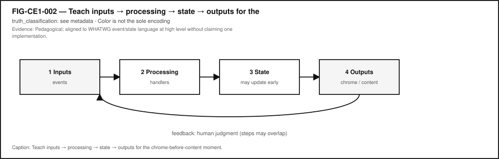
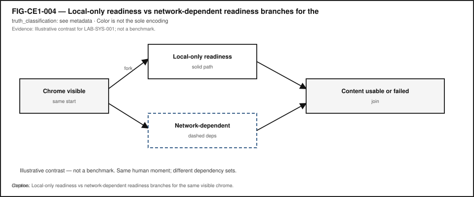
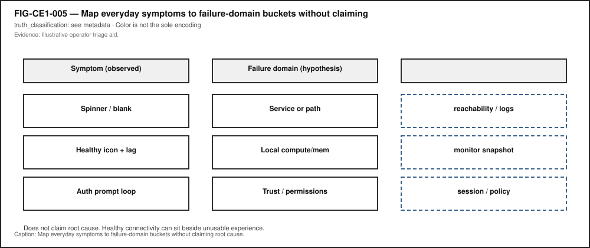
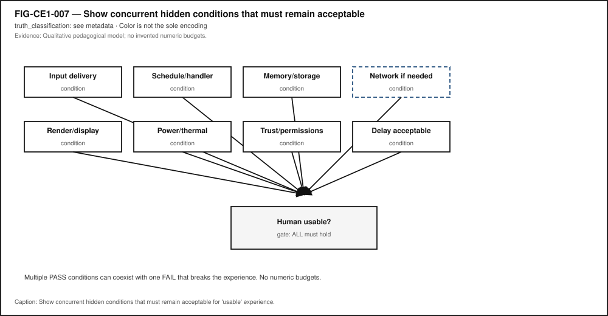

# Chapter 1 — Technology Is a System, Not a Screen

**Status:** `draft` · **Chapter ID:** `CH01`  
**Author:** Edmund Gunn, Jr.

---

## 1. The moment {#sec-ch01-moment}

You unlock a familiar phone, tablet, or laptop. You open something you already use—messages, a document, a map, a school portal. The chrome appears quickly: the icon, the title, the navigation bar, the skeleton layout that looks almost ready.

Then you wait.

The list is empty. The tiles stay gray. A spinner turns. Yesterday’s content sits there while a refresh fails to finish. From your seat it still feels like *one app*. Underneath, several cooperating parts may still be starting, restoring state, reading storage, talking to an optional remote service, or failing quietly while the surface looks polite.

This chapter’s promise is simple:

> After this chapter, you can look at an ordinary device experience and name the hidden cooperating parts—not just the colorful surface—and explain why “the app” is usually not one thing.

Chapter 2 will later prove a method by following one tap through the stack. Chapter 1 teaches the **system lens** first: visible interface versus hidden work, local readiness versus network-dependent readiness, and the honesty of naming a **failure domain** before blaming a vague villain. When one domain limits the whole path, later chapters will call that limiting resource a **bottleneck**—here it is enough to name the domain before inventing a cause.

---

## 2. What you notice {#sec-ch01-notice}

Before jargon, notice the human contract you already expect when you open something familiar.

You expect the open action to be recognized—whether you used a finger, trackpad, keyboard, switch, or voice. You expect the shell of the experience to appear soon enough that the device feels awake. You expect usable content to arrive, or a failure you can understand. You expect the interface not to seize up. You expect “connected” status—when it matters—to relate to the service you need, not merely to a radio icon. You also expect battery and heat to stay within reason for something so ordinary.

Those expectations are not decorations around technology. From the person’s point of view, they *are* the product.

**Chrome visible is not the same event as content usable.**

The title bar can look finished while the body is still empty. A skeleton can look “alive” while a sync has already failed. Stale content can look complete while a refresh never returns. Your nervous system may stitch those timelines into one story—“the app opened”—or into another—“something feels wrong even though the screen is there.”

Optional comparison available on almost any device you already own: open a photo, note, or file that already lives on the device. Then open something that must fetch fresh remote content. The first often finishes inside the device. The second may add waiting that has nothing to do with how hard you pressed the glass.

Accessibility belongs in this noticing, not later as a disclaimer. If the only “busy” cue is a colored spinner, someone who does not see that color—or someone using a screen reader that never hears a ready announcement—experiences a different system than the designer imagined [@wcag22-20231005]. Inclusive readiness is part of the human contract.

---

## 3. Exploded ecosystem {#sec-ch01-ecosystem}

An ordinary open is not a single object. It is a path through a **technology ecosystem**: people, device, software, optional network, and a usable (or failed) result. @fig-ch01-001 is the first-minute map. @fig-ch01-003 opens the everyday word *app* into cooperating cards. Both are **conceptual / Representative educational architecture**—not measured teardowns of a specific manufactured revision.

{#fig-ch01-001 fig-cap="First-minute ecosystem map. Conceptual educational architecture; dashed optional remote branch; not measured telemetry." fig-alt="Person to visible interface to hidden local system to optional network/service to human-usable result."}

{#fig-ch01-003 fig-cap="Why 'the app' is not one thing. Conceptual layer stack; everyday language collapses several cards into one word." fig-alt="Stacked cards for UI, runtime, OS services, storage, network interface, and remote service grouped as everyday 'the app'."}

Walk the layers in ordinary language. Keep the same layers when vocabulary deepens later.

### Human

You form intent: open this portal, resume this draft, check this map. Muscles, voice, or assistive controls issue the open. Later, eyes, ears, and hands judge whether the result matches what you meant.

### Visible interface

What you can see or hear on the surface—chrome, skeleton, spinners, lists, error text, spoken status. The **visible interface** is a cooperating part, not the whole story [@saltzer-kaashoek].

### Hidden local system

Application runtime, operating-system services, working memory, durable storage, power and thermal headroom, and the local path that can schedule work soon enough to show chrome and continue. Computer systems are designed as layered cooperating abstractions; treating the glass as the entire machine collapses those layers into one vague object [@saltzer-kaashoek; @tanenbaum-bos].

### Optional network and remote service

When the experience needs fresh remote content, a network interface, access network, and remote service may enter the path. Packet transport commonly rests on IP and TCP foundations [@rfc791; @rfc9293]. Many useful opens never take this branch. Teaching the word **optional** is part of the chapter’s honesty rule.

### Human-usable result

Content you can act on—or a clear failure. The ecosystem succeeds only when the person can finish the job they came to do.

@fig-ch01-006 foreshadows device subsystems that support readiness (display, compute, memory/storage, radio, power) as **Representative educational architecture**. The Device Quartet—Student 14.5-inch, Handheld Hybrid, DS-XL Coder, and Edge IO Wearables—appears here only as a future shared learning-laboratory spine of research form factors. Physical fabrication remains pending (**PHYSICAL_PENDING**); Chapter 1 labs run on commodity devices you already own [@src-hardware-quartet].

{#fig-ch01-006 fig-cap="Exploded ecosystem preview. Conceptual architecture; Device Quartet names are research form factors (PHYSICAL_PENDING), not shipping products." fig-alt="Representative educational device blocks with Device Quartet form-factor names as future lab spine."}

Equity belongs in the map: always-online assumptions exclude learners on metered plans, shared devices, captive portals, or intermittent links. Low-cost devices remain first-class learning instruments, not lesser technology.

---

## 4. Follow the signal {#sec-ch01-signal}

Everyday interactive software commonly waits for inputs, processes them, updates remembered **state**, and presents outputs [@whatwg-html; @whatwg-dom]. @fig-ch01-002 shows that teaching path for the chrome-before-content moment. Read it as a logical story, not as a claim that every platform uses one identical event-loop implementation or that steps never overlap.

{#fig-ch01-002 fig-cap="Inputs → processing → state → outputs for a familiar open. Conceptual pipeline; real systems may overlap steps." fig-alt="Inputs to processing to state to outputs with feedback to human judgment."}

A useful reading of the open moment:

1. **Input arrives** — unlock/open intent becomes an event the software can interpret.
2. **Local processing begins** — the application or runtime starts (or wakes) enough work to draw chrome.
3. **State restore** — session, cache, or local files are consulted; validity matters.
4. **Optional remote branch** — if needed, a request may leave the device toward a service.
5. **Outputs update** — chrome first, then content—or a failure message.
6. **Human judgment** — ready enough to use, still busy, or failed.

@fig-ch01-004 forks after chrome appears into a **local-only** path and an **optional remote** path that rejoin at “content usable or failed.” Same starting human moment; different dependency sets. The fork is **illustrative** teaching geometry for observation—not a benchmark of any brand’s launch times.

{#fig-ch01-004 fig-cap="Local-only versus network-dependent readiness. Illustrative path branch; not a measured product law." fig-alt="Fork after app chrome visible into local-only and optional remote readiness paths."}

### Alternate paths (the honesty rule)

- A notes app opening a local draft may finish without any remote call.
- A streaming video may show player chrome while buffers and licenses still travel.
- A portal may show a healthy connectivity icon while DNS, authentication, or the application API still fails.

**Illustrative teaching point (not a measured universal product fact):** a connectivity indicator is related to, but not identical with, application success. Bars (or a “connected” label) report something about a link or association. They do not certify that *this* service, for *this* account, right now, is healthy.

RAM and durable storage play different jobs when an open feels slow: working memory holds what is being used now; storage holds what must survive restarts [@patterson-hennessy]. Naming the difference is enough here; later chapters deepen the hierarchy without inventing timings for this chapter.

---

## 5. Component cards {#sec-ch01-components}

These cards are orientation tools—not a complete bill of materials. Use them to name parts when something feels wrong.

### Visible interface / UI

**What it is.** The surface the person can see or hear: chrome, content, status text, spoken updates.  
**Why it matters.** It can look finished while hidden work is incomplete.  
**Common misconception.** “If I can see the screen, the system is ready.”  
**Failure hint.** Forever spinner; empty skeleton; missing ready announcement.

### Application / runtime

**What it is.** The local program and runtime that wait for events, update state, and ask for outputs [@whatwg-html; @whatwg-dom].  
**Why it matters.** Chrome can render from one code path while content waits on another.  
**Common misconception.** “The app” is a single indivisible object.  
**Failure hint.** Crash after chrome; frozen shell; endless redirect that still shows a title.

### OS services / scheduling

**What it is.** Operating-system abstractions that let software run, share resources, and talk to devices [@tanenbaum-bos]. Scheduling decides when runnable work receives CPU time soon enough to continue [@linux-scheduler].  
**Why it matters.** Extreme load can delay opens that still “look” like an app problem.  
**Common misconception.** Only the colorful app process matters.  
**Failure hint.** Everything on the device feels laggy, not only one title.

### Storage

**What it is.** Durable holding for files, caches, and offline copies—distinct from RAM’s working role [@patterson-hennessy].  
**Why it matters.** Offline success and online failure often split here.  
**Common misconception.** Slow open always means “bad Wi-Fi.”  
**Failure hint.** Missing offline file; corrupt cache; local item works while remote item fails.

### Network interface

**What it is.** The local radio or wired path and stack that can carry packets when the remote branch is taken [@rfc791; @rfc9293].  
**Why it matters.** Association ≠ usable experience.  
**Common misconception.** Connected icon proves the needed service.  
**Failure hint.** Icon healthy; target tiles never fill.

### Remote service

**What it is.** A provider of data or computation off-device—edge or cloud in later chapters’ vocabulary.  
**Why it matters.** UI can survive while the service does not.  
**Common misconception.** “My phone is broken” whenever a portal fails.  
**Failure hint.** Other local apps work; one remote experience fails.

@fig-ch01-005 maps everyday symptoms to failure-domain buckets without claiming root cause. Use it as an operator triage aid: symptom → guessed domain → evidence still needed.

{#fig-ch01-005 fig-cap="Failure-domain map for readiness symptoms. Illustrative triage aid; guesses are inference until more evidence." fig-alt="Symptom to failure-domain to evidence-still-needed columns."}

---

## 6. Stability contract {#sec-ch01-stability}

The **Stability Contract** is a signature idea across this book:

> A person experiences a usable open only while multiple hidden conditions remain within acceptable bounds.

Chapter 1 needs the preview, not invented numeric budgets. For the chrome-before-content anchor, conditions typically include:

- input path available (touch, keyboard, switch, voice),
- application/runtime schedulable soon enough to show chrome and continue,
- state/session usable—or failure communicated,
- storage readable when the path is local,
- optional network/service path healthy end-to-end *when* remote content is required (association ≠ DNS ≠ route ≠ auth ≠ API),
- output path able to present updates the person can perceive,
- power/thermal headroom sufficient that needed work is not silently deferred beyond human patience (qualitative only).

@fig-ch01-007 shows concurrent conditions feeding a single “human usable?” gate. Multiple conditions can look acceptable while one critical dependency still fails the experience.

{#fig-ch01-007 fig-cap="Stability Contract preview. Conceptual concurrent conditions; no invented numeric budgets." fig-alt="Parallel hidden conditions feeding a human-usable gate."}

Three separations matter:

1. The interface can look **alive** after the usable result has already failed—or before it is ready.
2. A connectivity indicator can look healthy while the application service you need is unreachable (**illustrative** operator lesson, not a measured RF law).
3. Local dependencies are not optional for on-device opens; network dependencies are optional branches.

When the contract breaks, people lose time, trust, and sometimes access to school, work, or care tasks. Mis-naming the failure domain—“the phone is broken” versus “the service is unreachable”—leads to wrong fixes and unfair blame, especially on shared or low-bandwidth networks. Later chapters deepen the contract; here, refuse false certainty.

---

## 7. Try it {#sec-ch01-try}

### LAB-SYS-001 — Name the System Behind a Familiar “Open”

**Observable question.** When I open something I already use, what becomes visible first, what becomes usable later, and which hidden parts might still be working?

**Why this lab (vs Chapter 2).** **LAB-TAP-001** times a tap-to-response path. **LAB-SYS-001** teaches the system lens: readiness, layers, dependencies, and failure domains—without duplicating one-tap instrumentation.

**WAIKE alignment note.** WAIKE accepted `main` hosts file-backed curriculum packages that can support adjacent systems-thinking competencies (for example observation/inference and ticket triage). It does **not** currently ship a course module literally titled like this chapter [@src-waike]. **LAB-SYS-001** is therefore a **publication-owned** commodity lab with competency neighbors—not a renamed false WAIKE lab ID.

**Prerequisites.** A phone, tablet, or laptop you may use for learning; a modern browser; optional Python for a large-print observation sheet helper. No Device Quartet hardware. No root or jailbreak.

**Safety and privacy.** Do not capture passwords, tokens, private chats, ID photos, or classmate personal information. Prefer the supplied fixture or public demo pages in shared spaces. No packet capture of others’ traffic. Do not disable safety features required for your context. Scrub identifiers before saving portfolio evidence.

**Time estimate.** About 45 minutes for the Explorer baseline.

#### Prediction

Before you open anything, write one sentence: do you expect **chrome** (shell/nav/title) or **content** (usable body) to become ready first, and why?

#### Route A — Browser demo (baseline)

Open the lab’s browser readiness demo. Watch once without changing settings. Record wall-clock (or on-page) times for **chrome visible** and **content usable** (or failed). List at least three visible cues and at least three guessed hidden parts—mark guesses as inference.

#### Route B — Local observation sheet (baseline)

Run the lab’s local observation-sheet helper to print a large-print structured sheet. Fill it while opening a familiar experience, or while using the fixture. Keyboard, switch, and voice opens count.

#### Route C — Offline fixture (required fallback)

Open the lab’s offline readiness fixture. Use the simulate-offline control to contrast chrome-still-visible versus content failure. Or use the written scenario card labeled **fixture / illustrative** for Explorer/Educator work when a live open is unavailable.

#### Evidence (minimum)

- readiness observation table (chrome vs usable; online vs offline if attempted),
- labeled ecosystem map,
- observation versus inference paragraph,
- scrubbed notes.

#### Interpretation

| Allowed as observation | Inference until more evidence |
|---|---|
| Chrome appeared at time T1 | “Network is bad” |
| Content usable/failed at T2 | “Storage is dying” |
| Airplane mode was on/off | “DNS failed” |
| Icon showed connected | “Server is down” |

Learner wall-clock timings are **your** observations on **your** commodity device or fixture—not publication benchmarks and not touch-to-photon laboratory results.

#### Limits (say them out loud)

- One run is not a benchmark.
- Fixture delays are illustrative teaching aids, not proof of a specific commercial app’s architecture.
- Software clocks do not measure every physical stage from intention to photon.
- Missing kernel-level visibility is a limit, not a failure of curiosity.

#### Portfolio output

Produce a small packet with a short README (question, method, limits), observation table, ecosystem map, scrubbed evidence note, and a teach-back paragraph. Completion means a claim is supported by an artifact—not that “a page loaded.”

---

## 8. Build it {#sec-ch01-build}

Use the same open story at the depth that matches your pathway. Your artifact is a **personal technology-ecosystem map** plus a readiness checklist tailored to one familiar experience.

### Explorer

Draw or list two columns: visible cues versus guessed hidden parts (≥3 each). Write one short paragraph explaining why “the app” is usually not a single object—UI, local software, and at least one optional remote dependency—without drowning a nontechnical listener in jargon.

### Operator

Repeat the open once online and once offline/airplane (if safe), or use the fixture’s offline toggle. Fill the observation table. Assign a failure-domain guess for any failure and mark it as inference. Note connectivity-icon state as a separate observation from usability.

### Builder

Fill an ecosystem-map template with named layers and a dashed optional remote branch. Adapt the readiness checklist to your chosen experience. Document one tradeoff (example: richer notes versus avoiding personal content in a shared classroom).

### Engineer

Write a diagnosis plan that separates observation, interpretation, and causal claim. State what additional evidence would be required before blaming network versus app versus storage. Optionally use browser Performance or Network panels only on a non-sensitive page; scrub secrets [@mdn-performance]. Map at least one Chapter 1 layer to a cited abstraction (process, event, packet, or storage hierarchy).

### Researcher

State a testable hypothesis such as: “For experience X, offline mode increases content-usable delay or causes failure while chrome still appears.” Define a small number of runs, environment notes, and explicit limits. Document what evidence would be required to upgrade an illustrative claim to a measured claim. Do not publish student timings as universal launch laws.

Educators can facilitate the ten-to-fifteen-minute misconception probe in Section 11 and adapt **LAB-SYS-001** with the fixture/scenario fallback when networks or personal apps are unavailable.

---

## 9. Secure and include it {#sec-ch01-secure-include}

### Security

Chapter 1 teaches structure, not offensive technique. Opens can involve sessions, permissions, and privileged data. Treat **identity/session** as a first-class failure domain: an expired login can look like a “broken app.” Capture only evidence you are allowed to keep. Prefer fixtures and public demos over production accounts with sensitive data.

### Privacy

Screenshots and logs are evidence and risk. Do not save passwords, tokens, private message bodies, or classmates’ identifying details. Classroom mode should default to fixture content. Redact before sharing portfolio packets.

### Accessibility

“Open” includes keyboard, switch, voice, and assistive pointer paths as first-class actions. Readiness states (busy versus ready) should be communicable beyond color alone; WCAG 2.2 guidance frames why status must not depend on a single sensory channel [@wcag22-20231005]. Figures in this chapter carry alt text and reading-order descriptions; labs accept audio notes and structured text tables instead of screenshots when needed.

### Equity

Do not assume a high-end phone, unlimited data, or Device Quartet hardware. Offline/fixture fallback is mandatory for **LAB-SYS-001**. “Bars look fine but the service fails” is also an equity story: shared networks, captive portals, throttled plans. Designing only for ideal always-online office conditions silently excludes many learners and workers.

---

## 10. Career lens {#sec-ch01-career}

One familiar open crosses many ownership domains. No table promises employment; roles vary by organization. Completing Chapter 1 or **LAB-SYS-001** does not qualify anyone for a job. Your artifacts resemble early professional evidence in miniature.

| Layer / concern | Example role family | Lab resemblance |
|---|---|---|
| Perceived readiness | UX / product design | Annotated chrome-vs-usable observations |
| Chrome vs data paths | Application / frontend engineering | Ecosystem map with UI/runtime/state cards |
| Symptom triage | IT support / operations | Two symptom→domain tickets labeled inference |
| Service dependency | SRE / backend / cloud | Online vs offline comparison notes |
| Link vs experience | Network engineering | Experience analysis without invented RF numbers |
| Inclusive status | Accessibility engineering | Notes on non-color busy/ready cues |
| Layered explanation | Systems / OS engineering | Mapping cards to textbook abstractions with citations |
| Evidence hygiene | Security / identity (introductory) | Privacy scrub checklist on portfolio files |
| Facilitation | Technical educator / mentorship | Probe questions for screen-as-surface misconceptions |

When Device Quartet form factors appear in later chapters, they remain research/learning spines—not mascots and not fabricated shipping SKUs [@src-hardware-quartet]. Commodity devices remain first-class citizens for Chapter 1 evidence.

---

## 11. Check understanding {#sec-ch01-check}

Answer with reasoning. Prefer short paragraphs over one-word guesses.

1. Why might an app’s chrome appear quickly while the usable list stays empty?
2. Which parts of an open can still succeed when the Internet is unavailable?
3. Why is a connectivity indicator insufficient proof that a specific portal or sync service is healthy?
4. What evidence would you need before blaming the network for a slow or failed open?
5. How can expired login/session problems look like “the app is broken”?
6. Why is “the app” usually not one object? Name at least three cooperating parts.
7. How could a keyboard or switch open enter a similar readiness story after the hardware differs?
8. **Teach-back.** Explain the system lens to a family member **without** using the words *kernel*, *API*, *packet*, or *runtime*. Then introduce those terms one at a time, tying each to something already understood.

Educator note: successful teach-backs show visible surface versus hidden cooperating parts and at least one alternate path (local-only versus network-dependent), not memorized vocabulary lists. Gate 3 chapter-prototype reader evidence for Chapter 2 remains historical; this chapter does not claim completed full-manuscript human validation.

---

## References

Selected authoritative sources for this chapter’s general technical explanations are listed in the bibliography. Project-specific repository evidence is cited with keys such as @src-waike and @src-hardware-quartet and remains distinct from external literature.

Inline citations used in this chapter include @saltzer-kaashoek, @tanenbaum-bos, @whatwg-html, @whatwg-dom, @patterson-hennessy, @rfc791, @rfc9293, @linux-scheduler, @wcag22-20231005, and @mdn-performance.

## 12. Glossary links {#sec-ch01-glossary}

Terms introduced or relied on as formal vocabulary in this chapter should resolve in the living glossary registry as entries mature. Candidates below are for linking—not a dump of free-standing encyclopedia definitions.

| Term | Role in this chapter |
|---|---|
| Visible interface | Surface the person can see or hear |
| Hidden layers | Cooperating parts under the interface |
| Technology ecosystem | Human + device + software + optional network producing usability |
| Dependency | Condition or component needed for a usable result |
| Failure domain | Bucket for where trouble may live |
| Inputs → processing → state → outputs | Teaching path for everyday interactive software |
| Event / event loop | Wait-and-dispatch structure in many interactive programs |
| State | Application’s current remembered condition |
| RAM | Fast working memory |
| Storage | Durable data holding |
| Packet / protocol | Network data unit and agreed exchange rules (optional branch) |
| Service | Provider of remote or local functions |
| Stability Contract | Experience depends on hidden conditions staying acceptable |
| Device Quartet | Research form-factor learning laboratory (**PHYSICAL_PENDING**) |

Deeper entries, analogies labeled as analogies, and “not the same as” warnings live in the glossary network. Prefer following a link when stuck over inventing a private definition.

---

## Figure references (embedded above; accessibility metadata)

All figures below are **conceptual** or **illustrative** unless a future revision cites a specific validated hardware release. Source preference: editable SVG in the publication repository. Reused from Concept Edition CE-1 preproduction art.

### FIG-CH01-001 — First-minute ecosystem map

- **File:** `figures/ecosystem/fig-ch01-001-ecosystem-map.svg` (reuse of FIG-CE1-001)
- **Truth classification:** conceptual
- **Alt / reading order:** Person → Visible interface → Hidden local system → Optional network/service → Human-usable result; state conceptual educational architecture
- **Color-independent encoding:** Shape + label + dashed vs solid stroke for optional branch

### FIG-CH01-002 — Inputs → processing → state → outputs

- **File:** `figures/sequence/fig-ch01-002-inputs-state-outputs.svg` (reuse of FIG-CE1-002)
- **Truth classification:** conceptual
- **Alt / reading order:** Numbered steps Inputs, Processing, State, Outputs, with feedback to human judgment; steps may overlap
- **Color-independent encoding:** Numbers + arrows

### FIG-CH01-003 — Why “the app” is not one thing

- **File:** `figures/architecture/fig-ch01-003-app-not-one-thing.svg` (reuse of FIG-CE1-003)
- **Truth classification:** conceptual
- **Alt / reading order:** UI → Runtime → OS services → Storage → Network interface → Remote service; brace groups everyday “the app”
- **Color-independent encoding:** Labeled layers + brace

### FIG-CH01-004 — Local-only vs network-dependent readiness

- **File:** `figures/ecosystem/fig-ch01-004-local-vs-network.svg` (reuse of FIG-CE1-004)
- **Truth classification:** illustrative
- **Alt / reading order:** Fork after chrome visible into Local path and Optional remote path; join at content usable or failed
- **Color-independent encoding:** Solid vs dashed branch labels

### FIG-CH01-005 — Failure-domain map

- **File:** `figures/architecture/fig-ch01-005-failure-domains.svg` (reuse of FIG-CE1-005)
- **Truth classification:** illustrative
- **Alt / reading order:** Symptom → domain → evidence still needed
- **Color-independent encoding:** Icons + text labels; status words not color alone

### FIG-CH01-006 — Exploded ecosystem preview

- **File:** `figures/exploded-views/fig-ch01-006-ecosystem-preview.svg` (reuse of FIG-CE1-006)
- **Truth classification:** conceptual; Device Quartet callout **PHYSICAL_PENDING**
- **Alt / reading order:** Device subsystem blocks + Quartet form-factor names as future lab spine; not a teardown photo
- **Color-independent encoding:** Leader lines + labels

### FIG-CH01-007 — Stability Contract preview

- **File:** `figures/architecture/fig-ch01-007-stability-preview.svg` (reuse of FIG-CE1-007)
- **Truth classification:** conceptual
- **Alt / reading order:** List each concurrent condition and the human-usable gate outcome
- **Color-independent encoding:** Pass/fail words + icons; not green/red alone
