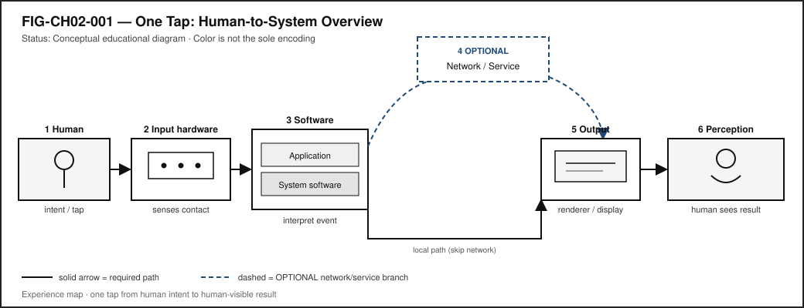
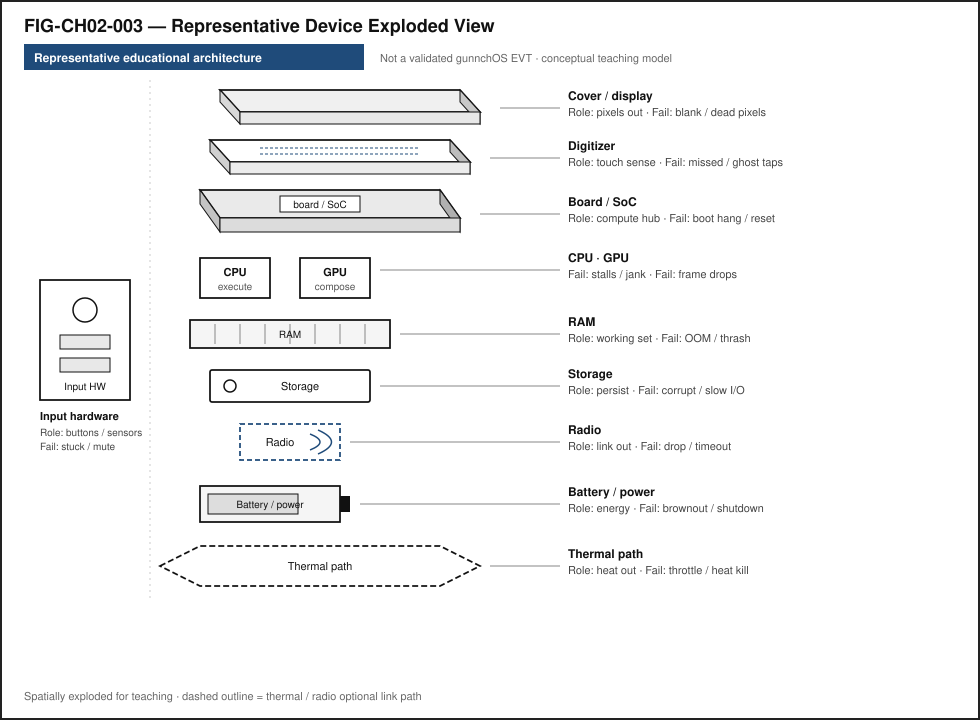
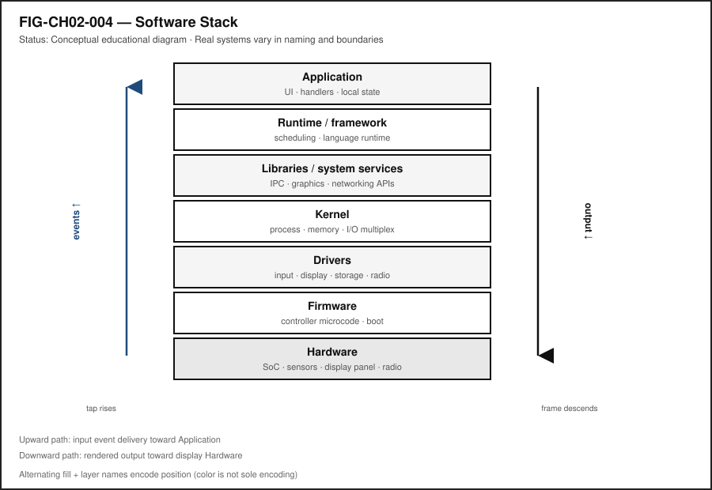
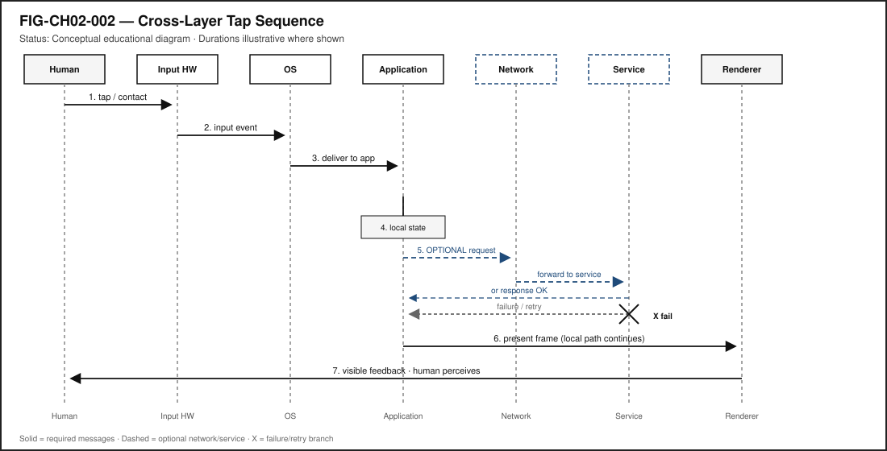
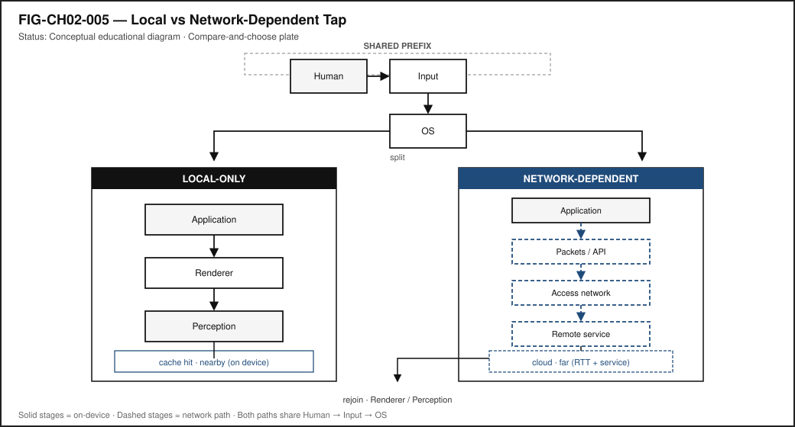
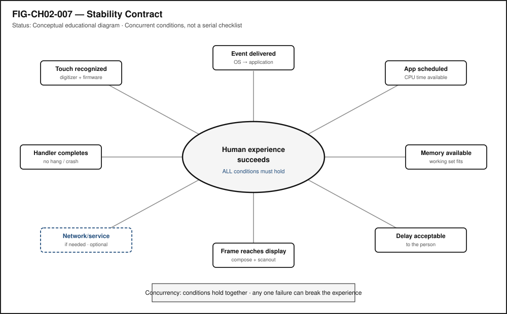
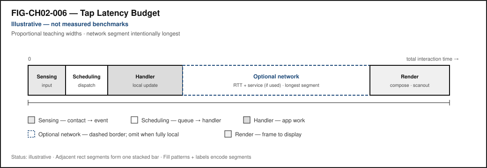

# Chapter 2 — Follow One Tap Through the Entire Stack

**Status:** `draft` · **Chapter ID:** `CH02`  
**Author:** Edmund Gunn, Jr.

---

## 1. The moment

You open an app you already know. Maybe it is a school portal, a messaging thread, a map, or a weather page. Your finger finds a familiar control—a button that says *Refresh*, *Send*, *Open*, or *Show more*—and you tap.

The button changes almost at once. It darkens, lifts, or flashes a tiny highlight. Something about the screen tells you: *I heard you.* A fraction of a second later—sometimes less than a blink, sometimes long enough that you notice—new content arrives. A list fills. A message status flips. A spinner disappears and a paragraph takes its place.

From your seat, it feels like one action. You asked; the device answered.

Underneath that feeling, many systems may have cooperated. Some of them live in the glass and metal under your finger. Some live in software that never shows itself. Some may live on another computer far away. Some may never leave your device at all.

This chapter follows that ordinary moment until it becomes visible, audible, or physical again. The governing question is simple and honest:

> What actually happens between my finger touching a screen and the system responding?

We will not pretend every tap travels the same road. A tap that opens a local menu is not the same journey as a tap that fetches a remote document. Immediate feedback and later content are related, but they are not the same timeline. Learning to tell those stories apart is the first real skill of systems thinking.

---

## 2. What you notice

Before names like *kernel* or *packet* enter the conversation, notice the human contract you already expect.

When you tap, you expect the touch to be recognized. You expect feedback soon enough that the control feels alive. You expect the right action—not the neighboring button, not yesterday’s screen, not a frozen half-state. You expect the interface not to seize up. You expect the same tap not to fire twice by accident if your finger lingered. If the action depends on a network, you expect the remote part to arrive eventually, or to fail in a way you can understand. You also expect the device not to become unusably hot, and battery use to stay within reason for something so small.

Those expectations are not decorations around technology. They *are* the product, from the person’s point of view.

**Responsiveness is a human perception produced by multiple technical timelines.**

The button’s quick visual change may complete while a remote request is still traveling. The remote answer may arrive while the display is still finishing another frame. The radio may report “connected” while the specific service you need is unreachable. Your nervous system stitches those timelines into one story—“I tapped and it worked”—or into another—“I tapped and something felt wrong.”

Later chapters measure delay, jitter, and throughput with more machinery. Here, keep the human observation first: something felt immediate; something arrived later; something might have failed quietly while the interface still looked polite.

Optional comparison, available on almost any device you already own: tap a control that only changes local appearance (a menu open, a theme toggle, a local checkbox). Then tap a control that must fetch remote content. The first often finishes inside the device. The second may add waiting that has nothing to do with how hard you pressed the glass.

---

## 3. Exploded ecosystem

A tap is not a single object. It is a path through an ecosystem. @fig-ch02-001 is the first-minute map: person → device → optional network → result. @fig-ch02-003 opens the box conceptually. Both are **conceptual / Representative educational architecture**—not a claim that any specific manufactured revision looks exactly like the diagram. The Device Quartet used elsewhere in this series—Student 14.5-inch, Handheld Hybrid, DS-XL Coder, and Edge IO Wearables—are research form factors and learning benchmarks defined in the hardware industrial-design source of truth; physical fabrication remains pending (**PHYSICAL_PENDING**) (CLM-0003).

{#fig-ch02-001 fig-cap="One Tap: Human-to-System Overview. Conceptual educational experience map with a dashed optional network/service branch." fig-alt="End-to-end map from human tap through input, software, optional network, output, and perception."}

{#fig-ch02-003 fig-cap="Representative educational architecture of a touch-capable device. Not a validated gunnchOS EVT." fig-alt="Exploded educational device view with display, digitizer, SoC, memory, storage, radio, battery, and thermal path."}

Walk the layers in ordinary language, then keep the same layers when vocabulary deepens.

### Human

You form intent: refresh this page, send this note, open this file. Muscles move. Skin contacts glass or a trackpad. Later, eyes, ears, and hands judge whether the result matches what you meant.

### Input hardware

Where a touchscreen is involved, cover glass, a touch-sensing layer (often called a **touch digitizer**), and input electronics convert contact into electrical signals. Controllers package those signals into digital reports—coordinates, contact state, sometimes pressure or size. On the web platform, related user-input event behavior is standardized in UI Events and Pointer Events [@w3c-uievents; @w3c-pointerevents]. Not every device uses the same sensing method, and not every interaction is a finger on glass. Keyboards, switches, voice, and assistive pointers enter through different hardware but must still become events software can interpret.

### Compute hardware

A system-on-chip (**SoC**) typically gathers a **CPU** for general work, a **GPU** for highly parallel graphics and similar tasks, **RAM** as fast working memory, and storage for durable data [@patterson-hennessy]. Radios, batteries, power regulation, and thermal paths sit nearby. When the book shows these parts for learning devices, treat exploded views as **Representative educational architecture** unless a dated, revision-specific hardware evidence package is cited—and for gunnchOS hardware sources audited for this edition, that physical EVT evidence is not yet available (CLM-0003).

### System software

Firmware may initialize hardware. A **kernel** mediates access to devices and resources. **Device drivers** translate between hardware reports and operating-system abstractions. An input subsystem, compositor or window system, and runtime or framework sit above, so applications do not personally micromanage every sensor.

On the gunnchOS device OS accepted `main`, what exists today is an **alpha / digital** experience layer with **SOFTWARE_SIMULATED** input routing for sources such as touch, controller, keyboard/mouse, and ring adapters—not a shipping OS bootable on reference hardware, and not a claim of physical ring silicon in the field (CLM-0002). When this chapter mentions that project, those labels travel with the sentence.

### Application

Your app runs an **event loop** or equivalent structure: wait for events, dispatch handlers, update **state**, maybe read local storage, maybe call a service [@whatwg-html; @whatwg-dom]. Local computation and remote calls are choices the application makes after it understands the event.

### Networking (when applicable)

A socket or higher-level API, a network stack, a Wi-Fi or cellular interface, an access network, and the wider Internet may carry a request to an **edge** or **cloud** service. Packet transport over the Internet commonly rests on IP and TCP foundations [@rfc791; @rfc9293]. Many taps never enter this layer. Teaching that “optional” word is part of the chapter’s honesty rule.

### Output

A renderer prepares pixels (and sometimes audio or haptic patterns). The GPU and display pipeline present frames. Speakers and vibration motors may add confirmation.

### Human feedback

Visual change, sound, vibration, and the felt sense of “alive” close the loop. The person does not experience layers; the person experiences the combined result.

@fig-ch02-004 stacks Application → Runtime/framework → Libraries/system services → Kernel → Drivers → Firmware → Hardware as a conceptual ladder. Names differ across platforms; the ladder’s purpose is orientation, not brand loyalty.

{#fig-ch02-004 fig-cap="Software stack supporting a tap-to-response path. Conceptual layering; real systems vary." fig-alt="Vertical software stack from application down to hardware."}

---

## 4. Follow the signal

@fig-ch02-002 shows a numbered path with optional branches and a failure branch. Read it as a logical story, not as a claim that a CPU executes exactly one step at a time with no overlap.

{#fig-ch02-002 fig-cap="Cross-Layer Tap Sequence. Conceptual sequence diagram with optional network path and failure/retry branch." fig-alt="Sequence across Human, Input HW, OS, Application, Network, Service, and Renderer."}

1. **Human intent.** You decide to act.
2. **Finger movement.** Contact begins.
3. **Sensing.** Digitizer and controller detect contact (or another input path activates).
4. **Event creation.** Coordinates and contact state become a digital touch (or key, switch, voice) event.
5. **Driver / input subsystem.** Hardware reports become OS-level input events [@linux-input].
6. **Scheduler / process availability.** The operating system’s **scheduler** decides when runnable software receives CPU time so the app can notice the event soon enough [@linux-scheduler; @tanenbaum-bos].
7. **Application event dispatch.** The runtime delivers the event toward the control under your finger.
8. **Handler executes.** Application code runs for that event.
9. **Local state changes.** The button’s pressed appearance, a flag, a list selection—something in memory flips.
10. **Optional storage / data access.** A local database, file, or cache may be consulted.
11. **Optional network request.** Only if the handler needs remote work.
12. **Network transmission.** Data moves as **packets** across interfaces and networks.
13. **Optional remote service processing.** An edge or cloud service may compute or fetch.
14. **Response arrives.** Bytes return—or fail, time out, or retry.
15. **Application state updates again.** New content merges into the interface model.
16. **Renderer prepares output.** Layout and paint work produce a frame description.
17. **GPU / display pipeline.** The frame becomes light on the screen (and optionally sound or haptics).
18. **Human perceives the result.** Eyes and brain close the experience.

Several of these may overlap. Sensing can continue while earlier events are still being handled. Rendering can proceed while a network request is in flight. A cache hit can skip remote processing entirely. A blocked UI thread can stall steps 7–9 even on a fast network.

### Alternate paths (the honesty rule)

**Not every tap goes to the cloud.**

| Path | Everyday example | What travels |
|---|---|---|
| **Local-only** | Open a menu; toggle a local theme; move a local game piece | Sensing → OS → app → render. No remote service required. |
| **Local service** | Change an OS setting; write a local file; query an on-device database | App talks to local services/storage. Still no Internet requirement. |
| **LAN** | Send a command to a printer or classroom device on the same network | Packets stay on the local network. |
| **Internet / cloud** | Fetch remote data; submit a form; invoke a hosted API | Request leaves the premises toward a distant service. |
| **Edge** | Request handled at a nearby edge service | Still networked, but closer than a far data center may be. |
| **Cache hit** | Content already available locally or nearby | Skip or shorten remote fetch. |
| **Cache miss** | Needed data is absent | Retrieve or compute elsewhere. |

@fig-ch02-005 places these side by side. Immediate local feedback can succeed on the local-only path while a later remote path is still pending—or has already failed. That split is not a trick of one brand’s UI; it is a structural fact of modern interfaces.

{#fig-ch02-005 fig-cap="Local-only versus network-dependent tap paths. Conceptual compare-and-choose plate." fig-alt="Side-by-side local-only and network-dependent execution paths."}

---

## 5. Component cards

Component cards answer three questions: What is it? What does it do for the person? What fails when it misbehaves? Treat platform-specific names as aliases of these roles.

### Touch digitizer

**Plain definition.** The sensing layer that detects touch position and movement on a touch surface.

**Experience benefit.** Touch becomes usable input instead of anonymous pressure on glass.

**Failure symptom.** Missed taps, ghost touches, delay, or inaccurate coordinates.

### Device driver

**Plain definition.** Software that lets the operating system control hardware or receive information from it.

**Experience benefit.** Hardware reports become usable by the rest of the software stack.

**Failure symptom.** Device unavailable, unreliable, or incorrectly interpreted.

### Kernel

**Plain definition.** The central part of an operating system that manages hardware access and system resources.

**Experience benefit.** Applications can use devices and memory without each app personally controlling every chip.

**Failure symptom.** Severe instability, unavailable resources, or system failure.

### Scheduler

**Plain definition.** The operating-system mechanism that decides when runnable software receives CPU time.

**Experience benefit.** Important work—including input handling—gets compute soon enough to feel responsive.

**Failure symptom.** Input lag, stutter, audio glitches, general sluggishness even when “the network is fine.”

### Event loop

**Plain definition.** A program structure that waits for events and dispatches work in response.

**Experience benefit.** The application reacts to input and other events instead of ignoring them.

**Failure symptom.** Frozen interface or delayed action when long work blocks the loop.

### RAM

**Plain definition.** Fast working memory used by running software.

**Experience benefit.** Active data stays quickly available.

**Failure symptom.** Memory pressure, slowdowns, app termination, thrashing to storage.

### GPU

**Plain definition.** A processor specialized for highly parallel work such as graphics rendering.

**Experience benefit.** Smooth visual output when frames complete on time.

**Failure symptom.** Missed frames, stutter, delayed rendering.

### Packet

**Plain definition.** A formatted unit of data transmitted across a network.

**Experience benefit.** Digital information can move between systems.

**Failure symptom.** Loss, retries, delay, incomplete responses.

These cards are not a complete bill of materials. They are the first toolkit for naming failure domains when a tap feels wrong.

---

## 6. Stability contract

The **Stability Contract** is a signature idea across this book:

> A user experience exists only while multiple hidden technical conditions remain within acceptable bounds.

For Chapter 2, a successful tap-to-response experience may require all of the following to stay “good enough” at once:

- touch (or equivalent input) recognized,
- input event delivered into the software stack,
- application scheduled to run,
- event handler completes without hanging the UI path,
- memory available for working state,
- UI thread / event loop not blocked by unrelated heavy work,
- network path available *if* the action needs the network,
- remote service responds *if* the action depends on it,
- renderer completes a coherent update,
- frame reaches the display (and optional audio/haptics fire),
- total delay remains acceptable to the person.

@fig-ch02-007 shows these as concurrent conditions, not a vanity checklist.

{#fig-ch02-007 fig-cap="Stability Contract: concurrent hidden conditions behind a successful tap experience." fig-alt="Hub-and-spoke diagram of concurrent Stability Contract conditions."}

Three separations matter:

1. The interface can look **alive** while a network request has already failed.
2. The network can report **connected** while the application is blocked on the CPU or waiting on storage.
3. The application can finish its work while the **frame** has not yet reached the display.

You experience the combined result. Blaming “the Wi-Fi” or “the app” without evidence collapses those domains into one vague villain. Section 11 asks you to practice better blame.

@fig-ch02-006 sketches where time can accumulate. Segments shown there are labeled **illustrative** teaching aids (not measured gunnchOS benchmarks). This chapter does not invent hardware scores. Commodity lab timings you collect in **LAB-TAP-001** are *your* measured evidence for *your* device and browser—not a universal score.

{#fig-ch02-006 fig-cap="Illustrative tap latency budget. Segments are teaching aids, not measured gunnchOS benchmarks." fig-alt="Horizontal stacked bar of illustrative latency segments."}

---

## 7. Try it

### LAB-TAP-001 — Observe a tap-to-response path on a device you already own

**Observable question.** How much of a tap-to-response path can I directly observe on a device I already own?

**WAIKE alignment note.** WAIKE (accepted `main`) maintains file-backed curriculum packages and lab validators; it does **not** currently ship a literal “trace one UI tap” module ID (CLM-0001). **LAB-TAP-001** is therefore a **publication-owned commodity lab**. Competency neighbors in WAIKE include input-action practice, networking datapath thinking, and embedded latency-budget fixtures—useful analogies, not renamed false lab IDs.

**Prerequisites.** A computer or phone you may use for learning; a modern browser; optional local Python if you choose Route B.

**Safety.** Do not capture passwords, tokens, private messages, or personal identifiers in screenshots or logs. Prefer a local HTML file or a harmless public demo endpoint. No device rooting, no unsafe hardware modification.

**Time estimate.** About 45–90 minutes for the baseline browser route, including write-up.

**Equipment / software.** Browser developer tools and timing interfaces such as the Performance API where available [@mdn-performance]. Optional: a small local GUI toolkit for Route B. Optional: Android logging tools for Route C without root.

**No-specialized-hardware route.** Route A below.

#### Prediction

Before you measure, write one sentence: which portion do you expect to take longest—local handler work, network wait, or visible paint? Predictions make later surprises educational instead of merely annoying.

#### Route A — Browser (baseline)

Create or open a simple page with:

- a button,
- an event handler,
- a visible local state update (for example, change the button label immediately),
- an optional `fetch` to a benign URL.

Using developer tools, capture what you can of:

- input-related timestamps where the tools expose them,
- handler start and end,
- request and response timing,
- paint or performance entries where feasible.

#### Route B — Local application

Build a small Python or other local GUI that logs:

- event receipt,
- processing start,
- processing end,
- output update time.

Compare a local-only button to one that performs a short network request.

#### Route C — Android-compatible extension (optional)

Where available, collect application logs, frame timing, network timing, and input-related evidence **without root**. Treat missing kernel-level visibility as a limit, not a failure of curiosity.

#### Evidence (minimum)

- one screenshot or log excerpt (scrubbed),
- a timestamp table,
- a short explanation separating observation from inference.

#### Interpretation

Label each row in your table:

- **Directly observed** (tool reported this timestamp),
- **Inferred** (you believe this internal step occurred between observations).

#### Limits (say them out loud)

- Software timestamps do not measure every physical stage from skin to photon.
- Clocks and logging themselves add overhead.
- Browser instrumentation is not kernel-level measurement.
- One run is not a benchmark; it is a single story under one set of conditions.

#### Portfolio output

Produce a small folder containing:

1. `README.md` (question, method, limits),
2. one diagram of your observed path,
3. one result table,
4. one evidence artifact,
5. one reflection,
6. one “teach it to a nontechnical person” paragraph.

Completion means a claim is supported by an artifact—not that “the command ran.”

---

## 8. Build it

Use the same tap story at the depth that matches your pathway.

### Explorer

Change the button’s text or local visual state. Explain, in ordinary language, what changed on the screen and what you think stayed inside the device.

### Operator

Using developer tools, compare a local-only action with a network-dependent action. Note status codes, timing panels, and whether “Wi-Fi connected” predicted success.

### Builder

Add timing instrumentation: log handler start/end; log request start/end; log when you update the DOM or GUI. Keep secrets out of logs.

### Engineer

Break an interaction’s latency budget into **measured** segments (from your tools) and **inferred** segments (between measurements). Identify at least two failure domains that could produce the same human complaint (“it felt slow”).

### Researcher

Design a repeated experiment: number of repetitions, environment controls (same device, same network class, quiet background load), a summary statistic, a variability measure, and an explicit limitations list. Separate correlation (“slow when on cellular”) from causation (what additional evidence would you need?).

Educators can facilitate teach-backs from Section 11 and adapt LAB-TAP-001 for classroom bandwidth and device constraints.

---

## 9. Secure and include it

### Security

A tap may trigger privileged behavior: sending a message, paying a fee, changing a setting, granting a permission. Relevant ideas here—without turning this chapter into a full cybersecurity treatise—include:

- **permissions** (what the app is allowed to do),
- **authentication** (who is acting),
- **trusted UI** (can the person tell which control they actually pressed?),
- **secure transport** when data leaves the device,
- **validation** on the receiving service so crafted input cannot become unintended action.

### Privacy

Touch and input telemetry can become sensitive when logged, stored, or correlated with identity and location. LAB-TAP-001 logs must not capture secrets. Prefer synthetic pages and scrubbed artifacts.

### Accessibility

Not everyone interacts through touch. Equivalent paths include keyboard, switch control, voice, assistive technology, and alternative pointing devices. The system-level constant remains:

> Human intent must become an input event that software can interpret.

If your lab device supports it, trigger the same local state change once by pointer and once by keyboard. Notice that different hardware can converge on similar application handlers.

On gunnchOS device OS accepted `main`, accessibility-related contracts and managers exist as part of the alpha digital layer; automated WCAG certification is **not** claimed (CLM-0002). Upstream WAIKE documents emphasize phone-first, low-cost, and offline-friendly learning intent; checklist completion and certification evidence remain incomplete (CLM-0001). Publication figures in this book carry their own alt text and text equivalents regardless.

### Equity

A network-dependent tap may behave differently under weak connectivity, high latency, data caps, low-cost hardware, or older devices. Local-first feedback and honest failure states matter more, not less, when the network is fragile. Designing only for ideal office Wi-Fi silently excludes many learners and workers.

---

## 10. Career lens

One tap crosses many ownership domains. No table promises employment; roles vary by organization. Your LAB-TAP-001 artifacts resemble early professional evidence in miniature.

| Layer | Example role | Professional artifact | Lab resemblance |
|---|---|---|---|
| Interaction | UX / HCI practitioner | Interaction specification | Written prediction + teach-back of expected feedback |
| Input hardware | Embedded engineer | Hardware/firmware interface notes | Description of sensing vs software event boundary |
| Driver | Systems engineer | Driver code / validation plan | Notes on what user-space never sees directly |
| Kernel | OS engineer | Scheduler / input-subsystem change write-up | Reasoning about scheduling under load |
| Application | App developer | Event-handling implementation | Instrumented handler and state update |
| Performance | Performance engineer | Trace / profile bundle | Timestamp table with measured vs inferred labels |
| Network | Network engineer | Packet / latency analysis | Request timing and loss/retry hypotheses |
| Wireless | Wireless engineer | Radio-performance analysis | Comparing “connected” vs service reachability |
| Service | Backend / cloud engineer | API / service implementation notes | Interpreting response success/failure independently of UI chrome |
| Security | Security engineer | Threat model / control checklist | Permission and secret-scrub review of lab logs |
| Accessibility | Accessibility engineer | Conformance / accessibility review | Keyboard/switch/voice equivalent path check |

When Device Quartet form factors appear in later labs—desk compute, handheld hybrid, learn-to-build coder, embodied wearables—they remain research/learning spines, not mascots and not fabricated shipping SKUs (CLM-0003). Commodity devices remain first-class citizens for Chapter 2 evidence.

---

## 11. Check understanding

Answer with reasoning. Prefer short paragraphs over one-word guesses.

1. Why might a button visually depress immediately even if the requested remote data takes about one second to arrive?
2. Which parts of the path can still work when the Internet is unavailable?
3. Why is “Wi-Fi connected” insufficient proof that the requested service is reachable?
4. What evidence would you need before blaming the network for a slow interaction?
5. Why might a heavily loaded device create input lag even on a fast network?
6. Why is a touch event not the same thing as an application action?
7. How could an accessible keyboard interaction enter a similar software path after the hardware differs?
8. **Teach-back.** Explain the entire interaction to a family member **without** using the words *kernel*, *interrupt*, *API*, or *packet*. Then introduce those four terms one at a time, tying each to something already understood in the teach-back.

Educator note: successful teach-backs show causal sequence and at least one alternate path (local-only vs network-dependent), not memorized vocabulary lists.

---

## References

Selected authoritative sources for this chapter’s general technical explanations are listed in the bibliography (`book/references/references.bib`). Project-specific repository evidence remains in `evidence/claim_registry.yaml` and is cited by claim ID (for example, CLM-0002), separately from external literature.

Inline citations used in this chapter include @w3c-uievents, @whatwg-dom, @rfc9293, @linux-scheduler, and @patterson-hennessy.

## 12. Glossary links

Terms introduced or relied on as formal vocabulary in this chapter should resolve in the living glossary registry. This section lists them for linking—not as a dump of forty free-standing definitions.

| Term | Role in this chapter |
|---|---|
| Touch digitizer | Sensing layer for touch position/movement |
| Device driver | Hardware ↔ OS translation software |
| Kernel | OS core mediating hardware and resources |
| Scheduler | Decides when runnable software gets CPU time |
| Event / input event | Digitized report of human action |
| Event loop | Wait-and-dispatch structure in applications |
| Handler | Code that runs in response to an event |
| State | Application’s current remembered condition |
| CPU | General-purpose processor |
| GPU | Parallel processor often used for rendering |
| RAM | Fast working memory |
| Storage | Durable data holding |
| SoC | System-on-chip integrating major compute blocks |
| Packet | Formatted network data unit |
| Protocol | Agreed rules for exchanging data |
| Latency | Delay along a path (label numbers carefully) |
| Jitter | Variation in delay |
| Cache | Nearby stored copy that may satisfy a request |
| Cache hit / cache miss | Found locally vs must fetch/compute elsewhere |
| Edge computing | Processing nearer the user than a far core cloud |
| Cloud computing | Remote hosted compute/storage/services |
| Rendering / frame | Preparing and presenting visual output |
| Haptic feedback | Touch-based output such as vibration |
| Stability Contract | Experience depends on hidden conditions staying acceptable |
| Interrupt | (Introduce in teach-back stage two; do not imply every touch surfaces identically to every app) |
| API | Program interface between software layers/services |
| Process / thread | Units of running work scheduled by the OS |
| Radio | Wireless interface hardware/path |
| Router | Forwards packets between networks |
| Service | Running provider of remote or local functions |

Deeper entries, analogies labeled as analogies, and “not the same as” warnings live in the glossary network. Prefer following a link when stuck over inventing a private definition.

---

## Figure references (embedded above; accessibility metadata)

All figures below are **conceptual** unless a future revision cites a specific validated hardware release. Source preference: editable SVG in the publication repository. Reviewer and version fields fill during art production.

### FIG-CH02-001 — One Tap: Human-to-System Overview

- **Caption.** A first-minute map from human intent through device layers to optional network and back to human perception.
- **Alt text.** Diagram linking a person tapping a device to optional remote services and a visible result.
- **Text equivalent / reading order.** (1) Human intent and tap → (2) Device input and compute → (3) Optional network/service → (4) Output on device → (5) Human perceives result.
- **Status.** Conceptual educational diagram.
- **Source.** Publication-owned original.

### FIG-CH02-002 — Cross-Layer Tap Sequence

- **Caption.** Numbered cross-layer sequence with optional network branch and failure branch.
- **Alt text.** Sequence diagram of actors Human, Input hardware, OS, Application, Network, Service, Renderer returning to Human.
- **Text equivalent / reading order.** Follow steps 1–18 in Section 4; mark optional network steps; show failure returning an error state to the application and UI.
- **Status.** Conceptual.
- **Source.** Publication-owned original.

### FIG-CH02-003 — Representative Device Exploded View

- **Caption.** Representative educational architecture showing display, digitizer, SoC (CPU/GPU), RAM, storage, radio, battery, power, thermal path, and input hardware.
- **Alt text.** Exploded educational device diagram of major hardware blocks.
- **Label required on art.** Representative educational architecture.
- **Status.** Conceptual; not a validated physical EVT of a gunnchOS SKU.
- **Source.** Publication-owned original informed by research form-factor roles (CLM-0003).

### FIG-CH02-004 — Software Stack

- **Caption.** Conceptual ladder from application down through runtime, libraries/services, kernel, drivers, and firmware to hardware.
- **Alt text.** Vertical software stack diagram above hardware.
- **Reading order.** Top (application) to bottom (hardware).
- **Status.** Conceptual abstraction; platform names vary.
- **Source.** Publication-owned original.

### FIG-CH02-005 — Local vs Network-Dependent Tap

- **Caption.** Comparison of a local-only tap path and a network-dependent tap path, including cache hit/miss and edge/cloud options.
- **Alt text.** Two-path comparison diagram for local versus networked taps.
- **Reading order.** Local path complete end-to-end; then network path with optional edge/cloud and cache branches.
- **Status.** Conceptual.
- **Source.** Publication-owned original.

### FIG-CH02-006 — Tap Latency Budget

- **Caption.** Where time can accumulate along a tap-to-response path; numeric bands labeled illustrative, measured, or inferred—not fabricated product benchmarks.
- **Alt text.** Latency budget bar from input through optional network to display.
- **Status.** Conceptual teaching aid; replace illustrative bands with learner-measured values from LAB-TAP-001 where possible.
- **Source.** Publication-owned original.

### FIG-CH02-007 — Stability Contract

- **Caption.** Hidden conditions that must remain good enough for a tap experience to succeed.
- **Alt text.** Checklist-style diagram of concurrent technical conditions behind a successful tap.
- **Reading order.** Input delivery → scheduling/handler → memory/UI thread → optional network/service → render/display → acceptable total delay.
- **Status.** Conceptual.
- **Source.** Publication-owned original.

---

## Claim footnotes used in this chapter (project-specific)

| Claim ID | Approved gist | Classification |
|---|---|---|
| CLM-0001 | WAIKE accepted `main` provides file-backed curriculum packages and validators; no literal UI tap-trace lab module ID | repository-implemented (curriculum ops) + explicit non-claim for tap lab |
| CLM-0002 | gunnchOS device OS accepted `main` exposes alpha digital experience with SOFTWARE_SIMULATED input routing; not shipping / not physical ring validated | repository-implemented (digital) with required qualifiers |
| CLM-0003 | Device Quartet defined as research form factors / learning benchmarks; PHYSICAL_PENDING; educational exploded views are representative | repository-documented research form factors |

General statements about RAM, packets, schedulers, and event loops are treated as general technical knowledge and are not rewritten as repository claims. Latency numbers, when shown in figures or learner tables, must carry **illustrative**, **measured**, or **inferred** labels.

---

*End of Chapter 2 draft manuscript.*
