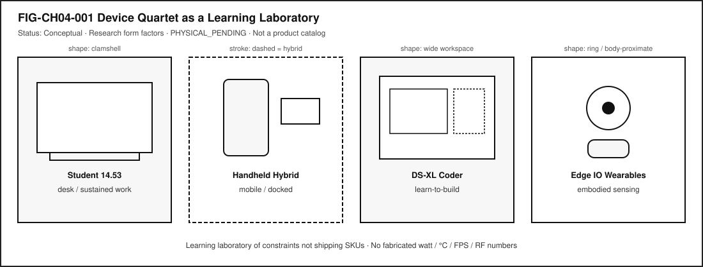
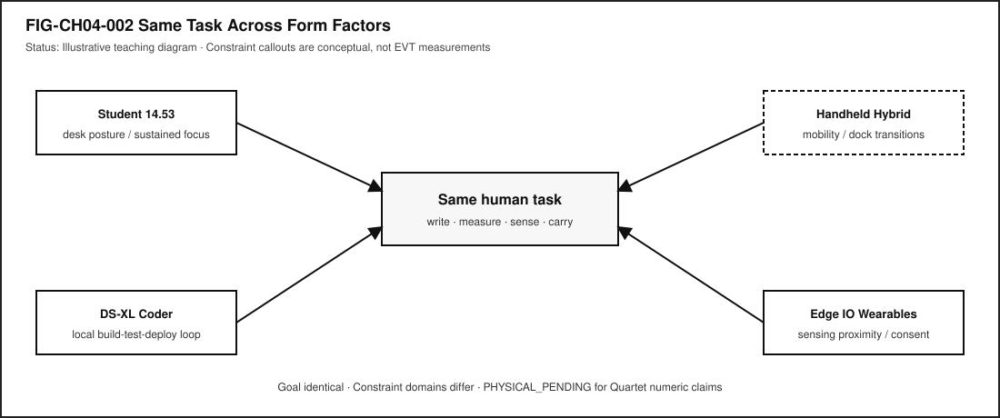
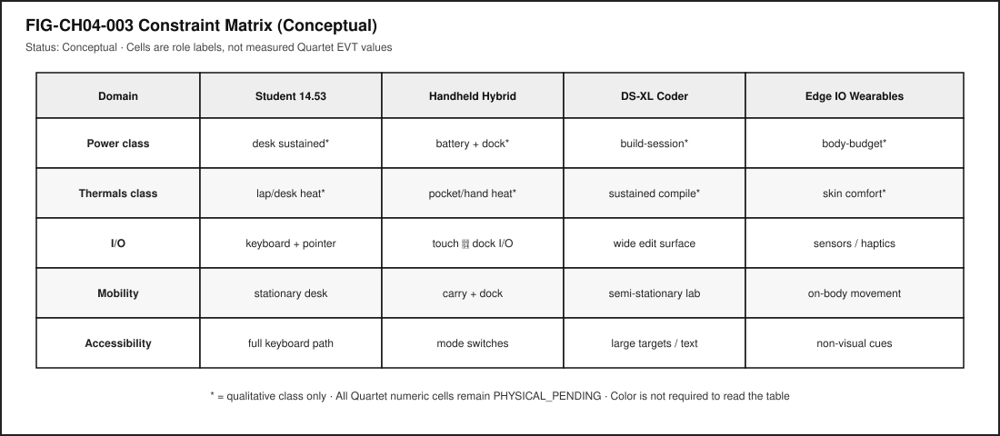

# Chapter 4 — The Device Quartet as a Learning Laboratory

**Status:** `draft` · **Chapter ID:** `CH04`  
**Author:** Edmund Gunn, Jr.  
**Gate posture:** `GATE_3_IN_PROGRESS — READER_EVIDENCE_PENDING` (not Gate 3 PASS)  
**Physical Device Quartet claims:** `PHYSICAL_PENDING`

---

## 1. The moment

You imagine one ordinary goal—write a short report, measure how long a page takes to become usable, sense whether a device is with you, or carry a work session across a day—and then you ask a dishonestly simple question:

> What if the *same* goal had to live on four different bodies of technology?

On a clamshell at a desk, the task has a keyboard, a stable posture, and room to spread windows. On a hybrid handheld that can also dock, the same task must survive pockets, one-handed moments, and sudden keyboard availability. On a larger coding-and-display form, the task becomes a learn-to-build loop: edit, run, inspect, revise. On a wearable or edge I/O device near the body, the task is no longer only about screens; it is about sensing, proximity, consent, and what it means for compute to move with you.

From the seat of imagination, the goal is identical. The failure modes are not.

This chapter introduces the book’s **Device Quartet** as a **learning laboratory**: four recurring research form factors used to expose different constraints, not to sell shipping SKUs [@src-hardware-quartet; @gunnchosTechnologyLandscape2026]. The four names you will meet again are:

| Research form factor | Learning role in this book |
|---|---|
| **Student 14.5-inch** | Sustained **desk** compute for full learning and work sessions |
| **Handheld Hybrid** | **Mobile and docked** compute |
| **DS-XL Coder** | Strongest **learn-to-build** device lens |
| **Edge IO Wearables** | **Embodied sensing** and body-proximate interaction |

Those roles come from the publication device index and the hardware industrial-design research docs audited for this edition. Physical fabrication and engineering validation testing (EVT) measurements remain pending—**PHYSICAL_PENDING**—so this chapter refuses invented battery capacities, wattage curves, thermal °C plots, FPS scores, RF field numbers, latency benchmarks, or shipping claims (CLM-0003; CLM-CH04-002).

You do not need Quartet hardware to learn here. Commodity devices you already own are enough for **LAB-QUARTET-001**.

---

## 2. What you notice

Before catalogs and SKUs, notice what changes when the *body* of the computer changes.

On a desk clamshell, you notice sustained attention: two hands, a stable seat, a surface that invites long editing. Interruptions are often social or network interruptions, not “I put the computer in my pocket.”

On a hybrid handheld, you notice mode switching: walking versus sitting; touch versus docked keyboard; bright outdoor light versus indoor desk light; the way “connected” and “usable” can diverge when you move between networks.

On a learn-to-build form, you notice workflow thickness: terminals, logs, local builds, side-by-side references. The limiting resource may be screen real estate for inspection, not pocketability.

On a wearable or edge I/O path, you notice embodiment: sensors near skin, haptics, glanceable cues, and a sharper privacy boundary because the device may know where a body is and what it is doing.

**Constraint contrast** is the chapter’s central observation: the same human task can remain the “same” in intention while different technical conditions become the first ones to break.

You may also notice a temptation: to fill the empty measurement cells with impressive numbers. Resist it. Empty cells labeled `PHYSICAL_PENDING` are more scientific than invented confidence.

Optional commodity comparison (no Quartet required): take one task you already do—draft a paragraph, open a shared document, start a timer, check a calendar—and try it once at a desk keyboard and once on a phone. Do not invent Quartet scores from that trial. Simply notice which constraint domain moved first: input, mobility, attention, or network.

---

## 3. Exploded ecosystem

A learning laboratory is not a store shelf. @fig-ch04-001 shows the Quartet as four educational lenses. Treat the diagram as **conceptual**—representative educational architecture for teaching roles—not a photograph of validated manufactured units.

{#fig-ch04-001 fig-cap="Device Quartet as a Learning Laboratory. Conceptual: research form factors with PHYSICAL_PENDING physical attributes; not a shipping catalog."}

### Human

You bring intent, attention, posture, and consent. On wearables, consent is not a footer checkbox; it is part of the experience boundary.

### Desk clamshell lens (Student 14.5-inch)

A sustained learning/work session form: keyboard-forward input, larger visual workspace, peripherals that can stay attached. The ecosystem emphasis is **stationary productivity** and long sessions [@src-hardware-quartet].

### Mobile/docked lens (Handheld Hybrid)

A form that must remain useful while carried and become deeper when docked. The ecosystem emphasis is **mode transition**—not entertainment-only portability [@src-hardware-quartet].

### Learn-to-build lens (DS-XL Coder)

A form that privileges local build-test-deploy learning: room to see code, logs, and references together. The ecosystem emphasis is **inspection bandwidth** for makers and students [@src-hardware-quartet].

### Embodied sensing lens (Edge IO Wearables)

A form where sensing and interaction sit near the body. The ecosystem emphasis is **proximity, safety-critical interaction, and privacy**, not novelty accessories [@src-hardware-quartet].

### Shared under-layers (every lens)

Across all four, familiar stacks still exist: input hardware, SoC/CPU/GPU/RAM/storage classes, radios when networked, batteries and power regulation, thermal paths, system software, applications, and optional network services [@patterson-hennessy; @tanenbaum-bos]. Chapter 2 taught you to follow one tap through those layers. Chapter 4 asks a different question: **which layers become the bottleneck when the enclosure and posture change?**

Publication machine-readable roles live in `devices/quartet.yaml` [@gunnchosTechnologyLandscape2026]. Concept Edition foreshadowing of the Quartet (CE-1) may have introduced the names; this chapter makes them a laboratory. Note carefully: Concept Edition module **CE-4** is about packets, access networks, edge, and cloud (later full-book chapters)—it is **not** a title match for Chapter 4.

---

## 4. Follow the signal

@fig-ch04-002 keeps one task in the center and fans constraint callouts outward. Read it as a logical story about *where pressure appears*, not as a measured EVT report.

{#fig-ch04-002 fig-cap="Same task across form factors. Illustrative teaching diagram; constraint callouts are conceptual, not Device Quartet EVT measurements."}

Walk one example task—“finish and submit a short write-up”—across the four lenses:

1. **Intent forms.** You decide the write-up must be completed.
2. **Posture selected.** Desk seat, walking commute, lab bench, or on-body glance.
3. **Input path engages.** Keyboard and pointer; touch; docked keyboard; or wearable confirmation plus companion screen.
4. **Working state loads.** Document opens; cache hit or miss; optional network sync.
5. **Attention budget appears.** Notifications, motion, ambient light, and multitasking compete differently by form.
6. **Compute and storage work.** Editing, autosave, local preview, optional compile if the “write-up” includes a small program on the coder lens.
7. **Power/thermal class becomes relevant qualitatively.** Desk sessions, pocket heat, sustained local builds, and skin-comfort budgets are different *classes* of constraint—even before any Wh or °C number exists.
8. **Network path (optional).** Sync, submit, or fetch references; “connected” may not mean “submitted.”
9. **Output and confirmation.** Screen text, haptic tap, audio cue, or docked display confirmation.
10. **Human judgment.** Done, stalled, or falsely marked done.

### Alternate honesty paths

| Path | What you are allowed to claim today |
|---|---|
| **Published research roles** | The four form factors exist as documented learning benchmarks [@src-hardware-quartet] |
| **Commodity analogy** | Your laptop/phone/tablet/band can stand in as *analogy devices* for labs |
| **Measured commodity trial** | Numbers you collect apply to *your* device and conditions only |
| **Quartet EVT comparison** | **PHYSICAL_PENDING** — do not invent |

The signal to follow in this chapter is not a single interrupt line. It is the migration of the bottleneck as posture and enclosure change.

---

## 5. Component cards

These cards name laboratory roles and the failure domains they teach. They are not a bill of materials and not a price list.

### Learning laboratory

**Plain definition.** A recurring set of form factors used to teach constraints by contrast.

**Experience benefit.** Readers practice systems thinking without waiting for a single “perfect” device.

**Failure symptom.** Treating the laboratory as a shopping list, or inventing measurements to make the lab feel “more real.”

### Research form factor

**Plain definition.** An educational/design benchmark describing a class of device experience; not a claim that a finished commercial SKU has shipped.

**Experience benefit.** Shared vocabulary across chapters.

**Failure symptom.** Marketing language (“buy this”) replacing constraint language (“this posture stresses X”).

### Student 14.5-inch

**Plain definition.** Clamshell-class research form factor for sustained desk learning and work [@src-hardware-quartet].

**Experience benefit.** Teaches long-session compute, keyboard-first input, and desk ergonomics as system conditions.

**Failure symptom.** Assuming desk comfort equals universal usability on mobile or wearable paths.

### Handheld Hybrid

**Plain definition.** Portable/hybrid research form factor emphasizing mobility and docked depth [@src-hardware-quartet].

**Experience benefit.** Teaches mode transitions and carry constraints.

**Failure symptom.** Designing only for the docked mode, or only for the pocket mode, and calling either “the” product.

### DS-XL Coder

**Plain definition.** Larger coding/display-oriented research form factor for local learn-to-build workflows [@src-hardware-quartet].

**Experience benefit.** Teaches inspection bandwidth: seeing build, test, and logs together.

**Failure symptom.** Confusing “more screen” with “measured faster compiles” without evidence.

### Edge IO Wearables

**Plain definition.** Wearable/edge I/O research form factor emphasizing embodied sensing, proximity, and safety-critical interaction [@src-hardware-quartet].

**Experience benefit.** Teaches that some computing is body-adjacent, with sharper privacy and consent stakes.

**Failure symptom.** Treating wearables as optional gadgets, or capturing other people’s biometric streams “for the lab.”

### Constraint contrast

**Plain definition.** Same task, different limiting conditions by form factor.

**Experience benefit.** Better failure-domain hypotheses (“mobility,” “input,” “sensing consent”) instead of one vague villain.

**Failure symptom.** Declaring a universal winner device from qualitative imagination alone.

### PHYSICAL_PENDING

**Plain definition.** Physical fabrication/EVT evidence is not yet available; numeric hardware claims stay unmarked or explicitly pending.

**Experience benefit.** Protects scientific honesty and reader trust.

**Failure symptom.** Filling tables with plausible-looking invented wattage, thermals, FPS, RF, or latency figures.

---

## 6. Stability contract

The book’s **Stability Contract** still holds:

> A user experience exists only while multiple hidden technical conditions remain within acceptable bounds.

For the Quartet laboratory, learning-lab usability adds a publication rule:

> Comparisons stay qualitative until EVT exists; readers are never blocked by missing Quartet hardware.

Concurrent conditions for a fair Chapter 4 learning experience include:

- the task goal is stated clearly,
- at least two form-factor lenses are compared,
- constraint language is used instead of invented SKU scores,
- commodity fallback routes remain available,
- privacy boundaries hold for embodied/sensing scenarios,
- accessibility alternatives are accepted as first-class input paths,
- observation is separated from inference,
- `PHYSICAL_PENDING` labels travel with any quantitative Quartet claim.

@fig-ch04-003 makes the matrix idea visible. Cells show **role classes**, not measured EVT values. Color is not required to read it; labels carry the meaning.

{#fig-ch04-003 fig-cap="Constraint matrix for power class, thermals class, I/O, mobility, and accessibility. Conceptual; Quartet numeric EVT cells remain PHYSICAL_PENDING."}

Three separations matter here:

1. A desk session can feel “stable” while the same task on a handheld is already failing for mobility reasons.
2. A coder form can expose build/inspection failures that never appear in a short phone edit.
3. A wearable path can keep radios “fine” while consent or sensing proximity has already broken the human contract.

You experience the combined result. Blaming “the battery” or “the OS” without evidence collapses those domains. Section 11 practices better blame—and better restraint.

---

## 7. Try it

### LAB-QUARTET-001 — Constraint contrast without Quartet hardware

**Observable question.** For one familiar task, which constraint domains change across desk, mobile/docked, learn-to-build, and embodied form-factor lenses—without inventing physical Device Quartet measurements?

**WAIKE alignment note.** WAIKE accepted `main` (audited SHA recorded in the Chapter 4 packet) offers adjacent product-charter, hardware-triage, and compatibility-matrix practice labs. It does **not** currently ship an exact Quartet physical module. **LAB-QUARTET-001** is therefore a **publication-owned** commodity/paper lab. Do not mint false WAIKE Quartet IDs.

**Prerequisites.** A text editor or spreadsheet; optional Python 3 for the blank CSV helper. No Quartet hardware. No purchase required.

**Safety / privacy.** No unsafe electrical, battery, RF, or thermal abuse. Do not capture passwords, tokens, private messages, or other people’s biometric streams. Prefer synthetic or public tasks.

**Time estimate.** About 45–90 minutes including write-up.

**Equipment / software.** None specialized (`equipment: []`). Fixtures live under `labs/LAB-QUARTET-001/`.

#### Prediction

Before filling the matrix, write one sentence: which Quartet lens do you expect to stress **mobility** most for your chosen task, and why?

#### Route A — Paper / digital matrix (baseline)

1. Choose one familiar task.
2. Open `fixtures/constraint_matrix_template.md`.
3. Fill qualitative cells only for the four lenses.
4. Leave Quartet numeric EVT fields empty or marked `PHYSICAL_PENDING`.

#### Route B — Commodity analogy (required companion)

1. Open `fixtures/commodity_analogy_card.md`.
2. Map two devices you already own onto two lenses by analogy.
3. Record what you **observed** vs what you only **inferred**.

#### Route C — Optional local helper

Run `python labs/LAB-QUARTET-001/local/matrix_sheet.py` to print a blank CSV skeleton. It invents nothing; it only prints headers.

#### Evidence (minimum)

- completed constraint matrix,
- observation vs inference paragraph,
- one-page PHYSICAL_PENDING measurement plan (what EVT evidence would be required later),
- teach-back paragraph.

#### Interpretation

Label claims:

- **Directly observed** on a commodity device you used,
- **Analogical** (mapped to a Quartet lens for learning),
- **PHYSICAL_PENDING** (would require Quartet fabrication/EVT).

#### Limits (say them out loud)

- Analogies are not product equivalence.
- One informal trial is not a benchmark.
- Qualitative class labels are not Wh, °C, FPS, dBm, or ms.
- Fixture completion is not Gate 3 PASS and not human full-manuscript validation.

#### Portfolio output

1. `README.md` (question, method, limits),
2. constraint matrix,
3. observation vs inference note,
4. PHYSICAL_PENDING plan,
5. teach-back,
6. scrubbed evidence note.

Completion means a claim is supported by an artifact—not that a command ran.

---

## 8. Build it

Use the same laboratory at the depth that matches your pathway.

### Explorer

Name the four form factors and one constraint each exposes. Use ordinary language. No invented specs.

### Operator

Map one familiar task onto two lenses. Predict different failure domains (for example, mobility vs inspection bandwidth). Check your prediction against a commodity trial.

### Builder

Produce the comparison matrix: task × form factor × likely constraint. Keep cells qualitative unless you measured *your* commodity device. Document tradeoffs without purchase pressure.

### Engineer

State which claims would require physical EVT evidence before quantitative comparison. Draft a measurement plan that lists instruments, revision identifiers, and honesty labels—without fabricating results.

### Researcher

Design a controlled comparison protocol for a future date when physical units exist: hypotheses, variables, environment controls, uncertainty, and stop-rules against overclaim. Until then, keep status `PHYSICAL_PENDING`.

Educators can facilitate teach-backs from Section 11 and adapt LAB-QUARTET-001 for classrooms that only have phones and shared laptops.

---

## 9. Secure and include it

### Security

Form-factor changes can change the attack and mistake surface: docked sessions may trust peripherals differently; handhelds increase loss/theft exposure; wearables add on-body capture risk. Relevant ideas here include permissions, authentication at mode transitions, and not treating a haptic buzz as proof of a privileged action.

### Privacy

Embodied sensing is not a toy layer. LAB-QUARTET-001 forbids capturing other people’s biometric or body-proximate streams. Prefer imagined constraints or your own consented commodity sensors, with scrubbed artifacts.

### Accessibility

Not every learner uses the same input path. Desk keyboards, touch, switches, voice, and assistive pointers must remain first-class ways to complete the laboratory task. Comparison materials should not rely on color alone; @fig-ch04-001 through @fig-ch04-003 use shape and label encodings.

### Equity

Readers must not be blocked by missing Quartet hardware or by purchase pressure. Commodity fallback is a requirement, not a consolation prize (CLM-CH04-004). Designing labs only for ideal desks silently excludes learners who work on phones, shared machines, or intermittent networks.

---

## 10. Career lens

Constraint-based laboratories show up in real work. No table promises employment; roles vary by organization.

| Concern | Example role | Professional artifact | Lab resemblance |
|---|---|---|---|
| Form-factor strategy | Industrial designer | Research form-factor brief | Quartet role table without fake SKUs |
| Hardware systems | Hardware systems engineer | Constraint and interface notes | Matrix of I/O and thermal *classes* |
| Product management | Product manager | Problem framing across postures | Same-task / different-failure write-up |
| Education design | Learning designer / educator | Lab that works without specialty gear | LAB-QUARTET-001 commodity routes |
| Accessibility | Accessibility specialist | Mode-equivalent interaction review | Keyboard/switch/voice acceptance |
| Privacy / trust | Privacy engineer | On-body sensing consent model | Wearable boundary rules in the lab |
| Validation | Test / EVT engineer | Revision-dated measurement package | PHYSICAL_PENDING plan (results empty until real) |

When later chapters reuse these lenses—performance, sensors, edge AI, product design—they remain research/learning spines, not mascots and not fabricated shipping products (CLM-0003).

---

## 11. Check understanding

Answer with reasoning. Prefer short paragraphs over one-word guesses.

1. Why is a learning laboratory of four form factors more honest than a single “ideal student device” story?
2. Name one constraint each of Student 14.5-inch, Handheld Hybrid, DS-XL Coder, and Edge IO Wearables is meant to expose.
3. Why must Quartet battery, wattage, thermal, FPS, RF, and latency figures stay `PHYSICAL_PENDING` in this edition?
4. How can a commodity phone-and-laptop comparison teach Quartet ideas without claiming product equivalence?
5. Why might “the device is connected” be true while an embodied or mobile task has already failed for a person?
6. What evidence would you need before claiming one form factor is “faster” or “cooler” than another?
7. How should privacy rules change when a laboratory involves body-proximate sensing?
8. **Teach-back.** Explain the Device Quartet to a family member **without** using the words *EVT*, *SoC*, or *form factor*. Then introduce those three terms one at a time, tying each to something already understood.

Educator note: successful teach-backs show constraint contrast and the no-purchase rule, not memorized product slogans.

---

## References

Selected sources for this chapter:

- Device Quartet research docs and manufacturing-readiness honesty labels [@src-hardware-quartet]
- Publication device index and learning-lab posture [@gunnchosTechnologyLandscape2026]
- General computer organization vocabulary for shared under-layers [@patterson-hennessy]
- Operating-system and systems vocabulary for software under-layers [@tanenbaum-bos]

Project-specific claim IDs (for example, CLM-0003, CLM-CH04-001–004) live in `evidence/claim_registry.yaml` and the Chapter 4 claim plan. They are not substitutes for Gate 3 human reader evidence. Full-book human validation remains deferred until the working manuscript is complete; this chapter does **not** claim Gate 3 PASS.

## 12. Glossary links

| Term | Role in this chapter |
|---|---|
| Device Quartet | Four research form factors used as a learning laboratory |
| Learning laboratory | Recurring constraint-teaching set, not a store shelf |
| Research form factor | Educational/design benchmark; not a shipping SKU claim |
| Student 14.5-inch | Desk / sustained-session lens |
| Handheld Hybrid | Mobile and docked lens |
| DS-XL Coder | Learn-to-build lens |
| Edge IO Wearables | Embodied sensing / body-proximate lens |
| Constraint contrast | Same task, different limiting conditions |
| PHYSICAL_PENDING | Physical/EVT evidence not yet available |
| Stability Contract | Experience depends on hidden conditions staying acceptable |
| Commodity fallback | Lab route that uses devices learners already own |
| Observation | What was directly seen or recorded |
| Inference | What is believed between observations |
| EVT | Engineering validation testing (evidence class—not claimed complete here) |

Deeper entries and “not the same as” warnings belong in the living glossary network. Prefer following a link when stuck over inventing a private definition.

---

## Figure references (embedded above; accessibility metadata)

All figures below are **conceptual** or **illustrative** unless a future revision cites a dated, revision-specific hardware evidence package.

### FIG-CH04-001 — Device Quartet as a Learning Laboratory

- **Caption.** Four research form factors as a learning laboratory, not a product catalog.
- **Alt text.** Four panels: Student 14.5 desk; Handheld Hybrid mobile/docked; DS-XL Coder learn-to-build; Edge IO Wearables embodied sensing.
- **Status.** Conceptual.
- **Source.** Publication-owned original informed by research form-factor roles [@src-hardware-quartet].

### FIG-CH04-002 — Same Task Across Form Factors

- **Caption.** One task with different constraint callouts by lens.
- **Alt text.** Center task node with four constraint branches.
- **Status.** Illustrative teaching diagram; not measured EVT.
- **Source.** Publication-owned original.

### FIG-CH04-003 — Constraint Matrix (Conceptual)

- **Caption.** Power class, thermals class, I/O, mobility, and accessibility across four lenses.
- **Alt text.** Conceptual table; numeric Quartet EVT cells pending.
- **Status.** Conceptual; `PHYSICAL_PENDING` for quantitative Quartet claims.
- **Source.** Publication-owned original.

---

## Claim footnotes used in this chapter (project-specific)

| Claim ID | Approved gist | Classification |
|---|---|---|
| CLM-0003 | Device Quartet defined as research form factors / learning benchmarks; PHYSICAL_PENDING | repository-documented research form factors |
| CLM-CH04-001 | Quartet docs define research form factors / educational learning benchmarks | SOURCE_IDENTIFIED (@src-hardware-quartet + devices/quartet.yaml) |
| CLM-CH04-002 | Physical Quartet units and EVT measurements remain PHYSICAL_PENDING | PHYSICAL_PENDING |
| CLM-CH04-003 | Different form factors expose different ecosystem constraints for the same task | ILLUSTRATIVE_ONLY teaching model |
| CLM-CH04-004 | Chapter 4 labs must not require purchase or possession of Quartet hardware | publication policy / Wave-1 lab posture |

General statements about CPUs, memory classes, and operating-system layers are treated as general technical knowledge and cited to textbooks where helpful. Quartet numeric hardware claims, when shown at all, must carry **PHYSICAL_PENDING**, **illustrative**, **measured (commodity)**, or **inferred** labels—and must never be fabricated.

---

*End of Chapter 4 working draft manuscript.*
