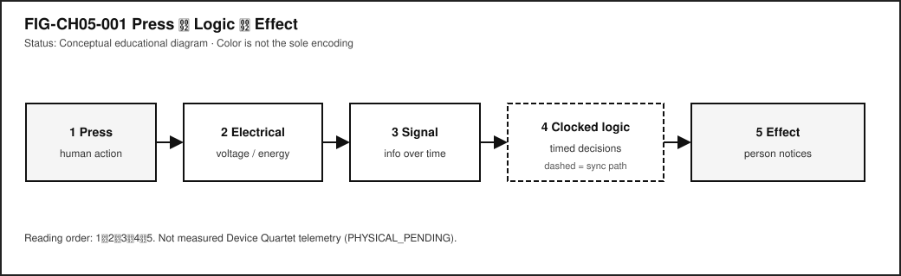
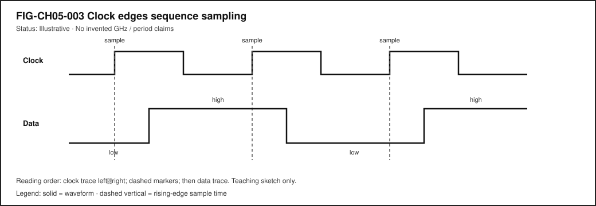

# Chapter 5 — Electricity, Signals, Clocks, and Logic

**Status:** `WORKING_DRAFT_COMPLETE` · **Chapter ID:** `CH05`  
**Author:** Edmund Gunn, Jr.  
**Part II:** Hardware and electrical fundamentals (not a parts catalog)

---

## 1. The moment

You press a button—or touch a screen that *behaves* like a button. The control darkens. A light turns on. A menu opens. A lock clicks. Something you can see, hear, or feel has changed.

From your seat, it is tempting to credit the glass, the plastic, or the logo. Those surfaces matter for comfort and trust, but they are not where the decision lives. Underneath the ordinary moment, voltages change, a time-varying quantity is treated as information, a shared timing reference keeps order, and logic decides what should happen next.

This chapter’s governing question is simple:

> How does an everyday device turn a human action into an electrical story that logic can decide—and turn that decision back into something a person notices?

Part II starts here on purpose. Later chapters name processors, memory, radios, and firmware. Those systems still rest on electricity, signals over time, clocks, and logic. Chapter 2 already followed a tap through a stack and lightly named sensors and interrupts; this chapter does **not** replay that story. It zooms under the stack into the physical substrate—without becoming an encyclopedia of every resistor and chip package.

If you remember only one sentence after the first reading, remember this: **glass shows; electricity and timed logic decide.** Everything else in Part II elaborates that sentence with more honest detail.

---

## 2. What you notice

Before formulas, notice the human contract you already enforce with frustration.

When you press, you expect recognition. When nothing happens, you may blame a “dead button,” a drained battery, a flaky cable, or “the software.” Those everyday diagnoses are not always wrong—but they collapse several domains into one complaint. A button that never changes voltage cannot deliver a signal. A signal that arrives while logic is confused about *when* to look may be ignored. Power that is present for a display and missing for an input controller can look like “the app froze” even though the glass still glows.

You also notice timing. A light that flips instantly feels different from a light that hesitates. A keyboard that repeats characters feels different from one that drops them. Those feelings are not decorations around engineering. They are the product, from the person’s point of view.

**Devices move and decide using electrical signals and timed logic.**

That sentence is enough for the Explorer pathway. Operators and Builders will add failure domains. Engineers will separate continuous physical quantities from discrete abstractions. Researchers will state what would be required to *measure* a real waveform instead of inventing one.

Optional comparison available on almost any device you already own: press a physical power or volume rocker, then tap an on-screen control. Both can produce a perceptible effect. The hardware paths differ. The shared idea does not: human action → physical change → interpreted signal → decision → effect.

---

## 3. Exploded ecosystem

@fig-ch05-001 is the first-minute map for this chapter: press → electrical change → signal → clocked logic → perceptible effect. It is **conceptual**—not a claim that any particular manufactured revision wires those stages the same way, and not a measured Device Quartet waveform. Device Quartet form factors used elsewhere in this series remain research/learning spines; physical fabrication and EVT electrical measurements stay **PHYSICAL_PENDING** [@src-hardware-quartet].

{#fig-ch05-001 fig-cap="Press → electrical change → signal → clocked logic → effect. Conceptual educational flow; not measured telemetry." fig-alt="Causal flow from human press through electrical change, signal, clocked logic, and perceptible effect."}

Walk the ecosystem in ordinary language. Keep the same layers when vocabulary deepens. Do **not** treat this as a bill of materials.

### Human

You form intent: turn something on, open a menu, confirm a choice. Muscles move. Skin contacts a switch, a key, or a sensing surface. Later, eyes, ears, and hands judge whether the result matches what you meant.

### Transducer / input interface

Something converts the action into an electrical change. A mechanical switch opens or closes a path. A touch-sensing layer alters capacitance or another measurable property. A microphone membrane moves. The exact physics differ; the educational role is the same: human action becomes a change the electronics can sense.

### Electrical medium

Three ordinary electrical quantities stay distinct in this chapter. **Voltage** is a potential difference—the “pressure” that can drive charge when a path exists. **Current** is charge in motion along that path. **Power** is how fast energy is delivered or converted (qualitatively: when both voltage and current are present in a useful path, work can be done and heat can appear). You do not need a full circuits course to hold the separation: energy and control arrive as electrical quantities that must be present, limited, and safe enough for the intended parts. Later sections stay qualitative; this book will not invent precision meter readings for research hardware that has not been measured.

### Signal

A **signal** is a physical quantity varying in time that carries information. The press is not the signal. The changing voltage (or related quantity) *is*—once a designer decides how to interpret it. Noise, bounce, and incomplete connections can corrupt that interpretation without erasing the human’s intent.

### Clock (when the design is synchronous)

Many digital systems share a **clock**: a timing reference that sequences when values are sampled and updated. Not every useful circuit is synchronous; asynchronous and continuous analog paths exist. Still, for the digital behavior most people meet in phones, laptops, and controllers, a clock is the drumbeat that keeps decisions orderly [@harris-harris-riscv; @patterson-hennessy].

### Logic

**Logic** implements decision rules. Simple elements—often taught as gates realizing Boolean functions—combine into larger digital behavior: “if the button is down *and* the unlock condition is true, then release the latch” [@harris-harris-riscv]. Software later names the same decisions as `if` statements; underneath, the substrate remains electrical interpretation against rules.

### Effect

An actuator, display pixel path, speaker, motor driver, or status LED turns the decision into something perceptible. The person experiences the effect, not the intermediate abstractions.

### Optional software boundary

Once digitized, the same story may continue as an input event delivered into an operating-system input subsystem and application handlers [@linux-input]. Chapter 2 already walked that upper path. Here, keep the boundary honest: software events rest on earlier electrical recognition.

---

## 4. Follow the signal

Read the following as a logical story, not as a claim that every device executes exactly one step at a time with no overlap.

1. **Intent.** You decide to press.
2. **Contact or proximity.** Skin meets a control surface, or a finger approaches a capacitive sensor.
3. **Transduction.** The interface changes an electrical quantity.
4. **Conditioning (often invisible).** Designers may debounce, filter, amplify, or threshold so that a messy physical change becomes a cleaner decision input. Commodity devices hide this; educational kits sometimes expose it.
5. **Interpretation as levels.** Continuous variation is often mapped to discrete levels—commonly taught as logic `0` and `1` bands with forbidden or uncertain regions between them [@harris-harris-riscv]. @fig-ch05-002 compares continuous analog variation with digital level bands.
6. **Timing reference.** In synchronous designs, a clock edge (or related timing event) says *when* to trust a sample. @fig-ch05-003 is an **illustrative** timing sketch—no invented gigahertz claims, no Device Quartet scope captures.
7. **Logic decision.** Gates and sequential elements combine present inputs (and remembered state) into next outputs [@harris-harris-riscv]. @fig-ch05-004 shows tiny Boolean blocks composing larger behavior.
8. **Downstream action.** The decision enables a driver, updates a register that software will read, or changes a display path.
9. **Human feedback.** Light, motion, sound, or haptic change closes the loop.

{#fig-ch05-002 fig-cap="Analog continuous quantity versus digital level bands. Conceptual; not a measured scope capture." fig-alt="Side-by-side comparison of a continuous analog waveform and discrete digital logic levels."}

{#fig-ch05-003 fig-cap="Illustrative clock edges sequencing decisions. Teaching sketch only; no invented frequency claims." fig-alt="Illustrative clock edges sequencing sampling of a digital signal."}

{#fig-ch05-004 fig-cap="Boolean building blocks composing larger digital behavior. Conceptual educational diagram." fig-alt="Small logic gates composing a larger Boolean decision path."}

Failure branches are part of honesty:

- **No power in the right place.** The display may still glow while the input path is starved.
- **Signal not interpretable.** Bounce, noise, or a broken cable yields chatter or silence.
- **Timing violated.** The value changes while logic is sampling; the system may see a metastable or simply wrong bit—explained here qualitatively, without invented lab numbers.
- **Logic correct, effect blocked.** The decision happened; the actuator path did not.

Separating those domains is an Operator skill. Claiming root cause without evidence is not.

A useful habit is to narrate the same press twice: once as a person (“I pushed; the light should turn on”) and once as a path (“contact → electrical change → sample → decision → drive → light”). When the stories disagree, you have located a teaching moment instead of a vague villain. Chapter 6 and later hardware chapters will add richer component vocabulary; they still depend on this path discipline. Do not replay Chapter 2’s full tap stack here—keep the zoom under the stack, on the substrate that makes later stacks possible.

---

## 5. Component cards

These cards are teaching tools, not a catalog of SKUs. If removing a name still leaves the human story intact, the name was trivia.

### Electricity as useful energy and control

- **What it is.** Voltage (potential difference), current (charge flow), and power (energy delivery rate) used together to do work or convey control—three related quantities, not three names for one thing.
- **What it does.** Powers sensors, logic, radios, and actuators; carries many of the signals this chapter cares about.
- **When it works.** Enough energy arrives where it is needed, within limits the parts can tolerate.
- **When it fails.** Brownout, open path, short, or wrong domain powered—often experienced as “dead” behavior without a helpful error message.
- **Misconception to drop.** Seeing a glowing screen (some power domain alive) does not prove the input path has voltage, current, and power where the decision needs them.

### Signal

- **What it is.** A time-varying physical quantity treated as information.
- **What it does.** Carries the press, the sensor reading, the bit stream, the clock itself.
- **When it works.** Variation stays within the interpreter’s expectations.
- **When it fails.** Noise, attenuation, disconnection, or mis-wiring corrupt meaning.

### Analog versus digital

- **What it is.** Continuous physical quantities versus discrete symbolic levels [@harris-harris-riscv].
- **What it does.** Analog paths can track smooth change; digital abstractions tolerate some mess by snapping to levels.
- **Misconception to drop.** “Digital” does not mean “perfect” or “non-physical.” Digits still ride on voltages (or other media) that must be interpreted.

### Clock

- **What it is.** A shared timing reference that sequences synchronous digital work [@harris-harris-riscv; @patterson-hennessy].
- **What it does.** Coordinates when state updates, so cooperating parts agree on “now.”
- **Misconception to drop.** Not all electronics are clocked the same way; analog and asynchronous designs exist. A clock is not magic speed—it is agreement about time.

### Logic gate / Boolean decision

- **What it is.** A simple decision element (AND, OR, NOT, and kin) realizing a Boolean function [@harris-harris-riscv].
- **What it does.** Builds larger digital behavior from small, composable rules.
- **Misconception to drop.** Software `if` statements are not a different universe; they are a higher description of decisions that must eventually become physical.

### Noise and integrity (qualitative)

- **What it is.** Unwanted disturbance that can corrupt interpretation.
- **What it does.** Turns a clean story into chatter, dropouts, or wrong bits.
- **When teaching.** Stay qualitative here. Measuring integrity on a real board requires fixtures, probes, and stated methods—Researcher territory, not invented numbers.

---

## 6. Stability contract

The **Stability Contract** is a signature idea across this book:

> A user experience exists only while multiple hidden technical conditions remain within acceptable bounds.

For Chapter 5, a successful press-to-effect experience may require all of the following to stay “good enough” at once—stated **qualitatively**, with no fabricated thresholds:

- power present in the domains that sense, decide, and actuate,
- a signal that remains interpretable after transduction and conditioning,
- a timing reference stable enough for the intended synchronous logic (when the design relies on one),
- noise not overwhelming the interpretation margins,
- logic rules matching the designer’s intent (including remembered state),
- an effect path actually able to change something the person can notice,
- safety limits respected so “it worked once” does not become a hazard.

Three separations matter:

1. The interface can look **alive** while the input electrical path is already dead.
2. Logic can **decide correctly** while the actuator never receives drive.
3. A cable can be **mechanically seated** while the signal integrity is already insufficient.

You experience the combined result. Blaming “the button” or “the battery” without evidence collapses domains. Section 11 practices better blame.

Think of the Stability Contract as concurrent conditions, not a single score. Power can be “fine” in one domain and missing in another. A clock can be present yet unsuitable for the intended logic if it is unstable in ways the design cannot tolerate—stated here only as a qualitative warning, not as a numeric jitter budget. Noise can be harmless until it pushes a signal into the uncertain middle region on @fig-ch05-002. The contract fails when *any* required condition leaves the acceptable region for long enough that the person notices.

Device Quartet electrical measurements remain **PHYSICAL_PENDING**; do not treat conceptual figures as scope captures [@src-hardware-quartet].

---

## 7. Try it

### LAB-SIG-001 — From Press to Logic

**Observable question.** Can I label a press-to-effect path—human action → transducer → signal → logic → effect—using a simulation, offline fixture, or commodity kit without unsafe electrical work?

**WAIKE alignment note.** WAIKE (accepted `main` audit SHA recorded in the chapter packet) includes adjacent HARDWARE_ENGINEERING labs such as logic-gate and RC-transient practice. Those are **competency neighbors**, not renamed false IDs for this publication lab. **LAB-SIG-001** is publication-owned.

**Prerequisites.** A computer you may use for learning; ability to open a local HTML/Markdown fixture or a browser-based logic simulation. Optional commodity LED/button learning kit only if your setting already allows supervised low-voltage educational use.

**Safety (non-negotiable).**

- Do **not** open mains-powered equipment, cut into power cords, defeat safety covers, or improvise high-voltage experiments.
- Do **not** abuse batteries (no crushing, heating, shorting, or “see what happens” modifications).
- Do **not** transmit on radio frequencies you are not authorized to use.
- Prefer **simulation and offline fixtures**. If a supervised educational kit is used, stay within the kit’s documented low-voltage intent and local lab rules.
- Do not capture passwords, tokens, or private identifiers in screenshots.

**Time estimate.** About 40–75 minutes for the baseline simulation/fixture route, including write-up.

**Equipment / software.** Baseline: browser or local viewer for the supplied fixture. Optional: a classroom logic simulator. Optional supervised kit is an extension, never a requirement.

**No-specialized-hardware route.** Route A below.

#### Prediction

Before you look at the fixture, write one sentence: where do you expect the story to fail first if the button “does nothing”—power, transduction, interpretation, timing, logic, or effect?

#### Route A — Simulation / offline fixture (baseline)

Open the LAB-SIG-001 fixture (see `labs/LAB-SIG-001/`). It presents a labeled path with stages you can mark as **observed**, **inferred**, or **not evidenced**.

Complete:

1. Name each stage in ordinary language.
2. Mark which stages the fixture lets you *observe* directly versus only *infer*.
3. Introduce one deliberate failure in the fixture’s controls (for example, “noise high,” “clock paused,” or “effect disconnected”) and record which human complaint it mimics.
4. Write two sentences separating observation from interpretation.

#### Route B — Commodity kit (optional, supervised only)

Only where policy allows: use a documented educational button→LED kit at the kit’s intended low voltage. Map the same five-stage path. Do not invent oscilloscope numbers you did not capture with a method you can state. If you cannot measure, say so.

#### Evidence to keep

- Your prediction sentence.
- A filled stage table (observed / inferred / not evidenced).
- One failure-mode note tied to a Stability Contract condition.
- A teach-back paragraph (Section 11).

#### Limits

One fixture run is not a characterization of a phone or a Quartet revision. Software timestamps and cartoon waveforms are not physical scope captures. Commodity kit results are *your* evidence for *that* kit—not universal device truth.

If your classroom cannot open HTML files, use the Markdown fixture and a printed stage table. The learning target is the labeled path and the observation/inference split—not a particular file format. Educators may substitute an equivalent simulator as long as safety rules stay intact and learners still produce the same artifacts.

---

## 8. Build it

Use the press-to-logic story at the depth that matches your pathway.

### Explorer

Trace @fig-ch05-001 with a finger and retell it aloud without using the words *voltage*, *Boolean*, or *synchronous*. Then add those three words back, one at a time, tied to something already understood.

### Operator

Given a familiar complaint—“dead button,” “flaky cable,” “random double presses”—list at least two electrical/logic domains that could produce the same human report. Do not claim root cause without a test.

### Builder

Construct a labeled signal-path card: human action → transducer → signal → logic → effect. Annotate where software events might begin [@linux-input]. Keep the card free of SKU marketing language.

### Engineer

Distinguish analog continuous quantities from digital abstractions on @fig-ch05-002. Name the clock as a sequencing reference on @fig-ch05-003, and state one reason a design might still include asynchronous or analog paths [@harris-harris-riscv].

### Researcher

State what would be required to measure a real press-related waveform: probe points, ground reference, instrument class, sampling intent, and uncertainty notes. Keep Device Quartet claims **PHYSICAL_PENDING** until a dated evidence package exists [@src-hardware-quartet].

Educators can facilitate teach-backs from Section 11 and adapt LAB-SIG-001 for classrooms that have only simulation access—equity of route is part of the design, not an afterthought.

---

## 9. Secure and include it

### Electrical and lab safety

Curiosity about electricity is healthy; improvisation with mains power, damaged batteries, or unknown wiring is not. Publication labs for this chapter prefer simulation and fixtures precisely so learning does not require hazardous setups. Supervised educational kits remain optional extensions with documented limits.

### Security of the decision path

A press may unlock a door, approve a payment, or send a message. Relevant ideas—without turning this chapter into a full security course—include:

- **trusted sensing** (is the press authentic to the intended control?),
- **debounce and filtering** as integrity helpers that can also be abused if poorly designed,
- **privilege** of the effect (what can this decision enable?),
- **no unauthorized RF** experiments while “testing signals.”

### Privacy

Input timing and sensor traces can become sensitive when logged and correlated with identity. LAB-SIG-001 artifacts should use synthetic fixtures and scrubbed notes.

### Equity

Not every learner has a hardware kit. The baseline route is simulation/fixture on ordinary computers. Kit routes must not be framed as the only “real” learning. Assessment should accept high-quality fixture reasoning.

### Accessibility

Timing diagrams and logic figures must remain readable without color alone: labels, shapes, and stroke patterns carry meaning (@fig-ch05-002, @fig-ch05-003, @fig-ch05-004). Equivalent input paths—keyboard, switch control, voice, assistive pointers—still require the same underlying honesty: human intent must become an interpretable signal. Describe timing relationships in text equivalents, not only in pictures.

Inclusion also means pacing. Readers who are new to electricity should be able to finish Section 1–3 and LAB-SIG-001 Route A without being told they are “not technical enough.” Readers with prior circuits coursework should find enough precision in the Engineer/Researcher prompts to stay honest—especially the ban on invented measurements. The chapter’s middle path is intentional: fundamentals tied to experience, not a dump of catalog pages.

---

## 10. Career lens

Electricity, signals, clocks, and logic cross many ownership domains. No table promises employment; roles vary by organization. LAB-SIG-001 artifacts resemble early professional evidence in miniature: clear stage labels, observation-versus-inference discipline, and safety-aware procedures.

| Domain | Example role | Professional artifact | Lab resemblance |
|---|---|---|---|
| Circuits fundamentals | Electrical engineering student / technician | Annotated circuit explanation | Stage card with power and signal domains named |
| Digital design | Digital / FPGA engineer | Timing diagram + logic rationale | Clock-edge sketch with qualitative constraints |
| Embedded | Embedded systems engineer | GPIO / input contract notes | Builder path card including software boundary |
| Hardware test | Test engineer | Fixture procedure + uncertainty notes | Researcher measurement plan without invented data |
| Hardware bring-up | Board bring-up engineer | Power-rail and reset checklist | Stability Contract mapping for “dead board” complaints |
| Reliability | Hardware reliability engineer | Noise / integrity investigation plan | Failure-mode note tied to interpretation margins |
| Accessibility engineering | Accessibility engineer | Text equivalent for timing figures | Alt-text / reading-order check on chapter figures |
| Educator / mentor | Teacher, lab mentor | Scaffolded simulation lab | Facilitating Route A when kits are unavailable |

When Device Quartet form factors appear nearby in the series, treat them as learning spines with **PHYSICAL_PENDING** electrical evidence—not as shipping SKUs and not as sources of invented measurements [@src-hardware-quartet].

Career growth in this space often looks like better questions, not louder confidence: *Which domain failed? What did I observe? What would a fair test require?* Those questions travel from a classroom fixture to a bring-up lab to a field failure review.

---

## 11. Check understanding

Answer with reasoning. Prefer short paragraphs over one-word guesses.

1. Why is it incomplete to say “the screen did it” when a button press changes what you see?
2. What is the difference between a human press and a signal?
3. Why might a device look powered on while a particular button still does nothing?
4. In ordinary language, what job does a clock do in a synchronous digital design?
5. Why can analog and digital descriptions both be true of the same physical voltage over time?
6. Name two Stability Contract conditions for a press-to-effect experience and explain how each could fail independently.
7. What evidence would you need before blaming “noise” for a flaky button?
8. **Teach-back.** Explain electricity → signal → clock → logic → effect to a family member **without** using the words *Boolean*, *synchronous*, or *transducer*. Then introduce those three terms one at a time, tying each to something already understood.

Educator note: successful teach-backs show causal sequence and at least one failure branch, not a memorized parts list.

---

## References

Selected authoritative sources for this chapter’s general technical explanations are listed in the bibliography (`book/references/references.bib`). Project-specific repository evidence for Device Quartet physical status remains labeled **PHYSICAL_PENDING** and is cited separately from textbook foundations.

Inline citations used in this chapter include @harris-harris-riscv, @patterson-hennessy, @linux-input, and @src-hardware-quartet.

## 12. Glossary links

| Term | Role in this chapter |
|---|---|
| Electricity (energy/control) | Medium for power and many control signals |
| Voltage | Potential difference that can drive charge when a path exists |
| Current | Charge in motion along a path |
| Power | Rate of energy delivery or conversion (not a synonym for voltage) |
| Signal | Time-varying physical quantity carrying information |
| Analog | Continuous physical representation |
| Digital | Discrete symbolic levels interpreted from physical media |
| Clock | Timing reference sequencing synchronous digital work |
| Logic / logic gate | Decision rules and Boolean building blocks |
| Boolean function | Truth mapping realized by digital logic |
| Noise | Unwanted disturbance affecting interpretation |
| Signal integrity (qualitative) | Whether a signal remains interpretable |
| Transducer / input interface | Converts human/physical action into an electrical change |
| Debounce / conditioning | Making a messy press more interpretable (conceptual) |
| Stability Contract | Experience depends on hidden conditions staying acceptable |
| PHYSICAL_PENDING | Label for unmeasured Quartet/EVT electrical claims |

Deeper entries, analogies labeled as analogies, and “not the same as” warnings belong in the glossary network. Prefer following a link when stuck over inventing a private definition.

---

## Figure references (embedded above; accessibility metadata)

All figures below are **conceptual** or **illustrative** unless a future revision cites a dated, method-stated measurement package. Source preference: editable SVG in the publication repository.

### FIG-CH05-001 — Press to Logic Flow

- **Caption.** Human press through electrical change, signal, clocked logic, and perceptible effect.
- **Alt text.** Left-to-right causal flow: Press; Electrical change; Signal; Clocked logic; Effect.
- **Text equivalent / reading order.** (1) Press → (2) Electrical change → (3) Signal → (4) Clocked logic → (5) Perceptible effect.
- **Status.** Conceptual educational diagram.
- **Source.** Publication-owned original.

### FIG-CH05-002 — Analog versus Digital

- **Caption.** Continuous analog variation beside discrete digital level bands.
- **Alt text.** Two panels: smooth continuous waveform; stepped high/low digital levels with labeled bands.
- **Reading order.** Analog panel first, digital panel second; labels for high, low, and uncertain middle region.
- **Status.** Conceptual.
- **Source.** Publication-owned original.

### FIG-CH05-003 — Clock Edges Sequencing Decisions

- **Caption.** Illustrative clock edges marking when a digital signal is sampled.
- **Alt text.** Timing diagram with a clock waveform and a data waveform; arrows at selected edges mark sample times.
- **Status.** Illustrative teaching sketch; not a measured frequency claim.
- **Source.** Publication-owned original.

### FIG-CH05-004 — Logic Building Blocks

- **Caption.** Small Boolean gates composing a larger decision.
- **Alt text.** AND, OR, and NOT blocks feeding a labeled output decision.
- **Reading order.** Inputs left; gates center; composed output right.
- **Status.** Conceptual.
- **Source.** Publication-owned original.
