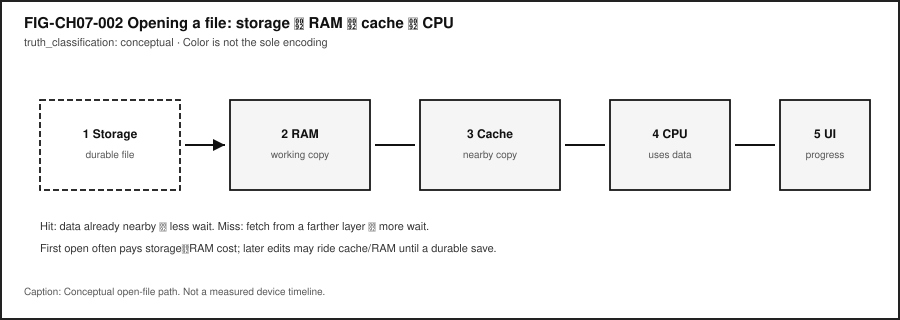
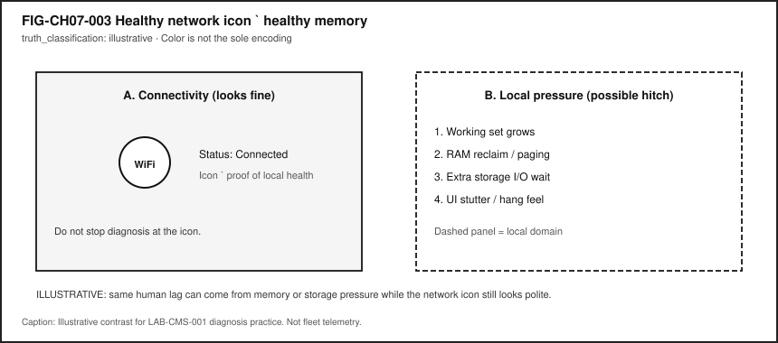

# Chapter 7 — Memory, Cache, and Storage

**Status:** `draft` · **Chapter ID:** `CH07`  
**Author:** Edmund Gunn, Jr.

---

## 1. The moment

You reopen an app you already know—or a large file you edited yesterday. Sometimes the window returns as if it never left. Sometimes a spinner spins long enough that you notice. Sometimes the drive (or fan) makes a thrash-sound, the pointer hitch-steps, and the app reloads as if starting over.

Glance at the network icon. It may still look fine: connected bars, a calm Wi‑Fi glyph, no angry offline badge. From the seat, the temptation is automatic—*the internet must be slow*—even when the work you are waiting on never left the device.

This chapter stays with that ordinary moment until hierarchy and persistence become visible. The governing questions are simple and honest:

> Why does “memory” mean different things in everyday speech?  
> Why is RAM not the same as storage?  
> How do hierarchy misses and storage I/O change how technology *feels*?

Chapter 6 names the local compute machine. This chapter deepens the **memory hierarchy** and the **durability** story without becoming a filesystem or database encyclopedia (that depth belongs later, especially Chapter 13). Concept Edition module CE-3 supplies the shared teaching spine—local lag with a healthy connectivity icon—and the commodity lab you will run inherits as **LAB-CMS-001**.

---

## 2. What you notice

Before jargon like *working set* or *write-back*, notice the human contracts you already expect.

When you open a familiar file, you expect it to return. When you edit, you expect the screen to keep up with your hands. When you save, you expect the work to still be there after quit or restart. When something stalls, you expect a progress cue honest enough that you know whether to wait, cancel, or worry. You also expect the device not to become unusably warm for something that “should be simple,” and you expect a healthy-looking network icon not to gaslight you when the real wait is local.

Those expectations collide with ambiguous everyday language. People say *memory* for RAM stickers on a store shelf, for “how much storage the phone has,” for remembering a password, and for “the app is using too much memory.” The words collide. The layers do not.

**What you feel is often a hierarchy miss or a durability wait dressed up as “the computer is bad.”**

Optional comparison on a device you already own: open a small text note that is already warm in the app, then open a large local document after a fresh launch. The first often feels like the data was nearby. The second may pay a longer path from durable storage into working memory—even while Wi‑Fi still smiles.

---

## 3. Exploded ecosystem

A reopen or open-file moment is not a single object. It is a path through cooperating layers. @fig-ch07-001 is the first-minute map of those layers as a **memory hierarchy**: registers, cache, RAM (main memory), and storage. It is **conceptual**—a teaching architecture, not a claim that your particular laptop silicon matches the diagram’s geometry.

{#fig-ch07-001 fig-cap="Memory hierarchy: registers → cache → RAM → storage. Conceptual educational diagram; qualitative tradeoffs only. RAM ≠ storage." fig-alt="Conceptual pyramid from registers through cache and RAM to durable storage."}

Walk the ecosystem in ordinary language, then keep the same layers when vocabulary deepens.

### Human

You form intent: reopen this project, open that photo, save these notes. Eyes and hands judge whether the result matches what you meant—and how long the wait felt.

### Application and processes

The app holds on-screen state, open documents, undo history, and caches of its own. The operating system represents that work as one or more **processes** and **threads**—abstractions for concurrent execution, not mystical containers that “are” the file [@tanenbaum-bos].

### OS mediation

The OS schedules who runs, mediates access to memory and files, and may reclaim RAM under pressure. It does **not** replace your application’s own computation; it allocates attention and enforces boundaries [@tanenbaum-bos].

### CPU (and optional accelerators)

Processors execute instructions and touch data that must arrive from somewhere in the hierarchy. Accelerators may help with media or composition; they still depend on data movement and shared resource limits.

### Memory hierarchy

Closer to the CPU, storage tends to be **smaller and faster**. Farther away, capacity grows and durability becomes the point. Architecture texts teach this capacity/latency/cost tradeoff as a hierarchy, not as four interchangeable synonyms for “memory” [@patterson-hennessy].

### Storage and power

Durable media hold files across quit and power-off in ordinary personal computing. Power and thermal policy can quietly reduce available performance during sustained work—another local domain that can look like “slowness” while connectivity still appears healthy.

### Optional network (often ruled out)

Remote services may matter for other chapters. For this chapter’s anchor, a healthy connectivity icon is frequently a **ruled-out** explanation when the workload is local: open a local file, scroll a local editor, save to local disk.

Device Quartet form factors (desk, handheld hybrid, learn-to-build, wearables) remain **research / learning benchmarks**. Any RAM or storage *capacity figures* that would require physical validation stay **PHYSICAL_PENDING** (CLM-CH07-004). Commodity devices remain first-class evidence sources for the lab.

---

## 4. Follow the signal

Follow one open. Imagine a medium-sized local file on durable storage.

1. **Intent.** You choose *Open* (or the app restores a previous session).
2. **Request.** Software asks the OS for the file’s bytes—not for “some RAM,” not for “the Wi‑Fi.”
3. **Storage read.** Durable media and the storage stack supply data. This step can dominate first-open feel.
4. **Into RAM.** A working copy (and related structures) lands in main memory so the CPU can use it without revisiting storage for every tiny access [@patterson-hennessy]; [@tanenbaum-bos].
5. **Into cache.** Hardware caches keep recently or likely-needed lines nearby. **Locality**—reusing the same or nearby data—is why caches reduce average access time; a **miss** costs a trip to a farther layer [@patterson-hennessy].
6. **CPU work.** Instructions decode, edit, render previews, run spellcheck—whatever the app does.
7. **UI progress.** Frames update; a page appears; a spinner stops.
8. **Later save (optional second path).** Edited state in RAM is not automatically durable. Completing a save pushes bytes toward storage; buffers may delay true durability until the write path finishes [@tanenbaum-bos].

@fig-ch07-002 shows that left-to-right teaching path. Segments are conceptual—not a stopwatch claim about your device.

{#fig-ch07-002 fig-cap="Opening a file: storage → RAM → cache → CPU → UI. Conceptual educational sequence; hits and misses change wait." fig-alt="Conceptual open-file path from storage through RAM and cache to CPU and UI."}

Three separations matter while you follow the signal:

1. **Warm reopen vs cold open.** Data already in RAM/cache can feel instant; a cold open may pay storage I/O.
2. **On screen vs on disk.** Visible text can live in a volatile working set while the durable file is older—or missing—until a save completes.
3. **Connected icon vs local wait.** Memory pressure and disk backlog can hitch the UI while the network glyph stays polite [@tanenbaum-bos]. @fig-ch07-003 sketches that contrast as an **illustrative** teaching aid.

{#fig-ch07-003 fig-cap="Illustrative: healthy connectivity icon with possible memory-pressure hitch. Not fleet telemetry." fig-alt="Illustrative two-panel contrast of a healthy network icon beside memory-pressure symptoms."}

---

## 5. Component cards

These cards are a toolkit for naming layers—not a complete bill of materials.

### Registers

**Role.** Tiny holding places inside the CPU for values in active use.  
**Human feel.** Invisible; you notice only the aggregate responsiveness of computation.  
**Failure symptom (rare as a named user complaint).** Extreme compute load, not “I ran out of registers” in everyday speech.  
**Not the same as.** App “memory use” percentages in a monitor, RAM sticks, or durable storage.

### Cache

**Role.** Smaller, faster memory holding recently or likely-needed data to exploit locality [@patterson-hennessy].  
**Human feel.** Repeated actions often feel snappier than first-time opens.  
**Failure symptom.** Cold starts and large working-set jumps that miss nearby copies.  
**Not the same as.** Browser “clear cache” buttons (related idea, different layer) or durable storage.

### RAM (main memory)

**Role.** Volatile working space for running programs and live data under ordinary power-off conditions [@patterson-hennessy]; [@tanenbaum-bos].  
**Human feel.** Smooth multitasking when the **working set**—what the workload actively needs in a time window—fits; hitching when it does not.  
**Failure symptom.** Climbing memory use, reclaim activity, paging/swap pressure, apps reloading after backgrounding.  
**Not the same as.** Disk/SSD capacity marketed as “storage.”

### Storage

**Role.** Durable persistence for files and installed software—the ordinary home that survives quit and power-off [@tanenbaum-bos].  
**Human feel.** First opens, saves, installs, and photo imports that wait on I/O.  
**Failure symptom.** Lingering save dialogs, disk activity spikes, “recovered files” after a crash, full-disk warnings.  
**Not the same as.** RAM. Confusing the two is the chapter’s primary misconception.

### Working set

**Role.** The subset of memory a workload actively needs now—not the entire installed app size on disk.  
**Human feel.** One heavy document can hurt more than ten idle icons.  
**Failure symptom.** Thrashing-like feel when the system spends too much time moving data between RAM and storage instead of making progress [@tanenbaum-bos].  
**Not the same as.** A single marketing gigabyte number on a retail box.

### Volatility vs durability

**Role.** What disappears on power loss versus what is meant to persist.  
**Human feel.** Unsaved buffers vanish; saved files return.  
**Failure symptom.** Believing “I saw it on screen” equals “it is saved.”  
**Not the same as.** Encryption or backup policy (related, later chapters).

---

## 6. Stability contract

The **Stability Contract** is a signature idea across this book:

> A user experience exists only while multiple hidden technical conditions remain within acceptable bounds.

For Chapter 7, a successful open/edit/save experience may require all of the following to stay “good enough” at once:

- the working set fits available RAM **or** the system degrades gracefully without pathological thrash,
- needed storage reads/writes complete (or fail with a clear report),
- storage I/O is not saturating the interactive path,
- the interactive threads still obtain CPU time under contention,
- hierarchy misses stay mild enough that “simple” actions do not feel randomly stuck,
- power/thermal policy still permits needed performance,
- durable saves that the person believes completed actually reach durable media—or the UI admits they did not.

A device can remain **powered on and connected** while the **human experience has already failed**.

Three separations matter:

1. The interface can look **alive** while a save has not finished durably.
2. The network can report **connected** while RAM reclaim or disk wait owns the hitch.
3. High CPU percent can mean useful work—or spinning while waiting on memory/I/O; monitors need paired columns, not a single villain number.

This chapter does not invent universal millisecond budgets or Device Quartet capacity measurements (CLM-CH07-004). Classroom observations in **LAB-CMS-001** are *your* evidence for *your* device and conditions—not a fleet benchmark.

---

## 7. Try it

### LAB-CMS-001 — Make Local Slowness Visible

**Observable question.** When a familiar local app feels slow but the connectivity icon looks fine, what evidence can I gather—using only commodity tools—to separate **memory pressure**, **storage I/O**, and **cache/hierarchy misses** from a CPU-only story?

**Inheritance note.** LAB-CMS-001 is the publication-owned Concept Edition lab for CE-3; Chapter 7 reuses it as the hierarchy/persistence practice lab rather than inventing a duplicate WAIKE module ID. WAIKE accepted `main` hosts adjacent competencies (for example MCU memory-map and storage-triage labs) but no exact “CH07 memory hierarchy” course module ID—adjacency only, no invented titles.

**Prerequisites.** A computer you may use for learning; built-in OS monitor (Task Manager / Activity Monitor / `top`) or the lab’s fixture fallback; optional Python 3 for the safe snapshot helper.

**Safety.** Do not capture personal document contents; redact filenames before sharing. Do not install “PC cleaner” tools, disable security software, or load kernel modules. Use **mild** load only. **Stop** if the device warns about heat or becomes uncomfortably hot. No Device Quartet hardware is required.

**Time estimate.** About 45 minutes for Explorer + Operator baseline.

#### Prediction

Before measuring, write which hidden part you expect to dominate during your action: CPU activity, memory pressure, persistent storage / disk I/O, or scheduling / thermal-power limits.

#### Route A — Commodity computer (baseline)

1. Open your built-in OS monitor.
2. Record **before** CPU, memory, and disk/storage activity.
3. Perform one controlled local action (open a medium document, scroll, or save).
4. Record **during** readings and wall-clock feel.
5. Optional Experience B: save → quit → reopen; note whether content returned.
6. Fill observation vs inference columns.

#### Route B — Safe CLI snapshot (optional)

```bash
python3 labs/LAB-CMS-001/local_app/safe_snapshot.py
```

Read-only sampling where the OS exposes coarse stats. If a metric is unavailable, the script reports `unavailable`—never invent hardware claims.

#### Route C — Fixture fallback

Use `labs/LAB-CMS-001/fixtures/` when monitors are inaccessible or you must avoid personal screenshots. Fixtures teach reading order; they are not measurements of your personal device.

#### Evidence (minimum)

- observation table,
- two monitor snapshots or fixture IDs with timestamps,
- teach-back: RAM vs storage; OS schedules while apps still compute.

#### Interpretation

| Observation (allowed) | Inference (must label) |
|---|---|
| CPU % rose from A to B | “CPU-bound root cause” |
| Memory used rose; disk active | “Thrashing” without page-fault/swap evidence |
| Save completed; reopen succeeded | “All future autosaves are durable” |
| Device felt warmer | “Thermal throttle at X °C” |

#### Limits

- Classroom N is small; no published benchmark claims.
- Monitor samples are coarse.
- Thermal/power effects stay qualitative unless you have disclosed sensors.
- No unsupported hardware timing budgets; no shipping-SKU marketing language.

#### Portfolio

Use `labs/LAB-CMS-001/portfolio/` templates: observation table, teach-back, hierarchy map, diagnosis plan, hypothesis note.

---

## 8. Build it

Use the same open/save story at the depth that matches your pathway.

### Explorer

Teach-back in ordinary language: what is RAM for, what is storage for, and why calling both “memory” confuses diagnosis? Point at @fig-ch07-001 while you talk.

### Operator

Complete LAB-CMS-001 before/during snapshots for a controlled open **and** a controlled save. Note whether the connectivity icon changed. Label every causal sentence as observation or inference.

### Builder

Draw a labeled hierarchy map for one experience: registers/cache/RAM/storage, plus the process that owns the document, plus where a durable file lives. Change one variable (extra documents open, larger file, or save vs scroll) and re-run the observation table.

### Engineer

Relate roles to qualitative latency/capacity tradeoffs: why a cache miss costs more than a hit; why a cold storage read can dominate first open; what evidence would upgrade “disk looked busy” to a storage-bound claim [@patterson-hennessy]; [@tanenbaum-bos]. Order inspections: connectivity rule-out → CPU → memory → disk → qualitative thermal/power.

### Researcher

State a hypothesis about working-set size versus thrashing-like symptoms under two load conditions. List variables, planned repetitions, confounders (battery vs plugged, background updates, thermal state), and what would be required to publish a measured claim. Do **not** invent GB/s product numbers.

Educators can facilitate the RAM≠storage misconception check and the fixture route for classrooms without admin rights.

---

## 9. Secure and include it

### Security

Memory and storage are trust boundaries, not only performance knobs. Process isolation exists partly so one app should not freely read another’s memory—teach the **intent** without claiming every consumer OS is perfectly enforced [@tanenbaum-bos]. Storage holds credentials, messages, and schoolwork; foreshadow encryption-at-rest and careful sharing without turning this chapter into a cryptography treatise. Warn that “RAM cleaner / PC booster” downloads marketed for memory symptoms are a common social-engineering path—LAB-CMS-001 forbids them.

### Privacy

Monitor screenshots can leak filenames, account names, and thumbnails. Portfolio artifacts should redact personal paths. Do not require cloud sync of lab evidence. Prefer fixtures when evidence must leave the learner device.

### Accessibility

Lag and stutter are accessibility failures: motor timing, cognitive load, and vestibular stress all rise when frames hitch. Long I/O needs progress that is perceivable without color alone—labels, text, and patterns. Provide keyboard paths to OS monitors where the platform allows them; accept dictated observation tables; keep fixture routes first-class.

### Equity

Not every learner has a high-RAM laptop. Teaching must not shame low-end devices or treat “just buy more memory” as the moral of the chapter. Diagnosis, workload control, and honest save UI come first. Device Quartet form factors are learning benchmarks, not purchase requirements (CLM-CH07-004). Offline fixtures keep Explorer/Operator goals reachable on locked-down school images.

---

## 10. Career lens

No table promises employment; roles vary by organization. LAB-CMS-001 artifacts resemble early professional evidence in miniature—observation tables, hierarchy maps, and labeled inferences.

| Layer | Example role | Professional artifact | Lab resemblance |
|---|---|---|---|
| Hierarchy teaching | Computer architecture / CS educator | Hierarchy lecture + misconception probes | Teach-back + @fig-ch07-001 map |
| Main memory systems | Systems / embedded engineer | Memory map / budget notes | Working-set vs capacity discussion |
| Storage stack | Storage / filesystem engineer | I/O path write-up | Save/quit/reopen checklist |
| Performance | Performance engineer | Profile bundle with claim labels | Before/during monitor table |
| Reliability | SRE / support engineer | Incident timeline separating domains | Healthy-icon + local-pressure contrast |
| Data lifecycle | Backup / data governance adjacent | Durability and retention notes | Volatility vs durability teach-back |
| Security | Security engineer | Isolation / at-rest threat notes | Redacted screenshots; no cleaner tools |
| Accessibility | Accessibility engineer | Progress and stutter review | Progress during long I/O; fixture equity |

When Device Quartet capacities appear in hardware-repo comparison materials, treat them as **representative educational targets**, not measured shipping specs (CLM-CH07-004).

---

## 11. Check understanding

Answer with reasoning. Prefer short paragraphs over one-word guesses.

1. Why might an app reopen instantly once, then feel slow after you open several large files—even though Wi‑Fi still looks fine?
2. What is wrong with saying “the phone has 128 GB of memory” when you mean durable capacity?
3. How do caches use locality to reduce average access time, and what does a miss cost in human terms?
4. What evidence would you need before claiming thrashing rather than “disk looked busy once”?
5. Why can text visible on screen disappear after quit if a durable save never completed?
6. Name two Stability Contract conditions from Section 6 that can fail while the connectivity icon stays healthy.
7. Why is “buy more RAM” an incomplete default answer to every hitch?
8. **Teach-back.** Explain RAM vs storage to a family member **without** using the words *volatile*, *hierarchy*, or *paging*. Then introduce those three terms one at a time, tying each to something already understood.

Educator note: successful teach-backs show the reopen/open/save causal sequence and at least one mis-attribution (network icon vs local pressure).

---

## References

Selected authoritative sources for this chapter’s general technical explanations are listed in the bibliography (`book/references/references.bib`). Project-specific Device Quartet boundaries remain claim-scoped (CLM-CH07-004) and **PHYSICAL_PENDING** for fabrication measurements.

Inline citations used in this chapter include @patterson-hennessy and @tanenbaum-bos.

## 12. Glossary links

Terms introduced or relied on as formal vocabulary in this chapter should resolve in the living glossary registry. This section lists them for linking—not as a dump of free-standing encyclopedia entries.

| Term | Role in this chapter |
|---|---|
| Memory hierarchy | Speed/capacity layers from registers to storage |
| Register | Tiny CPU-local storage for active values |
| Cache | Smaller faster holding of likely-needed data |
| Cache hit / cache miss | Found nearby vs must fetch farther |
| Locality | Reuse of same or nearby data over time/space |
| RAM (main memory) | Volatile working memory for running programs |
| Storage | Durable persistence medium for files |
| Volatility vs durability | Disappears on power loss vs meant to persist |
| Working set | Memory a workload actively needs in a window |
| Thrashing (qualitative) | Excessive paging/I/O under memory pressure that destroys feel |
| Process / thread | OS abstractions for concurrent work |
| Scheduler | Allocates processor time among runnable work |
| File | OS-managed durable object (deeper in CH13) |
| Stability Contract | Experience depends on hidden conditions staying acceptable |
| Paging / reclaim | OS movement/recovery of memory under pressure |

Deeper entries, analogies labeled as analogies, and “not the same as” warnings live in the glossary network. Prefer following a link when stuck over inventing a private definition.

---

## Figure references (embedded above; accessibility metadata)

All figures below are **conceptual** or **illustrative** as labeled. Source preference: editable SVG in the publication repository.

### FIG-CH07-001 — Memory hierarchy

- **Caption.** Registers → cache → RAM → storage with qualitative tradeoffs; RAM ≠ storage.
- **Alt text.** Pyramid diagram with four labeled layers from tiny/fastest to large/durable.
- **Text equivalent / reading order.** Registers → Cache → RAM → Storage → RAM≠storage callout.
- **Status.** Conceptual educational diagram.
- **Source.** Publication-owned original informed by architecture hierarchy teaching [@patterson-hennessy].

### FIG-CH07-002 — Open file path

- **Caption.** Storage → RAM → cache → CPU → UI for a conceptual open.
- **Alt text.** Five numbered boxes connected left to right.
- **Reading order.** Storage, RAM, Cache, CPU, UI.
- **Status.** Conceptual.
- **Source.** Publication-owned original.

### FIG-CH07-003 — Healthy network icon with memory-pressure hitch

- **Caption.** Illustrative contrast of a connected icon beside local memory-pressure symptoms.
- **Alt text.** Two panels: connectivity looks fine; local pressure steps to UI stutter.
- **Reading order.** Panel A, then Panel B steps 1–4.
- **Status.** Illustrative teaching aid—not measured fleet evidence.
- **Source.** Publication-owned original for LAB-CMS-001 diagnosis practice.

---

## Claim footnotes used in this chapter (project-specific)

| Claim ID | Approved gist | Classification |
|---|---|---|
| CLM-CH07-001 | Registers/cache/RAM/storage form a hierarchy; RAM ≠ durable storage | general technical (textbook-backed) |
| CLM-CH07-002 | Caches exploit locality; misses cost time | general technical (textbook-backed) |
| CLM-CH07-003 | Memory pressure can degrade experience while connectivity appears healthy | general technical / lab-illustrated |
| CLM-CH07-004 | Device Quartet RAM/storage capacity figures requiring physical validation remain PHYSICAL_PENDING | project-specific |

General statements about hierarchy, volatility, and files are treated as general technical knowledge scoped to the cited textbooks. Latency or throughput numbers, when shown later, must carry **illustrative**, **measured**, or **inferred** labels—never invented product scores.

---

*Manuscript status: working draft. Human reader validation pending. Not publication-ready. Gate 3 reader evidence is not claimed here.*
