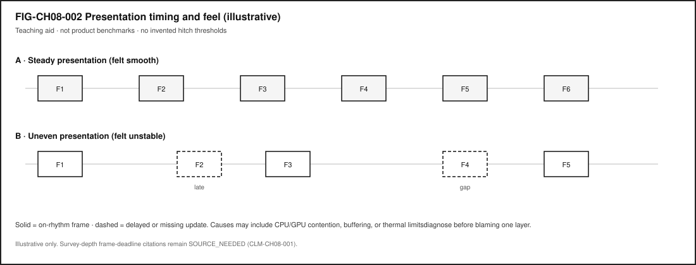
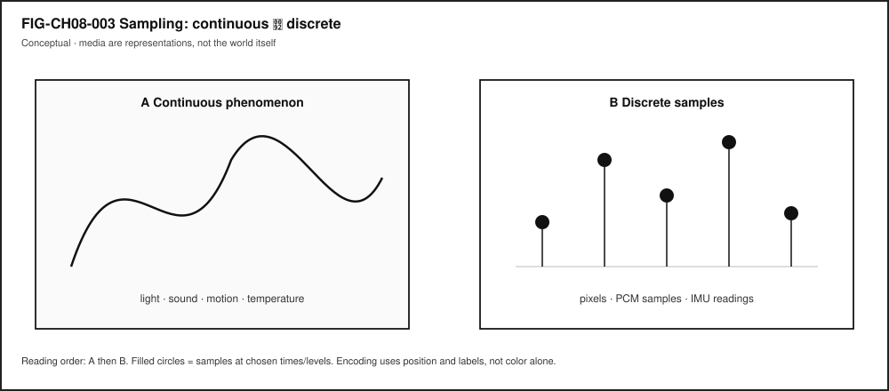

# Chapter 8 — Graphics, Displays, Audio, Cameras, and Sensors

**Status:** `draft` · **Chapter ID:** `CH08`  
**Author:** Edmund Gunn, Jr.  
**Manuscript:** working full-manuscript draft · human validation pending · not publication-ready

---

## 1. The moment

You watch a short video. A notification banner slides in from the top. Music from another app keeps playing. Somewhere in the same pocket of glass and metal, a microphone may be waiting for a wake word—or a camera preview may be one tap away if you decide to take a photo.

From your seat it feels like one device doing several friendly things at once. Underneath, several **pipelines**—paths that turn between the physical world and digital representations—share the same processors, memory, power, and thermal budget.

This chapter’s governing question is practical:

> How do displays, audio, cameras, and sensors turn between the world and bits—and why do frames, sampling, and pipelines shape how the experience *feels*?

We will not catalog every gadget part number. Part II treats human I/O modalities as **system interfaces**. Chapter 2 already named rendering and frames on the way out of a tap; Concept Edition compute materials survey GPU roles beside the CPU. Here we stay with experience → system → component, then give you a permission-safe way to map one pipeline yourself.

---

## 2. What you notice

Before vocabulary like *compositor* or *ISP*, notice the human contracts you already expect.

You expect the picture to look continuous enough that motion does not feel broken. You expect sound not to crackle for no reason. You expect a photo button to respect your choice about the camera. You expect a wake-word listener—if present—not to pretend it was off when it was on. You expect the phone not to become a hand warmer just because a banner animated over a video. You expect failure to be visible: a permission denied, a black preview with an honest message, a frozen frame with a spinner—not a silent wrong recording of someone else.

Those expectations are not decorations. They *are* the media product from the person’s point of view.

**Media feel is produced by multiple pipelines sharing one device’s budgets.**

A smooth-looking video can share the GPU with an animation. An audio path can glitch while the screen still looks polite. A camera can be optically fine while the software never received permission to open the sensor. Your nervous system stitches those timelines into “this feels fine” or “something is wrong,” often before you have a technical name for the fault.

Optional comparison on a device you already own: play a local video alone; then play it while opening a heavy settings animation or another media app. You are not collecting a product benchmark. You are noticing contention as an everyday fact (CLM-CH08-003) [@tanenbaum-bos].

A second optional notice: open a camera or microphone permission dialog in a context where you are allowed to experiment, then cancel or deny. The preview may never appear. That is still a complete lesson about gates sitting in front of sensors—without capturing anyone.

---

## 3. Exploded ecosystem

@fig-ch08-001 is the first-minute map for this chapter: physical world ↔ sensors/cameras/mics ↔ processing ↔ display/speakers ↔ human perception. It is **conceptual**—Representative educational architecture, not a claim that any specific manufactured revision wires exactly like the diagram.

{#fig-ch08-001 fig-cap="World ↔ sensing ↔ processing ↔ presentation. Conceptual educational map; not measured telemetry." fig-alt="Conceptual map from physical world through capture and processing to presentation and perception."}

Walk the layers in ordinary language.

### Human

You watch, listen, speak, move, and decide. Eyes and ears close presentation loops. Intent to capture—“take a photo,” “start a call”—opens capture loops only when policy and permission allow.

### Sensors and transducers

A **sensor** turns a physical quantity into a signal or data. Cameras and microphones are familiar; accelerometers, ambient light sensors, and touch digitizers are neighbors. They do not hand you “the world.” They hand you **samples**.

### Capture pipelines

A **camera pipeline** (optics → sensor → image-signal processing → buffers) and an **audio pipeline** (microphone → conversion → buffers → optional encode) build digital media. On the web platform, camera and microphone access is explicitly modeled as mediated capture of media streams under a permission model—not as unmediated truth about reality [@w3c-mediacapture-streams-20251009] (CLM-CH08-002).

### Compute and composition

CPU work, **GPU** parallel work, codecs, and a **compositor** (the system that combines layers into a presentable image) share memory and time [@patterson-hennessy; @khronos-vulkan-overview]. Operating systems schedule competing work rather than letting every app own the silicon alone [@tanenbaum-bos].

### Presentation pipelines

A **display pipeline** turns framebuffer/compositor work into visible light patterns. Speakers and haptic actuators present other modalities. A **frame** is one image update in a timed presentation sequence—vocabulary Chapter 2 already used on the way out of a tap.

### Device Quartet (learning spine only)

Where Edge IO Wearables or other Quartet form factors appear as sensing analogies, treat them as research/learning spines. Physical camera/sensor EVT claims remain **PHYSICAL_PENDING** (CLM-CH08-004) [@src-hardware-quartet]. Commodity devices remain first-class for labs.

---

## 4. Follow the signal

Two directions matter. Presentation moves bits toward light and sound. Capture moves light and sound toward bits. Many moments do both.

### Path P — Present (stored or generated media → human)

1. **Source ready.** A file, stream, or generated UI layer exists in memory or storage.
2. **Decode / render.** Software (and often a GPU or media block) produces pixel and/or audio buffers [@patterson-hennessy].
3. **Compose.** The compositor combines video, UI chrome, banners, and captions into a frame candidate.
4. **Present.** The display pipeline shows a frame; the audio pipeline emits samples.
5. **Perceive.** You judge smoothness, lip-sync, loudness, and meaning.

@fig-ch08-002 sketches steady versus uneven presentation *feel* as an **illustrative** teaching aid. It does not assert product hitch thresholds or a surveyed law of missed deadlines; that survey-depth evidence gap remains open as **CLM-CH08-001** (claim footnotes below). Read it as “rhythm you can notice,” not as a measured scoreboard.

{#fig-ch08-002 fig-cap="Illustrative presentation timing and feel. Teaching aid only; not product benchmarks." fig-alt="Illustrative timeline of steady versus uneven frame presentation feel."}

### Path C — Capture (world → representation)

1. **Consent / permission gate.** Policy asks whether this app may use the camera or microphone now [@w3c-mediacapture-streams-20251009].
2. **Transduce.** Optics and sensors (or a microphone diaphragm and converters) produce electrical signals.
3. **Sample.** Continuous phenomena become discrete samples—pixels, PCM audio, IMU readings (@fig-ch08-003).
4. **Process.** Image-signal processing, noise filtering, encoding, or on-device inference may run.
5. **Buffer / store / send.** Representations land in memory, files, or network messages.
6. **Optional preview.** A presentation path may show what is being captured—still a representation.

{#fig-ch08-003 fig-cap="Sampling: continuous phenomenon to discrete samples. Conceptual; media are representations." fig-alt="Conceptual comparison of a continuous phenomenon and discrete samples."}

### Honesty rule

**Digital media are representations, not the world itself** (CLM-CH08-002). A beautiful preview can still be cropped, delayed, color-processed, or blocked by permission. A denied permission is not a broken lens; it is a policy outcome.

### Contention rule

**Multiple media pipelines contend for CPU, GPU, memory, and power on one device** (CLM-CH08-003) [@tanenbaum-bos]. When a banner animates over a video while audio plays, you are watching shared scheduling and shared accelerators, not three separate computers glued together.

### What this chapter does not invent

Frame-timing pedagogy is anchored to platform display-refresh docs (CLM-CH08-001 · `SOURCE_IDENTIFIED` via [@mdn-requestanimationframe; @whatwg-html]). This chapter still refuses invented hitch/tearing thresholds or product frame budgets. Learner-measured notes from LAB-IO-001 stay labeled as *your* observations on *your* device.

---

## 5. Component cards

Each card answers: What is it? What does it do for the person? What fails when it misbehaves?

### Display pipeline

**Plain definition.** The path that turns framebuffer/compositor work into visible light patterns.

**Experience benefit.** You see coherent UI and video.

**Failure symptom.** Black screen, wrong layer order, frozen UI chrome, or uneven motion feel—diagnose before assuming “the panel is dead.”

### Frame

**Plain definition.** One image update in a timed presentation sequence.

**Experience benefit.** Motion and UI change become watchable over time.

**Failure symptom.** Stuttery or uneven visual update; still may be compositor, app, GPU, or power—not only “refresh rate.”

### Audio pipeline

**Plain definition.** Capture and/or render path for sound.

**Experience benefit.** Speech, music, and alerts become audible in sync with intent.

**Failure symptom.** Glitches, silence despite UI animation, wrong routing (earpiece vs speaker), or permission denial.

### Camera pipeline

**Plain definition.** Optics → sensor → ISP/processing → image/video buffers.

**Experience benefit.** Scenes become images or video representations you can preview, save, or send.

**Failure symptom.** Black preview with permission errors, focus/exposure oddities, thermal throttling after long capture, or privacy blocks.

### Sensor

**Plain definition.** A transducer that turns a physical quantity into a signal or data.

**Experience benefit.** The device can react to light, motion, orientation, touch, and more.

**Failure symptom.** Stuck readings, noisy values, missing calibration, or apps inventing meaning the sensor never provided.

### Sampling

**Plain definition.** Measuring a continuous phenomenon at discrete times and/or levels.

**Experience benefit.** Computers can store and compute on media and measurements.

**Failure symptom.** Alias-looking artifacts, choppy motion from too-sparse samples, or overconfidence that samples equal reality.

### Compositor / GPU role (survey)

**Plain definition.** Two cooperating jobs, not one synonym: the **compositor** combines layers into a presentable frame; a **GPU** (or similar accelerator) may speed rendering and related parallel work when software submits it through mediated APIs [@khronos-vulkan-overview; @patterson-hennessy].

**Experience benefit.** Smooth composition of video + UI + banners when budgets hold.

**Failure symptom.** Janky animations, dropped UI responsiveness, or heat while “nothing important” seemed to run.

**Not the same as.** The display panel itself—the pipeline that turns a composed frame into light can fail even when GPU work looked busy.

These cards are a failure-domain toolkit—not a shopping list.

---

## 6. Stability contract

The **Stability Contract** returns:

> A user experience exists only while multiple hidden technical conditions remain within acceptable bounds.

For media on one device, a “fine” experience may require all of the following to stay good enough at once:

- presentation path producing frames and/or audio samples the person can use,
- capture path only active when permission and consent allow,
- compositor ordering layers so the person sees the intended surface,
- CPU/GPU/memory headroom shared fairly enough that one pipeline does not silently starve another [@tanenbaum-bos],
- power/thermal conditions not forcing a sudden quality collapse without feedback,
- failures visible (permission denied, offline file missing, device busy)—not silent wrong capture,
- accessibility alternatives available when vision- or hearing-only cues would exclude someone [@wcag22-20241212].

Three separations matter:

1. The screen can look busy while audio has already glitched.  
2. A camera preview can look live while permission never authorized recording.  
3. A sensor can report numbers while the app’s interpretation is wrong.

You experience the combined result. Blaming “the display” or “the mic” without evidence collapses domains into one vague villain.

Analogy (labeled as an analogy): shared pipelines on one device are a bit like several cooks sharing one stove—the meal can still succeed, but only while heat, space, and timing stay “good enough” together. The analogy must not replace measurement; it only names concurrency.

---

## 7. Try it

### LAB-IO-001 — Map one media pipeline (permission-safe)

**Observable question.** For one familiar media experience, what is the capture → process → present path—and which parts can I observe without capturing other people?

**WAIKE alignment note.** WAIKE (accepted `main`) offers adjacent competencies such as game-loop timing, sensor-noise awareness, and ADC sampling labs; it does **not** ship an exact CH08 module ID [@src-waike]. **LAB-IO-001** is therefore a **publication-owned** commodity lab. Do not invent a WAIKE lab ID for it.

**Prerequisites.** A computer or phone you may use for learning; optional local media file you already own.

**Safety and privacy (non-negotiable).**

- Do **not** capture other people’s faces, voices, or private spaces without explicit permission.
- Prefer the offline fixture, a public-domain file, or a permission dialog you **deny**.
- Do not enable always-on microphone or camera recording for this lab.
- No rooting, no unsafe thermal abuse to force glitches.

**Time estimate.** About 40–75 minutes including write-up.

#### Prediction

Write one sentence: if something feels wrong, which pipeline do you expect to notice first—display, audio, camera permission, or another sensor?

#### Route A — Fixture only (baseline)

Open `labs/LAB-IO-001/fixtures/pipeline_map.md`. Fill the capture → process → present table using the offline story. No live sensing required.

#### Route B — Local media you already own

Play a short local video or audio file. While it plays, trigger a lightweight UI animation (notification shade, settings pane). Note what you **observe** (banner appeared; audio continued) versus what you only **infer** (GPU overloaded).

#### Route C — Permission deny (optional)

Open an app’s camera or microphone prompt in a context where you are allowed to experiment, then **Deny** or cancel. Record whether the app offers a non-sensing path. Do not grant capture in shared spaces if bystanders could be recorded.

#### Evidence (minimum)

- one filled pipeline map,
- permission/consent notes,
- observation-vs-inference table,
- teach-back paragraph (Section 11 style).

#### Limits (say them out loud)

- UI timestamps are not photon-to-retina measurements.
- Denying permission is a valid outcome, not a failed lab.
- One session is a story under one set of conditions—not a device grade.
- Quartet wearable sensing remains PHYSICAL_PENDING; do not invent EVT numbers [@src-hardware-quartet].

Completion means a claim is supported by an artifact—not that a camera preview opened.

---

## 8. Build it

Use the same pipeline story at the depth that matches your pathway.

### Explorer

Draw @fig-ch08-001 from memory with five boxes. Label which boxes your LAB-IO-001 route actually touched.

### Operator

Using only on-screen cues, decide whether a failure looks more like (a) permission/policy, (b) presentation/compositor, or (c) audio routing. Write why—without claiming root cause beyond evidence.

### Builder

Create a one-page markdown map: arrows for capture and present; a dashed box labeled “permission gate.” Keep secrets and faces out of any attached screenshots.

### Engineer

Propose how you would measure uneven presentation or audio glitches with commodity tools (for example, browser or OS performance views where available) [@mdn-performance]. Mark each proposed metric as **measured**, **inferred**, or **out of reach** on your device. Do not invent hitch thresholds.

### Researcher

Design a repeated comparison: same device, same clip, with and without a concurrent animation. Pre-register what you will count as an observation. State limits: logging overhead, subjective feel ratings, and the absence of a pinned multimedia-systems survey citation for deadline physics in this edition’s claim plan.

Educators can facilitate teach-backs and adapt LAB-IO-001 for classrooms that forbid any camera use—fixture-only is enough.

---

## 9. Secure and include it

### Security and privacy

Cameras and microphones are privileged sensors. Relevant ideas here:

- **permissions** and consent before capture [@w3c-mediacapture-streams-20251009],
- **minimize retention**—labs should not keep other people’s media,
- **indicator honesty**—when capture is active, the person should be able to tell,
- **least privilege**—an app that needs a photo does not need always-on microphone,
- **trust boundaries**—a preview surface can be spoofed in malicious UI; teach skepticism without turning this chapter into a full adversarial playbook.

Platform-specific OS permission encyclopedias remain an open source need for later tightening; this chapter uses the W3C media-capture permission model as a representative, citable web path—not as a claim that every OS dialog matches it.

### Accessibility

Do not ship experiences that only work for one sense. WCAG 2.2 provides dated guidance for alternatives to purely visual information, time-based media considerations, and motion sensitivity concerns that affect animation-heavy interfaces [@wcag22-20241212]. Captions, transcripts, non-motion alternatives, and keyboard-operable controls are part of Stability Contract thinking—not optional polish.

### Equity

Not every learner has a high-refresh display, multiple cameras, or quiet space for audio labs. Fixture-first routes and deny-permission routes keep the learning intact when hardware, policy, or shared classrooms constrain capture. Designing only for ideal studio conditions silently excludes people.

---

## 10. Career lens

No table promises employment. Roles vary by organization. LAB-IO-001 artifacts resemble early professional evidence in miniature.

| Domain | Example role | Professional artifact | Lab resemblance |
|---|---|---|---|
| Display / UI graphics | Graphics or UI engineer | Frame/composition notes | Presentation map + feel notes |
| Audio | Audio software engineer | Capture/render path write-up | Audio pipeline card + glitch hypotheses |
| Camera | Imaging / ISP engineer | Pipeline block diagram | Camera path without unauthorized capture |
| Sensors | Embedded sensing engineer | Sampling and calibration notes | Sensor vs interpretation separation |
| GPU / media | Media performance engineer | Trace bundle | Measured vs inferred timing labels |
| Privacy | Privacy engineer | Permission and retention review | Consent notes in portfolio |
| Accessibility | Accessibility specialist | WCAG-informed review | Non-visual alternative check |
| UX | Interaction designer | Motion and feedback spec | Banner-vs-video contention observation |

When Quartet wearables appear in later sensing chapters, they remain research/learning spines—not shipping SKU ads—until EVT evidence exists [@src-hardware-quartet].

---

## 11. Check understanding

Answer with reasoning. Prefer short paragraphs.

1. Why can a video look fine while audio glitches, or the reverse?
2. What is the difference between a sensor reading and the meaning an app attaches to it?
3. Why is a denied camera permission not proof that the lens hardware failed?
4. How does sampling turn a continuous sound into something a computer can store?
5. Why might a notification animation change how smooth a video *feels* even if the file is unchanged?
6. Name two Stability Contract conditions for a media experience that are not “pretty pixels.”
7. What evidence would you need before blaming the GPU for uneven motion?
8. **Teach-back.** Explain capture → process → present to a family member **without** using the words *compositor*, *ISP*, *GPU*, or *buffer*. Then introduce those four terms one at a time, tied to something already understood.

Educator note: successful teach-backs show both directions (present and capture) and at least one permission or equity constraint.

---

## References

Selected authoritative sources for this chapter’s general technical explanations live in the working Full31 bibliography (`publication/full31/WORKING_BIBLIOGRAPHY.bib`) and the book reference pool. Project-specific repository evidence is cited by claim ID where labeled.

Inline citations used in this chapter include @tanenbaum-bos, @patterson-hennessy, @w3c-mediacapture-streams-20251009, @wcag22-20241212, @khronos-vulkan-overview, @mdn-performance, @src-hardware-quartet, and @src-waike.

## 12. Glossary links

Terms introduced or relied on as formal vocabulary in this chapter should resolve in the living glossary registry. This section lists them for linking—not as a dump of free-standing essays.

| Term | Role in this chapter |
|---|---|
| Display pipeline | Path to visible frames |
| Frame | One timed image update |
| Audio pipeline | Capture/render path for sound |
| Camera pipeline | Optics → sensor → processing → buffers |
| Sensor | Transducer from physical quantity to signal/data |
| Sampling | Discrete measurement of a continuous phenomenon |
| Compositor | Combines layers for presentation |
| GPU | Parallel processor often used for graphics/media |
| Permission | Policy gate for camera/microphone access |
| Stability Contract | Experience depends on hidden conditions staying acceptable |
| Representation | Digital media standing in for—not identical to—the world |

Deeper entries and “not the same as” warnings live in the glossary network.

---

## Figure references (embedded above; accessibility metadata)

All figures below are **conceptual** or **illustrative** as labeled. Source preference: editable SVG in the publication repository.

### FIG-CH08-001 — Media sensorium map

- **Caption.** World ↔ sensing ↔ processing ↔ presentation ↔ perception.
- **Alt text.** Left-to-right conceptual map from physical world through capture and processing to display/speakers and human perception.
- **Text equivalent / reading order.** (1) Physical world → (2) Capture (cameras, mics, sensors) → (3) Process (ISP/codecs/apps/compositor/GPU) → (4) Present (frames, speakers) → (5) Human perception.
- **Status.** Conceptual.
- **Source.** Publication-owned original.

### FIG-CH08-002 — Presentation timing and feel

- **Caption.** Illustrative steady versus uneven presentation feel.
- **Alt text.** Two timelines of frames; dashed boxes mark delayed or missing updates without numeric thresholds.
- **Status.** Illustrative teaching aid; not product benchmarks; frame-timing cite present without hitch thresholds (CLM-CH08-001 · SOURCE_IDENTIFIED).
- **Source.** Publication-owned original.

### FIG-CH08-003 — Sampling continuous to discrete

- **Caption.** Continuous phenomenon compared with discrete samples.
- **Alt text.** Side-by-side conceptual plate: continuous wave versus stem samples labeled as pixels, PCM, or IMU readings.
- **Status.** Conceptual.
- **Source.** Publication-owned original.

---

## Claim footnotes used in this chapter

| Claim ID | Approved gist | Classification |
|---|---|---|
| CLM-CH08-002 | Cameras/mics sample the world; digital media are representations | SOURCE_IDENTIFIED (`w3c-mediacapture-streams-20251009`) |
| CLM-CH08-003 | Multiple media pipelines contend for CPU/GPU/memory/power | SOURCE_IDENTIFIED (`tanenbaum-bos`) |
| CLM-CH08-004 | Wearable/camera Quartet sensing EVT remains PHYSICAL_PENDING | PHYSICAL_PENDING (`src-hardware-quartet`) |
| CLM-CH08-001 | Displays present timed frames; missed deadlines can appear as hitching/tearing (qualitative) | **SOURCE_IDENTIFIED** (`mdn-requestanimationframe`, `whatwg-html`); no invented hitch thresholds |

General statements about pipelines and sampling as teaching vocabulary are not rewritten as repository claims. Numbers in figures are illustrative unless a learner labels them measured.

---

*End of Chapter 8 working manuscript draft.*
