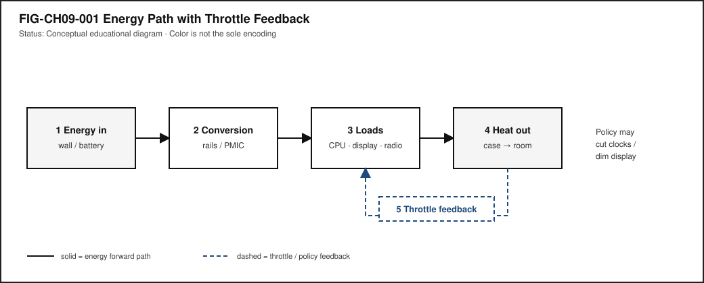

# Chapter 9 — Power, Batteries, Thermals, and Mechanical Design

**Status:** `WORKING_DRAFT_COMPLETE` · **Chapter ID:** `CH09`  
**Author:** Edmund Gunn, Jr.  
**Gate note:** `GATE_3_IN_PROGRESS — READER_EVIDENCE_PENDING` (human validation deferred until the full manuscript draft exists; this chapter is a working draft, not publication-ready).

---

## 1. The moment

You are on battery in a warm room. The same app that felt fine an hour ago—plugged in, cooler air, quieter fan—now hitchs when you scroll, dims the display, or takes a beat longer before the next frame. Nothing in the icon tray says “software forgot how.” The code path you care about is still the code path. What changed is the **budget**: how much energy the device can deliver, how much heat it can shed, and what the operating system is willing to spend to keep the machine safe and usable.

Part II opened the device as electricity, compute, memory, and media. This chapter adds the constraint layer those chapters already hinted at: power, batteries, thermals, and mechanical design. Performance is not a permanent property of an app. It is what remains after energy and heat policies have taken their cut [@linux-cpu-freq].

The Device Quartet—Student 14.5-inch, Handheld Hybrid, DS-XL Coder, and Edge IO Wearables—appear here only as **research form-factor analogies**. Their watt and °C curves are **PHYSICAL_PENDING**; no shipping-SKU marketing language and no invented EVT telemetry belong in this chapter [@src-hardware-quartet].

---

## 2. What you notice

Before naming governors and heat sinks, notice the human contract that broke.

You expected the familiar app to feel familiar. Instead you notice hitching, delayed taps, a dimmer screen, a warmer case, a fan that works harder, or a battery percentage that falls faster than your intuition predicted. Sometimes the OS surfaces a battery or temperature cue. Sometimes it does not, and the experience just… softens.

**Performance collapses when energy and thermal budgets tighten—even if the “same” software is running.**

That sentence is the chapter’s first systems skill. The software did not necessarily regress. The **available performance** changed because power and thermal policy reduced clocks, limited radios, dimmed pixels, or deferred work [@linux-cpu-freq]. Chapter 3 taught you to separate feel from blame; Chapter 6 and Chapter 7 taught competing work for CPU and memory. Here the competing force is the budget itself.

Optional commodity comparison (no specialized hardware): run a light local task while plugged in, then the same task on battery after the device has been warm for a while. Record only what you can see—battery mode, temperature warnings if any, qualitative smoothness—and label guesses as inference. Do not invent watt or °C numbers.

---

## 3. Exploded ecosystem

Energy does not appear inside the SoC by magic. It enters, converts, feeds loads, becomes heat, and leaves—or it accumulates until policy intervenes. @fig-ch09-001 is the first-minute map: energy in → conversion → loads → heat out, with a throttle feedback path. It is **conceptual**, not a measured board layout.

{#fig-ch09-001 fig-cap="Energy in → conversion → loads → heat out, with throttle feedback. Conceptual educational diagram; not measured Device Quartet telemetry."}

Walk the layers in ordinary language.

### Human and room

Ambient temperature, clothing, lap vs desk, sunlight through a window—all change how easily heat leaves the case. The person’s body heat and the room are part of the thermal story, not decoration around it.

### Energy sources

A wall adapter (or dock) and a **battery** are different sources. Plugged-in operation can often sustain higher continuous work. Battery operation draws from finite stored chemical energy with rate and aging constraints that everyday users experience as “how long until I need a charger,” not as an ideal constant-voltage lab supply. Formal cell and pack safety requirements for portable lithium systems are published in standards such as IEC 62133-2; household and commercial battery safety requirements appear in UL 2054 [@iec-62133-2; @ul-2054]. Those standards address safe operation and testing—not permission to abuse cells in a classroom.

### Conversion and distribution

Regulators, power-management ICs, and rails convert and distribute energy to compute, display, radios, storage, audio, and sensors. Conversion is never perfectly efficient; some energy becomes heat in the conversion path itself.

### Loads

CPU, GPU, display backlight or emissive panel, radios, storage, and sensors are the main spenders. Peak bursts can look fine for a moment; sustained feel is constrained by energy delivery and heat removal together [@patterson-hennessy].

### Sensors and policy

Temperature, current, and battery state-of-charge estimates inform OS and firmware **policy**. The policy may reduce clocks, limit frame rates, dim the display, or request shutdown. Linux documents CPU performance scaling as a first-class power-management concern [@linux-cpu-freq].

### Mechanical enclosure

The case, hinges, seals, vents, materials, and button placement are **mechanical design**. They protect internals, shape heat paths, determine whether controls stay reachable, and affect repairability and durability. Qualitative mechanical discussion belongs here; measured Quartet enclosure EVT data does not [@src-hardware-quartet].

@fig-ch09-003 opens the enclosure roles conceptually: protection, heat path, and human interface.

{#fig-ch09-003 fig-cap="Mechanical enclosure roles: protection, heat path, and human interface. Conceptual; not a validated EVT."}

---

## 4. Follow the signal

Here the “signal” is energy and control, not a tap packet. Read the sequence as a logical story of budgets tightening—not as a claim that every device executes identical steps.

1. **Intent and workload.** You ask the device to do sustained interactive work (scroll, edit, render, sync).
2. **Energy request.** Loads draw current from the active source (adapter and/or battery).
3. **Conversion.** Power electronics deliver usable rails; some energy becomes heat in conversion.
4. **Useful work.** Compute and I/O progress; displays and radios spend energy for the experience you notice.
5. **Heat generation.** Electrical work that is not stored or transmitted as useful signal becomes heat in silicon, boards, and batteries.
6. **Heat path.** Conduction, convection, and (sometimes) radiation move heat toward the case and room—or fail to keep up.
7. **Sensing.** Thermal and power sensors report state to firmware/OS policy.
8. **Budget check.** Policy compares demand to what is safe and sustainable on the current source and temperature.
9. **Throttle or dim (if needed).** Clocks drop, work is deferred, brightness falls, radios limit—**throttle** as deliberate protection [@linux-cpu-freq].
10. **Human perceives change.** Hitch, warmth, dimming, or battery cliff becomes the felt experience.
11. **Optional recovery.** Cooler ambient, lighter load, or returning to wall power can restore headroom—if nothing else is wrong.

### Alternate paths (honesty rule)

| Path | Everyday example | What changes |
|---|---|---|
| **Plugged-in, cool** | Desk use with charger | Higher sustained budget often available |
| **Battery, cool** | Travel use | Finite energy; rate limits still apply |
| **Battery, warm** | Warm room, heavy local app | Thermal policy may cut performance first |
| **Low battery mode** | OS power-saver | Explicit policy reduces spend |
| **Display-heavy** | Bright outdoor screen | Display can dominate energy share |
| **Radio-heavy** | Weak signal retries | Radios can dominate without “CPU busy” |

@fig-ch09-002 contrasts on-charger vs on-battery feel as an **illustrative** teaching plate—no invented watts.

{#fig-ch09-002 fig-cap="On charger vs on battery feel. Illustrative compare plate; no fabricated watt or °C product curves."}

---

## 5. Component cards

Component cards answer: What is it? What does it do for the person? What fails when it misbehaves?

### Power budget

**Plain definition.** The sustainable energy delivery rate a design can keep without violating safety or thermal limits.

**Experience benefit.** Interactive work stays smooth when demand fits the budget.

**Failure symptom.** Hitching, dimming, unexpected slowdown, or shutdown under sustained load.

### Battery

**Plain definition.** Stored chemical energy with capacity, rate, aging, and environmental constraints—not an infinite ideal source.

**Experience benefit.** Untethered use for a finite time.

**Failure symptom.** Rapid drain, unexpected power-off, swollen pack (stop using; seek proper disposal), or charging refusal. Do not open, puncture, crush, or heat cells as a “lab.”

### Thermal limit

**Plain definition.** Heat must leave the system; excess heat forces reduced performance or protective shutdown.

**Experience benefit.** The device stays safe to hold and durable over time.

**Failure symptom.** Hot case, fan noise, throttle, thermal warnings, or shutdown.

### Throttle

**Plain definition.** Deliberate reduction of performance to respect power, thermal, or safety limits.

**Experience benefit.** The machine survives the workload instead of damaging itself or cutting power abruptly.

**Failure symptom.** From the seat it can look like “the app got worse” even when policy is working as designed [@linux-cpu-freq].

### Mechanical design

**Plain definition.** Enclosure, materials, hinges, seals, vents, and control placement that shape durability, heat, accessibility, and repair.

**Experience benefit.** The device stays usable, serviceable, and comfortable enough to hold.

**Failure symptom.** Flex that threatens boards, blocked vents, unreachable controls, or heat trapped against skin.

### Energy vs peak performance

**Plain definition.** Short bursts can look fast; sustained feel is constrained by energy and heat together [@patterson-hennessy].

**Experience benefit.** Honest expectations: demos at peak are not the same as all-day use.

**Failure symptom.** Benchmarks that look great for seconds, then collapse under continuous interactive load.

---

## 6. Stability contract

The **Stability Contract** returns with energy and heat as first-class conditions:

> A user experience exists only while multiple hidden technical conditions remain within acceptable bounds—including power delivery and thermal headroom.

For this chapter, a sustainably good interactive experience may require all of the following to stay “good enough” at once:

- energy source adequate for the demanded load (adapter and/or battery state),
- conversion and rails intact,
- power budget not already exhausted by background work,
- thermal path able to shed heat into the room,
- policy still permitting needed clocks and display brightness,
- mechanical integrity preserved (no unsafe flex, blocked vents, or compromised packs),
- status cues available enough that the person can understand dimming or slowdown when platforms expose them,
- no unsafe lab or field procedure that defeats protections.

Three separations matter:

1. The app can be “the same binary” while **available performance** has already fallen.
2. The network can look fine while **thermal throttle** is the real villain (link back to CE-3 / Chapter 3 local-lag thinking).
3. A warm case is **evidence of heat**, not automatically a measured °C root-cause report—observe, then infer carefully.

Device Quartet watt/°C Stability Contract numbers remain **PHYSICAL_PENDING** [@src-hardware-quartet]. Commodity-device observation is enough for this chapter’s lab.

---

## 7. Try it

### LAB-PWR-001 — Budget Collapse Observation

**Observable question.** What visible battery-mode and thermal cues appear when I compare a light local workload with a heavier local workload on a device I already own—without unsafe heating or battery abuse?

**WAIKE alignment note.** WAIKE (accepted `main`, SHA `e97e74fc9bfb44b1cdc26b272dc4848264f15fe0`) includes adjacent labs such as `HARDWARE_ENGINEERING / lab_power_budget` and `EMBEDDED_PROTOTYPING / lab_ep_sleep_mode`. Those are **neighbors**, not renamed IDs. **LAB-PWR-001** is a **publication-owned commodity observation lab**.

**Prerequisites.** A phone, tablet, or laptop you may use for learning; ability to see battery percentage / power mode; optional OS battery or thermal status pages where present.

**Safety (mandatory).**

- Do **not** open, puncture, crush, overcharge, freeze, microwave, or externally heat batteries or packs.
- Do **not** block vents with blankets to “force throttle,” run devices in ovens, or defeat thermal protections.
- Stop if the device warns, smells unusual, swells, or becomes painfully hot.
- Prefer ambient room conditions; no outdoor asphalt “bake tests.”
- Do not capture passwords, tokens, or private content in screenshots.

**Time estimate.** About 45–75 minutes including write-up.

**No-specialized-hardware route.** Required. Simulation/fixture fallback is provided under `labs/LAB-PWR-001/fixtures/`.

#### Prediction

Write one sentence: do you expect the heavier local workload to change smoothness, warmth, battery drop, or OS cues first?

#### Route A — Commodity device (baseline)

1. Note device class, OS name, plugged vs battery, and approximate room comfort (cool / comfortable / warm)—no invented °C.
2. Run a **light** local task for a few minutes (static document, idle desktop, or the fixture “light” scenario).
3. Run a **heavier** local task (local video encode preview, large local spreadsheet recalc, or local photo filter)—still without network dependence if you can avoid it.
4. Record visible cues: battery mode, brightness changes, fan behavior if any, stutter, OS warnings.
5. Label each row **observed** vs **inferred**.

#### Route B — OS status pages (optional)

Where the platform exposes battery or energy pages, note qualitative fields only. Do not claim vendor-private telemetry you cannot see.

#### Route C — Offline fixture (required fallback)

Open `labs/LAB-PWR-001/fixtures/budget_collapse_card.md` and complete the observation table using the labeled **fixture / illustrative** scenarios when a personal device is unavailable or shared-lab policy forbids sustained loads.

#### Evidence (minimum)

- one scrubbed screenshot or written status list,
- a two-condition observation table (light vs heavier),
- one paragraph separating observation from inference,
- explicit safety confirmation: no battery abuse, no forced overheating.

#### Limits (say them out loud)

- Feeling warmer ≠ knowing a precise junction temperature.
- One session is not a product thermal qualification.
- Device Quartet EVT curves are **PHYSICAL_PENDING**; your commodity notes do not fill that gap [@src-hardware-quartet].
- OS cues are platform-specific.

#### Portfolio output

A small folder with README (question, method, limits), observation table, one evidence artifact, reflection, and a teach-back paragraph for a nontechnical reader.

---

## 8. Build it

Use the energy story at the depth that matches your pathway.

### Explorer

Draw the path wall/battery → conversion → one load you care about (display or CPU) → heat → possible throttle. Use ordinary words.

### Operator

Compare plugged-in vs battery notes from LAB-PWR-001. List confounders: brightness, background apps, room warmth, network retries.

### Builder

Build a one-page **power path map** (paper or SVG) with nodes and a feedback arrow for throttle. Mark every number either absent or labeled illustrative—never invent watts.

### Engineer

Propose a diagnosis tree: “feels slow on battery” → check power mode → check thermal cues → check competing processes → check display brightness → only then suspect application regression. Cite where OS performance scaling concepts enter the tree [@linux-cpu-freq].

### Researcher

Write a **PHYSICAL_PENDING** measurement plan for a future Device Quartet thermal/battery campaign: instruments, ambient controls, workload definition, stop criteria, and what would still be out of scope. Do not fabricate results [@src-hardware-quartet].

Educators can run Route C fixtures when shared devices cannot sustain loads, and can emphasize the safety non-goals as the first learning outcome.

---

## 9. Secure and include it

### Safety

Portable batteries are energy-dense. Classroom and field rules:

- no teardown, puncture, crush, or improvised heating,
- respect manufacturer charging accessories when required,
- stop on swelling, odor, or thermal alarms,
- dispose of damaged packs through proper channels—not general trash experiments.

IEC 62133-2 states safety requirements and tests for portable sealed secondary lithium cells and batteries under intended use and reasonably foreseeable misuse [@iec-62133-2]. UL 2054 covers household and commercial batteries with requirements intended to reduce fire and explosion risk in product use and related handling [@ul-2054]. Citing those standards is not a license to reproduce abusive tests outside accredited labs.

### Security

Power and thermal side channels exist in advanced threat models; this chapter does not teach exploitation. Practical posture: keep firmware/OS updates that include battery and thermal fixes; do not disable safety services “for benchmarks.”

### Privacy

Battery and location-correlated telemetry can become sensitive when logged. LAB-PWR-001 artifacts must scrub identifiers and avoid capturing personal screen content.

### Accessibility

Thermal and battery status must be perceivable: not color-only icons, not only a subtle case-warmth cue. Dimming and low-power modes should remain navigable with keyboard, switch, or screen-reader paths where the platform supports them. Mechanical design that hides critical controls behind heat-swollen gaps or unreachable flaps fails inclusion as well as ergonomics.

### Equity

Charger access, device age, and hot classrooms are not evenly distributed. Designs and lessons that assume unlimited wall power and cool offices silently exclude learners. Local-first honesty about throttle and dimming matters more when batteries and rooms are constrained.

---

## 10. Career lens

Energy and mechanics cross many ownership domains. No table promises employment; roles vary by organization.

| Layer | Example role | Professional artifact | Lab resemblance |
|---|---|---|---|
| Power architecture | Power electronics / PMIC engineer | Rail budget and efficiency notes | Builder power-path map |
| Battery systems | Battery systems engineer | Pack safety and BMS requirements | Safety non-goals checklist; standards awareness |
| Thermal | Thermal engineer | Heat-path analysis (measured in real programs) | Qualitative heat-path narrative; PHYSICAL_PENDING plan |
| Mechanical / ID | Mechanical or industrial designer | Enclosure and DFM package | Enclosure-roles sketch from @fig-ch09-003 |
| Reliability | Reliability engineer | Stress and lifetime test plan | Stop criteria and abuse prohibitions |
| OS power | Systems / OS engineer | Governor and power-policy changes | Operator cue log; [@linux-cpu-freq] reading |
| Performance | Performance engineer | Throttle-aware profiles | Light vs heavy observation table |
| Field / IT | Field or support engineer | Triage: power → thermal → app | Diagnosis tree from Section 8 |
| Accessibility | Accessibility specialist | Status-cue perceivability review | Color-independent cue notes |

Portfolio evidence from LAB-PWR-001 looks like early professional habit: prediction, observation/inference split, safety limits, and refusal to invent product curves.

---

## 11. Check understanding

Answer with reasoning. Prefer short paragraphs over one-word guesses.

1. Why might the same app hitch on battery in a warm room after feeling fine on a charger?
2. What is the difference between peak burst performance and sustained interactive feel?
3. Why is “the CPU percentage is high” incomplete evidence that software alone regressed?
4. What does throttle protect, and how can correct throttle still feel like failure to a person?
5. Name two mechanical design choices that can affect heat or accessibility without changing application code.
6. Why are Device Quartet watt/°C curves labeled PHYSICAL_PENDING in this book?
7. List three lab actions that are explicitly forbidden in LAB-PWR-001 and why.
8. **Teach-back.** Explain to a family member—without saying *governor*, *junction*, or *PMIC*—why a warm phone on battery can feel slower. Then introduce those three terms one at a time, tied to something already understood.

Educator note: success is causal sequence (energy → heat → policy → feel) plus at least one safety boundary, not a parts catalog.

---

## References

Selected authoritative sources for this chapter’s general technical explanations are listed in the bibliography (`book/references/references.bib`). Project-specific Device Quartet physical evidence remains **PHYSICAL_PENDING** and is cited via [@src-hardware-quartet], separately from external literature.

Inline citations used in this chapter include @linux-cpu-freq, @patterson-hennessy, @iec-62133-2, @ul-2054, and @src-hardware-quartet.

**Omitted as cited technical claims (SOURCE_NEEDED remaining in the chapter claim plan):** detailed battery electrochemistry textbook pinning for “non-ideal voltage source” formalization, and a pinned mechanical/industrial-design textbook edition for mechanical theory. Prose above treats those topics qualitatively or via verified safety standards only—no invented ISBNs.

## 12. Glossary links

Terms introduced or relied on as formal vocabulary in this chapter should resolve in the living glossary registry as candidates mature. This section lists them for linking—not as a dump of free-standing encyclopedia entries.

| Term | Role in this chapter |
|---|---|
| Power budget | Sustainable energy delivery rate for the experience |
| Battery | Stored chemical energy with capacity/rate/aging constraints |
| Thermal limit | Heat constraint that forces reduced performance or shutdown |
| Throttle | Deliberate performance reduction to respect limits |
| Mechanical design | Enclosure/materials/controls shaping durability, heat, UX |
| Energy vs peak performance | Bursts possible; sustained feel constrained by energy/heat |
| Stability Contract | Experience depends on hidden conditions staying acceptable |
| Conversion / regulation | Turning source energy into usable rails (with losses) |
| Heat path | How heat moves from silicon toward case and room |
| Status cue | Battery/thermal signal the person can perceive |

Deeper entries and “not the same as” warnings live in the glossary network. Prefer following a link when stuck over inventing a private definition.

---

## Figure references (embedded above; accessibility metadata)

All figures below are **conceptual** or **illustrative** unless a future revision cites validated hardware evidence. Device Quartet measured curves remain PHYSICAL_PENDING.

### FIG-CH09-001 — Energy Path with Throttle Feedback

- **Caption.** Energy in → conversion → loads → heat out, with throttle feedback.
- **Alt text.** Flow diagram from energy source through conversion and loads to heat, plus a feedback arrow labeled throttle.
- **Text equivalent / reading order.** (1) Energy in → (2) Conversion → (3) Loads → (4) Heat out → (5) Throttle feedback to loads/policy.
- **Status.** Conceptual educational diagram.
- **Source.** Publication-owned original.

### FIG-CH09-002 — On Charger vs On Battery

- **Caption.** Compare-and-choose plate for feel on charger versus on battery without invented watts.
- **Alt text.** Two columns sharing the same app; left plugged-in/cool, right battery/warm with hitch and dim cues.
- **Status.** Illustrative teaching aid.
- **Source.** Publication-owned original.

### FIG-CH09-003 — Enclosure Roles

- **Caption.** Mechanical enclosure roles: protection, heat path, and human interface.
- **Alt text.** Exploded conceptual enclosure with three labeled roles.
- **Status.** Conceptual; not a validated EVT.
- **Source.** Publication-owned original.

---

## Claim footnotes used in this chapter

| Claim ID | Approved gist | Classification |
|---|---|---|
| CLM-CH09-001 | Interactive devices operate under finite power/thermal budgets that can reduce available performance | general_technical · SOURCE_IDENTIFIED via @linux-cpu-freq |
| CLM-CH09-002 | Batteries as non-ideal finite sources | SOURCE_NEEDED — **omitted as cited claim**; safety standards cited separately |
| CLM-CH09-003 | Mechanical design affects thermals/durability/a11y/repairability | SOURCE_NEEDED — **qualitative only** in this draft |
| CLM-CH09-004 | Device Quartet thermal/battery EVT curves | PHYSICAL_PENDING via @src-hardware-quartet |

General statements about heat needing a path out of a closed system are treated as ordinary physical reasoning and are not rewritten as repository claims. Any future numeric watt/°C figures must carry **illustrative**, **measured**, or **inferred** labels—and Quartet measured figures stay blocked until PHYSICAL_PENDING clears.
