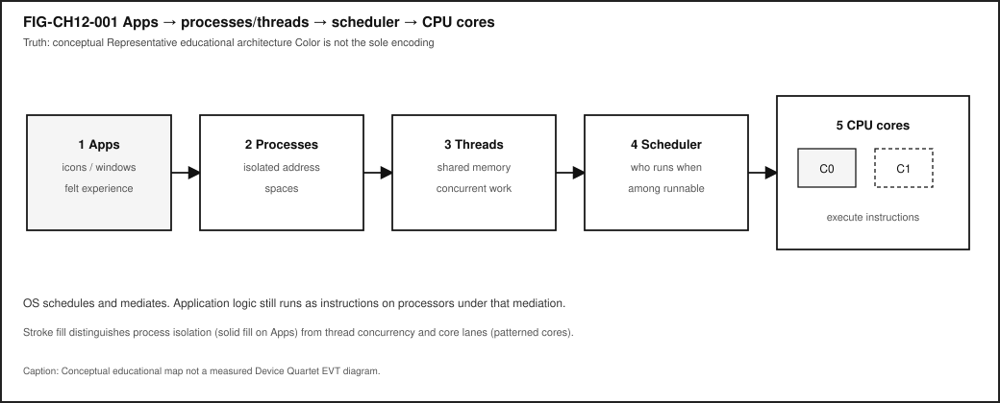
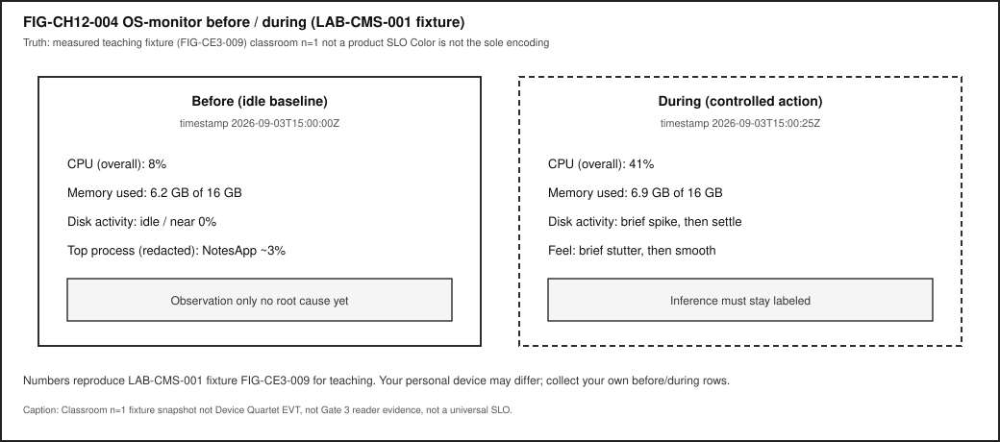

# Chapter 12 — Operating Systems, Processes, Threads, and Scheduling {#ch12}

**Status:** `working_draft` · **Chapter ID:** `CH12`  
**Author:** Edmund Gunn, Jr.  
**Inheritance:** CE-3 OS abstractions deepened; primary Try-it lab **LAB-CMS-001** (link, do not duplicate)  
**Gate posture:** `GATE_3_IN_PROGRESS — READER_EVIDENCE_PENDING` (this chapter does **not** claim Gate 3 PASS)

---

## 1. The moment {#ch12-moment}

You open two apps. One keeps playing audio while you scroll another. Or one hung window freezes the whole UI while a clock somewhere still ticks. From the seat it feels like multitasking magic—or “the phone froze.” Underneath, an **operating system** is isolating address spaces, scheduling runnable work, and mediating devices so hardware can be shared without every program owning the machine alone.

Chapter 6 already named instruction streams and “more cores ≠ always smoother.” Chapter 7 deepened memory and storage waits. This chapter stays with the **OS mediation story**: processes, threads, context switches, and the scheduler—without an encyclopedia dump of every ISA quirk or every vendor scheduling algorithm.

The governing question is ordinary and honest:

> When two apps seem to “run at once,” what is the OS actually doing—and how is that different from the OS doing my app’s work for me?

---

## 2. What you notice {#ch12-notice}

Before jargon, notice the human contract you already expect from a shared machine.

You expect more than one activity to make progress without every other window becoming dead. You expect a hung editor not to silently rewrite another app’s files. You expect music to keep playing while you scroll a document—until something fails the Stability Contract. You expect that “the computer is busy” and “the UI froze” are related but not identical stories. You expect that closing one icon does not always stop every helper process the OS still tracks.

Those expectations are not decorations. They *are* the product from the person’s point of view.

**Multitasking feel is a perception produced by OS abstractions that share processors while keeping programs from freely overwriting each other.**

What you may notice, without opening a monitor yet:

- audio continuing while another window scrolls,
- one app beachballing while another still redraws,
- a sudden full-UI freeze that feels like “the whole OS died,”
- recovery after you force-quit one process,
- fans or warmth when many apps compete.

What those symptoms do **not** prove by themselves: a single root cause named “bad scheduling,” or that the OS replaced your app’s computation. High activity and poor feel can travel together or apart. A frozen UI can be scheduling starvation, priority quirks, lock contention, waiting on I/O, or a busy main thread—diagnosis needs evidence [@tanenbaum-bos; @linux-scheduler].

Optional seat comparison: start a familiar local editor and a media player. Scroll the editor while media plays. Then intentionally open enough mild local load that something stutters. Write one sentence about what still progressed and what stalled *before* you look at any graph. That comparison is a teaching experience, not a universal benchmark—and not a Device Quartet EVT result.

---

## 3. Exploded ecosystem {#ch12-ecosystem}

Shared-device feel is not a single object. It is a path through an inside-the-device ecosystem. @fig-ch12-001 is the first-minute map for this chapter: app icons → processes → threads → scheduler → CPU cores. Treat it as **conceptual / Representative educational architecture**—not a claim that any specific manufactured revision looks exactly like the diagram.

{#fig-ch12-001 fig-cap="Apps → processes/threads → scheduler → CPU cores. Conceptual educational map; OS mediates while instructions still execute on hardware."}

The Device Quartet used elsewhere in this series—Student 14.5-inch, Handheld Hybrid, DS-XL Coder, and Edge IO Wearables—are research form factors and learning benchmarks. Physical fabrication and EVT scheduler/load traces remain **PHYSICAL_PENDING**; do not treat comparison-matrix core counts or thermal-scheduler stories as shipping product facts [@src-hardware-quartet].

Walk the layers in ordinary language.

### Human

You form intent: scroll this page, keep that song playing, save that file. Eyes and hands judge whether multiple activities stay present enough to trust.

### Application

Your apps hold state and code. Icons and windows are the human surface. Underneath, software prepares work that will become **instructions** on processors—still the app’s logic, not a mystical OS substitute [@tanenbaum-bos; @silberschatz-galvin-gagne].

### Process

A **process** is an OS abstraction for a running program instance: typically its own address space, resource handles, and scheduling identity [@tanenbaum-bos; @silberschatz-galvin-gagne]. The icon on your dock is not identical to the process table entry—but for Explorer teach-back, “app icon ≠ process” is the useful first correction.

### Thread

A **thread** is a unit of concurrent execution inside a process, usually sharing that process’s address space [@tanenbaum-bos; @silberschatz-galvin-gagne]. A UI thread, a save thread, and a decoder thread can all be “the app” from the seat while remaining distinct to the scheduler.

### Scheduler and OS mediation

A **scheduler** decides which runnable entity obtains processor time next [@linux-scheduler; @tanenbaum-bos]. The OS mediates hardware and provides services. It does **not** replace application computation: your logic still runs as instructions under that mediation [@tanenbaum-bos].

### CPU cores

Cores execute the chosen instruction streams. Extra cores can help when independent work is ready; they do not guarantee lower latency for every interaction [@patterson-hennessy].

### Adjacent layers (named, not encyclopedized)

Memory isolation, storage I/O, locks, interrupts, and power/thermal policy sit beside scheduling. Chapters 6–7 and 9 named those neighbors; CE-6’s Stability Contract reminds us that concurrent conditions fail together even when a connectivity icon stays polite.

---

## 4. Follow the signal {#ch12-signal}

Follow one ordinary shared-device moment—say, scrolling a document while audio keeps playing—as a logical story. Platforms differ; the teaching sequence is orientation, not brand loyalty.

1. **Intent becomes software work.** Scroll and audio decode become work items inside one or more apps.
2. **Processes and threads exist.** The OS already tracks process boundaries and thread contexts for those apps [@silberschatz-galvin-gagne].
3. **Work becomes runnable.** Threads that are ready to execute become **runnable** if they are not waiting on I/O, locks, or other events [@tanenbaum-bos].
4. **Scheduler chooses.** The OS scheduler selects among runnable entities on available cores [@linux-scheduler]. Interactive work can still be delayed under contention.
5. **Instructions execute.** On a chosen core, the CPU advances that thread’s instruction stream. The OS mediated the turn; the app’s code still runs [@tanenbaum-bos].
6. **Context switches happen.** When the OS moves the processor from one runnable entity to another, it **saves and restores CPU state**—a **context switch** [@tanenbaum-bos; @silberschatz-galvin-gagne]. @fig-ch12-002 shows that swimlane as a conceptual teaching sequence, not a traced kernel log.
7. **Waits appear.** A thread may stop being runnable while it waits for memory, storage, a lock, or another thread. Busy and waiting can both feel like “frozen” from the seat.
8. **Feedback returns.** Pixels update; audio buffers refill; or the UI stops responding. Your nervous system judges the combined timeline.

{#fig-ch12-002 fig-cap="Context-switch swimlane. Conceptual teaching sequence; not a measured ftrace capture."}

### Concurrency without fairy tales

@fig-ch12-003 separates **concurrency** (structuring overlapping work over time) from **parallelism** (simultaneous progress on multiple cores). The distinction is an **illustrative** teaching aid—not a measured speedup curve [@patterson-hennessy; @tanenbaum-bos].

{#fig-ch12-003 fig-cap="Concurrency vs parallelism. Illustrative teaching comparison; not measured benchmarks."}

In plain language for this book:

- **Concurrency** lets a system make progress on more than one task by structuring overlapping work—even on a single core via interleaving.
- **Parallelism** means simultaneous execution when hardware and ready independent work allow.
- **More cores can improve throughput** for parallelizable work but **do not guarantee lower latency** for every click, scroll, or save [@patterson-hennessy].

A practical seat-test: if the UI thread must finish drawing before it can handle the next input, a second core cannot teleport that dependency away. If audio decode and document layout truly need independent work, multiple cores may help—until locks, memory, or storage become the new line at the door.

### Honesty branches

- Audio can continue while a UI thread starves.
- A monitor can show modest average CPU while the interactive thread keeps missing its turn.
- Force-quitting a window may leave helper processes running.
- “Frozen” can mean not scheduled, waiting, deadlocked, or busy in a useless loop—evidence decides which inference is fair [@tanenbaum-bos; @linux-scheduler].

---

## 5. Component cards {#ch12-components}

These cards are a first toolkit—not a bill of materials for every kernel.

### Operating system

**Plain definition.** Software that mediates hardware resources and provides abstractions to programs [@tanenbaum-bos; @silberschatz-galvin-gagne].

**Experience benefit.** Many programs can share one machine without each owning the silicon outright.

**Failure symptom.** Mediation that starves interactive work, or a crash that takes more than one app with it.

### Process

**Plain definition.** OS abstraction for a running program instance with isolation boundaries [@tanenbaum-bos].

**Experience benefit.** One buggy app is less likely to freely rewrite another’s memory.

**Failure symptom.** Too many competing processes; unclear which process owns the lag; assuming the icon *is* the process.

### Thread

**Plain definition.** Schedulable execution context that shares a process address space [@silberschatz-galvin-gagne].

**Experience benefit.** Background saves and foreground UI can progress as separate units of work.

**Failure symptom.** A stuck UI thread; lock contention that freezes feel while other threads still “look busy.”

### Scheduler

**Plain definition.** OS mechanism that allocates processor time among runnable entities [@linux-scheduler; @tanenbaum-bos].

**Experience benefit.** Interactive work can share the machine with background tasks.

**Failure symptom.** Foreground starvation; fair-looking averages that still feel awful in the seat. Do not universalize one vendor algorithm.

### Context switch

**Plain definition.** Saving and restoring CPU state when switching among runnable entities [@tanenbaum-bos].

**Experience benefit.** The processor can serve more than one thread over time.

**Failure symptom.** Thrashy switching under pathological load (qualitative caution—measure before claiming).

### Process isolation

**Plain definition.** Protection so one process cannot freely read or write another’s memory [@tanenbaum-bos; @silberschatz-galvin-gagne].

**Experience benefit.** Safety and privacy boundaries that make multitasking socially tolerable.

**Failure symptom.** Treating “apps share a CPU” as “apps share all secrets.”

### System call

**Plain definition.** Controlled entry from user programs into kernel services [@tanenbaum-bos].

**Experience benefit.** Programs can request I/O, process creation, and other services without owning the hardware.

**Failure symptom.** Blocking too long in a service path that the UI thread needed.

### Concurrency vs parallelism

**Plain definition.** Concurrency structures overlapping work; parallelism executes simultaneously on multiple cores when possible [@patterson-hennessy].

**Experience benefit.** Language that prevents buying the wrong upgrade story.

**Failure symptom.** “I bought more cores and my typing still stutters”—often a serial, waiting, or lock path.

---

## 6. Stability contract {#ch12-stability}

The **Stability Contract** is a signature idea across this book:

> A user experience exists only while multiple hidden technical conditions remain within acceptable bounds.

For Chapter 12, a smooth shared-device interactive experience may require all of the following to stay “good enough” at once—qualitative bounds only; no invented numeric budgets (CE-3 / CE-6 inheritance):

- the target process is scheduled enough to make progress,
- the UI/thread is not starved indefinitely under normal load,
- memory isolation holds (no silent cross-process corruption as a learner assumption),
- runnable work can obtain CPU time when needed [@linux-scheduler],
- needed waits (I/O, locks) do not erase the interactive path without visible symptoms,
- power/thermal policy does not collapse available CPU without any seat-visible clue,
- the person can still tell progress from failure.

A device can remain **powered on and connected** while the **human experience has already failed**.

Three separations matter here:

1. **OS schedules** versus **OS does my app’s work** — mediation is not substitution [@tanenbaum-bos].
2. **Concurrency** versus **parallelism** — structure versus simultaneous hardware progress [@patterson-hennessy].
3. **Frozen UI** versus **CPU busy** — scheduling, locks, and waits need evidence [@linux-scheduler].

Commodity observations you collect in **LAB-CMS-001** are *your* evidence for *your* device and session—not universal EVT curves, and not Gate 3 reader validation. @fig-ch12-004 shows a classroom **n=1** before/during fixture snapshot inherited from that lab’s teaching transcript—not a product SLO and not Device Quartet EVT [@src-hardware-quartet].

{#fig-ch12-004 fig-cap="LAB-CMS-001 fixture before/during monitor readings. Classroom n=1 teaching figure; not a product SLO or Quartet EVT."}

Device Quartet scheduler behavior under load remains **PHYSICAL_PENDING**—no fabricated thermal/scheduler traces in this chapter.

---

## 7. Try it {#ch12-try}

### LAB-CMS-001 — Make Local Slowness Visible

**Observable question.** When a familiar local app feels slow but the connectivity icon looks fine, what evidence can I gather—using only commodity tools—to separate **CPU**, **memory**, **storage**, and **scheduling/thermal** hypotheses?

This chapter’s Try It **inherits and links** the publication-owned CE-3 lab rather than inventing a duplicate `LAB-SCHED-001` package. Follow the full lab packet at [`labs/LAB-CMS-001/`](../../../labs/LAB-CMS-001/) (README, routes, fixtures, portfolio templates). Focus your write-up on the **process / thread / scheduler** columns of the diagnosis; Chapters 6–7 reuse the same lab for CPU and memory/storage emphasis.

**WAIKE alignment note.** WAIKE accepted `main` (audit SHA in the CH12 packet) hosts adjacent labs on observability and OS users, but there is **no** exact WAIKE module ID for `LAB-CMS-001`. Do not mint one. Optional method craft for observation vs inference also sits in **LAB-TAP-001** (CH02)—use it for labeling habits, not as a substitute OS lab.

**Prerequisites.** A computer you may use for learning; built-in OS monitor (Task Manager / Activity Monitor / `top` or equivalent); a familiar local app.

**Safety.**

- Do not capture personal document contents; redact filenames before sharing.
- Do not install “optimizer” tools, disable security software, or load kernel modules.
- Use **mild** load only. **Stop** if the device warns about heat or becomes uncomfortably hot.
- No Device Quartet hardware is required. No invented EVT numbers.
- No privilege-escalation recipes.

**Time estimate.** About 45 minutes for Explorer + Operator baseline.

#### Prediction

Before measuring, write which hidden part you expect to dominate during your controlled action: CPU activity, memory pressure, storage I/O, or scheduling/thermal contention.

#### Route A — Commodity OS monitor (baseline)

1. Record **before** CPU, memory, and disk/storage activity; note which processes appear for your apps.
2. Perform one controlled local action (open a medium document, scroll, or save) while optional second media plays.
3. Record **during** readings, wall-clock feel, and whether another activity kept progressing.
4. Fill observation vs inference columns in the lab portfolio table.

#### Route B — Safe CLI snapshot (optional)

```bash
python3 labs/LAB-CMS-001/local_app/safe_snapshot.py
```

Read-only sampling where the OS exposes coarse stats. If a metric is unavailable, the script reports `unavailable`—never invent hardware claims.

#### Route C — Fixture fallback

Use `labs/LAB-CMS-001/fixtures/` when monitors are inaccessible or you must avoid personal screenshots. Fixtures teach concepts; they are not claims about your personal device. @fig-ch12-004 reproduces fixture `FIG-CE3-009` for classroom reading.

#### Evidence (minimum)

- observation table,
- two snapshots or fixture IDs with timestamps,
- teach-back: “OS schedules; apps still compute,” plus one sentence on process vs app icon.

#### Interpretation labels

| Observation (allowed) | Inference (must label) |
|---|---|
| CPU % rose from A to B | “CPU-bound root cause” |
| UI froze; another process still drew | “Scheduler bug for sure” |
| Fans spun; device felt warmer | “Thermal throttle at X °C” |
| Scroll stuttered under extra load | “Need N more cores” |

#### Limits (say them out loud)

- OS monitors are coarse; they are not silicon performance-counter labs.
- One run is not a benchmark.
- This lab does not close Gate 3 and does not validate Device Quartet EVT scheduler claims (**PHYSICAL_PENDING**).

---

## 8. Build it {#ch12-build}

Use the same shared-device story at the depth that matches your pathway. Prefer commodity tools and LAB-CMS-001 artifacts. A proposed stretch idea `LAB-SCHED-001` remains namespaced-only—do not mint it as a WAIKE ID.

### Explorer

Draw @fig-ch12-001 from memory with four labels: process, thread, scheduler, CPU. Teach a nontechnical person: “The OS decides who runs; the app’s work still happens as instructions.”

### Operator

Capture before/during monitor snapshots under idle vs mild multi-app load. Mark each row observation or inference. Note which processes appeared for each app icon.

### Builder

Change **one** variable (extra documents, a background export, a second media app, fewer tabs). Re-run the observation table. Produce a **process/thread map** for one experience: which processes, which likely threads (UI vs background), what you did *not* measure.

### Engineer

Order a diagnosis plan: connectivity rule-out (if the workload is local) → which process owns the feel → CPU activity vs waiting → locks/priority hypotheses → qualitative thermal/power. State what additional evidence would be required before claiming causation. Separate concurrency from parallelism using @fig-ch12-003 language without inventing speedup curves.

### Researcher

Propose a small scheduling hypothesis: for example, “Adding mild background CPU load increases scroll hitch rate more than adding idle tabs.” Define variables, planned runs, confounders (thermal state, battery mode, other processes), and uncertainty. Report that Device Quartet physical scheduler claims remain **PHYSICAL_PENDING** [@src-hardware-quartet]. Do not invent vendor algorithm universals or Gate 3 PASS language.

Educators can facilitate misconception probes from Section 11 and use LAB-CMS-001 fixtures for learners without admin rights.

---

## 9. Secure and include it {#ch12-secure-include}

### Security

Process isolation is an intent you can already name at survey depth: separate processes limit how much damage one buggy or malicious program can do to another’s memory and credentials [@tanenbaum-bos; @silberschatz-galvin-gagne]. Scheduling and privilege boundaries are part of that story. This chapter does **not** teach exploitation or privilege-escalation recipes—only the literacy that “apps share a CPU” is not the same claim as “apps share all secrets.”

### Privacy

Monitor screenshots can leak filenames, thumbnails, account names, and open document titles. Redact before sharing. Prefer fixtures when portfolio evidence must leave the device. LAB-CMS-001 forbids capturing personal document contents as a requirement.

### Accessibility

Activity visualizations and color-coded monitor graphs are not equally readable. Prefer labeled columns, patterns, and text tables. Keyboard-reachable OS monitors matter; fixture transcripts exist when GUIs are hostile. Dictate observation tables if needed. Do not make “see the red spike” the only teaching channel—@fig-ch12-001 through @fig-ch12-004 encode meaning with shape, order, and stroke pattern as well as text.

### Equity

Not every learner has a new multi-core laptop, admin rights, or a quiet thermal environment. Commodity routes and offline fixtures are the baseline. Device Quartet form factors are learning analogies here, not admission tickets [@src-hardware-quartet]. Avoid shaming older hardware; teach diagnosis that works with the machine in front of you.

Shared family or school machines raise another equity edge: “just open Activity Monitor” may require permissions a learner does not hold. Fixture transcripts and verbal observation tables keep the pathway open without forcing privilege escalation. The Stability Contract fails for people first; pedagogy should not add a second failure by assuming identical tools.

---

## 10. Career lens {#ch12-career}

Literacy from this chapter shows up in several neighboring roles—without employment promises:

- **ROLE-KERNEL — Kernel / OS Engineer** — processes, threads, schedulers, and context-switch thinking; living docs such as Linux CPU scheduler documentation as examples, not universals [@linux-scheduler].
- **ROLE-APP — Application Developer** — UI threads vs background work; avoiding main-thread blocks that feel like “the OS froze.”
- **ROLE-SRE — SRE-adjacent local diagnosis** — separate scheduling starvation, waiting, and busy-work using monitors as evidence, not folklore.
- **ROLE-EMBEDDED — Embedded Engineer** — who runs when under tight latency budgets; interrupt-time vs process-time neighbors (adjacency only).
- **Educator / mentor** — teach observation vs inference so people stop buying the wrong upgrade story.

Day-one habits transfer across those roles: write a prediction before you open a monitor; label every causal sentence; refuse brochure numbers without a method. Career growth here means better questions: “Is this not scheduled, waiting, or busy without progress?”—not a guaranteed job title.

---

## 11. Check understanding {#ch12-check}

### Misconception probes

1. **“The operating system runs my app’s logic for me.”**  
   Counter: the OS schedules and mediates; instructions still execute on processors [@tanenbaum-bos].

2. **“An app icon is the same thing as a process.”**  
   Counter: icons are the surface; processes are OS abstractions that may outlive or outnumber windows [@silberschatz-galvin-gagne].

3. **“More CPU cores always make everything faster.”**  
   Counter: useful overlap and non-CPU bottlenecks decide; serial and waiting paths remain [@patterson-hennessy].

4. **“Concurrency and parallelism are synonyms.”**  
   Counter: concurrency structures overlapping work; parallelism is simultaneous hardware progress [@patterson-hennessy].

5. **“A frozen UI always means the CPU is saturated.”**  
   Counter: scheduling, locks, waits, and sampling artifacts confuse percent alone—label inferences [@tanenbaum-bos; @linux-scheduler].

6. **“Device Quartet scheduler traces are measured shipping specs.”**  
   Counter: research form factors; physical EVT remains **PHYSICAL_PENDING** [@src-hardware-quartet].

### Teach-back (say it out loud)

> Apps become processes and threads. The OS decides who runs when. Context switches move the CPU among runnable work. Apps still compute as instructions. Isolation keeps programs from freely rewriting each other. A healthy network icon does not prove local scheduling is fine.

### Pathway self-check

| Pathway | You can… |
|---|---|
| Explorer | Explain process vs app icon; teach-back “OS schedules while apps still compute.” |
| Operator | Use commodity monitors or fixtures to observe CPU/memory during controlled action (LAB-CMS-001). |
| Builder | Produce a process/thread map for one experience. |
| Engineer | Reason about concurrency vs parallelism and evidence needed for CPU-bound claims. |
| Researcher | Design a small scheduling hypothesis with labeled uncertainty; keep Quartet claims PHYSICAL_PENDING. |

---

## References {#ch12-references}

Inline citations used in this chapter include @tanenbaum-bos, @silberschatz-galvin-gagne, @linux-scheduler, @patterson-hennessy, and @src-hardware-quartet.

CE-3 preproduction packets (`publication/preproduction/ce-03/`) supply the inherited claim, lab, and stability wording this chapter adapts. Full bibliography entries live in the active Quarto project bibliography (including `publication/full31/WORKING_BIBLIOGRAPHY.bib`).

---

## 12. Glossary links {#ch12-glossary}

Candidate terms for integrator merge (not auto-merged into the live glossary):

| Term | Plain link |
|---|---|
| operating system | Software that mediates hardware and provides abstractions |
| process | OS abstraction for a running program instance with isolation |
| thread | Schedulable execution context sharing a process address space |
| scheduler | OS decision of what runs when among runnable entities |
| context switch | Saving/restoring CPU state when switching runnable entities |
| process isolation | Protection against unrestricted cross-process memory access |
| system call | Controlled request from user mode into kernel services |
| concurrency vs parallelism | Overlapping structure vs simultaneous multi-core progress |
| Stability Contract | Experience depends on hidden conditions staying acceptable |

See also Chapter 2 (process/thread/scheduler naming), Chapter 6 (CPU / parallel work), Chapter 7 (memory/storage waits), Chapter 9 (power/thermal), and Chapter 13 (files/persistence neighbors).

---

## Figure references (embedded above; accessibility metadata) {#ch12-figure-refs}

### FIG-CH12-001 — Apps → processes/threads → scheduler → cores

- **File:** `figures/architecture/fig-ch12-001-apps-to-scheduler.svg`
- **Truth:** conceptual
- **A11y:** `figures/preproduction/accessibility/fig-ch12-001.yaml`

### FIG-CH12-002 — Context-switch swimlane

- **File:** `figures/architecture/fig-ch12-002-context-switch.svg`
- **Truth:** conceptual
- **A11y:** `figures/preproduction/accessibility/fig-ch12-002.yaml`

### FIG-CH12-003 — Concurrency vs parallelism

- **File:** `figures/architecture/fig-ch12-003-concurrency-vs-parallelism.svg`
- **Truth:** illustrative
- **A11y:** `figures/preproduction/accessibility/fig-ch12-003.yaml`

### FIG-CH12-004 — OS-monitor before/during (fixture)

- **File:** `figures/architecture/fig-ch12-004-monitor-snapshots.svg`
- **Truth:** measured teaching fixture (LAB-CMS-001 / FIG-CE3-009); classroom n=1
- **A11y:** `figures/preproduction/accessibility/fig-ch12-004.yaml`

Related CE-3 maps (optional cross-read, not required embeds): `figures/preproduction/ce-03/fig-ce3-001.svg`, `fig-ce3-003.svg`.

---

## Claim footnotes used in this chapter {#ch12-claims}

| Claim | Status handling in prose |
|---|---|
| CLM-CH12-001 — processes/threads are OS abstractions; scheduler allocates CPU time | Taught with @tanenbaum-bos, @silberschatz-galvin-gagne, @linux-scheduler (`SOURCE_IDENTIFIED`) |
| CLM-CH12-002 — OS mediates; apps still compute as instructions | Taught with @tanenbaum-bos (CE-3 wording boundary) |
| CLM-CH12-003 — more cores help throughput, not guaranteed latency | Taught with @patterson-hennessy; no invented speedup curves |
| CLM-CH12-004 — frozen UI needs evidence (scheduling/locks/waits) | Taught with @tanenbaum-bos, @linux-scheduler + LAB-CMS-001 observation/inference |
| CLM-CH12-005 — Quartet scheduler-under-load | **PHYSICAL_PENDING** with @src-hardware-quartet |

**Explicit non-claims:** Gate 3 PASS; measured Device Quartet scheduler EVT; invented vendor algorithm universals; WAIKE lab ID `LAB-SCHED-001` as if published.
