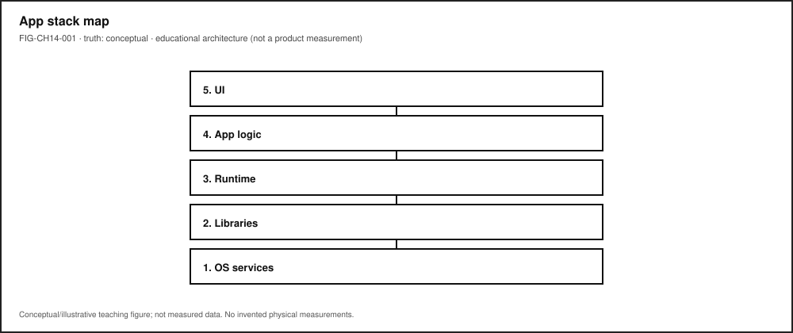
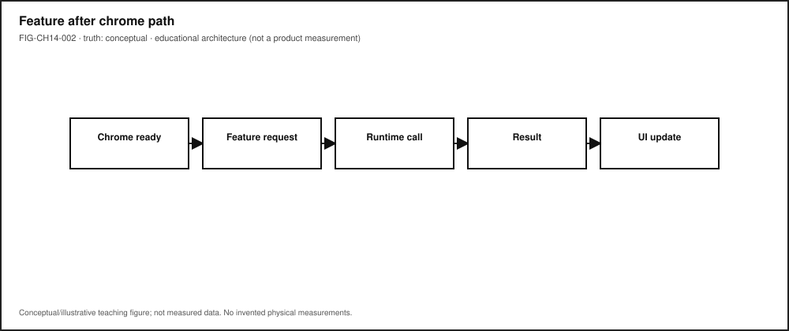
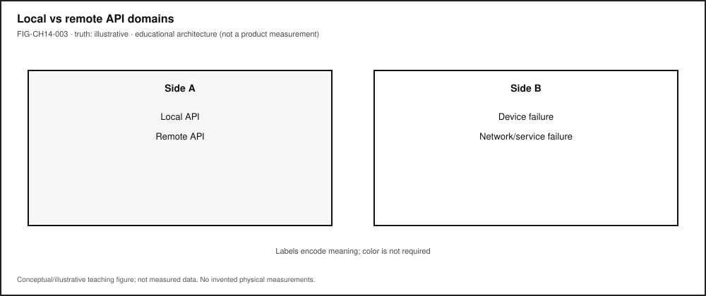

# Chapter 14 — Applications, APIs, Runtimes, and User Interfaces

**Status:** `draft` · **Chapter ID:** `CH14`  
**Author:** Edmund Gunn, Jr.  
**Manuscript:** working full-manuscript draft · human validation pending · not publication-ready  
**Gate note:** `GATE_3_IN_PROGRESS — READER_EVIDENCE_PENDING` (not Gate 3 PASS; this chapter does not edit Gate 3 packets)

---

## 1. The moment {#sec-ch14-moment}

You launch an app you already use. The skeleton appears almost at once: icon, title bar, navigation chrome, maybe a gray tile where a list should live. Something about the surface says *I am here*.

Then you wait.

The list stays empty. A spinner turns. Yesterday’s content sits politely while a refresh never quite finishes. From your seat it still feels like *one app*. Underneath, a **user interface**, a language **runtime**, libraries and frameworks, local OS services, and—often—remote **APIs** are cooperating, stalling, or failing on different clocks.

This chapter’s promise is practical:

> After this chapter, you can explode an ordinary app into UI, runtime, libraries, and APIs—and explain why chrome-ready is not the same event as work-complete.

Chapter 1 / Concept Edition CE-1 already taught the system lens: the screen is not the whole machine, and chrome can arrive before content [@saltzer-kaashoek]. Chapter 2 already proved a method: follow one interaction through the stack with **LAB-TAP-001**. This chapter stays in Part III’s job—make OS services usable to humans—by naming the *application stack* those earlier chapters opened without replaying their labs as duplicates.

---

## 2. What you notice {#sec-ch14-notice}

Before jargon like *event loop* or *API version*, notice the human contracts you already expect.

You expect the open or tap to be recognized—finger, trackpad, keyboard, switch, or voice. You expect the shell of the experience to appear soon enough that the product feels awake. You expect usable content to arrive, or a failure you can understand. You expect the interface not to seize up while something invisible works. You expect “connected” status—when it matters—to relate to the *service this feature needs*, not merely to a radio icon. You also expect battery and heat to stay within reason for something so ordinary.

Those expectations are not decorations around software. From the person’s point of view, they *are* the product.

**Chrome visible is not the same event as content usable—and neither is the same as “all APIs finished.”**

A title bar can look finished while a handler is still waiting. A skeleton can look “alive” while a local cache miss or a remote 500 sits unseen. Stale content can look complete while a versioned API call never returns. Your nervous system may stitch those timelines into “the app opened” or into “something feels wrong even though the screen is there” (CLM-CH14-003).

Optional comparison on a device you already own: open a note, photo, or file that already lives locally. Then open something that must fetch fresh remote content. The first often finishes inside the device. The second may add waiting that has nothing to do with how hard you pressed the glass. CE-1’s readiness story and Chapter 2’s local-versus-remote fork are the adjacent methods; here we keep the same honesty without inventing launch-time budgets.

Accessibility belongs in this noticing, not later as a disclaimer. If the only “busy” cue is a colored spinner, someone who does not see that color—or someone using a screen reader that never hears a ready announcement—experiences a different application than the designer imagined. Inclusive readiness is part of the human contract; WCAG 2.2 states that obligation in two dated Recommendation editions that this book cites separately rather than collapsing onto an undated shortcut [@wcag22-20231005; @wcag22-20241212].

---

## 3. Exploded ecosystem {#sec-ch14-ecosystem}

An ordinary app experience is not a single binary floating alone. It is a path through cooperating parts: people, UI, application logic, runtime, libraries, OS services, and optional remote APIs (CLM-CH14-001) [@saltzer-kaashoek; @whatwg-html]. **FIG-CH14-001** is the first-minute stack map: UI → app logic → runtime → libraries → OS services → optional remote API. Treat it as **Representative educational architecture**—not a measured teardown of any brand’s process list.

{#fig-ch14-001 fig-cap="UI → app logic → runtime → libraries → OS services → optional remote API. Conceptual stack."}

Walk the layers in ordinary language. Keep the same layers when vocabulary deepens.

### Human

You form intent: refresh this list, send this note, open this portal. Muscles, voice, or assistive controls issue the action. Later, eyes, ears, and hands judge whether the result matches what you meant.

### User interface (UI)

The presentation and interaction surface—visual layout, spoken status, assistive-technology (AT) trees, chrome, content, and failure text. The UI is a cooperating part, not the whole story [@whatwg-html].

### Application logic

Handlers, state, and feature code that decide what the interaction *means*. This is where “Refresh” becomes a sequence of local reads and optional remote calls—not where pixels are painted by magic.

### Runtime

The language or platform environment that schedules work: garbage collection, timers, an **event loop** or equivalent dispatcher, and the rules for when UI work may run [@whatwg-html]. Chrome can render from one scheduled path while content waits on another.

### Libraries and frameworks

Reusable code that shapes how apps are built—UI toolkits, networking helpers, serialization, routing. They are opinionated neighbors of the runtime, not synonyms for “the OS.”

### OS services (local APIs)

Permissions, storage, notifications, clipboard, sensors, and other host-provided contracts the app calls without leaving the device. Local does not mean free of failure: a denied permission is still a broken Stability Contract for the feature that needed it.

### Optional remote APIs

When the feature needs fresh off-device work, a network path and a remote service contract enter. Packet and path literacy live in Part IV and in **LAB-PKT-001**; here, keep the teaching word **optional** honest.

### Human-usable result

Content you can act on—or a clear failure. The ecosystem succeeds only when the person can finish the job they came to do.

Equity belongs in the map: always-online assumptions exclude learners on metered plans, shared devices, captive portals, or intermittent links. Low-cost devices remain first-class learning instruments. Device Quartet form factors may appear later as research/learning spines; Quartet UI latency budgets remain **PHYSICAL_PENDING** (CLM-CH14-005)—this chapter does not invent millisecond product laws.

---

## 4. Follow the signal {#sec-ch14-signal}

Everyday interactive software commonly waits for inputs, dispatches handlers, updates remembered **state**, and presents outputs [@whatwg-html; @whatwg-dom]. **FIG-CH14-002** shows one teaching path for a feature after chrome is already visible: event → handler → API call → state update → render / AT feedback. Read it as a logical story, not as a claim that every platform uses one identical event-loop implementation or that steps never overlap.

{#fig-ch14-002 fig-cap="Event → handler → API → state → render/AT feedback. Conceptual sequence; steps may overlap."}

A useful reading of the chrome-before-content moment inside an already-running app:

1. **Input arrives** — tap, key, switch, or voice becomes an event the software can interpret.
2. **Handler runs** — application logic decides what work is needed.
3. **Local API path** — storage, permission, or OS service may be consulted first.
4. **Optional remote API path** — if needed, a request may leave the device toward a versioned service contract.
5. **State updates** — success, failure, or partial data is remembered.
6. **Outputs update** — pixels, sound, haptics, and AT announcements reach the human.
7. **Human judgment** — ready enough to use, still busy, or failed.

**FIG-CH14-003** separates **local API** failure domains from **remote API** failure domains. Same call metaphor (“ask for data”); different latency, authorization, and blame stories. Association ≠ DNS ≠ route ≠ auth ≠ this API version.

{#fig-ch14-003 fig-cap="Local API vs remote API failure domains. Illustrative teaching comparison."}

### Alternate paths (the honesty rule)

- Opening a local draft may finish without any remote call.
- A messaging chrome may show while media attachments still travel.
- A portal may show a healthy connectivity icon while the application API still returns 401 or 503.

**Illustrative teaching point (not a measured universal product fact):** a connectivity indicator is related to, but not identical with, application API success.

Chapter 2’s cross-layer sequence remains the canonical method for *one tap through the whole stack*. This chapter zooms the middle of that story—application, runtime, and API contracts—without replacing **LAB-TAP-001**.

---

## 5. Component cards {#sec-ch14-components}

These cards are orientation tools—not a complete bill of materials. Use them to name parts when something feels wrong.

### User interface

**What it is.** The surface the person can see or hear: chrome, content, status text, spoken updates, AT tree.  
**Why it matters.** It can look finished while handlers and APIs are incomplete.  
**Common misconception.** “If I can see the screen, the work is done.”  
**Failure hint.** Forever spinner; empty skeleton; missing ready announcement.

### Application / feature logic

**What it is.** The code that interprets events and chooses local or remote work [@whatwg-html].  
**Why it matters.** Chrome and content often travel different code paths.  
**Common misconception.** “The app” is a single indivisible object.  
**Failure hint.** Crash after chrome; frozen shell; endless redirect that still shows a title.

### Runtime / event loop

**What it is.** The environment that schedules timers, I/O callbacks, and UI work [@whatwg-html].  
**Why it matters.** A hung UI thread can make a healthy network look broken.  
**Common misconception.** Slow feel always means “bad Wi-Fi.”  
**Failure hint.** Whole UI seizes; other apps on the device still feel fine—or everything feels laggy (then look beyond one app).

### Library / framework

**What it is.** Reusable structure that shapes routing, rendering, and networking helpers.  
**Why it matters.** Framework defaults become Stability Contract defaults for users.  
**Common misconception.** Framework name equals understanding of failure domains.  
**Failure hint.** Errors wrap so deeply that the person only sees a generic toast.

### API (contract)

**What it is.** An interface contract for invoking functionality across a boundary—library, OS service, or remote service [@saltzer-kaashoek].  
**Why it matters.** Breaking changes and versioning change what users can trust (CLM-CH14-002) [@semver-2.0.0].  
**Common misconception.** “API” always means a public HTTPS JSON endpoint.  
**Failure hint.** Local permission denied; remote 404 after a silent version bump; client built against yesterday’s contract.

### Local vs remote API

**What it is.** Same call metaphor; different failure domains and latency.  
**Why it matters.** Offline success and online failure often split here.  
**Common misconception.** Connected icon proves *this* feature’s API.  
**Failure hint.** Other local features work; one remote feature fails—or the reverse.

### Accessibility API / inclusive status

**What it is.** Platform and web contracts that expose name, role, state, and updates to assistive technologies—not optional decoration (CLM-CH14-004) [@wcag22-20231005; @wcag22-20241212].  
**Why it matters.** Busy/ready must be communicable beyond color alone.  
**Common misconception.** Accessibility is a polish pass after “real” engineering.  
**Failure hint.** Spinner only; no text status; keyboard path cannot reach the control.

---

## 6. Stability contract {#sec-ch14-stability}

The **Stability Contract** is a signature idea across this book:

> A user experience exists only while multiple hidden technical conditions remain within acceptable bounds.

Chapter 14 needs the application-stack lens, not invented numeric budgets. For the chrome-before-content / API-waiting anchor, concurrent conditions typically include:

- input events reach handlers (touch, keyboard, switch, voice),
- runtime scheduled; UI thread not hung,
- required local APIs available and authorized,
- required remote APIs available, authorized, and version-compatible *when* the feature needs them,
- render and AT feedback reach the human,
- power/thermal headroom sufficient that needed work is not silently deferred beyond human patience (qualitative only).

Three separations matter:

1. The interface can look **alive** after the usable result has already failed—or before it is ready.
2. A connectivity indicator can look healthy while *this* application API is unreachable (**illustrative** operator lesson, not a measured RF law).
3. Local API dependencies are not optional for on-device features; network API dependencies are optional branches for some features and mandatory for others—name which kind you are diagnosing.

When the contract breaks, people lose time, trust, and sometimes access to school, work, or care tasks. Mis-naming the failure domain—“the phone is broken” versus “the service returned 503” versus “permission denied”—leads to wrong fixes and unfair blame. Quartet-specific UI latency numbers stay **PHYSICAL_PENDING** until measured evidence exists (CLM-CH14-005).

---

## 7. Try it {#sec-ch14-try}

Prefer inheriting existing CE labs. Do not invent CE/WAIKE lab IDs. The chapter’s observation craft comes from three real publication labs with different jobs.

### LAB-SYS-001 — Name the system behind a familiar “open” (CE-1 adjacency)

**Observable question.** When I open something I already use, what becomes visible first, what becomes usable later, and which hidden parts might still be working?

**Why this lab here.** CE-1 / Chapter 1 adjacency: explode “the app” into cooperating parts and teach chrome versus content without claiming Quartet timings. Full procedure lives under `labs/LAB-SYS-001/`; do not duplicate the entire write-up in this chapter.

**Evidence habit.** Readiness observation table, labeled ecosystem map, observation-versus-inference paragraph, scrubbed notes.

### LAB-TAP-001 — Trace one interaction (CH02 method adjacency)

**Observable question.** How much of a tap-to-response path can I directly observe on a device I already own?

**Why this lab here.** Chapter 2’s canonical method: follow one interaction with timestamps and honest limits. Use it when CH14 asks you to watch a *feature* after chrome is already up—handler timing, local work, optional remote wait—without rewriting Chapter 2. Full procedure lives under `labs/LAB-TAP-001/`.

**Safety.** Do not capture passwords, tokens, private chats, or classmate personal information. Prefer fixtures and public demos.

### LAB-PKT-001 — When the API path leaves the device (CE-4 adjacency)

**Observable question.** When a connected action leaves the device, what path and access segments can I name—and what remains inference?

**Why this lab here.** When CH14’s optional remote API branch is taken, Part IV-style path literacy matters. **LAB-PKT-001** is the publication-owned lab for that adjacency; full procedure lives under `labs/LAB-PKT-001/`. Keep Wi-Fi / cellular / Internet / cloud vocabulary distinct—do not collapse them into synonyms.

### Shared interpretation rule

| Allowed as observation | Inference until more evidence |
|---|---|
| Chrome appeared at time T1 | “Network is bad” |
| Content usable/failed at T2 | “Runtime is hung” |
| API status code / error text (if visible) | “Server is down forever” |
| Permission dialog shown/denied | “Storage is dying” |

Learner timings on commodity devices or fixtures are **your** observations—not publication benchmarks and not Quartet EVT results.

### Optional operator extension (not a new lab ID)

On a non-sensitive public page or fixture HAR, browser DevTools Network/Performance panels can name phases without inventing a new CE ID [@mdn-performance]. Redact URLs that contain secrets. Proposed future idea `LAB-API-OBS-001` remains namespaced opportunity only—do not treat it as implemented.

---

## 8. Build it {#sec-ch14-build}

Use the same app story at the depth that matches your pathway. Your artifact is an **application-stack map** plus an API failure-domain note for one familiar feature.

### Explorer

Draw or list two columns: visible UI cues versus guessed hidden parts (≥3 each: runtime, library, local API, optional remote API). Write one short teach-back paragraph explaining why chrome-ready is not work-complete—without drowning a nontechnical listener in jargon.

### Operator

Repeat one feature once online and once offline/airplane (if safe), or use a lab fixture’s offline toggle. Fill an observation table. Assign a failure-domain guess (UI, runtime, local API, remote API) and mark it as inference. Note connectivity-icon state as a separate observation from usability. Inherit craft from **LAB-SYS-001** and **LAB-TAP-001**.

### Builder

Map one feature to the APIs it likely calls: at least one local OS/web API and, if applicable, one remote endpoint *name or category* (not a secret URL). Document one tradeoff (example: richer live data versus offline usability). Prefer fixture HAR over production accounts.

### Engineer

Reason about API versioning as a Stability Contract issue: what breaks for users when a contract changes incompatibly [@semver-2.0.0; @saltzer-kaashoek]. Write a short diagnosis plan that separates observation, interpretation, and causal claim. Optionally use Performance/Network panels only on a non-sensitive page; scrub secrets [@mdn-performance].

### Researcher

State a testable hypothesis such as: “For feature X, offline mode causes content failure while chrome still appears.” Define a small number of runs, environment notes, and explicit limits. Document what evidence would be required to upgrade an illustrative claim to a measured claim—Quartet UI latency remains **PHYSICAL_PENDING** until then. Do not publish student timings as universal product laws.

### Educator

Facilitate a ten-to-fifteen-minute misconception probe: “If the spinner is spinning, the app must be downloading.” Adapt **LAB-SYS-001** with fixture fallback when networks or personal apps are unavailable. Point advanced students to **LAB-TAP-001** for method and **LAB-PKT-001** when the story leaves the device.

---

## 9. Secure and include it {#sec-ch14-secure-include}

### Security

Chapter 14 teaches structure, not offensive technique. Features can involve sessions, tokens, and privileged APIs. Treat **identity/session** as a first-class failure domain: an expired login can look like a “broken app.” API keys and secrets never belong in screenshots or portfolio HARs. Prefer fixtures and public demos over production accounts with sensitive data.

### Privacy

Screenshots, HAR files, and logs are evidence and risk. Do not save passwords, tokens, private message bodies, or classmates’ identifying details. Classroom mode should default to fixture content. Redact before sharing portfolio packets.

### Accessibility

Accessibility APIs are part of the real application stack, not optional decoration (CLM-CH14-004). “Use the app” includes keyboard, switch, voice, and assistive pointer paths as first-class actions. Busy versus ready should be communicable beyond color alone. This book cites WCAG 2.2 via the dated Recommendation keys `@wcag22-20231005` (5 October 2023) and `@wcag22-20241212` (12 December 2024)—not the undated `/TR/WCAG22/` latest shortcut as a sole canonical URL [@wcag22-20231005; @wcag22-20241212]. Labs accept audio notes and structured text tables instead of screenshots when needed.

### Equity

Do not assume a high-end phone, unlimited data, or Device Quartet hardware. Offline/fixture fallback remains mandatory for inherited labs. “Bars look fine but the API fails” is also an equity story: shared networks, captive portals, throttled plans. Designing only for ideal always-online office conditions silently excludes many learners and workers.

### Safety and ethics

No packet capture of others’ traffic. Do not disable required safety features for your context. Observation versus inference columns are ethical hygiene, not bureaucracy: overclaiming root cause can mis-blame people and platforms.

---

## 10. Career lens {#sec-ch14-career}

One ordinary feature crosses many ownership domains. No table promises employment; roles vary by organization. Completing Chapter 14 or its inherited labs does not qualify anyone for a job. Your artifacts resemble early professional evidence in miniature.

| Layer / concern | Example role family | Lab resemblance |
|---|---|---|
| Perceived readiness / chrome vs content | UX / product design (`ROLE-UX`) | Annotated chrome-vs-usable observations (**LAB-SYS-001**) |
| UI event instrumentation | Frontend engineering (`ROLE-FRONTEND`) | DevTools / tap timing craft (**LAB-TAP-001**) |
| Feature handlers and local APIs | Application development (`ROLE-APP`) | Feature→API map |
| Remote contracts and versioning | Backend / cloud (`ROLE-BACKEND`) | Failure-domain notes; SemVer literacy |
| Inclusive status / AT | Accessibility / HCI (`ROLE-HCI`) | Non-color busy/ready cues; WCAG-dated cites |
| Path when the call leaves the device | Network / connectivity operations | **LAB-PKT-001** path vocabulary |
| Facilitation | Technical educator / mentorship | Probe questions for “spinner = downloading” misconceptions |

When Device Quartet form factors appear in later chapters, they remain research/learning spines—not mascots and not fabricated shipping SKUs [@src-hardware-quartet]. Commodity devices remain first-class citizens for Chapter 14 evidence.

---

## 11. Check understanding {#sec-ch14-check}

Answer with reasoning. Prefer short paragraphs over one-word guesses.

1. Why might an app’s chrome appear quickly while the usable list stays empty?
2. Name at least four cooperating parts inside everyday language’s word “app.”
3. How can a local API failure look different from a remote API failure while the UI chrome still looks healthy?
4. Why is a connectivity indicator insufficient proof that a specific application API is healthy?
5. What does it mean to say an API is a *contract*, and how can versioning affect users’ Stability Contract?
6. Why are accessibility APIs part of the application stack rather than optional decoration?
7. Which inherited lab would you reach for to (a) map chrome vs content, (b) time one interaction, (c) follow a path that leaves the device?
8. **Teach-back.** Explain to a family member why chrome-ready is not work-complete **without** using the words *runtime*, *API*, or *event loop*. Then introduce those three terms one at a time, tying each to something already understood.

Educator note: successful teach-backs show UI versus hidden cooperating parts and at least one alternate path (local-only versus remote API), not memorized vocabulary lists. Gate 3 chapter-prototype reader evidence for Chapter 2 remains historical process; this chapter does not claim completed full-manuscript human validation and does not modify `publication/gates/gate-3/`.

---

## References

Selected authoritative sources for this chapter’s general technical explanations are listed in the working bibliography. Project-specific repository evidence is cited with keys such as @src-hardware-quartet and remains distinct from external literature.

Inline citations used in this chapter include @saltzer-kaashoek, @whatwg-html, @whatwg-dom, @semver-2.0.0, @mdn-performance, @wcag22-20231005, @wcag22-20241212, and @src-hardware-quartet.

Claim plan keys for CH14: CLM-CH14-001 through CLM-CH14-005 (`publication/full31/chapters/ch14/CLAIM_PLAN.yaml`).

## 12. Glossary links {#sec-ch14-glossary}

Terms introduced or relied on as formal vocabulary in this chapter should resolve in the living glossary registry as entries mature. Candidates below are for linking—not a dump of free-standing encyclopedia definitions.

| Term | Role in this chapter |
|---|---|
| Application | User-facing program assembling UI + logic + dependencies |
| User interface | Presentation and interaction surface (visual, voice, AT) |
| Runtime | Language/platform environment executing app code |
| Event loop | Dispatcher of UI/input/timer events to handlers |
| API | Contract for calling into a library, OS service, or remote service |
| Library / framework | Reusable code that shapes how apps are built |
| Local vs remote API | Same call metaphor; different failure domains and latency |
| Chrome vs content | Shell visible versus body usable |
| Accessibility API | Inclusive status and AT exposure as first-class stack |
| Failure domain | Bucket for where trouble may live |
| Stability Contract | Experience depends on hidden conditions staying acceptable |
| Semantic versioning | Compatibility vocabulary for contract changes |
| Device Quartet | Research form-factor learning laboratory (**PHYSICAL_PENDING**) |

Deeper entries, analogies labeled as analogies, and “not the same as” warnings live in the glossary network. Prefer following a link when stuck over inventing a private definition.

---

## Figure references (embedded; registered SVG + a11y)

All figures below are **conceptual** or **illustrative** unless a future revision cites a specific validated hardware release. Source: editable SVG in the publication repository (`figures/full31/`). Production status: **embedded**.

### FIG-CH14-001 — UI → logic → runtime → libraries → OS → optional remote API

- **Provisional ID:** `FIG-CH14-001`
- **Figure type:** exploded_diagram
- **Truth classification:** conceptual
- **Pedagogical purpose:** UI to app logic to runtime to libraries to OS to optional remote API
- **Alt / reading order:** Labeled stack layers from human-facing UI down through runtime and libraries to OS services, with a dashed optional remote API branch
- **Color-independent encoding:** Labels + solid vs dashed stroke for optional remote branch
- **Edition scope:** full_edition

### FIG-CH14-002 — Event → handler → API → state → render

- **Provisional ID:** `FIG-CH14-002`
- **Figure type:** sequence_diagram
- **Truth classification:** conceptual
- **Pedagogical purpose:** Event to handler to API to state to render
- **Alt / reading order:** Numbered steps Event, Handler, API call, State update, Render/AT feedback; steps may overlap
- **Color-independent encoding:** Numbers + arrows
- **Edition scope:** full_edition

### FIG-CH14-003 — Local API vs remote API failure domains

- **Provisional ID:** `FIG-CH14-003`
- **Figure type:** comparative_layers
- **Truth classification:** illustrative
- **Pedagogical purpose:** Local API vs remote API failure domains
- **Alt / reading order:** Two labeled columns (Local API, Remote API) with distinct failure examples; join at human-usable or failed
- **Color-independent encoding:** Column labels + text status words (not color alone)
- **Edition scope:** full_edition

---

## Claim footnotes used in this chapter (project-specific)

- **CLM-CH14-001** — App means UI + runtime + libraries + OS services + optional remote APIs (`SOURCE_IDENTIFIED`).
- **CLM-CH14-002** — APIs are contracts; versioning affects Stability Contracts (`SOURCE_IDENTIFIED`).
- **CLM-CH14-003** — UI chrome can render before application work or remote fetches complete (`SOURCE_IDENTIFIED`).
- **CLM-CH14-004** — Accessibility APIs are part of the real stack (`SOURCE_IDENTIFIED`; dual dated WCAG keys).
- **CLM-CH14-005** — Quartet UI latency budgets (`PHYSICAL_PENDING`).
