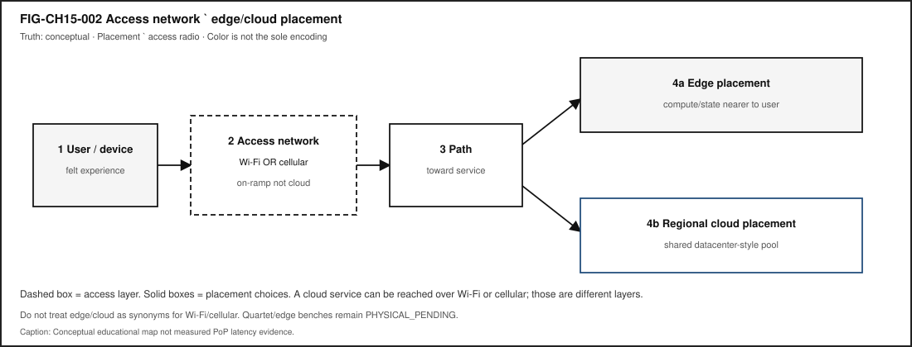
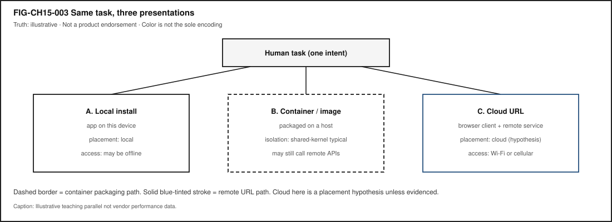

# Chapter 15 — Containers, Virtualization, Cloud, and Edge Computing {#ch15}

**Status:** `draft` · **Chapter ID:** `CH15`  
**Author:** Edmund Gunn, Jr.  
**Inheritance:** CE-4 edge/cloud *placement* + access-network disambiguation; CE-3 local resource multiplexing  
**Gate posture:** `GATE_3_IN_PROGRESS — READER_EVIDENCE_PENDING` (this chapter does **not** claim Gate 3 PASS)

---

## 1. The moment {#ch15-moment}

A classroom lab says: *run this in a container*. Or your school Chromebook opens the same assignment as a website that “just works,” while a local install never appears. Or a sync spinner sits on “waiting for network” even though the Wi-Fi or cellular icon still looks healthy.

From the seat it feels like computers in the sky—or like the radio failed. Underneath, two different stories are mixed together. **Virtual machines** and **containers** multiplex hardware so many workloads can share one machine with different isolation boundaries [@tanenbaum-bos; @oci-runtime-spec]. Separately, services are **placed** near you (**edge**) or farther away in shared datacenter pools (**cloud**) [@nist-sp800-145; @nist-sp500-325]. And separately again, your **access network** may be Wi-Fi or cellular—on-ramps that are *not* synonyms for cloud, edge, or “the Internet” [@ieee80211-2020; @threegpp-ts23501].

This chapter inherits Concept Edition CE-4’s hard rule: **placement ≠ access radio**. Part IV will deepen packets and radios; here the governing question is:

> When something runs “in a container” or “in the cloud,” what is being shared, where is the work placed—and why is that not the same question as “Am I on Wi-Fi or cellular?”

---

## 2. What you notice {#ch15-notice}

Before names like *hypervisor* or *orchestration* enter, notice the human contract that broke or held.

You expected the lab image to start, the browser app to feel local, or a sync to finish. Instead you notice a pull that takes forever, a permission prompt you do not understand, a green connectivity icon with a stalled spinner, or a Chromebook workflow that never needed an install. Sometimes the failure is “cannot reach service.” Sometimes it is “machine is busy.” Sometimes it is “wrong image version.” Those feel different once you stop treating “online” as one word.

**A usable remote or packaged experience is a human perception produced by isolation boundaries, scheduled capacity, a reachable path when placement is remote, and configuration that matches what the app expects—not by radio bars alone.**

Notice the split timelines. A container can start while the remote API it needs is unreachable. Cloud placement can be healthy while your café Wi-Fi is captive-portal blocked. Cellular can be fine while a distant region is overloaded. Outside observation (icon lit, page opened, spinner spinning) is evidence of *symptoms*, not automatic proof of *cause*. Label guesses as inference.

Optional commodity comparison (no paid cloud account required): open one familiar task three ways if available—(1) a local app you already have, (2) the same task via a browser URL, (3) a documented container/lab image if your classroom provides one. Record only what you can see: install vs URL vs container wording, access mode (Wi-Fi / cellular / unknown / fixture), and whether work felt nearby or far. Do not invent latency milliseconds.

---

## 3. Exploded ecosystem {#ch15-ecosystem}

A packaged or remote experience is not a single object. It is a path through an ecosystem. **FIG-CH15-001** compares two common multiplexing stories: hardware → hypervisor → virtual machines versus shared kernel → containers. **FIG-CH15-002** separates the **access network** from **edge vs cloud placement**. Treat both as **Representative educational architecture**, not a claim that any sealed phone or school Chromebook looks exactly like the diagram inside.

{#fig-ch15-001 fig-cap="Hardware → hypervisor/VM vs shared kernel → containers. Conceptual educational comparison; not measured Device Quartet telemetry." fig-alt="Comparative stacks: hardware to hypervisor and VMs versus hardware to shared kernel and containers."}

{#fig-ch15-002 fig-cap="Access network ≠ edge/cloud placement. Conceptual educational map; placement ≠ access radio." fig-alt="User and device to access network (Wi-Fi or cellular) to path, then edge or regional cloud placement."}

Walk the layers in ordinary language.

### Human

You form intent: finish a lab, sync a document, open a class site. Hands and eyes judge whether the experience started, stalled, or recovered.

### Local device and OS

Your laptop, phone, or Chromebook still has CPU, memory, storage, and an OS (Chapter 6–7 / CE-3 adjacency). Local lag can look like “network” when it is really resource pressure—especially if many containers or VMs compete on one host (optional stretch toward LAB-CMS-001).

### Isolation / packaging layer

A **hypervisor** hosts **virtual machines** that present machine-like interfaces. A **container** typically packages a process group that shares a host kernel with namespace and resource controls [@tanenbaum-bos; @oci-runtime-spec]. An **image** is the filesystem-plus-metadata package used to start that work. Isolation reduces—but does not magically erase—shared-hardware risk (CLM-CH15-003).

### Access network (not placement)

**Wi-Fi** is a wireless LAN access technology family [@ieee80211-2020]. **Cellular** attachment follows operator architectures such as the 5G System family [@threegpp-ts23501]. Either can be an on-ramp toward a remote service. Neither *is* the cloud. Neither *is* the edge. A service can sit in a cloud region while your phone uses Wi-Fi—or cellular—to reach it (CLM-CH15-004).

### Path / Internet (survey)

Packets still travel paths CE-4 and Chapter 16 deepen. Here, keep only the literacy you need: remote placement implies a reachable path, naming, and transport progress—or an honest offline/fixture story.

### Edge placement

**Edge** means compute or state closer to users or devices than a distant regional pool—fog-adjacent framing in NIST’s conceptual model—not “Wi-Fi itself” and not a brand synonym for “fast Internet” [@nist-sp500-325].

### Cloud placement

**Cloud** means on-demand network access to a shared pool of configurable computing resources, with essential characteristics and service/deployment models as NIST defines them—not “any website” and not “the radio icon” [@nist-sp800-145].

### Orchestration (intro only)

**Orchestration** names automation that places and heals many containerized services. Survey depth only: enough to recognize the word; not a Kubernetes certification chapter.

### Multitenancy

Many customers may share underlying hardware with isolation hopes. That hope is a design goal and a risk surface—not a promise of absolute safety.

Device Quartet / Edge IO placement benches remain **PHYSICAL_PENDING** (CLM-CH15-005). Research form factors may appear as analogies only; no shipping-SKU language and no invented PoP latency tables [@src-hardware-quartet].

---

## 4. Follow the signal {#ch15-signal}

**FIG-CH15-003** shows the same human task packaged three ways: local install, container/image, and cloud URL. Read it as a logical story, not as proof that every vendor product uses identical steps.

{#fig-ch15-003 fig-cap="Same task, three presentations. Illustrative teaching parallel; not vendor performance data." fig-alt="Same human task as local install, container/image, or cloud URL."}

1. **Intent.** A person asks to run, open, or sync something.
2. **Local packaging decision.** Is the work a native install, a container/image start, a VM, or a browser client talking to a remote service?
3. **Isolation boundary.** VM-style machine isolation or container-style shared-kernel isolation (qualitative contrast) [@tanenbaum-bos; @oci-runtime-spec].
4. **Capacity scheduling.** Host or cluster must have enough CPU/memory/storage for the start to succeed.
5. **Access attachment (if remote).** Wi-Fi association or cellular attachment—or a fixture path when live networks are unavailable [@ieee80211-2020; @threegpp-ts23501].
6. **Path toward placement.** Packets must make progress toward the edge or cloud dependency when the experience needs one.
7. **Placement executes.** Edge-near or cloud-far work runs (or times out). Placement is *where* computation/state live relative to the user [@nist-sp800-145; @nist-sp500-325].
8. **Response and human feedback.** UI success, stall, or error closes the loop—or fails to.

### Alternate paths (the honesty rule)

Not every app is containerized. Not every remote URL is “cloud” in the NIST sense. Not every green icon means Internet scope. Not every edge story is measurable from a classroom seat—**observation vs inference** remains mandatory.

### Failure domains without drama

Prefer failure *domains* over confident blame:

- Local install / image / config mismatch
- Host resource pressure (CPU/memory/storage)
- Access network (Wi-Fi vs cellular vs captive portal)—still not “the cloud broke”
- Path / naming / transport
- Remote placement unhealthy or wrong region
- Human/task expectation (“opened” ≠ “fully synced”)

Outside observation rarely distinguishes those cleanly. That limitation is literacy.

---

## 5. Component cards {#ch15-components}

For each object: plain language, analogy, technical function, constraints, common symptoms. Analogies are labeled as analogies.

### Virtual machine (VM)

- **Plain language.** A computer-like instance hosted on shared hardware.
- **Analogy (labeled).** Like renting a whole apartment inside a building—more walls, more overhead.
- **Technical function.** Presents a machine interface via hypervisor-mediated isolation [@tanenbaum-bos].
- **Constraints.** Heavier than typical containers; still shares underlying hardware risk.
- **Symptoms.** Slow boot of a full guest; host thrash when too many VMs compete.

### Hypervisor

- **Plain language.** Software that hosts virtual machines.
- **Analogy (labeled).** Like a building manager allocating apartments—not the tenants’ furniture.
- **Technical function.** Multiplexes hardware and mediates guest machine interfaces [@tanenbaum-bos].
- **Constraints.** Configuration and capacity limits; misconfig is a failure domain.
- **Symptoms.** Guests will not start; host reports resource exhaustion.

### Container

- **Plain language.** Packaged process group that typically shares the host kernel with isolation controls.
- **Analogy (labeled).** Like a standardized shipping crate on a shared ship—lighter walls than a whole apartment, still not “alone on the ocean.”
- **Technical function.** Runtime configuration and lifecycle as described by container runtime practice/specs such as OCI [@oci-runtime-spec].
- **Constraints.** Shared-kernel trust assumptions; image supply-chain and privilege boundaries matter.
- **Symptoms.** Image pull failures; permission denials; “works on my machine” until the host differs.

### Image / packaging

- **Plain language.** Filesystem-plus-metadata used to start containers (or related packaged workloads).
- **Analogy (labeled).** Like a recipe card plus ingredients list—not the meal already eaten.
- **Technical function.** Makes starts reproducible across hosts when tags/digests match expectations [@oci-runtime-spec].
- **Constraints.** Version drift; large pulls on metered links; unsigned or untrusted images.
- **Symptoms.** Wrong API behavior after an unnoticed tag move; pull stalls that feel like “Wi-Fi died.”

### Cloud (placement)

- **Plain language.** Remote shared datacenter-style resources accessed over a network—**placement**, not radio.
- **Analogy (labeled).** Like a regional workshop you send work to—not the road you drive to get there.
- **Technical function.** On-demand access to a shared pool with NIST essential characteristics and models [@nist-sp800-145].
- **Constraints.** Path dependency; tenancy; cost; region choice; provider policy.
- **Symptoms.** Reachable Wi-Fi/cellular with unhealthy remote service—or the reverse.

### Edge (placement)

- **Plain language.** Compute/state closer to users or devices than a distant region—**still not Wi-Fi itself**.
- **Analogy (labeled).** Like a neighborhood workshop instead of a far warehouse—still a *place to run work*, not the sidewalk.
- **Technical function.** Distributes compute/storage/networking nearer to users/things in fog/edge-adjacent framing [@nist-sp500-325].
- **Constraints.** Capacity, physical presence, continuity when the device moves; many consumer apps hide true placement.
- **Symptoms.** Feels snappy nearby until the dependency still phones home to a far region (inference unless evidenced).

### Multitenancy

- **Plain language.** Multiple customers sharing underlying hardware with isolation hopes.
- **Analogy (labeled).** Like many tenants in one building—walls help; they are not magic force fields.
- **Technical function.** Economic sharing plus isolation mechanisms (VM and/or container layers) [@tanenbaum-bos].
- **Constraints.** Isolation is incomplete in principle; wording must avoid absolute safety claims (CLM-CH15-003).
- **Symptoms.** Noisy-neighbor performance; policy limits; incident blur across tenants (usually invisible to end users).

### Orchestration (intro)

- **Plain language.** Automation that places and heals many services.
- **Analogy (labeled).** Like a dispatcher assigning trucks—not the cargo inside one crate.
- **Technical function.** Declares desired state for many containerized workloads (survey depth only).
- **Constraints.** Control-plane dependency; mis-scheduled capacity still fails the human experience.
- **Symptoms.** “Service restarted” loops; region failover that still feels down until DNS/path catch up.

---

## 6. Stability contract {#ch15-stability}

**Definition (book-wide):** a user experience exists only while multiple hidden technical conditions remain within acceptable bounds.

**Chapter lens:** a containerized or remote experience continues only while isolation boundaries hold enough for the task, scheduled capacity is available on the host or cloud, the network path to placement is reachable when remote, and the image/config version matches the expected API—and while the *access* story (Wi-Fi, cellular, or fixture) is not confused with the *placement* story (edge vs cloud).

A system can remain technically “connected” (radio icon lit; container “Up”) while the human experience has already failed.

### Concurrent conditions (qualitative; no invented numeric budgets)

| Condition | Why it matters |
|---|---|
| Isolation boundary adequate | Shared hosts must not silently break the task’s trust/assumptions |
| Capacity available | CPU/memory/storage/scheduling headroom to start and run |
| Image/config match | Wrong digest/tag → wrong API behavior that looks like “network” |
| Access attachment meaningful | Wi-Fi or cellular must exist *for the needed path*—or use fixtures |
| Path to placement reachable | Remote edge/cloud dependencies need progress, not only association |
| Placement healthy enough | Edge/cloud service must accept and complete the work |
| Continuity across changes | Switching Wi-Fi↔cellular must not be misread as “cloud moved” |

### Failure domains

1. **On-device / host** — local CPU/memory pressure; container engine stuck; wrong runtime.  
2. **Packaging** — image pull, tag drift, missing dependencies.  
3. **Access network** — Wi-Fi congestion/captive portal; cellular policy/metering.  
4. **Path** — DNS, routing, filtering (Chapter 16 depth).  
5. **Placement / service** — edge/cloud outage, overload, region mismatch.  
6. **Human/task** — assuming “container started” means “assignment submitted.”

### Measurements we can seek (when available)

- Browser Resource Timing phases for URL-based tasks (LAB-PKT-001 Route A)  
- OS text labels for Wi-Fi vs cellular (never color alone)  
- Fixture path parse proving observation vs inference (LAB-PKT-001 Route B)  
- Qualitative host resource notes if many local containers/VMs (LAB-CMS-001 stretch only)

### Measurements we cannot invent

- Authoritative edge PoP geolocation for arbitrary consumer apps  
- Quartet/Edge IO placement bench numbers (**PHYSICAL_PENDING**, CLM-CH15-005)  
- Universal millisecond SLOs for classroom sync  
- Absolute “containers are secure” claims

---

## 7. Try it {#ch15-try}

Primary lab: **LAB-PKT-001** — Trace one connected action across path and access, with an explicit **placement hypothesis** (local / edge / cloud / unknown) kept separate from **access mode** (Wi-Fi / cellular / fixture).

### Baseline (all pathways)

1. Predict whether a stall would look like latency, reliability, or throughput—and whether you expect the failure domain to be access, path, or placement.  
2. Run Route A (browser/CLI) **or** Route B (fixture)—Route B is mandatory-accessible when live networks are unsafe or unavailable.  
3. Fill observation vs inference columns. Do not capture secrets, tokens, or other users’ traffic.  
4. On your path diagram, label **access** and **placement** as different layers.  

### Pathway notes

| Pathway | LAB-PKT-001 emphasis |
|---|---|
| Explorer | Teach-back sentence: cloud ≠ Wi-Fi; container ≠ VM. |
| Operator | Name whether symptoms look local packaging vs remote placement. |
| Builder | Produce the labeled path + placement diagram artifact. |
| Engineer | Separate DNS / connect / waiting / transfer when timing is visible. |
| Researcher | List what evidence would confirm an edge vs cloud claim you are *not* allowed to assert from icons alone. |
| Educator | Prefer fixture route for mixed classrooms; require text status labels. |

Optional stretch only: **LAB-CMS-001** if many local containers/VMs make the host feel slow—keep that as *local resource pressure*, not as proof the cloud failed.

Proposed-only (not live): `LAB-PLACE-001` remains a packet opportunity name—do **not** treat it as an implemented publication lab ID.

---

## 8. Build it {#ch15-build}

Extend LAB-PKT-001 without turning Part III into a cloud certification course.

### Explorer

Build a pocket card with four sentences: VM, container, cloud (placement), edge (placement). Each sentence must refuse one synonym trap (especially cloud ≠ Wi-Fi).

### Operator

Build a “green icon, bad experience” checklist that starts with access mode text, then path symptoms, then placement hypothesis, and ends with “needs more evidence.”

### Builder

Build a labeled diagram: human → device → access network → path → edge **or** cloud placement for one familiar task. Mark observed vs inferred nodes.

### Engineer

Build a one-page qualitative isolation comparison (VM vs container): boundary layer, typical sharing, failure modes. Cite textbook + runtime-spec survey depth—no exploit steps [@tanenbaum-bos; @oci-runtime-spec].

### Researcher

Build an evidence plan for a claim you cannot make yet—for example, “this app’s sync runs at a metro edge PoP.” Specify what measurements would be required, and keep Quartet/project benches **PHYSICAL_PENDING** (CLM-CH15-005).

Educators can facilitate Section 11 teach-backs and keep paid cloud accounts optional forever for the baseline.

---

## 9. Secure and include it {#ch15-secure-include}

### Security

Isolation and multitenancy reduce—but do not eliminate—shared-hardware and shared-infrastructure risk [@tanenbaum-bos]. Teach boundaries and least privilege at concept level. **Out of scope:** container-escape tutorials, exploit development, unauthorized scanning, or bypassing access controls. Prefer official images, understand that “running in a container” is not a security certificate, and treat unknown registries as supply-chain risk surfaces.

### Privacy

Screenshots of container logs, cloud consoles, or network panels may reveal emails, hostnames, tokens, or message previews—redact before portfolio save. Placement in cloud/edge implies third-party processing adjacency (forward to CE-5 / later privacy chapters without dumping full law here).

### Accessibility

Status UIs that rely on color-only bars or waves exclude readers. LAB-PKT-001 requires text labels for access mode. Provide text-first diagrams for VM vs container and for placement. Fixture Route B keeps learners without personal hotspots inside the evidence path.

### Equity

Do not require paid cloud accounts for baseline literacy. Café Wi-Fi, metered cellular, and school-filtered networks are first-class conditions—not edge cases. “Just deploy to the cloud” can exclude learners by cost and policy; local fixtures and public documentation URLs are valid evidence routes.

### Safety

No unauthorized radio transmission labs; no social-engineering classmates’ credentials “for practice.”

### Ethics

Do not claim Gate 3 PASS, Quartet placement benchmarks, or absolute isolation safety. Overclaiming “the cloud” when you only observed Wi-Fi association is still false evidence.

---

## 10. Career lens {#ch15-career}

One packaged or remote experience crosses many ownership domains. No table promises employment; roles vary by organization. LAB-PKT-001 artifacts resemble early professional evidence in miniature: labeled diagrams, observation discipline, and explicit uncertainty.

| Role lens | Typical artifacts | Review questions |
|---|---|---|
| Cloud / backend | Service diagrams, deployment notes | Is placement stated separately from access? |
| Platform / containers | Image provenance, runtime config | What isolation boundary is assumed? |
| SRE / reliability | Incident timelines, dependency maps | Access vs path vs placement failure domain? |
| Network / wireless (adjacency) | Path traces, access-mode labels | Did someone confuse radio with cloud? |
| Embedded / edge | On-device vs offload decisions | What must stay local for latency/privacy? |
| Support / operator | Ticket notes with observation tables | Are inferences labeled as inferences? |
| Security (awareness) | Threat sketches without exploits | Multitenancy residual risk named? |
| Educator / facilitator | Fixture-first lab plans | Can every learner complete without paid cloud? |

Portfolio hint: a scrubbed path+placement diagram with observation vs inference beats a vibes-based “the cloud is down” claim. Completing LAB-PKT-001 does **not** qualify anyone for CCNA or cloud certifications.

WAIKE adjacency (not equivalence): `CLOUD_DEVOPS` / `lab_cloud_cost` / `lab_slo_budget` at accepted-main SHA `e97e74fc9bfb44b1cdc26b272dc4848264f15fe0`—adjacent only; no exact CH15 module ID.

---

## 11. Check understanding {#ch15-check}

**Concept.** In one sentence each, define *virtual machine*, *container*, and *cloud (placement)* so that none of them swallows the other two—and none equals Wi-Fi.

**System tracing.** Trace a familiar browser-based task from intent to response. Mark access network and placement as different steps. Label observed vs inferred.

**Misconception check.** Why can a service be “in the cloud” while the user is on cellular—and why is that not a contradiction?

**Misconception check.** Why is “containers are always safer than VMs” (or the reverse) an overclaim this chapter refuses?

**Teach-it-back.** Explain to a newcomer—using only LAB-PKT-001 vocabulary—why “Wi-Fi connected” ≠ “Internet usable” ≠ “cloud service healthy.”

**Researcher prompt.** What evidence would convert a PHYSICAL_PENDING Quartet/edge placement claim into a documented physical claim? What remains out of scope for a commodity classroom lab?

---

## References

Selected authoritative sources for this chapter’s general technical explanations are listed in the bibliography (`book/references/references.bib`). Project-specific Device Quartet / Edge IO placement status remains **PHYSICAL_PENDING** (CLM-CH15-005), separately from external literature.

Inline citations used in this chapter include @tanenbaum-bos, @oci-runtime-spec, @nist-sp800-145, @nist-sp500-325, @ieee80211-2020, and @threegpp-ts23501.

CE inheritance: `publication/preproduction/ce-04/` (placement ≠ access radio) and CE-3 local multiplexing adjacency. Gate posture remains `GATE_3_IN_PROGRESS — READER_EVIDENCE_PENDING`.

---

## 12. Glossary links {#ch15-glossary}

Candidate terms introduced or reinforced here (see also chapter glossary candidates; do not treat this list as an auto-merge into the live glossary):

| Term | Plain link |
|---|---|
| Virtual machine | Computer-like instance hosted via hypervisor isolation |
| Hypervisor | Software layer that hosts virtual machines |
| Container | Packaged process group typically sharing a host kernel with isolation controls |
| Image | Filesystem-plus-metadata package used to start containerized work |
| Cloud (placement) | Network-accessible shared datacenter computing resources—not a radio |
| Edge (placement) | Compute/state closer to users/devices than a distant region—not Wi-Fi itself |
| Multitenancy | Multiple customers sharing underlying hardware with isolation hopes |
| Orchestration (intro) | Automation placing/healing many services |
| Access network | Wi-Fi or cellular on-ramp—distinct from placement |
| Stability contract | Concurrent conditions that keep the packaged/remote experience alive |

Related earlier chapters: local compute multiplexing (CH06 / CE-3), systems boot/trust adjacency (CH11–CH14). Related later chapters: packets/routing depth (CH16), radio/access depth (CH17–CH18), latency/QoE (CH20), network security/privacy (CH23–CH25).

---

## Figure references (working embeds; accessibility metadata)

All three figures are **conceptual / illustrative teaching aids**. No fabricated telemetry. No Quartet EVT measurements.

### FIG-CH15-001 — Hardware → hypervisor/VM vs shared kernel → containers

- **Type.** Comparative layers.
- **Reader should notice.** VMs and containers both multiplex hardware but isolate at different layers.
- **Truth class.** Conceptual.
- **Alt text requirement.** Name both stacks in reading order; state conceptual truth class; color not sole cue.

### FIG-CH15-002 — User → access network → edge vs regional cloud

- **Type.** System map.
- **Reader should notice.** Access (Wi-Fi/cellular) is a different layer from placement (edge/cloud).
- **Truth class.** Conceptual.
- **Alt text requirement.** Separate access from placement labels; deny synonym collapse.

### FIG-CH15-003 — Same app: local vs container vs cloud URL

- **Type.** Illustrative.
- **Reader should notice.** One human task, three packaging/placement presentations.
- **Truth class.** Illustrative.
- **Alt text requirement.** Enumerate three parallel paths; label illustrative; no product endorsement.

---

## Claim footnotes used in this chapter

- **CLM-CH15-001.** VMs and containers multiplex hardware at different typical isolation layers—framed with OS textbook + OCI runtime survey depth [@tanenbaum-bos; @oci-runtime-spec].
- **CLM-CH15-002.** Edge vs cloud is placement relative to users/constraints—not synonyms for Wi-Fi or cellular [@nist-sp800-145; @nist-sp500-325].
- **CLM-CH15-003.** Isolation reduces shared-hardware risk without absolute safety claims [@tanenbaum-bos; @oci-runtime-spec].
- **CLM-CH15-004.** Cloud placement and Wi-Fi/cellular access are different layers [@nist-sp800-145; @ieee80211-2020; @threegpp-ts23501].
- **CLM-CH15-005.** gunnchOS/Quartet edge placement benchmarks remain **PHYSICAL_PENDING** / **PROJECT_EVIDENCE_NEEDED**.
