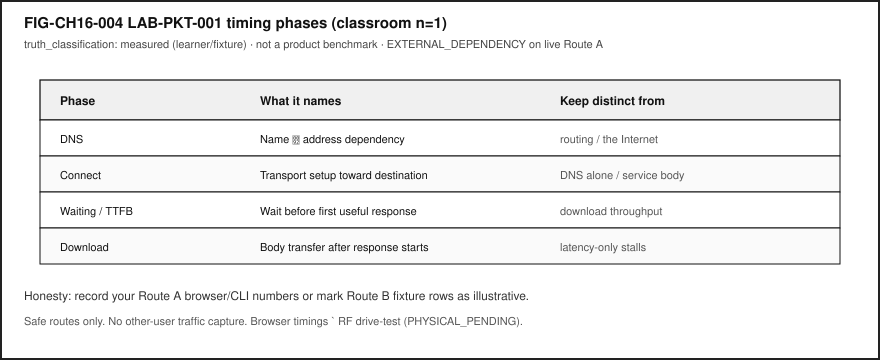

# Chapter 16 — Packets, Protocols, Routing, and the Internet

**Status:** `draft` · **Chapter ID:** `CH16`  
**Author:** Edmund Gunn, Jr.  
**Manuscript:** working draft complete · human validation pending · not publication-ready  
**Gate posture:** `GATE_3_IN_PROGRESS — READER_EVIDENCE_PENDING` (not Gate 3 PASS)

---

## 1. The moment {#sec-ch16-moment}

You send a short message. The UI shows **sent**. Then nothing: no delivered check, no reply, a spinner that will not end. You refresh a page you trust. The browser stalls on “looking up…” or hangs on connect. From your seat it feels like one verdict: *the Internet is broken*.

Underneath that verdict, several different things may have failed—or may still be fine. Your **device** may still be awake. Your **LAN** may still reach a printer. A **DNS** lookup for one name may have failed while another service answers. A **route** toward a destination may be missing even though Wi‑Fi waves still decorate the status bar. The remote **service** may be unhealthy while your access radio looks perfect.

This chapter is Part IV’s packet-path spine. It inherits Concept Edition CE‑4’s connectivity story and deepens packets, protocols, routing, and Internet scopes—without collapsing Wi‑Fi, cellular, cloud, and “the Internet” into synonyms, and without claiming Gate 3 reader evidence that does not yet exist.

The governing question:

> When everyday connected work stalls, what must I keep distinct—device, LAN, Internet, DNS, and service—so I can follow packets under protocols instead of blaming “the Internet”?

---

## 2. What you notice {#sec-ch16-notice}

Before words like *TTL* or *TCP*, notice the human contracts you already enforce with frustration.

You expect “sent” to mean progress toward another person—not only a local queue. You expect a refresh to either show content or fail with a readable reason. You expect bars and waves to mean something useful. You expect toggling Wi‑Fi or walking nearer a window to sometimes help, and you treat that superstition as data even when it is not a root cause.

Those expectations are the product from the person’s point of view.

**A connected experience is a human perception produced by concurrent conditions: local readiness, access attachment, name resolution when names are required, reachable routes, transport progress, and a healthy-enough remote service.**

Notice the split timelines. A messenger can stamp **sent** while packets never leave the LAN. A browser can show a green lock on a previous tab while a new hostname never resolves. Cellular can rescue a café Wi‑Fi stall without proving that “cellular is the Internet.” Chat can work while a large upload crawls—latency, reliability, and throughput are different failure families [@kurose-ross-8].

Optional notice on a device you already own (safe, commodity only): open a page you are allowed to load, watch whether failure language mentions lookup, connect, or waiting—or use the lab fixture if live networks are unavailable or untrusted. Do not capture other people’s traffic. Do not chase signal by climbing or distracted walking.

---

## 3. Exploded ecosystem {#sec-ch16-ecosystem}

A stalled sync is not one object. It is a path through an ecosystem. **FIG-CH16-001** is the first-minute map: **device (local)**, **LAN**, and **Internet** as nested reachability scopes—not synonyms (CLM-CH16-002).

{#fig-ch16-001 fig-cap="Local / LAN / Internet scopes. Conceptual educational map; Wi-Fi association is not Internet usability." fig-alt="Conceptual nested scopes: device, LAN, and Internet."}

Walk the layers in ordinary language, then keep the same layers when vocabulary deepens.

### Human

You form intent: send, sync, refresh, join a call. Eyes read checkmarks and spinners. Later you judge whether the other person *got it*.

### Device (local scope)

Apps, OS network stack, and NIC/radio on *this* machine. Local drafts, local caches, and on-device failures live here. Local success is not Internet success.

### Access on-ramp (not “the Internet”)

**Wi‑Fi** is a wireless LAN access technology family [@ieee80211-2020]. **Cellular** is a mobile-operator access architecture family at survey depth [@threegpp-ts23501]. Both can be on-ramps toward Internet-scoped work. Neither *is* the Internet (CLM-CH16-005). Icons report attachment moods; they do not certify remote services.

### LAN scope

Neighbors reachable under the same local network / gateway neighborhood—printers, captive portals, private address spaces commonly used on home and campus nets [@rfc1918]. A **LAN** may include **wired Ethernet** segments and/or wireless LAN attachment; those are local on-ramps and link technologies, not synonyms for Internet scope [@kurose-ross-8; @ieee80211-2020]. A device can be “on Wi‑Fi” or “on Ethernet” and still fail Internet-scoped work.

### DNS (dependency, not the whole path)

The Domain Name System maps human-readable names to addresses [@rfc1034; @rfc1035]. When a name is required, DNS sits on the critical path. DNS failure can look like “Internet down” while other paths still work (CLM-CH16-004).

### Internet path / routing

Across networks, **routing** chooses where next toward a destination. Packets carry addresses; routers and gateways forward [@rfc791; @kurose-ross-8]. Internet scope means multi-network reachability—not “any radio is lit.”

### Transport and protocols

A **protocol** is an agreed set of rules. **Transport** (survey: TCP, UDP, and modern options such as QUIC) decides how end-to-end conversation reliability is *attempted* over an unreliable datagram substrate [@rfc9293; @rfc768; @rfc9000]. Routing decides *where next*; transport decides *how the conversation tries to complete* (CLM-CH16-003).

### Remote service (placement)

Edge-near or cloud-far placement is about where compute and state live—not about which radio you used. Service health is distinct from path health. Chapter 15 adjacency covers placement depth; here, keep the label honest: without provider evidence, “the cloud region failed” is inference.

### System software preview

Browsers and OS tools can expose request phases useful for classroom observation [@mdn-resource-timing; @mdn-network-monitor]. Those are software-visible timings—not kernel traces and not RF drive-tests (**PHYSICAL_PENDING** for Quartet/project path measurements; CLM-CH16-006).

---

## 4. Follow the signal {#sec-ch16-signal}

**FIG-CH16-002** follows one connected action as encapsulation “sticky notes” across hops. Read it as a logical story, not as a claim that every messenger executes identical steps with measured timings.

{#fig-ch16-002 fig-cap="Encapsulation sticky notes along one path. Conceptual; no measured timings." fig-alt="Encapsulation sequence from app through gateway and path to service."}

1. **Intent.** You tap send or refresh. The UI may optimistically show progress.
2. **Local enqueue.** The app and OS prepare a request on the **device**. Failure here is not “the Internet.”
3. **Name resolution (when a hostname is used).** DNS must yield an address [@rfc1034; @rfc1035]. **FIG-CH16-003** shows how DNS failure can strand a named path while other work continues.
4. **Packetization / encapsulation.** Data travels as **packets**—bounded chunks with headers—not an unbroken hose of bits (CLM-CH16-001) [@rfc791]. Each layer wraps payload with its headers (encapsulation).
5. **Access + LAN hop.** Frames leave via Wi‑Fi or cellular attachment toward a gateway. Access ≠ Internet.
6. **Routing across Internet scope.** Each hop chooses a next hop toward the destination address [@rfc791; @kurose-ross-8].
7. **Transport conversation.** TCP (and kin) attempt sequenced, acknowledgment-based recovery over IP’s best-effort delivery [@rfc9293]. UDP offers a minimal message service without that machinery [@rfc768].
8. **Service response.** A remote service accepts, rejects, or times out. Placement (edge/cloud) is a hypothesis until evidenced.
9. **Human feedback.** Checkmarks, errors, or eternal spinners close the loop—or fail to.

{#fig-ch16-003 fig-cap="DNS on the critical path. Conceptual teaching aid; DNS ≠ routing ≠ service." fig-alt="DNS failure can look like Internet failure while other paths work."}

### Failure domains without drama

Prefer labeled domains over confident blame:

| Domain | Example observation | Forbidden leap |
|---|---|---|
| Device | App frozen; airplane mode on | “ISP is down” |
| Access | Wi‑Fi associated; captive portal page | “DNS is broken” without lookup evidence |
| DNS | Browser DNS phase fails for one name | “Entire Internet is down” |
| Routing / reachability | Connect timeouts after DNS OK | “Server deleted my account” |
| Transport / retries | Repeated reconnects | Tower congestion from bars alone |
| Service | HTTP 5xx / app error after connect | “My Wi‑Fi is stupid” |

Outside observation rarely separates these cleanly. That limitation is literacy, not a reader failure.

---

## 5. Component cards {#sec-ch16-components}

For each object: plain language, analogy, technical function, constraints, common symptoms. Analogies are labeled as analogies.

### Packet

- **Plain language.** A bounded chunk of network data with headers that layers use to forward and deliver.
- **Analogy (labeled).** Like a labeled envelope—not a continuous fire hose.
- **Technical function.** Classic IPv4 datagram model includes source/destination addresses, protocol, and TTL among other fields [@rfc791]. IPv6 is a parallel modern network-layer standard [@rfc8200].
- **Constraints.** Size limits, loss, reordering, and TTL expiry.
- **Symptoms.** Partial loads, stalls, “connection reset,” or silence after “sent.”

### Encapsulation

- **Plain language.** Wrapping payload with layer-specific headers (and sometimes trailers) on the way out; peeling them on the way in.
- **Analogy (labeled).** Sticky notes added at each desk in a mailroom.
- **Technical function.** Lets protocols cooperate without each layer rewriting the whole application message [@kurose-ross-8].
- **Constraints.** Overhead, mismatch if a middlebox expects different headers.
- **Symptoms.** Works on one network path and fails on another that handles headers differently.

### Addressing

- **Plain language.** Identifiers used to deliver packets (for example, IP addresses).
- **Analogy (labeled).** Street addresses for envelopes—not the road itself.
- **Technical function.** Network-layer delivery targets in IP [@rfc791; @rfc8200]. Private IPv4 ranges commonly appear on LANs [@rfc1918].
- **Constraints.** Ambiguity behind NAT; wrong address → wrong place.
- **Symptoms.** Reaches the wrong host; never leaves private scope when Internet scope was intended.

### Routing

- **Plain language.** Choosing next hops toward a destination across networks.
- **Analogy (labeled).** Intersection decisions—not the conversation once you arrive.
- **Technical function.** Forwarding based on destination information toward the intended scope [@rfc791; @kurose-ross-8].
- **Constraints.** Misconfiguration, filtering, missing default route, policy blocks.
- **Symptoms.** DNS succeeds; connect hangs; LAN peers work; Internet peers do not.

### Protocol

- **Plain language.** Shared rules so two parties can communicate meaningfully.
- **Analogy (labeled).** A script both sides agree to follow.
- **Technical function.** Defines formats and behaviors at each layer—from IP to TCP to application protocols [@rfc791; @rfc9293].
- **Constraints.** Version mismatch; middleboxes; incomplete implementations.
- **Symptoms.** “Protocol error,” failed negotiation, mysterious hangs after connect.

### Transport (intro)

- **Plain language.** End-to-end conversation behaviors above the internetwork layer—reliability attempts, ports, streams vs messages.
- **Analogy (labeled).** How carefully you confirm that spoken sentences arrived—not which highway you drove.
- **Technical function.** TCP provides a connection-oriented byte-stream service with sequenced data and acknowledgment-based recovery [@rfc9293]. UDP provides a minimal message-oriented service [@rfc768]. QUIC is an optional modern survey pointer [@rfc9000].
- **Constraints.** Cannot invent a lossless physical medium; timeouts still feel like failure.
- **Symptoms.** Retries, resets, one-way audio, “connected” with no progress.

### DNS

- **Plain language.** A system mapping names people use to addresses machines need [@rfc1034; @rfc1035].
- **Analogy (labeled).** A phone book lookup before dialing—not the phone call itself.
- **Technical function.** Critical-path dependency for many named Internet requests [@kurose-ross-8].
- **Constraints.** Stale caches, broken resolvers, filtering, captive portals impersonating “success.”
- **Symptoms.** “Server not found” while IP-literal or cached services still work (CLM-CH16-004).

### Local vs LAN vs Internet

- **Plain language.** Distinct reachability scopes (CLM-CH16-002).
- **Analogy (labeled).** Room / building / city—not three words for “online.”
- **Technical function.** Teaching structure for diagnosis; aligned with host/internet layering intuition [@rfc1122].
- **Constraints.** NAT and policy blur edges; still refuse synonym collapse.
- **Symptoms.** Printer works, web fails; guest Wi‑Fi associates, Internet blocked.

---

## 6. Stability contract {#sec-ch16-stability}

The **Stability Contract** returns:

> A user experience exists only while multiple hidden technical conditions remain within acceptable bounds.

For this chapter’s anchor—send/sync/refresh that remains *human-usable*—keep conditions **qualitative**. Do not invent millisecond budgets (forbidden until measured; CE‑4/CH16 posture).

Concurrent conditions (chapter lens):

1. **Device local stack** can enqueue and process network work.
2. **Access attachment** exists for the *needed* path (Wi‑Fi or cellular as on-ramps—not synonyms for Internet) [@ieee80211-2020; @threegpp-ts23501].
3. **Auth / captive gates** cleared when they apply.
4. **DNS succeeds** when names are required [@rfc1034; @rfc1035].
5. **Route exists** toward the destination scope required [@rfc791].
6. **Transport progresses** or fails visibly [@rfc9293].
7. **Latency / loss** stay acceptable *for the human task* (qualitative).
8. **Remote service** healthy enough to complete the action.

A radio icon can stay positive while the human experience has already failed. Conversely, a page can load from cache while live Internet scope is gone. Stability is concurrent conditions—not a single green glyph.

**Honesty bound:** Device Quartet / project-specific path measurements remain **PHYSICAL_PENDING** (CLM-CH16-006). **LAB-PKT-001** produces *your* classroom evidence for *your* route—or fixture honesty banners—not a universal SLO.

---

## 7. Try it {#sec-ch16-try}

### LAB-PKT-001 — Trace One Connected Action Across Path and Access

**Goal.** When a connected action feels stuck, observe what you can on a commodity device—or parse fixtures—and separate **device / LAN / Internet / DNS / service**, plus access mode and latency vs reliability vs throughput.

**WAIKE alignment note.** WAIKE accepted `main` includes adjacent `COMPUTER_NETWORKING` labs such as `lab_datapath` and DNS neighbors. Those are competency adjacencies. They are **not** renamed as publication lab IDs. **LAB-PKT-001** is publication-owned.

**Safety (hard stops).**

- Do **not** capture other users’ traffic.
- Do **not** run unauthorized scanning or packet capture on networks you do not administer.
- Do **not** store passwords, tokens, private message bodies, or banking amounts.
- Prefer demo pages, public documentation URLs, or fixtures.
- On public/untrusted Wi‑Fi classrooms, prefer **Route B**.
- No radio transmission experiments; no captive-portal term bypass.

**Routes.**

- **Route A — live commodity (browser or CLI).** `IMPLEMENTED_DIGITAL` with `EXTERNAL_DEPENDENCY` when live DNS/Internet is used. Browser Network / Resource Timing phases are allowed classroom observations [@mdn-network-monitor; @mdn-resource-timing]. Optional CLI: `python3 labs/LAB-PKT-001/cli/path_inspect.py --fixture` and, only if policy allows, `--dns-check example.com`.
- **Route B — fixture fallback (mandatory accessible path).** `FIXTURE_VALIDATED`. Use `fixtures/sample_path_trace.json`, `sample_timing_table.csv`, and `sample_observation.md`. Mark rows as **not** your device measurements.

**Explorer baseline (about 45–60 minutes).**

1. Predict failure family: latency / reliability / throughput; name access if known (Wi‑Fi / cellular / unknown / fixture).
2. Complete Route A **or** Route B.
3. Fill an observation-vs-inference table. Keep **device, LAN, Internet, DNS, and service** in separate columns or labels.
4. Draw a path diagram with access on-ramp and edge/cloud placement *hypothesis* labeled as hypothesis.
5. Teach-back: Wi‑Fi ≠ Internet ≠ cellular ≠ cloud.

**Operator.** Change one condition on Route A, or answer fixture parse questions (TTL, ethertype, scopes) on Route B.

**Builder.** Clean diagram another student could follow without admin rights.

**Engineer.** Ordered hypotheses: access → DNS → reachability → transport/retries → remote placement. Separate DNS vs routing vs transport evidence.

**Researcher.** N≥3 runs with confounders listed; no published benchmark claim from classroom n=1.

**Evidence to keep.** Timing/observation table; path diagram; screenshot **or** fixture note; reflection; teach-back. Bare `PASS` is not evidence.

**FIG-CH16-004** shows the phase vocabulary learners record—measured as *classroom learning*, not as a product scoreboard.

{#fig-ch16-004 fig-cap="LAB-PKT-001 timing phases. Learner or fixture measured rows; not a published benchmark." fig-alt="Classroom timing phase vocabulary for LAB-PKT-001."}

---

## 8. Build it {#sec-ch16-build}

Extend LAB-PKT-001 without turning Part IV into a certification dump.

### Explorer

Build a pocket card with five labels—**device, LAN, Internet, DNS, service**—and one plain sentence each that refuses synonym collapse.

### Operator

Build a “stuck sync” checklist that starts with access mode text (not color alone), then DNS evidence, then connect/waiting phases, and ends with “needs more evidence”—never with fake certainty about towers or cloud regions.

### Builder

Build a labeled path diagram (paper or digital) for one experience: human → device → access on-ramp → LAN gateway → Internet path → service. Annotate which boxes you **observed** vs **inferred**. Optional: parse fixture JSON fields (TTL, ethertype) into diagram callouts.

### Engineer

Build a one-page differential: DNS failure vs routing failure vs transport stall vs service error, each with *minimum evidence* required. Cite standards for packet/transport/DNS vocabulary rather than inventing vendor SLOs [@rfc791; @rfc9293; @rfc1034].

### Researcher

Build an evidence plan for a claim you are **not** allowed to make yet—for example, “Quartet RF path latency is X ms.” Keep CLM-CH16-006 **PHYSICAL_PENDING**. Specify what drive-test or accepted-main artifacts would be required.

Educators: facilitate teach-backs from Section 11; default classrooms without stable broadband to Route B.

---

## 9. Secure and include it {#sec-ch16-secure-include}

### Security

Open Wi‑Fi is an eavesdropping and captive-portal phishing surface at awareness level—not a cracking tutorial. Prefer encrypted sessions in transit at concept depth (TLS adjacency) [@rfc8446]. “Wi‑Fi on” is not a security state. Out of scope for this chapter and lab: exploit development, WPA cracking, unauthorized interception, evil-twin how-tos, or bypassing access controls.

### Privacy

Network screenshots may reveal hostnames, emails, locations, or message previews—redact. Timing tables store action labels and phase names, not payloads. Cellular vs Wi‑Fi choice can imply location patterns; record access as a category, not a GPS trail.

### Accessibility

Status UIs often rely on color icons (bars/waves). Lab writeups require **text** status. Captive portals frequently break screen readers and keyboard flows—document as real exclusion. Provide text-first path diagrams. Fixture Route B is mandatory so learners without personal hotspots can complete evidence.

### Equity

Assuming always-on unlimited home broadband excludes many readers. Café/library Wi‑Fi and metered cellular are first-class conditions—not edge cases. “Just use cellular” can impose cost. Do not require Device Quartet hardware.

### Safety

No climbing for signal; no distracted walking-and-testing; no illegal antenna operation; no social-engineering classmates’ credentials “for the lab.”

### Ethics

Connectivity failures are often system and policy issues, not learner moral failures. Distinguishing access technologies prevents false blame when the failure is DNS, routing, or remote service health.

---

## 10. Career lens {#sec-ch16-career}

One stalled message crosses many ownership domains. No table promises employment; roles vary by organization. Completing LAB-PKT-001 does not grant CCNA or cloud certifications.

| Role lens | Typical artifacts | Review questions |
|---|---|---|
| Network engineer | Path diagrams, scope labels, reachability notes | LAN vs Internet ownership clear? |
| ROLE-BACKEND / service owner | API error classes, placement hypotheses | Path vs service failure distinguished? |
| SRE / reliability | Incident timelines, dependency maps | DNS/routing/transport separated? |
| Support / operator | Ticket notes, observation-vs-inference | Did we ask for unauthorized captures? |
| Wireless (survey entry) | Access-mode labels only at CE/CH16 depth | Did we synonymize Wi‑Fi with Internet? |
| Educator / facilitator | Fixture-first rubrics | Can offline learners still pass with evidence? |

Portfolio hint: a scrubbed path diagram plus a DNS-vs-routing differential is more honest than “the Internet was down.”

---

## 11. Check understanding {#sec-ch16-check}

**Concept.** In one sentence each, define *packet*, *routing*, and *DNS* so that none of them swallows the other two.

**Scopes.** Give an everyday example where **device**, **LAN**, and **Internet** disagree about “working.”

**System tracing.** Trace a refresh that fails “looking up host” in numbered steps. Mark observed vs inferred. Where does DNS sit relative to routing and service?

**Misconception check.** Why is “Wi‑Fi connected means the Internet works” incomplete (CLM-CH16-005)?

**Misconception check.** Why can DNS failure look like total Internet failure while a LAN printer still works (CLM-CH16-004)?

**Teach-it-back.** Using only LAB-PKT-001 vocabulary, explain to a newcomer why a message can show **sent** while the peer never receives it—without capturing anyone’s traffic.

**Researcher prompt.** What evidence would convert CLM-CH16-006 from PHYSICAL_PENDING into a documented physical claim? What remains out of scope for a commodity classroom lab?

---

## References

Selected authoritative sources for this chapter’s general technical explanations are listed in the bibliography (`book/references/references.bib`), with CE‑4 verified register inheritance (`publication/preproduction/ce-04/SOURCE_REGISTER.md`). Project-specific Quartet path measurements remain **PHYSICAL_PENDING** (CLM-CH16-006). WAIKE adjacency uses accepted-main SHA `e97e74fc9bfb44b1cdc26b272dc4848264f15fe0` as competency neighbors only—not as a LAB-PKT-001 module ID.

Inline citation keys used in this chapter include @rfc791, @rfc768, @rfc8200, @rfc9293, @rfc9000, @rfc1034, @rfc1035, @rfc1122, @rfc1918, @rfc8446, @ieee80211-2020, @threegpp-ts23501, @kurose-ross-8, @mdn-resource-timing, and @mdn-network-monitor.

---

## 12. Glossary links {#sec-ch16-glossary}

Candidate terms introduced or reinforced here (see also `publication/full31/chapters/ch16/GLOSSARY_CANDIDATES.yaml`; do not treat this list as an auto-merge into the live glossary):

| Term | Plain link |
|---|---|
| Packet | Bounded network data unit with headers |
| Encapsulation | Adding layer-specific headers around payload |
| Addressing | Identifiers used to deliver packets |
| Routing | Selecting paths / next hops for packets |
| Protocol | Shared rules enabling communication |
| Transport layer | End-to-end conversation behaviors above internetworking |
| DNS | Name-to-address dependency often on the critical path |
| Local vs LAN vs Internet | Distinct reachability scopes—not synonyms |
| Stability contract | Concurrent conditions that keep the experience alive |

Related earlier chapters: systems tracing method (CH02), cloud/edge placement adjacency (CH15). Related later chapters: Wi‑Fi/cellular depth (CH17–CH18), continuity and QoE (CH19–CH20), network attack surfaces (CH23+). CE inheritance: CE‑4 primary; CE‑6 connected ≠ usable.

---

## Figure references (embeds above; accessibility metadata)

All figures are teaching aids. No fabricated operator telemetry. No Gate 3 PASS claim.

### FIG-CH16-001 — Local / LAN / Internet scopes

- **Type.** Comparative layers (inherit FIG-CE4-001 intent).
- **Reader should notice.** Nested scopes; Wi‑Fi association ≠ Internet usable.
- **Truth class.** Conceptual.
- **Alt text requirement.** Name device, LAN, Internet; state conceptual truth class.

### FIG-CH16-002 — Encapsulation sticky notes

- **Type.** Sequence (inherit FIG-CE4-002 intent).
- **Reader should notice.** Headers add outbound; service is not the access radio.
- **Truth class.** Conceptual.
- **Alt text requirement.** Enumerate steps 1–6; deny measured timings.

### FIG-CH16-003 — DNS on the critical path

- **Type.** System map.
- **Reader should notice.** Named path can fail at DNS while other work continues.
- **Truth class.** Conceptual.
- **Alt text requirement.** Contrast Path A vs Path B; DNS ≠ routing ≠ service.

### FIG-CH16-004 — LAB-PKT-001 timing phases

- **Type.** Measured classroom / fixture table vocabulary.
- **Reader should notice.** Phase names; honesty banner for n=1 learning.
- **Truth class.** Measured (learner or illustrative fixture)—not a published benchmark.
- **Alt text requirement.** List phases; state EXTERNAL_DEPENDENCY / PHYSICAL_PENDING limits.

---

## Claim footnotes used in this chapter

- **CLM-CH16-001.** Packets are bounded chunks with headers—not an unbroken hose [@rfc791].
- **CLM-CH16-002.** Local, LAN, and Internet are different reachability scopes [@rfc791; @rfc1122 teaching structure].
- **CLM-CH16-003.** Routing decides where next; transport decides how conversation reliability is attempted [@rfc9293].
- **CLM-CH16-004.** DNS failure can look like Internet failure while other paths work [@rfc1034; @rfc1035; @kurose-ross-8].
- **CLM-CH16-005.** Wi‑Fi and cellular are access on-ramps, not synonyms for the Internet [@ieee80211-2020; @threegpp-ts23501; @rfc791].
- **CLM-CH16-006.** Project-specific path measurements on Quartet remain **PHYSICAL_PENDING**.
