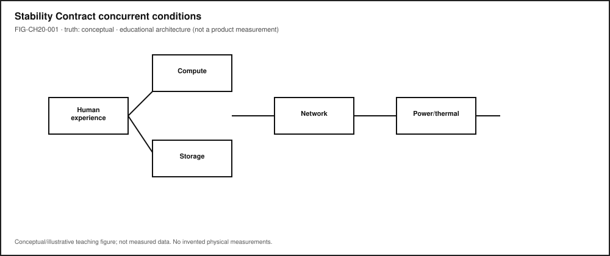
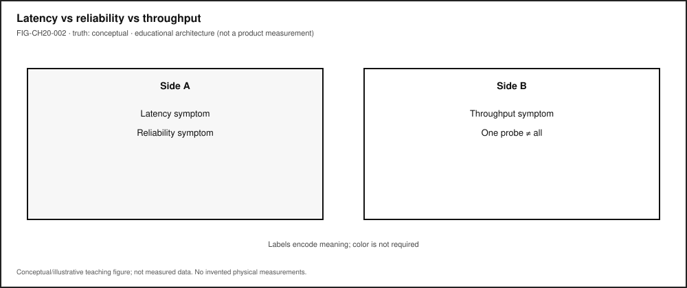
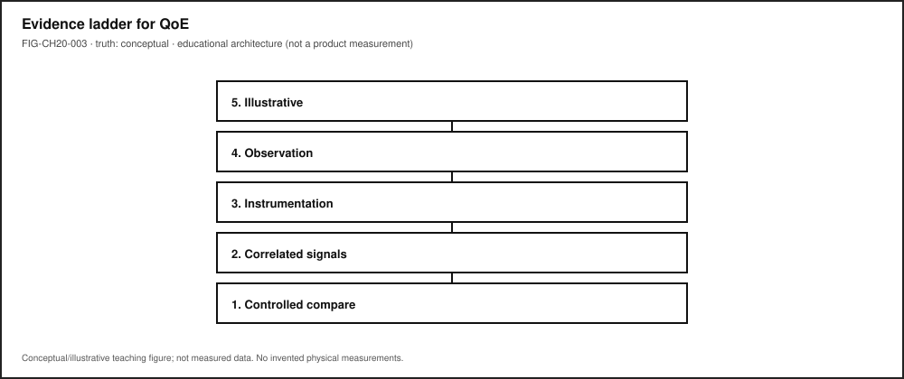
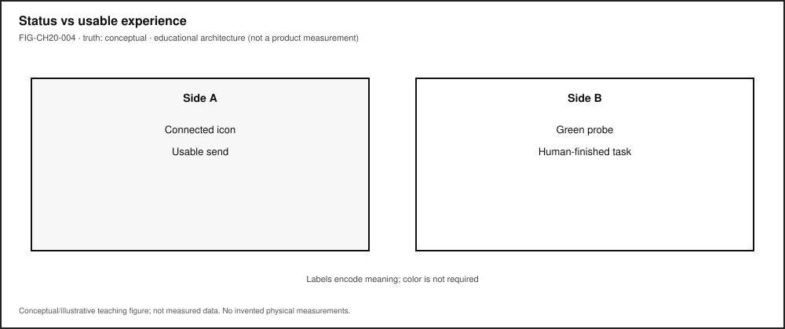

# Chapter 20 — Latency, Reliability, QoE, and the Stability Contract

**Status:** `draft` · **Chapter ID:** `CH20`  
**Author:** Edmund Gunn, Jr.  
**Manuscript:** working draft complete · human validation pending · not publication-ready  
**Gate note:** `GATE_3_IN_PROGRESS — READER_EVIDENCE_PENDING` (this chapter does **not** claim Gate 3 PASS; EMIT fixtures and illustrative portfolios are teaching infrastructure, not human reader evidence).

Part IV has already named paths, packets, radios, and services. This chapter closes the connect-everything arc by refusing a single-metric story. It inherits the Concept Edition CE-6 Stability Contract package and the publication-owned capstone **LAB-CE06-001**, then expands them for full-book depth: latency, reliability, throughput, QoE, QoS, and the discipline of evidence.

---

## 1. The moment {#sec-ch20-moment}

Everything looks connected. The icon says online. The Wi‑Fi name is familiar. Cellular bars are present. You tap send, submit, refresh, or sync—and the experience stalls, flickers, retries, or never finishes. Sometimes a toast claims success while the remote effect never arrives. Sometimes ping looks fine and the app still feels awful.

From the seat: contradiction.

Underneath: concurrent hidden conditions. A **connectivity indicator** answers a narrow question—“is some association or reachability path believed present?” It does not answer whether *this person’s* intended action completed with acceptable delay, correctness, and feedback. **Quality of Experience (QoE)** is the human-facing question. **Quality of Service (QoS)** is related service-characteristic language. **Ping** is one probe among many—not a full contract [@itu-t-p10-g100].

The governing question for this chapter:

> When everything looks connected but the experience fails, which concurrent conditions broke—and what evidence do I actually have?

This is Part IV’s synthesis close and the full-book expansion of CE-6. It is not a second one-tap lecture, not a carrier-grade MOS campaign, and not a table of invented product SLOs.

---

## 2. What you notice {#sec-ch20-notice}

Before naming latency budgets or reliability mathematics, notice the human contract that broke.

You expected a familiar action to finish. Instead you notice a persistent spinner, a partial local update without remote confirmation, a reconnect banner that never resolves, choppy media while “connected” stays green, or an assistive path that never announces completion. A classmate on a different device or network may finish the same action while you do not. That divergence is part of the technical story—not a character flaw in the user.

**Connected indicators can remain green while the human experience has already failed.**

That distinction is the chapter’s first systems skill (CLM-CH20-004; CE-6 signature). Status chrome is an observation about *status chrome*. Usable completion is a different observation. Collapsing them produces confident wrong blame: “the Wi‑Fi,” “the cloud,” “the phone,” as if those were synonyms for one failure.

Optional commodity notice (no specialized gear): attempt one familiar send/submit/sync on a device you already own. Write two columns—*status shown* and *action outcome for a human*—before you invent a cause. If live reproduction is unsafe, offline, or metered, use the LAB-CE06-001 fixture route and mark rows `fixture`. Fixture timings are illustrative teaching data, not your measured evidence and not Gate validation.

---

## 3. Exploded ecosystem {#sec-ch20-ecosystem}

A stalled send is not a single object. It is a path through an ecosystem. **FIG-CH20-001** is the first-minute map: human experience at the center, with concurrent spokes—not a single ordered villain chain. Treat it as **Representative educational architecture**, not a claim that every app fails the same way.

{fig-alt="Stability Contract concurrent conditions around human experience. Conceptual hub-and-spoke." #fig-ch20-001 fig-cap="Stability Contract concurrent conditions around human experience. Conceptual hub-and-spoke."}

Walk the layers in ordinary language.

### Human and context

Intent, expectation, attention, and situation set what “acceptable” means *for this person now*. A classroom quiz submit and a casual chat send do not share one universal delay tolerance. Acceptable bounds are context-dependent; inventing universal millisecond tables as gunnchOS truth is forbidden (CLM-CH20-005).

### Input and interaction path

Taps, keys, voice, or assistive technology must be recognized and delivered into the software path. SC-01 in the CE-6 contract list. A silent AT path can fail the experience even when sighted UI chrome looks busy [@wcag22-20241212].

### Application / code / event loop

Handlers must be scheduled and must not hang. SC-02. Browser and app event-loop behavior matters when the UI thread is blocked [@whatwg-html]. Local code can stall while the radio still shows associated.

### Memory, storage, and local state

Working memory and storage responsiveness condition saves, attachments, and caches. SC-03 / SC-04. Hitch after a large attachment can be storage pressure without any network villain [@patterson-hennessy].

### Network path (if remote work is required)

Link association, DNS, routing, transport, and retries. SC-05. Part IV already separated Wi‑Fi, cellular, Internet path, and cloud placement—do not collapse them into “the network” as one synonym. A usable local association does not entail a usable end-to-end path.

### Remote service / authorization

Service health, sessions, scopes, and API contracts. SC-06. HTTP 5xx, 401, or “success UI without durable effect” are service-domain symptoms—not proof that the phone radio failed.

### Render / display feedback

Coherent UI feedback must reach the human. SC-07. Work can finish on a server while frames arrive late, or a spinner can outlive the request.

### Power / thermal policy

Battery and thermal modes can collapse performance mid-experience. SC-08. Chapter 9’s budget lesson returns as a contract condition [@linux-cpu-freq].

### Trust / permissions

Identity, scopes, and secure storage must allow the action. SC-09. Permission denial is not “Wi‑Fi.”

### Accessibility / alternate path

Equivalent feedback along assistive or non-pointer paths. SC-10. Accessibility is a Stability Contract condition, not a garnish [@wcag22-20241212].

### Total delay and variability

SC-11: delay and variability remain acceptable *to this person in this context*. Total delay is an aggregate of the above—not a license to invent product SLOs.

**FIG-CH20-002** separates latency vs reliability vs throughput symptom families so readers stop treating one green probe as all three.

{fig-alt="Latency vs reliability vs throughput symptom families. Conceptual; do not collapse into one probe." #fig-ch20-002 fig-cap="Latency vs reliability vs throughput symptom families. Conceptual; do not collapse into one probe."}

---

## 4. Follow the signal {#sec-ch20-signal}

Here the “signal” is the human action’s fate across layers—not a single ICMP echo. Read the sequence as a logical diagnosis story. Alternate paths exist; open questions stay labeled undetermined.

1. **Intent.** A person chooses send / submit / sync / stream.
2. **Input delivery.** The OS and app receive the intent (or do not).
3. **Local work.** Scheduling, memory, storage, and UI update begin.
4. **Optional remote request.** If required, a network transaction starts—DNS, TLS, transport, retries.
5. **Service decision.** Authorize, accept, reject, timeout, or partially apply.
6. **Return path.** Response, error, or silence travels back.
7. **Render / announce.** Visual, haptic, audio, or AT feedback reaches (or fails to reach) the human.
8. **Human judgment.** Finished, stuck, wrong, or “works for them / not for me.”

### Metric families without collapse

| Family | Everyday question | Typical mis-use |
|---|---|---|
| **Latency** | How long until a useful response? | Treating one RTT sample as the whole experience |
| **Reliability** | Does the action complete correctly often enough over time? | Calling a single success “reliable” |
| **Throughput** | How much useful data per time? | Assuming high throughput cures latency or correctness |
| **QoS language** | What service characteristics are in play? | Treating KPI compliance as guaranteed delight |
| **QoE** | How delightful or annoying is the experience for the user? | Equating ping with QoE [@itu-t-p10-g100] |
| **Ping / probe** | What did *this* probe return? | Promoting one probe into a Stability Contract |

Latency, reliability, and throughput are different failure/success families; collapsing them misleads diagnosis (CLM-CH20-001) [@iso-iec-25010-2023; @itu-t-p10-g100]. Software quality models discuss characteristics such as performance efficiency and reliability as related but distinct lenses—useful vocabulary, not a product certification claim for this book [@iso-iec-25010-2023].

### Evidence hierarchy (climb only as far as tools and ethics allow)

**FIG-CH20-003** and CE-6’s evidence ladder teach the same honesty:

{fig-alt="QoE vs QoS vs ping. Conceptual non-entailment teaching." #fig-ch20-003 fig-cap="QoE vs QoS vs ping. Conceptual non-entailment teaching."}

1. Illustrative teaching aid (labeled)
2. Commodity observation (status UI, wall-clock, visible stalls)
3. Browser / OS instrumentation where exposed (for example Performance API timings) [@mdn-performance; @mdn-resource-timing]
4. Correlated multi-signal inspection (still not proof)
5. Controlled comparison under ethical constraints
6. Standards-aligned subjective / objective QoE methods (ITU-T G.1011 context)—**not** required for classroom completion [@itu-t-g1011]

Learner labs sit mid-ladder. Carrier-grade MOS campaigns and invented scores do not belong in Explorer portfolios.

### Failure branch without drama

Prefer failure *domains* over confident blame: input, compute/schedule, memory/storage, network path, service/backend, render/display, power/thermal, trust/permissions, equity/access. Outside observation rarely distinguishes them cleanly. That limitation is literacy.

---

## 5. Component cards {#sec-ch20-components}

For each idea: plain language, analogy (labeled), technical function, constraints, common symptoms.

### Latency

- **Plain language.** Delay until a useful result is available—often many segments, not one number.
- **Analogy (labeled).** Like waiting for a reply in a conversation with several people passing the message—total wait is not “the last person’s fault” by default.
- **Technical function.** Names time-to-useful-response across input, compute, path, service, and render segments.
- **Constraints.** Context-dependent acceptability; clock granularity; instrumentation coverage gaps.
- **Symptoms.** Spinner longevity, late first paint of result, stalled progress with partial UI.

### Reliability

- **Plain language.** Completing correctly often enough over repeated attempts and time.
- **Analogy (labeled).** Like a bridge that must carry traffic many days—not a single photo of a car that made it once.
- **Technical function.** Correct completion under intended conditions; related to software quality “reliability” language without claiming ISO certification [@iso-iec-25010-2023].
- **Constraints.** One lab run ≠ reliability study; fixture scripts ≠ fleet evidence.
- **Symptoms.** Intermittent success, silent failure, success toast without durable effect.

### Throughput

- **Plain language.** Useful data volume per unit time.
- **Analogy (labeled).** Like how many boxes fit through a door per minute—not how long until the first box arrives.
- **Technical function.** Capacity of a path or transfer for bulk usefulness.
- **Constraints.** High throughput can coexist with awful interactive latency or failed reliability.
- **Symptoms.** Slow large uploads/downloads while tiny control messages still feel “stuck” for other reasons.

### Quality of Experience (QoE)

- **Plain language.** Human-facing acceptability—delight or annoyance of the application or service experience, in ITU vocabulary terms [@itu-t-p10-g100].
- **Analogy (labeled).** Like whether a journey felt usable—not only whether the odometer moved.
- **Technical function.** Centers the person’s outcome; related to but not identical with QoS.
- **Constraints.** Formal subjective methods are higher on the evidence ladder [@itu-t-g1011]; classroom MOS invention is forbidden.
- **Symptoms.** “Connected but unusable,” peer divergence, abandon/retry behavior.

### Quality of Service (QoS)

- **Plain language.** Service-characteristic language about properties that bear on satisfying user needs [@itu-t-p10-g100].
- **Analogy (labeled).** Like published transit schedule metrics—related to rider satisfaction, not identical to it.
- **Technical function.** Gives operators shared vocabulary for path and service characteristics.
- **Constraints.** Meeting a KPI does not entail QoE without evidence (CLM-CH20-002).
- **Symptoms.** Operators citing loss, delay, availability numbers while users still abandon.

### Ping / probe

- **Plain language.** One measurement sample from one probing method.
- **Analogy (labeled).** Like tapping a pipe once—useful, incomplete.
- **Technical function.** Cheap reachability or RTT hint when ethically available.
- **Constraints.** Not SC-01…SC-11; not QoE; not reliability.
- **Symptoms.** “Ping is fine” beside a broken submit.

### Stability Contract (teaching model)

- **Plain language.** A user experience exists only while multiple hidden technical conditions remain within acceptable bounds.
- **Analogy (labeled).** Like a mobile that stays upright only while many guy-wires stay tensioned—any one wire can drop the experience.
- **Technical function.** Publication teaching model for concurrent conditions (not an ITU term; do not attribute the phrase to ITU) [@itu-t-p10-g100].
- **Constraints.** Qualitative where unmeasured; no fake SLOs (CLM-CH20-003; CLM-CH20-005).
- **Symptoms.** Green chrome + failed human outcome; single-metric overconfidence.

---

## 6. Stability contract {#sec-ch20-stability}

**Definition (publication teaching model):** a user experience exists only while multiple hidden technical conditions remain within acceptable bounds.

**Signature distinction:** a system can remain technically **connected** while the human experience has already **failed**.

This section is the deepest Stability Contract synthesis in the book’s Part IV close. It inherits CE-6’s formal teaching model and concurrent-condition table, then binds them to latency/reliability/QoE literacy without inventing numeric product budgets.

### How to teach and apply it (eight moves)

1. **Name the human experience** — what success looks like for a person.
2. **List concurrent conditions** — SC-01…SC-11 style; not a single villain metric.
3. **Separate status chrome from experience outcomes.**
4. **Assign symptoms to failure domains** with evidence gates.
5. **Label every datum** observed / inferred / illustrative / fixture.
6. **Climb the evidence hierarchy** only as far as tools and ethics allow [@itu-t-g1011; @mdn-performance].
7. **State tradeoffs and who is excluded** when conditions are tuned.
8. **Close with teach-back** — can another person use the model?

### Concurrent conditions (qualitative anchor)

For a successful send/submit/sync experience, conditions such as the following must remain *good enough together* (CE-6 inheritance):

| ID | Hidden condition |
|---|---|
| SC-01 | Input / intent recognized and delivered |
| SC-02 | Application scheduled; handler not hung |
| SC-03 | Memory / working state available |
| SC-04 | Storage responsive if persistence required |
| SC-05 | Network path usable *if* remote work is required |
| SC-06 | Remote service available and authorized *if* required |
| SC-07 | Coherent render / UI feedback reaches the human |
| SC-08 | Power / thermal state not collapsing performance |
| SC-09 | Trust / permissions allow the action |
| SC-10 | Accessibility / alternate path provides equivalent feedback |
| SC-11 | Total delay and variability acceptable *in this context* |

**Numeric humility rule:** use qualitative language where no measured threshold exists. Do **not** invent performance budgets, MOS scores, or gunnchOS product SLOs (CLM-CH20-005). Any numeric bands in teaching figures prior to learner measurement are **illustrative** only.

### CE-6 + LAB-CE06-001 linkage

- **CE-6 preproduction** (`publication/preproduction/ce-06/`) is the primary inheritance package: Stability Contract model, experience map, claim boundaries, and figure intents.
- **LAB-CE06-001** is the publication-owned EMIT capstone (Explain → Measure → Improve → Teach). Status on accepted infrastructure: **`FIXTURE_VALIDATED`**. That status means validators, blank portfolio templates, and illustrative fixtures exist and pass structural checks. It does **not** mean Gate 3 PASS. It does **not** mean illustrative example portfolios are human evidence. It does **not** mean fixture timings are product SLOs.

**Honesty bound for this edition:** Device Quartet QoE benches remain **PHYSICAL_PENDING** (CLM-CH20-006). Commodity observation in LAB-CE06-001 produces *your* evidence for *your* chosen experience—or fixture-labeled teaching practice—not a universal score.

---

## 7. Try it {#sec-ch20-try}

### LAB-CE06-001 — Explain, Measure, Improve, and Teach

**Goal.** Using the book’s full model, gather ethical commodity evidence to explain a real experience, measure what is actually observable, propose one bounded improvement, and teach the Stability Contract for that experience to someone else.

**WAIKE alignment note.** WAIKE accepted `main` (SHA `e97e74fc9bfb44b1cdc26b272dc4848264f15fe0`) includes adjacent competencies such as networking, observability, ethics-ladder evidence language, and SLO-budget *neighbors*. Those are adjacencies. They are **not** renamed as publication lab IDs. There is **no** exact WAIKE module literally named Stability Contract / EMIT / TECHNOLOGY_LANDSCAPE_CAPSTONE. **LAB-CE06-001** is publication-owned.

**Safety (hard stops).**

- No passwords, tokens, private messages, health data, or classmate PII in portfolios.
- No rooting, jailbreaking, unauthorized scanning, or attacking systems.
- Prefer local demos, benign public endpoints, or supplied fixtures; heed metered-data warnings.
- No Device Quartet / specialized RF / EVT hardware required or requested.

**Routes.**

- **Route A — Notebook + status UI.** Reproduce a connected-but-unusable send/submit/sync (or allowed substitute) once on a commodity device. Record OS connectivity status *separately* from whether the action finished for a human.
- **Route B — Local stall demo (optional).** Open `labs/LAB-CE06-001/browser/index.html`; compare local UI updates vs stalled remote path; label timings observed vs inferred.
- **Route F — Fixture fallback (mandatory offline path).** Use `fixtures/sample_observation.md`, `fixtures/sample_result_table.csv`, and optionally study `fixtures/illustrative_example/` (**ILLUSTRATIVE ONLY — not human evidence**). Mark fixture-derived rows as `fixture`.

**Explorer baseline.**

1. Predict which failure domain will dominate before measuring.
2. Complete EMIT: Explain → Measure → Improve → Teach.
3. List ≥4 Stability Contract conditions; mark observed vs guessed.
4. Fill observation vs inference; no causal claim without naming extra evidence needed.
5. Produce teach-back a peer or family member could use.

**Operator extension.** Add ≥3 inspection artifacts and one comparison (for example local-only vs remote, or two network classes you already have). Keep LAB-PKT-001 adjacency in mind: predict metric family (latency vs reliability vs throughput symptoms) before reading instrumentation.

**Builder extension.** One reusable checklist or helper plus a tradeoff note (who might be excluded if you “optimize” only for your device).

**Engineer extension.** Diagnosis tree; two claims placed on the evidence hierarchy; explicit instrumentation limits (Performance API is software timing, not touch-to-photon or RF truth) [@mdn-performance].

**Researcher extension.** Falsifiable hypothesis; ≥3 confounders; **no invented statistics or MOS**. State what a G.1011-aligned study would require that this lab does not provide [@itu-t-g1011].

**Educator facilitation.** Use `rubric.yaml`; keep classrooms on Route F when live capture is inequitable or unsafe.

**Evidence to keep.** Portfolio field set under `labs/LAB-CE06-001/portfolio/`; result table; scrubbed notes; teach-back. Validator: `validate_portfolio.py`. Completion means artifact-backed claims—not a bare exit code and not the string PASS.

---

## 8. Build it {#sec-ch20-build}

Extend LAB-CE06-001 without turning Part IV into a fake SLO catalog.

### Explorer

Build a pocket card: *status chrome ≠ usable outcome*, plus five contract conditions in plain sentences.

### Operator

Build a two-column inspection sheet: status observations | experience outcomes. Add a third column only for inferences, each with “evidence still needed.”

### Builder

Build a one-page Improve plan: one bounded change, predicted failure-domain effect, and **qualitative** success criteria you could observe. Optional: a tiny local helper that timestamps visible UI state transitions—never a claim of product latency budgets.

### Engineer

Build a metric-family decision tree (latency / reliability / throughput / QoE question) that ends in “needs more evidence” more often than in fake certainty. Cite QoS/QoE vocabulary honestly [@itu-t-p10-g100]. Optional adjacency: reuse LAB-PKT-001 prediction discipline on the same experience.

### Researcher

Build an evidence plan for a claim you are *not* allowed to make yet—for example, a MOS score or Quartet QoE bench. Specify what subjective/objective methodology and physical evidence would be required; keep Quartet claims **PHYSICAL_PENDING** (CLM-CH20-006). Peer-reviewed empirical QoE studies remain **SOURCE_NEEDED** for later depth—do not invent DOIs.

Educators can facilitate Section 11 teach-backs and keep Route F as a first-class equitable path—not a lesser path.

---

## 9. Secure and include it {#sec-ch20-secure-include}

### Security

Traces, screenshots, HAR exports, and retry logs can leak tokens, message contents, and identifiers. Prefer fixtures and redaction. Do not capture others’ screens without consent. Unauthorized scanning is out of scope.

### Privacy

Portfolio artifacts must scrub account names, emails, message previews, and location breadcrumbs. Metered-link learners should not be forced onto expensive live captures—Route F exists for equity and privacy together.

### Accessibility

SC-10 is a contract condition. Document whether completion was announced to assistive technology; do not rely on color-only status. WCAG 2.2 informs teaching intent here—not a claim that this book or any gunnchOS product is certified [@wcag22-20241212]. Timing tasks allow extended time; avoid flicker-heavy demos.

### Equity

“Works on the author’s laptop on fast Wi‑Fi” is not a Stability Contract. Weaker devices, metered cellular, shared computers, offline contexts, and assistive paths change which concurrent conditions hold. Name who is excluded when “optimization” assumes one privileged setup. Device Quartet form factors may appear as optional research analogies only—never required lab hardware (PHYSICAL_PENDING).

### Safety

Commodity devices only. No RF transmit experiments, no battery abuse, no jailbreaks.

### Ethics

Do not present illustrative fixture numbers as measured human evidence. Do not present `FIXTURE_VALIDATED` as Gate 3 PASS. Do not invent SLOs, MOS scores, or Quartet EVT curves. Overclaiming measurement is still false evidence.

---

## 10. Career lens {#sec-ch20-career}

One stalled submit crosses many ownership domains. No table promises employment; roles vary by organization. LAB-CE06-001 artifacts resemble early professional evidence in miniature: labeled observations, failure-domain shortlists, and explicit uncertainty.

| Role lens (registry IDs where present) | Typical artifacts | Review questions |
|---|---|---|
| SRE (`ROLE-SRE`) | Service reliability evidence; connected≠usable notes | Did we confuse reachability with completion? |
| Performance engineer (`ROLE-PERF`) | Trace/profile; segmented delay hypotheses | Which segments are observed vs inferred? |
| Network engineer (`ROLE-NET`) | Path/latency analysis with labeled probes | Is ping being over-promoted? |
| HCI (`ROLE-HCI`) | Interaction study notes; expectation vs outcome | What did the person think “done” meant? |
| Accessibility (`ROLE-A11Y`) | AT pathway writeup | Was equivalent feedback present? |
| Frontend / backend (`ROLE-FRONTEND` / `ROLE-BACKEND`) | UI vs API evidence split | Local toast vs durable effect? |
| Educator / facilitator (descriptive) | Rubric scores; misconception prompts | Did learners label fixtures correctly? |

Portfolio hint: a scrubbed result table with observation/inference/`fixture` labels is more honest than a vibes-based “the network is bad” claim.

---

## 11. Check understanding {#sec-ch20-check}

**Concept.** In one sentence each, distinguish *latency*, *reliability*, and *throughput* so that none swallows the other two.

**Concept.** In one sentence each, distinguish *QoE*, *QoS*, and *ping*.

**System tracing.** Trace a familiar send/submit/sync from intent to human feedback in numbered steps. Mark observed vs inferred. Name ≥4 Stability Contract conditions that had to hold together.

**Misconception check.** Why can ping be fine while the app feels awful?

**Misconception check.** Why must this chapter refuse invented universal millisecond budgets and MOS scores even when discussing QoE?

**Evidence ethics.** What is the difference between LAB-CE06-001 `FIXTURE_VALIDATED` infrastructure and Gate 3 human reader validation? Why are `fixtures/illustrative_example/` portfolios not human evidence?

**Teach-it-back.** Explain to a newcomer—using only LAB-CE06-001 vocabulary—why a green connected icon is not a Stability Contract.

**Researcher prompt.** What additional evidence would be required to move a claim from commodity observation toward ITU-T G.1011-aligned assessment—and what remains out of scope for this classroom lab [@itu-t-g1011]?

---

## References

Selected authoritative sources for this chapter’s general technical explanations are listed in the bibliography (`book/references/references.bib`). CE-6 chapter-local proposals and the full31 working bibliography informed key promotion of `itu-t-g1011`. Project-specific Device Quartet QoE status remains **PHYSICAL_PENDING** in the chapter claim plan (CLM-CH20-006). Gate 3 reader evidence remains pending; this working draft is not publication-ready.

Inline citations used in this chapter include @itu-t-p10-g100, @itu-t-g1011, @iso-iec-25010-2023, @mdn-performance, @mdn-resource-timing, @wcag22-20241212, @whatwg-html, @patterson-hennessy, and @linux-cpu-freq.

Primary inheritance (link, prefer over duplication): `publication/preproduction/ce-06/` and `labs/LAB-CE06-001/`.

---

## 12. Glossary links {#sec-ch20-glossary}

Candidate terms introduced or reinforced here (see also chapter glossary candidates; do not treat this list as an auto-merge into the live glossary):

| Term | Plain link |
|---|---|
| Latency | Delay until a useful result is available (often multi-segment) |
| Reliability | Correct completion often enough over time |
| Throughput | Useful data volume per unit time |
| QoE | Human-facing quality of the experience |
| QoS | Service-characteristic language related to, not identical with, QoE |
| Ping / probe | One sample from one probing method—not the full contract |
| Stability Contract | Concurrent hidden conditions that keep an experience alive (book teaching model) |
| Connected ≠ usable | Status chrome can succeed while human outcomes fail |
| Evidence hierarchy | Climb from illustrative aids toward stronger methods without faking rungs |
| EMIT | Explain → Measure → Improve → Teach (LAB-CE06-001 spine) |
| Observation vs inference | What happened vs what may explain it |

Related earlier chapters: experience-first path and observation craft (CH02/CH03 adjacency), power/thermal budgets (CH09), packets and metric families (Part IV / LAB-PKT-001). Related later chapters: equity as contract condition (CH25), evidence practice (CH27), capstone synthesis (CH31).

---

## Figure references (embedded; registered SVG + a11y)

All four figures are **conceptual / illustrative teaching aids** unless a future revision replaces them with measured learner or lab evidence. No fabricated telemetry. No product SLO curves.

### FIG-CH20-001 — Stability Contract concurrent conditions

- **Production status.** `embedded` (registered SVG + accessibility sidecar).
- **Type.** Conceptual / hub-and-spoke (inherit CE-6 FIG-CE06-001 intent).
- **Reader should notice.** Multiple concurrent conditions; any one can break the experience.
- **Truth class.** Conceptual.
- **Alt text requirement.** Name center (human experience) and each spoke; state conceptual truth class; deny numeric product budgets.

### FIG-CH20-002 — Latency vs reliability vs throughput

- **Production status.** `embedded` (registered SVG + accessibility sidecar).
- **Type.** Comparative layers.
- **Reader should notice.** Three symptom families that must not collapse into one green probe.
- **Truth class.** Conceptual.
- **Alt text requirement.** Name all three families and one everyday question each.

### FIG-CH20-003 — QoE vs QoS vs ping

- **Production status.** `embedded` (registered SVG + accessibility sidecar).
- **Type.** Conceptual comparative.
- **Reader should notice.** Human-facing QoE ≠ service QoS language ≠ one probe.
- **Truth class.** Conceptual.
- **Alt text requirement.** State the non-entailment: KPI compliance does not guarantee delight without evidence.

### FIG-CH20-004 — Learner portfolio timings labeled n=1

{fig-alt="Learner portfolio timings labeled n=1. Illustrative unless filled with learner-owned data." #fig-ch20-004 fig-cap="Learner portfolio timings labeled n=1. Illustrative unless filled with learner-owned data."}

- **Production status.** `embedded` (registered SVG + accessibility sidecar).
- **Type.** Measured-only when filled with learner data; otherwise illustrative placeholder.
- **Reader should notice.** n=1 classroom evidence; fixture rows labeled `fixture`; not Gate 3 human validation.
- **Truth class.** Measured *only* for learner-owned labeled timings; illustrative otherwise.
- **Alt text requirement.** State sample size / fixture labels; forbid reading illustrative bands as product SLOs.

---

## Claim footnotes used in this chapter (project-specific)

- **CLM-CH20-001.** Latency, reliability, and throughput are different families—framed with ISO/IEC 25010 vocabulary and ITU QoS/QoE terms without certification claims [@iso-iec-25010-2023; @itu-t-p10-g100].
- **CLM-CH20-002.** QoE is human-facing; QoS is related service language; ping is one probe [@itu-t-p10-g100; @itu-t-g1011; @mdn-performance].
- **CLM-CH20-003.** Stability Contract teaching definition—publication model, not an ITU phrase [@itu-t-g1011; @iso-iec-25010-2023].
- **CLM-CH20-004.** Connected indicators can remain green while experience failed—illustrative teaching distinction with CE-6 inheritance.
- **CLM-CH20-005.** No invented universal millisecond budgets or MOS scores as gunnchOS product truth—publication-internal honesty rule.
- **CLM-CH20-006.** Quartet QoE benches **PHYSICAL_PENDING**; learner timings are n=1 classroom evidence when measured and labeled.
