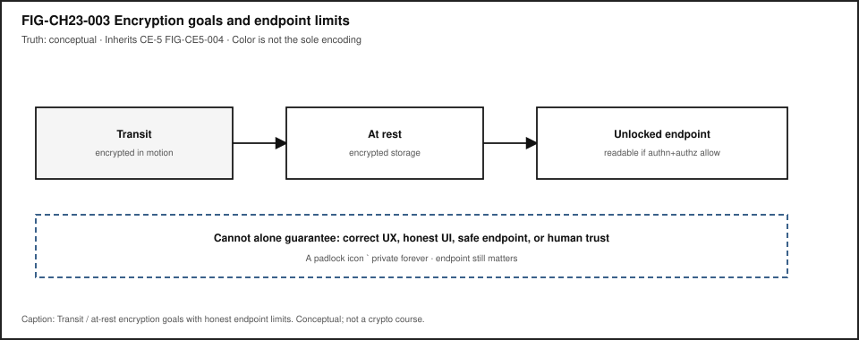

# Chapter 23 — Cybersecurity from Chip to Cloud {#ch23}

**Status:** `working_draft` · **Chapter ID:** `CH23`  
**Author:** Edmund Gunn, Jr.  
**Inheritance:** CE-5 identity / crypto-goal / UX-linked attack-surface slices; CH11 firmware/trust adjacency (link, do not duplicate)  
**Primary Try-it lab:** **LAB-TRUST-001** (publication-owned; link, do not duplicate)  
**Gate posture:** `GATE_3_IN_PROGRESS — READER_EVIDENCE_PENDING` (this chapter does **not** claim Gate 3 PASS)

---

## 1. The moment {#ch23-moment}

You sign in. The app looks connected. Then one of two ordinary things happens: an action you can see is refused—“you don’t have permission”—or a “verify it’s you” step interrupts a flow that felt already open. The glass still shows the product. The network icon may still look fine. Trust, from your seat, has already hitched.

From the outside it is tempting to collapse everything into one complaint: “security is broken,” or “the password worked so why can’t I do this?” Those complaints name real frustration. They also mix three different ideas: **identity** (who or what you claim to be), **authentication** (how believable that claim is for the risk), and **authorization** (what an authenticated actor may do). Login success is not a blank check [@nist_sp_800_63_4].

This chapter’s governing question is ordinary and honest:

> When a login succeeds but an action is denied—or a verify step appears while the app still looks connected—what trust conditions from chip to cloud still have to hold?

Part V starts security literacy here on purpose. Later chapters deepen privacy (CH24), responsibility and research ethics (CH27), and portfolio evidence (CH31). Chapter 11 already named firmware and early trust adjacency. This chapter does **not** replay a scare-list of vulnerabilities, and it does **not** teach attack recipes. It follows **principles and UX symptoms** along one chip-to-cloud path of conditions.

If you remember only one sentence after the first reading, remember this: **AuthN ≠ AuthZ—being recognized is not the same as being allowed.**

---

## 2. What you notice {#ch23-notice}

Before jargon, notice the human contract you already enforce with frustration.

You expect a successful sign-in to open a session that matches the risk of what you are about to do. You expect some actions to remain blocked even after login when your role does not include them. You expect a “verify it’s you” step to feel annoying but purposeful—not random theater. You expect recovery after lockout to remain possible without a single inaccessible channel. You expect that “connected” and “usable trust” can diverge.

Those expectations are not decorations. They *are* the product from the person’s point of view.

**Security feel is a perception produced by layered trust conditions—not by a single padlock or a single password field.**

What you may notice, without opening a debugger:

- login succeeds, then a specific button or page is denied,
- MFA or step-up verify interrupts a familiar flow,
- lockout after repeated attempts,
- a session that suddenly asks you to sign in again,
- recovery that only works through one channel (SMS-only, vision-only CAPTCHA, or a help desk you cannot reach).

What those symptoms do **not** prove by themselves: that the network failed, that “HTTPS means private forever,” that the cloud is evil, or that you should follow an exploit recipe to “test security.” High connectivity and broken trust can travel together. Diagnosis needs labeled observation versus inference—never unauthorized scanning of systems you do not own.

Optional seat comparison (safe): open a familiar account on a device you may use for learning. Note one action that works and one that is denied or asks for extra verify—*before* you invent a causal story. Prefer a personal sandbox or school account. Do not capture other people’s credentials, tokens, or private messages.

---

## 3. Exploded ecosystem {#ch23-ecosystem}

Usable trust is not a single object. It is a path of cooperating conditions. @fig-ch23-002 is the first-minute map for this chapter: chip/boot → firmware/OS → app/session → network → cloud/policy, with human UX symptoms attached to the same flows people actually use. Treat it as **conceptual**—not a claim that any manufactured revision wires trust the same way, and not a measured Device Quartet secure-boot capture. Chip/firmware measured secure-boot validation for research form factors remains **PHYSICAL_PENDING** [@src-hardware-quartet; @src-device-os-ce3].

{#fig-ch23-002 fig-cap="Chip/boot → firmware/OS → app/session → network → cloud/policy, with UX symptoms. Conceptual educational map; not measured secure-boot telemetry." fig-alt="Conceptual chip-to-cloud trust path with human UX symptoms attached."}

Walk the layers in ordinary language. Keep the same layers when vocabulary deepens. Do **not** treat this as a vulnerability encyclopedia.

### Human

You form intent: open a document, change a setting, approve a payment, ask an assistant. Eyes and hands judge whether the session still feels like *your* session—and whether denials and verifies are explainable.

### Chip / boot (conceptual)

Early hardware and boot stages can act as a **root of trust** for later software. This book names the idea without claiming a certified shipping secure-boot story for Device Quartet or gunnchOS products. Measured validation stays **PHYSICAL_PENDING** where product fact would be required [@src-device-os-ce3; @src-hardware-quartet]. Chapter 11 holds firmware adjacency in more depth—link, do not duplicate.

### Firmware / OS

Updates, isolation, and privilege boundaries shape what apps can claim about the machine underneath. Failures here often surface later as mysterious re-auth loops, broken sessions, or “the device no longer trusts itself”—not as a labeled “firmware” dialog.

### App / session

Tokens, cookies, roles, and permission prompts live where people can see them. Attack surfaces attach to the same flows: prompt boxes, permission dialogs, session tokens, update badges—UX-linked, not a scare collage (CE-5 inheritance via FIG-CE5-007 → FIG-CH23-002).

### Network

Transit protections matter for data in motion. A healthy path does not prove the endpoint is honest, and a padlock icon does not prove lifelong privacy. See @fig-ch23-003.

### Cloud / identity / policy

Identity providers, authorization services, logging, and recovery policies often sit off-device. The person experiences allow/deny, MFA, and restore—not the policy YAML.

### Society / recovery equity

Who can complete verify and recovery—and who is excluded by SMS-only, CAPTCHA-only, or unpaid support—belongs inside security literacy, not as an appendix afterthought.

---

## 4. Follow the signal {#ch23-signal}

Read the following as a logical story for one ordinary protected action—not as a claim that every product executes exactly one step at a time.

1. **Intent.** You decide to perform an action that matters (read, write, share, pay, administer).
2. **Identity claim.** The session asserts who or what is acting—a person, a device, a bot, a service account [@nist_sp_800_63_4].
3. **Authentication.** The system checks whether that claim is believable enough *for this risk*—password, passkey, MFA, hardware-backed proof, or a prior session assurance that has aged [@nist_sp_800_63_4].
4. **Authorization.** Separately, a policy decides whether *this* authenticated actor may do *this* action on *this* object. AuthN success does not skip AuthZ [@nist_sp_800_63_4].
5. **Crypto boundary (as needed).** Data may be protected in transit and/or at rest; endpoints that decrypt still matter (@fig-ch23-003).
6. **Effect or denial.** The UI allows, denies, or steps up verification. The person notices the outcome.
7. **Logging / retention (often invisible).** Systems may record the attempt for audit or support—privacy lifecycle territory deepened in CH24.
8. **Recovery path.** Lockout, lost-factor, or incident restore must return *usable* trust without theater alone.

{#fig-ch23-001 fig-cap="Identity claim → authentication assurance → authorization decision (Allow/Deny). Conceptual; inherits CE-5 FIG-CE5-003. AuthN ≠ AuthZ." fig-alt="Identity → authentication → authorization decision ladder."}

Failure branches are part of honesty:

- **AuthN fails** → cannot prove the claim (wrong factor, expired session, inaccessible MFA).
- **AuthZ fails** → claim is accepted, action still denied (role/attribute mismatch)—the chapter’s anchor moment.
- **Crypto boundary misunderstood** → padlock present while endpoint fully exposes content to the unlocked session.
- **Recovery fails** → technically “secure” lockout that strandes a person without an accessible path.

@fig-ch23-001 is the decision ladder you should be able to teach back without jargon inflation. Protection design principles—least privilege, fail-safe defaults, psychological acceptability—remain useful for connecting controls to usable experience [@saltzer_schroeder_1975]. This chapter cites those principles as **design constraints**, not as a vulnerability trivia dump.

---

## 5. Component cards {#ch23-components}

Each card is plain language + constraints + failure symptoms. None of these cards is a how-to for breaking systems.

### Identity

**What it is.** A claim about who or what an actor is—user account, device identity, service principal, bot.

**Constraints.** Claims need a namespace and lifecycle (create, change, retire). Identity alone never implies permission.

**Failure symptoms.** Wrong account selected; ghost accounts; “signed in as someone else”; confusing account switchers.

### Authentication (AuthN)

**What it is.** Checking whether an identity claim is believable enough for the risk of the next actions [@nist_sp_800_63_4].

**Constraints.** Assurance should match risk. Extra friction without purpose is theater. Accessible alternatives matter when factors exclude people.

**Failure symptoms.** Endless verify loops; MFA channel unreachable; session fixation *as a UX story* (mystery re-auth)—without teaching exploitation steps.

### Authorization (AuthZ)

**What it is.** Deciding what an authenticated actor may do [@nist_sp_800_63_4].

**Constraints.** Least privilege; fail-safe defaults [@saltzer_schroeder_1975]. Visible buttons that silently fail are a UX and equity problem.

**Failure symptoms.** Login works, action denied; feature visible but blocked; admin tools exposed to every desk role by mistake (design smell—not an invite to escalate privileges).

### Session / recovery

**What it is.** Continuity of trust across time, and paths back after lockout or incident.

**Constraints.** Recovery must remain usable and accessible. Incident restore should return usable trust—not security theater alone (CE-5 / CH23 Stability Contract).

**Failure symptoms.** Locked out with no second channel; restore that never re-enables legitimate work.

### Encryption boundary

**What it is.** Goals for unreadability without keys in transit and/or at rest—plus honest endpoint limits (@fig-ch23-003; CE-5 FIG-CE5-004 inheritance).

**Constraints.** Encryption often supports **confidentiality**, but **integrity** (detecting unwanted change) and **availability** (keeping usable access/recovery paths alive) are separate goals—the CIA trio is not a padlock icon. Encryption does not alone guarantee correct UX, honest UI, safe endpoint, or human trust.

**Failure symptoms.** “We use encryption” used as a conversation-stopper while unlocked endpoints still expose content; integrity or recovery failures blamed on “the network” alone.

{#fig-ch23-003 fig-cap="Transit and at-rest encryption with honest endpoint limits. Conceptual; inherits CE-5 FIG-CE5-004." fig-alt="Encryption transit / at-rest goals with unlocked-endpoint limits."}

### Chip-to-cloud trust path

**What it is.** Boot/firmware/OS/app/network/cloud controls treated as one chain of conditions (@fig-ch23-002).

**Constraints.** Do not overclaim measured secure boot for shipping research hardware while evidence is **PHYSICAL_PENDING** [@src-device-os-ce3; @src-hardware-quartet].

**Failure symptoms.** Connected glass with broken trust; update badges that people cannot interpret; local vs cloud path opacity (deeper in CE-5 / CH21 adjacency).

---

## 6. Stability contract {#ch23-stability}

The **Stability Contract** is a signature idea across this book:

> A user experience exists only while multiple hidden technical conditions remain within acceptable bounds.

For Chapter 23, a usable trusted session may require all of the following to stay “good enough” at once—qualitative bounds only; no invented numeric SLOs:

- authentication assurance appropriate to risk [@nist_sp_800_63_4],
- authorization decisions consistent with least privilege [@saltzer_schroeder_1975],
- crypto boundaries for transit/at-rest goals, with endpoint limits stated honestly,
- session and recovery paths remain usable and accessible,
- incident restore returns usable trust without security theater alone,
- the person can still tell allow, deny, and verify apart from “the network died.”

A system can remain **powered on and connected** while the **human experience of trust has already failed**.

Three separations matter here:

1. **Authentication** versus **authorization** — AuthN ≠ AuthZ [@nist_sp_800_63_4].
2. **Encryption in transit/at rest** versus **endpoint exposure** — padlock ≠ private forever; confidentiality ≠ integrity ≠ availability (@fig-ch23-003).
3. **Felt safety** versus **technical trust evidence** — feelings matter; they are not the same as controls and artifacts (CE-5 dual-ledger adjacency).

Commodity observations you collect with **LAB-TRUST-001** are *your* evidence for *your* routes and fixtures—not universal product certifications, and not Gate 3 reader validation. Device Quartet measured secure-boot claims remain **PHYSICAL_PENDING** [@src-hardware-quartet].

---

## 7. Try it {#ch23-try}

### LAB-TRUST-001 — Authn/authz literacy + trust restore adjacency (link)

**Observable question.** When the same practical question (or the same protected action) is answered or mediated by a local path versus a remote path, what can I observe about identity, privacy, and trust—without treating a model as a person who knows, and without building attacks?

This chapter’s Try It **inherits and links** the publication-owned CE-5 lab rather than inventing a duplicate `LAB-AUTH-001` package. Follow the full lab packet at [`labs/LAB-TRUST-001/`](../../../labs/LAB-TRUST-001/) (README, routes, fixtures, portfolio templates, `A11Y_PRIVACY_SAFETY.md`). Focus your write-up on the **AuthN vs AuthZ** columns and on which Stability Contract bounds stayed in bounds / out of bounds / unknown.

**WAIKE alignment note.** WAIKE accepted `main` (audit SHA `e97e74fc9bfb44b1cdc26b272dc4848264f15fe0` in the CH23 packet) hosts adjacent CYBERSECURITY competencies such as `lab_iam_rbac` and `lab_incident_playbook`, plus SOFTWARE_BUILDER `lab_authz`—**adjacent neighbors only** [@src-waike]. There is **no** exact WAIKE module ID for `LAB-TRUST-001` or CH23. Do not mint one.

**Prerequisites.** A computer or phone you may use for learning; modern browser optional; Python optional for local route; fixture route always available.

**Safety (non-negotiable).**

- Principles and UX symptoms only—**no** exploit steps, scanning, phishing kits, credential harvesting, or capture of others’ private data.
- Use only non-sensitive prompts; never paste real SSNs, health records, passwords, tokens, or private messages.
- Redact account identifiers before portfolio share.
- Prefer fixtures when live cloud accounts would expose personal history.
- No Device Quartet hardware is required. No invented EVT secure-boot numbers.
- Stop if a vendor warns about account lock risk; use the fixture path instead.

**Time estimate.** About 50 minutes for Explorer + Operator baseline.

#### Prediction

Before comparing routes, predict which path exposes more data leaving the device, and which bound is most likely to break first: locality, privacy lifecycle, identity continuity, authorization clarity, or uncertainty honesty.

#### Route L — Local / offline-capable (or fixture)

Complete Route L via `labs/LAB-TRUST-001/local_app/trust_sim.py`, the browser worksheet, or `fixtures/route_l_transcript.md`. Record observations only.

#### Route C — Cloud / remote (optional live) or fixture

Complete Route C live only if allowed and safe; otherwise use `fixtures/route_c_transcript.md`. Equity of completion requires the fixture path.

#### Route paper — No-device

Use printed/fixture materials when devices or bandwidth are unavailable.

#### Evidence (minimum)

- comparison table (observation vs inference columns),
- consent/trust card,
- dual-ledger note (human-trust feeling + technical-trust control),
- uncertainty note,
- teach-back sentence that includes **AuthN ≠ AuthZ**.

#### Pathway notes

| Pathway | LAB-TRUST-001 emphasis for CH23 |
|---|---|
| Explorer | Name identity vs authentication vs authorization in ordinary language. |
| Operator | Map lockouts, MFA prompts, and permission denials to likely domains. |
| Builder | Prefer the authz / consent card artifacts; prepare for Build it matrix. |
| Engineer | Mark component-boundary least privilege / fail-safe defaults on your sketch. |
| Researcher | State what evidence would support a trust claim without overclaiming. |
| Educator | Prefer fixture route; forbid offensive content; require text status labels. |

LAB-TRUST-001 is `FIXTURE_VALIDATED` as a publication lab design on its agent line—that is **not** Gate 3 human validation.

---

## 8. Build it {#ch23-build}

Extend LAB-TRUST-001 without turning Part V into an offensive security course.

### Explorer

Build a pocket card with three sentences: Identity, Authentication, Authorization. Each sentence must refuse one synonym trap (especially “login = permission”).

### Operator

Build a symptom → likely domain checklist: lockout, MFA prompt, permission denial, padlock-with-bad-feeling, recovery dead-end. End every row with “needs more evidence.”

### Builder

Fill an **authz matrix** for a toy service with three actors—desk user, reader-only guest, automation bot—and three actions—read, write, admin. Mark allow/deny. Document one least-privilege choice and one fail-safe default [@saltzer_schroeder_1975]. Do **not** implement privilege-escalation tests against live systems you do not own.

### Engineer

Sketch one component boundary (app ↔ identity provider, or app ↔ data store). Annotate AuthN check, AuthZ check, and crypto boundary (transit / at rest / endpoint). Apply least privilege and fail-safe defaults as labeled constraints—not as attack surface hunting.

### Researcher

State what evidence would support a trust claim (“this session restores usable trust after lockout”) including method, confounders, and uncertainty. Keep Device Quartet / gunnchOS measured secure-boot claims **PHYSICAL_PENDING** [@src-device-os-ce3; @src-hardware-quartet]. Do not invent Gate 3 PASS language.

### Educator

Adapt the authz matrix to a classroom with fixture-only completion. Provide keyboard / screen-reader notes for verify steps. Ban real credential capture as a learning activity.

---

## 9. Secure and include it {#ch23-secure-include}

### Security

Teach security as UX-linked conditions: permission dialogs (least privilege + psychological acceptability), verify steps (authentication assurance), feature blocked (authorization), strange login notices (session/account recovery UX), update badges (supply trust as literacy)—not a detached scare-list [@saltzer_schroeder_1975]. Out of scope for this book’s classroom path: exploit development, credential stuffing how-tos, privilege-escalation recipes, live social-engineering drills against third parties, jailbreak catalogs as entertainment, or binary reverse engineering.

### Privacy

Consent and lifecycle (collect → use → retain → share → delete/redact) sit beside AuthN/AuthZ. LAB-TRUST-001’s consent/trust card is the adjacent artifact; CH24 deepens privacy without treating this chapter as a law course.

### Accessibility

Auth and recovery paths must work with assistive technology, keyboard, and low bandwidth where feasible. SMS-only, CAPTCHA-only, or vision-only verify can exclude people—pair every “harder AuthN” discussion with accessible alternatives. Figures @fig-ch23-001 through @fig-ch23-003 encode meaning with shape, order, labels, and stroke pattern—not color alone. Automated checkers do not certify WCAG conformance.

### Equity

Not every learner has GPU credits, paid API keys, admin rights, or a private phone number for SMS MFA. Fixture routes are the baseline for fair completion. Device Quartet form factors are conceptual analogies here, not admission tickets [@src-hardware-quartet]. Avoid shaming older hardware or unpaid accounts; teach diagnosis that works with the machine and routes in front of you.

Shared family or school machines raise another equity edge: “just open the security settings” may require permissions a learner does not hold. Fixtures and verbal observation tables keep the pathway open without forcing privilege escalation. The Stability Contract fails for people first; pedagogy should not add a second failure by assuming identical tools—or by teaching attacks.

---

## 10. Career lens {#ch23-career}

Literacy from this chapter shows up in several neighboring roles—without employment promises:

| Role family | Portfolio evidence (safety-first) |
|---|---|
| Security engineer | UX-linked threat-model worksheet (principles + symptoms; **no** exploits) |
| IAM engineer | AuthN/AuthZ decision card; authz matrix for desk/reader/bot |
| SRE / incident responder | Restore-usable-trust playbook adjacency (detect → contain → recover as literacy) |
| Privacy-adjacent builder | Consent/trust card + redaction notes from LAB-TRUST-001 |
| Educator / mentor | Misconception drills: login ≠ authorization; padlock ≠ private forever |

WAIKE CYBERSECURITY labs such as `lab_iam_rbac` and `lab_incident_playbook` are **competency neighbors**, not renamed book lab IDs [@src-waike]. Completing artifacts does **not** guarantee employment.

Day-one habits transfer: write a prediction before you open a live account; label AuthN vs AuthZ; refuse brochure trust claims without a method; never confuse “I can attack it” with “I understand it.”

---

## 11. Check understanding {#ch23-check}

### Misconception probes

1. **“Login success means I am authorized for every action.”**  
   Counter: AuthN ≠ AuthZ; authorization is a separate decision [@nist_sp_800_63_4].

2. **“HTTPS / a padlock means private forever.”**  
   Counter: transit protection is not the whole story; unlocked endpoints still matter (@fig-ch23-003).

3. **“Security is a scare-list of vulnerabilities detached from UX.”**  
   Counter: this chapter attaches risks to flows people notice—permissions, verify, deny, recovery [@saltzer_schroeder_1975].

4. **“Encryption alone guarantees human trust.”**  
   Counter: encryption cannot alone guarantee correct UX, honest UI, or safe endpoints (@fig-ch23-003).

5. **“LAB-TRUST-001 is an official WAIKE module ID.”**  
   Counter: publication-owned lab; WAIKE links are adjacent only [@src-waike].

6. **“Device Quartet / gunnchOS measured secure boot is a shipping proven fact in this chapter.”**  
   Counter: **PHYSICAL_PENDING** / project evidence needed [@src-device-os-ce3; @src-hardware-quartet].

7. **“Gate 3 has PASSED for this manuscript.”**  
   Counter: `GATE_3_IN_PROGRESS — READER_EVIDENCE_PENDING`. Do not fabricate reader evidence.

### Teach-back (say it out loud)

> Identity is a claim. Authentication checks the claim for the risk. Authorization decides what you may do. Login can succeed while an action is denied. Encryption helps in transit and at rest, but endpoints still matter. Trust runs from chip to cloud as conditions—not as a single icon. We study principles and symptoms, not attack recipes.

### Pathway self-check

| Pathway | You can… |
|---|---|
| Explorer | Name identity vs authentication vs authorization in ordinary language. |
| Operator | Map lockouts, MFA prompts, and permission denials to likely domains. |
| Builder | Fill an authz matrix (desk/reader/bot) for a toy service. |
| Engineer | Apply least privilege / fail-safe defaults to a component boundary sketch. |
| Researcher | State what evidence would support a trust claim without overclaiming. |
| Educator | Facilitate AuthN ≠ AuthZ; keep labs fixture-safe and non-offensive. |

---

## References {#ch23-references}

Inline citations used in this chapter include @saltzer_schroeder_1975, @nist_sp_800_63_4, @src-waike, @src-device-os-ce3, and @src-hardware-quartet.

Selected authoritative sources for this chapter’s general technical explanations are listed in the bibliography (`book/references/references.bib`). Project-specific measured chip/boot claims remain **PHYSICAL_PENDING** and are cited separately from external literature. Living documents such as OWASP materials are **not** silently invented here; pin retrieval dates if promoted later (`owasp_living` remains SOURCE_NEEDED in the packet).

---

## 12. Glossary links {#ch23-glossary}

| Term | Plain link |
|---|---|
| Attack surface (UX-linked) | Places misuse can enter through the same flows people use |
| Identity | A claim about who/what an actor is |
| Authentication | Checking an identity claim is believable enough for the risk |
| Authorization | Deciding what an authenticated actor may do |
| Encryption goals and limits | Unreadability without keys; endpoints still matter |
| Chip-to-cloud trust path | Boot/firmware/OS/app/network/cloud controls as one chain of conditions |
| Protection design principles | Least privilege, fail-safe defaults, psychological acceptability, etc. |

Related earlier chapters: CH11 firmware/trust adjacency; CE-5 Concept Edition slices for identity/crypto/attack-surface. Related later chapters: privacy depth (CH24), responsibility (CH27), research portfolio honesty (CH31).

---

## Figure references (embedded above; accessibility metadata) {#ch23-figure-refs}

- **FIG-CH23-001** — `figures/architecture/fig-ch23-001-identity-authn-authz.svg` (inherits FIG-CE5-003)  
  - **A11y:** `figures/preproduction/accessibility/fig-ch23-001.yaml`
- **FIG-CH23-002** — `figures/ecosystem/fig-ch23-002-chip-to-cloud-trust.svg` (inherits FIG-CE5-007 pattern)  
  - **A11y:** `figures/preproduction/accessibility/fig-ch23-002.yaml`
- **FIG-CH23-003** — `figures/architecture/fig-ch23-003-encryption-boundaries.svg` (inherits FIG-CE5-004)  
  - **A11y:** `figures/preproduction/accessibility/fig-ch23-003.yaml`

Related CE-5 maps (optional cross-read, not required duplicates): `figures/preproduction/ce-05/fig-ce5-003.svg`, `fig-ce5-004.svg`, `fig-ce5-007.svg`.

---

## Claim footnotes used in this chapter {#ch23-claims}

| Claim ID | Teaching use | Evidence posture |
|---|---|---|
| CLM-CH23-001 — Saltzer & Schroeder principles as design constraints | least privilege / fail-safe / psychological acceptability | SOURCE_IDENTIFIED via @saltzer_schroeder_1975 |
| CLM-CH23-002 — Identity / AuthN / AuthZ separation | AuthN ≠ AuthZ | SOURCE_IDENTIFIED via @nist_sp_800_63_4 |
| CLM-CH23-003 — WAIKE CYBERSECURITY labs as adjacent neighbors | do not invent CH23 WAIKE IDs | SOURCE_IDENTIFIED via @src-waike |
| CLM-CH23-004 — Measured chip/firmware secure-boot product fact | research form-factor honesty | **PHYSICAL_PENDING** with @src-device-os-ce3 / @src-hardware-quartet |
