# Tap, Wait, and Wonder — KIDS-BABY

```
KIDS FULL WORKING MANUSCRIPT
NOT CHILD-VALIDATED
NOT PUBLICATION-READY
KIDS_CHILD_VALIDATION_PENDING
NO_CHILD_VALIDATION_EVIDENCE
NO_STANDARDS_CERTIFICATION_EVIDENCE
```

**Age band:** KIDS-BABY (guide ages 0–18 months)
**Cadence:** LOOK → POINT → NAME → WAIT → RESPOND → REPEAT
**Claim ceiling:** WORKING_DRAFT_COMPLETE units only — not publication-ready

> Adult-facing status banners and provenance live in companion YAML/MD files. Child-facing spread text must stay free of project-state meta, standards IDs, and source SHAs.

## How to use

Read together. Pause. Stop anytime. One idea per spread is enough.

## Caregiver / educator orientation

Follow attention; never force verbal performance. Observation notes only — no diagnostic claims.

## Cast (provisional — Character Bible Option A)

- Explorer: **Mira** · Builder: **Bolt** · Instructions: **Step** · Signals: **Ping** · Safety: **Shield**
- _Provisional Character Bible Option A — Signal Crew — not owner-locked IP._


## Safety / accessibility note

Caregiver mediation. No child accounts, no unnecessary PII, no hidden recording, no dark patterns, no fearmongering.

---

## Unit 1. Tap-Look Wait

**Strand:** Me & Technology
**Learning goal:** Notice change after contact

### Spread S01 — Look (LOOK)

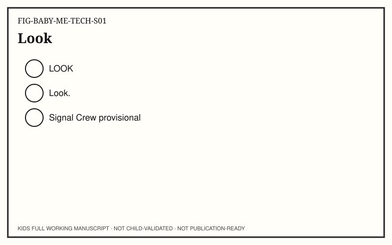

**Child-facing text:** Look.

**Try it:** Look together at one lit control.

**Talk together:** Follow gaze.

### Spread S02 — Hand (POINT)

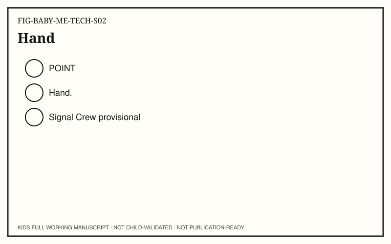

**Child-facing text:** Hand.

**Try it:** Notice hand near surface.

**Talk together:** Point hand then control.

### Spread S03 — Touch (NAME)


**Child-facing text:** Touch.

**Try it:** Finger meets surface.

**Talk together:** Name the touch.

### Spread S04 — Wait (WAIT)


**Child-facing text:** Wait…

**Try it:** Short wait before change.

**Talk together:** Pause. Do not rush.

### Spread S05 — Change (RESPOND)

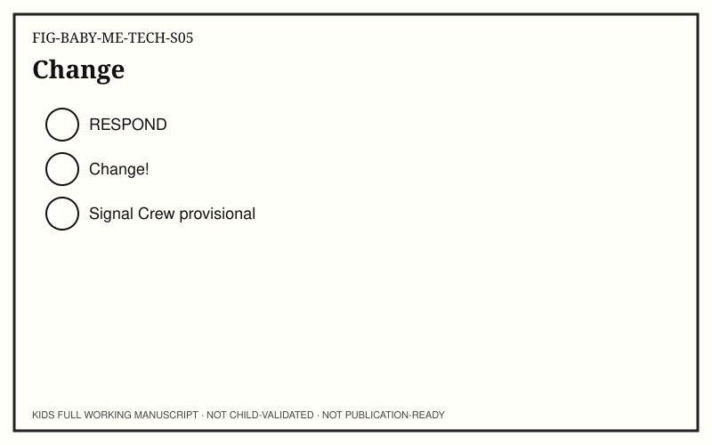

**Child-facing text:** Change!

**Try it:** Light or sound changes.

**Talk together:** Celebrate calmly.

### Spread S06 — Again (REPEAT)

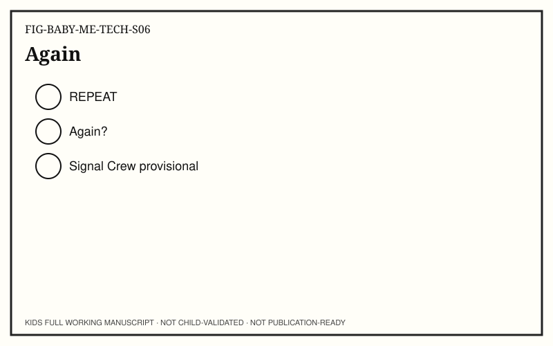

**Child-facing text:** Again?

**Try it:** Optional second touch.

**Talk together:** Offer; accept no.

## Unit 2. Awake Device

**Strand:** Inside the Machine
**Learning goal:** Dark to awake with adult

### Spread S01 — Dark (LOOK)


**Child-facing text:** Dark.

**Try it:** Device looks quiet.

**Talk together:** Soft voice.

### Spread S02 — Button (POINT)


**Child-facing text:** Button.

**Try it:** Point to wake control.

**Talk together:** Grown-up only press.

### Spread S03 — Wake (NAME)


**Child-facing text:** Wake.

**Try it:** Name the waking moment.

**Talk together:** No child disassembly.

### Spread S04 — Wait (WAIT)


**Child-facing text:** Wait…

**Try it:** Short boot wait.

**Talk together:** Keep calm.

### Spread S05 — Awake (RESPOND)


**Child-facing text:** Awake!

**Try it:** Screen or light wakes.

**Talk together:** Notice awake.

### Spread S06 — Again (REPEAT)


**Child-facing text:** Again?

**Try it:** Optional second wake.

**Talk together:** Stop anytime.

## Unit 3. Same Action Again

**Strand:** Instructions & Code
**Learning goal:** Repeat a known cause

### Spread S01 — Same (LOOK)


**Child-facing text:** Same.

**Try it:** Same control as before.

**Talk together:** Familiar place.

### Spread S02 — Here (POINT)

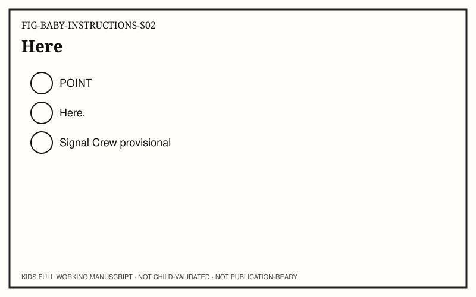

**Child-facing text:** Here.

**Try it:** Point to same spot.

**Talk together:** Match location.

### Spread S03 — Again (NAME)

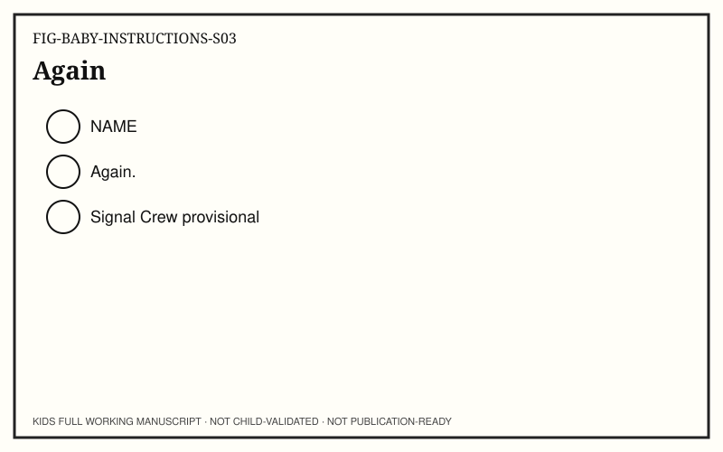

**Child-facing text:** Again.

**Try it:** Same action name.

**Talk together:** Repeat word softly.

### Spread S04 — Wait (WAIT)


**Child-facing text:** Wait…

**Try it:** Wait for same change.

**Talk together:** Predict quietly.

### Spread S05 — Same change (RESPOND)

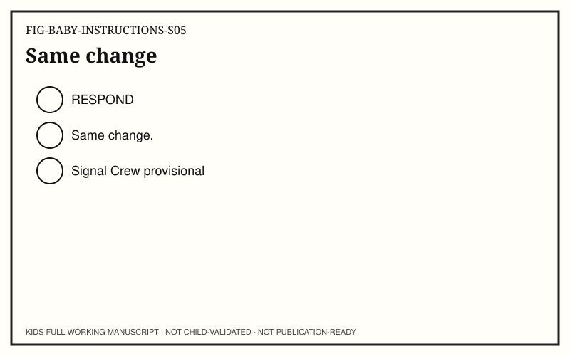

**Child-facing text:** Same change.

**Try it:** Same response returns.

**Talk together:** Smile; no quiz.

### Spread S06 — Once more (REPEAT)

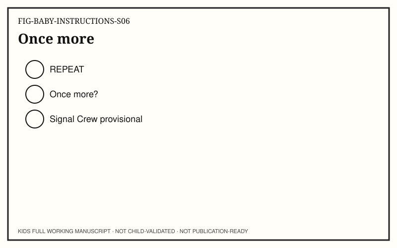

**Child-facing text:** Once more?

**Try it:** Optional repeat.

**Talk together:** Accept stop.

## Unit 4. Here to There

**Strand:** Messages & Connections
**Learning goal:** Gesture across space

### Spread S01 — Here (LOOK)

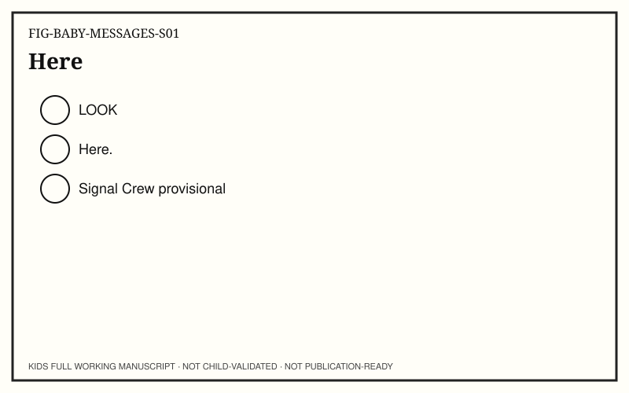

**Child-facing text:** Here.

**Try it:** Toy or phone here.

**Talk together:** One focal place.

### Spread S02 — There (POINT)

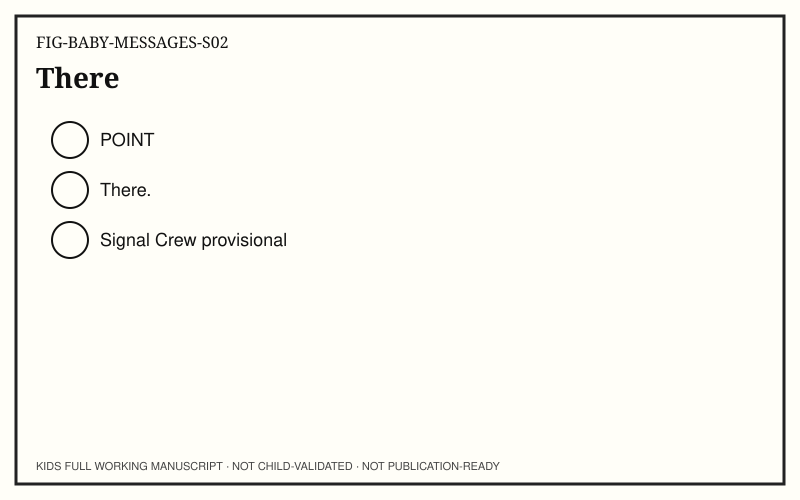

**Child-facing text:** There.

**Try it:** Point across room.

**Talk together:** Here → there.

### Spread S03 — Message (NAME)

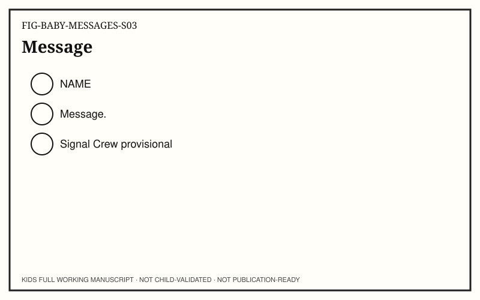

**Child-facing text:** Message.

**Try it:** Something can go.

**Talk together:** Simple name.

### Spread S04 — Wait (WAIT)


**Child-facing text:** Wait…

**Try it:** Short travel wait.

**Talk together:** Patience.

### Spread S05 — Arrived (RESPOND)

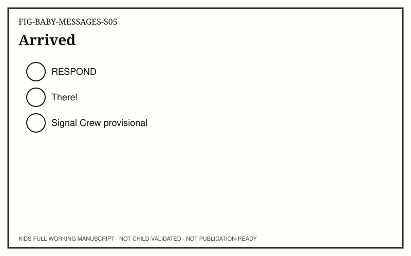

**Child-facing text:** There!

**Try it:** Change appears there.

**Talk together:** Celebrate path.

### Spread S06 — Again (REPEAT)


**Child-facing text:** Again?

**Try it:** Optional path again.

**Talk together:** Easy stop.

## Unit 5. Familiar Pattern

**Strand:** Data & Intelligence
**Learning goal:** Known face/sound comfort

### Spread S01 — Face (LOOK)

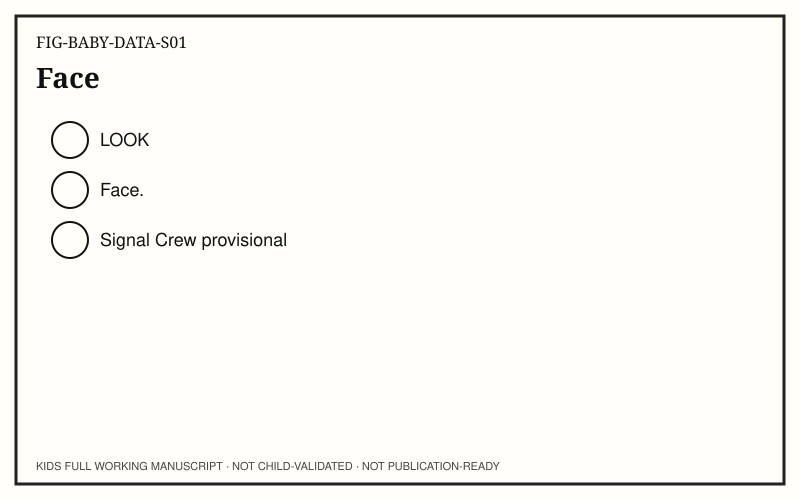

**Child-facing text:** Face.

**Try it:** Familiar face or shape.

**Talk together:** One focal image.

### Spread S02 — Match (POINT)

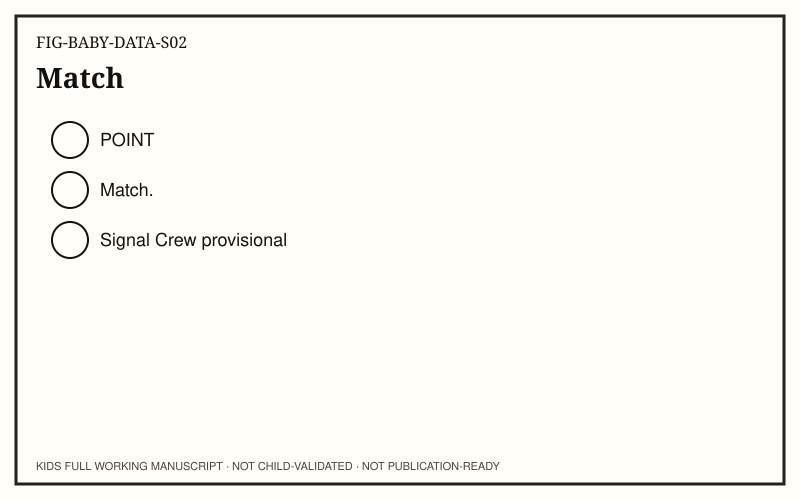

**Child-facing text:** Match.

**Try it:** Point to matching pair.

**Talk together:** No score.

### Spread S03 — Same (NAME)


**Child-facing text:** Same.

**Try it:** Name the familiar.

**Talk together:** Soft label.

### Spread S04 — Wait (WAIT)


**Child-facing text:** Wait…

**Try it:** Pause before reveal.

**Talk together:** No rush.

### Spread S05 — Known (RESPOND)

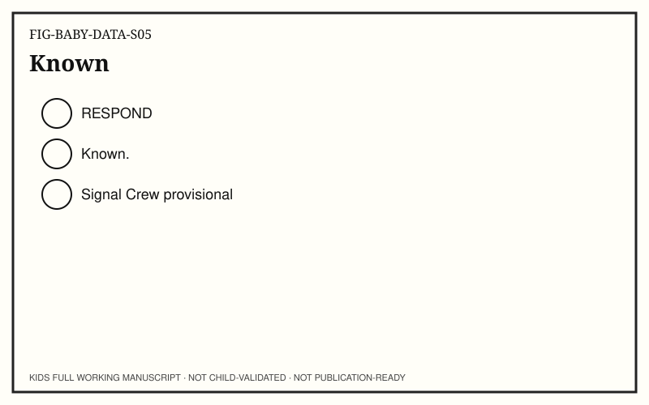

**Child-facing text:** Known.

**Try it:** Familiar pattern returns.

**Talk together:** Calm joy.

### Spread S06 — Again (REPEAT)


**Child-facing text:** Again?

**Try it:** Optional match.

**Talk together:** Accept no.

## Unit 6. Grown-Up Only

**Strand:** Safe, Private & Fair
**Learning goal:** Some controls are adult

### Spread S01 — Device (LOOK)


**Child-facing text:** Device.

**Try it:** Look at device with grown-up.

**Talk together:** Co-presence.

### Spread S02 — Grown-up (POINT)


**Child-facing text:** Grown-up.

**Try it:** Point to caregiver hands.

**Talk together:** Grown-up only.

### Spread S03 — Together (NAME)


**Child-facing text:** Together.

**Try it:** Name together time.

**Talk together:** No solo device.

### Spread S04 — Pause (WAIT)


**Child-facing text:** Pause.

**Try it:** Pause before new app.

**Talk together:** Ask first (adult).

### Spread S05 — Safe (RESPOND)

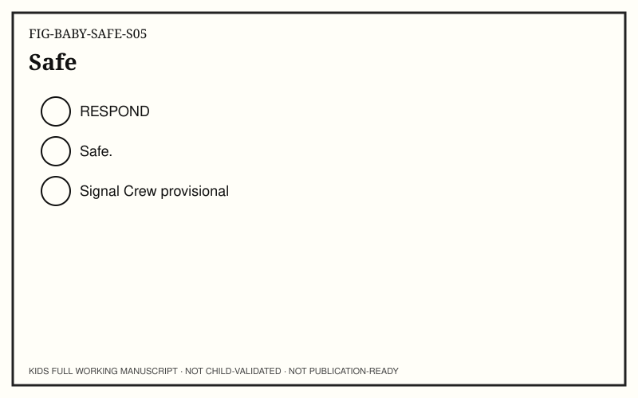

**Child-facing text:** Safe.

**Try it:** Grown-up chooses.

**Talk together:** Reassure.

### Spread S06 — Stop (REPEAT)

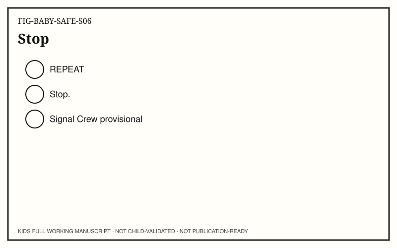

**Child-facing text:** Stop.

**Try it:** Practice stopping.

**Talk together:** Easy exit.

## Unit 7. Show What Happened

**Strand:** Build, Test & Share
**Learning goal:** Gesture teach-back

### Spread S01 — Show (LOOK)


**Child-facing text:** Show.

**Try it:** Look at what happened.

**Talk together:** Share gaze.

### Spread S02 — This (POINT)


**Child-facing text:** This.

**Try it:** Point to the change.

**Talk together:** Gesture teach-back.

### Spread S03 — Happened (NAME)


**Child-facing text:** Happened.

**Try it:** Name what changed.

**Talk together:** Adult words OK.

### Spread S04 — Wait (WAIT)


**Child-facing text:** Wait…

**Try it:** Pause for baby response.

**Talk together:** Follow lead.

### Spread S05 — Share (RESPOND)

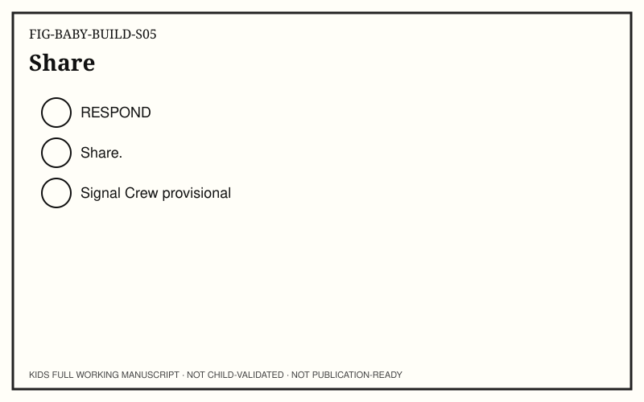

**Child-facing text:** Share.

**Try it:** Share the moment.

**Talk together:** No performance.

### Spread S06 — Again (REPEAT)

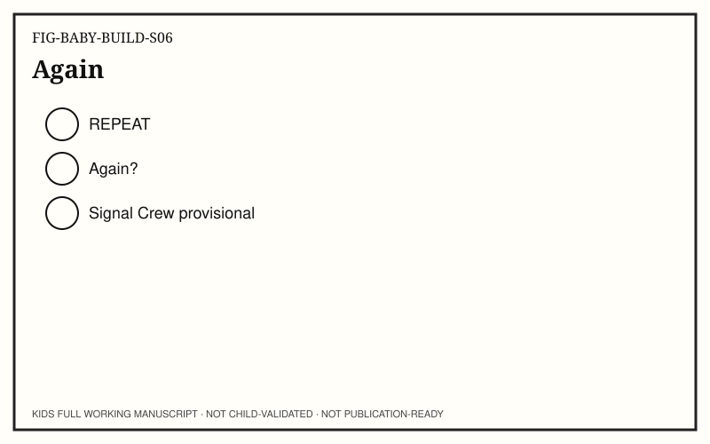

**Child-facing text:** Again?

**Try it:** Optional show again.

**Talk together:** Stop anytime.

---

## Back matter

### Age-appropriate glossary

See `GLOSSARY.yaml` (caregiver-facing definitions).

### Caregiver / educator extensions

See `CAREGIVER_EDUCATOR_NOTES.md`.

### Adult standards / evidence appendix

See `STANDARDS_TRACEABILITY.yaml` and `MEDIA_EVIDENCE_TRACEABILITY.yaml`. Not for child read-aloud.

### Accessibility alternatives

See `ACCESSIBILITY_NOTES.md`.

### Provenance

Adult-facing only. Working draft. Not child-validated. Not publication-ready.
