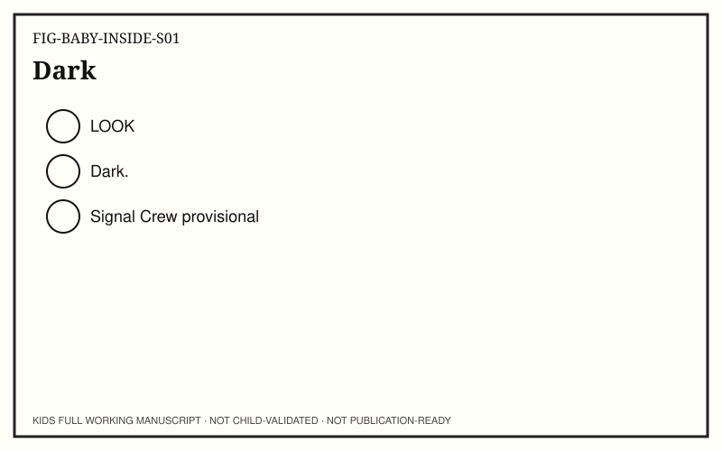
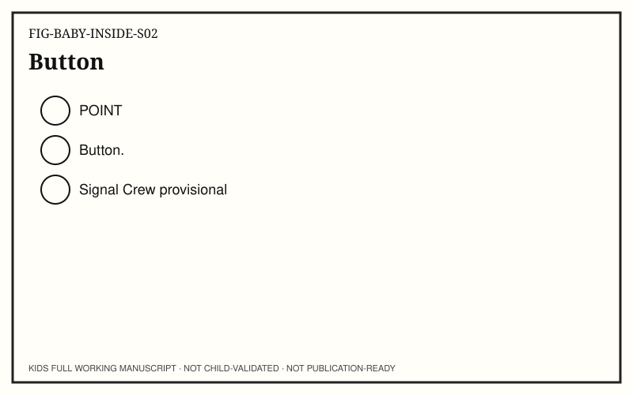
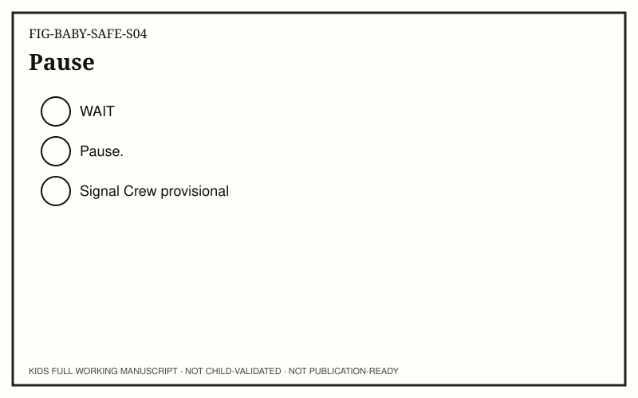
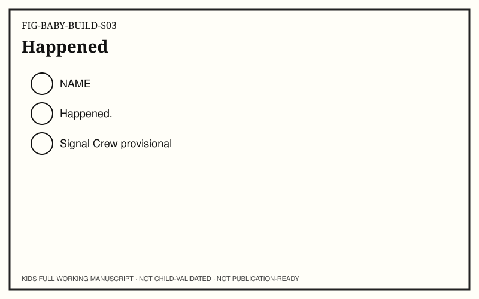

# KIDS-BABY Board Book Manuscript — Full Working Draft

```
KIDS DEVELOPMENTAL WORKING DRAFT
NOT CHILD-VALIDATED
NOT PUBLICATION-READY
KIDS_CHILD_VALIDATION_PENDING
NO_CHILD_VALIDATION_EVIDENCE
NO_STANDARDS_CERTIFICATION_EVIDENCE
Status ceiling: WORKING_DRAFT_COMPLETE
```

> Adult-facing truth banner only. Do not read banners aloud as story text.

## How to use this book

This is a **caregiver-mediated board book** for guide ages 0–18 months. Sit together. Follow the baby’s gaze. Keep sessions short. Stop anytime.

Cadence on every spread: **LOOK → POINT → NAME → WAIT → RESPOND → REPEAT**.

- Child-facing lines are sparse (often 1–3 words).
- No verbal performance is expected.
- Print-first. No screen dependency.
- One focal idea per spread.

## Caregiver orientation

You are the learning partner. Technology ideas appear only as gentle household cause→effect precursors: touch→change, dark→awake, here→there, familiar face, grown-up-only controls, show what happened.

Serve and return: notice → name → wait → respond. Delight over drill. Observation only — never screening or diagnosis.

## Provisional cast (Option A — Signal Crew)

Cast is **provisional** (Character Bible Option A). For KIDS-BABY, characters are soft background presence only — the dyad is primary.

| Role | Name | Baby-book presence |
| --- | --- | --- |
| Explorer | Mira | Quiet companion silhouette (optional) |
| Builder | Bolt | Occasional blocky shape near a device |
| Instructions | Step | Bead-step motif on repeat spreads |
| Signals | Ping | Dotted here→there trail |
| Safety | Shield | Open-hand pause near grown-up-only |

Narrative character art status: **ILLUSTRATION_DIRECTION_READY** (no final IP lock).

## Safety & accessibility note (adult)

- No child accounts, PII, hidden recording, or dark patterns.
- Adult mediation for every device action.
- Choke-safe props; cords and outlets are grown-up-only.
- High contrast; color never sole encoding; gaze/reach/sound alternatives.
- Easy stop on every unit.

---

## UNIT-BABY-ME-TECH-01 — Tap-Look Wait

**Strand:** STRAND-ME-TECH (Me & Technology)  
**Concept:** KCON-CH02-ONE-TAP  
**Learning goal (adult):** Notice change after contact  
**Unit status:** WORKING_DRAFT_COMPLETE

```
NOT CHILD-VALIDATED · NOT PUBLICATION-READY · KIDS_CHILD_VALIDATION_PENDING
```

### Spread S01 — Look (LOOK)



**Child-facing text:** Look.

**Try it:** Look together at one lit control.

**Talk together:** Follow gaze. Soft voice.

### Spread S02 — Hand (POINT)



**Child-facing text:** Hand.

**Try it:** Notice hand near the surface.

**Talk together:** Point to hand, then control.

### Spread S03 — Touch (NAME)



**Child-facing text:** Touch.

**Try it:** Finger meets surface.

**Talk together:** Name the touch when contact happens.

### Spread S04 — Wait (WAIT)



**Child-facing text:** Wait…

**Try it:** A short wait before change.

**Talk together:** Pause. Do not rush.

### Spread S05 — Change (RESPOND)



**Child-facing text:** Change!

**Try it:** Light or sound changes.

**Talk together:** Celebrate the change calmly.

### Spread S06 — Again (REPEAT)



**Child-facing text:** Again?

**Try it:** Optional second touch.

**Talk together:** Offer repeat; accept no.

### Spread S07 — Same (NAME)



**Child-facing text:** Same.

**Try it:** Repeat at same control.

**Talk together:** Same spot → same kind of change.

### Spread S08 — New (LOOK)

*Illustration direction:* `ILLUS-BABY-METECH-S08` — status **ILLUSTRATION_DIRECTION_READY** (no placeholder image).

**Direction:** One focal motif for “New.”; near-empty board; optional soft Signal Crew silhouette; high contrast; print-first.

**Child-facing text:** New.

**Try it:** Move attention to another control.

**Talk together:** Different control, different change.

### Spread S09 — Point (POINT)

*Illustration direction:* `ILLUS-BABY-METECH-S09` — status **ILLUSTRATION_DIRECTION_READY** (no placeholder image).

**Direction:** One focal motif for “Point.”; near-empty board; optional soft Signal Crew silhouette; high contrast; print-first.

**Child-facing text:** Point.

**Try it:** Point to what changed.

**Talk together:** Invite pointing; no demand for speech.

### Spread S10 — All done (RESPOND)


**Child-facing text:** All done.

**Try it:** Session ends positively.

**Talk together:** Easy stop. Close the book.

**Caregiver extension:** Caregiver-mediated look-point-touch-wait with one household control (lamp switch, music button). Stop anytime.

---

## UNIT-BABY-INSIDE-01 — Awake Device

**Strand:** STRAND-INSIDE (Inside the Machine)  
**Concept:** KCON-CH11-BOOT-TRUST  
**Learning goal (adult):** Dark to awake with adult  
**Unit status:** WORKING_DRAFT_COMPLETE

```
NOT CHILD-VALIDATED · NOT PUBLICATION-READY · KIDS_CHILD_VALIDATION_PENDING
```

### Spread S01 — Dark (LOOK)



**Child-facing text:** Dark.

**Try it:** Look at a dark, quiet device with adult.

**Talk together:** Soft voice. Follow gaze.

### Spread S02 — Here (POINT)



**Child-facing text:** Here.

**Try it:** Adult points to the power place.

**Talk together:** Point; no force.

### Spread S03 — Press (NAME)


**Child-facing text:** Press.

**Try it:** Adult presses once.

**Talk together:** Name the press.

### Spread S04 — Wait (WAIT)


**Child-facing text:** Wait…

**Try it:** Short wait together.

**Talk together:** Pause. Hold still.

### Spread S05 — Light (RESPOND)



**Child-facing text:** Light.

**Try it:** A light appears.

**Talk together:** Celebrate calmly.

### Spread S06 — Awake (NAME)



**Child-facing text:** Awake.

**Try it:** Device is awake with adult.

**Talk together:** Name awake.

### Spread S07 — Again (REPEAT)

*Illustration direction:* `ILLUS-BABY-INSIDE-S07` — status **ILLUSTRATION_DIRECTION_READY** (no placeholder image).

**Direction:** One focal motif for “Again?”; near-empty board; optional soft Signal Crew silhouette; high contrast; print-first.

**Child-facing text:** Again?

**Try it:** Optional off→on if baby still attending.

**Talk together:** Offer; accept no.

### Spread S08 — All done (RESPOND)


**Child-facing text:** All done.

**Try it:** Turn soft or off; end warmly.

**Talk together:** Easy stop.

**Caregiver extension:** Adult powers a familiar lamp or toy from dark to awake once. Baby watches; no independent handling of plugs.

---

## UNIT-BABY-INSTRUCTIONS-01 — Same Action Again

**Strand:** STRAND-INSTRUCTIONS (Instructions & Code)  
**Concept:** KCON-CH02-ONE-TAP  
**Learning goal (adult):** Repeat a known cause  
**Unit status:** WORKING_DRAFT_COMPLETE

```
NOT CHILD-VALIDATED · NOT PUBLICATION-READY · KIDS_CHILD_VALIDATION_PENDING
```

### Spread S01 — Look (LOOK)



**Child-facing text:** Look.

**Try it:** Return to a known control.

**Talk together:** Familiar spot.

### Spread S02 — Touch (NAME)



**Child-facing text:** Touch.

**Try it:** Same touch as before.

**Talk together:** Name the same action.

### Spread S03 — Wait (WAIT)


**Child-facing text:** Wait…

**Try it:** Wait for the known change.

**Talk together:** Pause.

### Spread S04 — Change (RESPOND)


**Child-facing text:** Change!

**Try it:** Same kind of change returns.

**Talk together:** Calm delight.

### Spread S05 — Again (REPEAT)



**Child-facing text:** Again.

**Try it:** Do the same action once more.

**Talk together:** Same steps.

### Spread S06 — Same (NAME)



**Child-facing text:** Same.

**Try it:** Notice sameness.

**Talk together:** Same action → same change.

### Spread S07 — Point (POINT)

*Illustration direction:* `ILLUS-BABY-INSTR-S07` — status **ILLUSTRATION_DIRECTION_READY** (no placeholder image).

**Direction:** One focal motif for “Point.”; near-empty board; optional soft Signal Crew silhouette; high contrast; print-first.

**Child-facing text:** Point.

**Try it:** Point to the place again.

**Talk together:** Invite; no demand.

### Spread S08 — All done (RESPOND)


**Child-facing text:** All done.

**Try it:** End while interest is kind.

**Talk together:** Easy stop.

**Caregiver extension:** Repeat one known household cause→effect twice only. Emphasize sameness, not novelty.

---

## UNIT-BABY-MESSAGES-01 — Here to There

**Strand:** STRAND-MESSAGES (Messages & Connections)  
**Concept:** KCON-CH16-PACKETS-INTERNET  
**Learning goal (adult):** Gesture across space  
**Unit status:** WORKING_DRAFT_COMPLETE

```
NOT CHILD-VALIDATED · NOT PUBLICATION-READY · KIDS_CHILD_VALIDATION_PENDING
```

### Spread S01 — Here (LOOK)



**Child-facing text:** Here.

**Try it:** Look at something near.

**Talk together:** Name here.

### Spread S02 — Point (POINT)



**Child-facing text:** Point.

**Try it:** Point from near object.

**Talk together:** Soft point.

### Spread S03 — There (NAME)



**Child-facing text:** There.

**Try it:** Look across to farther spot.

**Talk together:** Name there.

### Spread S04 — Wait (WAIT)



**Child-facing text:** Wait…

**Try it:** A slow hand path in air.

**Talk together:** Slow path.

### Spread S05 — Wave (RESPOND)



**Child-facing text:** Wave.

**Try it:** A gentle wave from here toward there.

**Talk together:** Celebrate the path.

### Spread S06 — Again (REPEAT)

*Illustration direction:* `ILLUS-BABY-MSG-S06` — status **ILLUSTRATION_DIRECTION_READY** (no placeholder image).

**Direction:** One focal motif for “Again?”; near-empty board; optional soft Signal Crew silhouette; high contrast; print-first.

**Child-facing text:** Again?

**Try it:** Optional second here→there gesture.

**Talk together:** Offer; accept no.

### Spread S07 — Here (NAME)


**Child-facing text:** Here.

**Try it:** Return attention to near.

**Talk together:** Here again.

### Spread S08 — All done (RESPOND)



**Child-facing text:** All done.

**Try it:** Settle close.

**Talk together:** Easy stop.

**Caregiver extension:** Gesture a soft toy or gaze from near (here) to across the room (there). No screens, no messaging apps.

---

## UNIT-BABY-DATA-01 — Familiar Pattern

**Strand:** STRAND-DATA (Data & Intelligence)  
**Concept:** KCON-CH21-DATA-AI  
**Learning goal (adult):** Known face/sound comfort  
**Unit status:** WORKING_DRAFT_COMPLETE

```
NOT CHILD-VALIDATED · NOT PUBLICATION-READY · KIDS_CHILD_VALIDATION_PENDING
```

### Spread S01 — Face (LOOK)

*Illustration direction:* `ILLUS-BABY-DATA-S01` — status **ILLUSTRATION_DIRECTION_READY** (no placeholder image).

**Direction:** One focal motif for “Face.”; near-empty board; optional soft Signal Crew silhouette; high contrast; print-first.

**Child-facing text:** Face.

**Try it:** Look at a known caregiver face.

**Talk together:** Soft mutual gaze.

### Spread S02 — You (NAME)

*Illustration direction:* `ILLUS-BABY-DATA-S02` — status **ILLUSTRATION_DIRECTION_READY** (no placeholder image).

**Direction:** One focal motif for “You.”; near-empty board; optional soft Signal Crew silhouette; high contrast; print-first.

**Child-facing text:** You.

**Try it:** Name the familiar person.

**Talk together:** Warm label.

### Spread S03 — Same (POINT)


**Child-facing text:** Same.

**Try it:** Same face again.

**Talk together:** Familiar pattern.

### Spread S04 — Wait (WAIT)



**Child-facing text:** Wait…

**Try it:** A familiar pause in a known song/rhyme.

**Talk together:** Predictable wait.

### Spread S05 — Soft (RESPOND)

*Illustration direction:* `ILLUS-BABY-DATA-S05` — status **ILLUSTRATION_DIRECTION_READY** (no placeholder image).

**Direction:** One focal motif for “Soft.”; near-empty board; optional soft Signal Crew silhouette; high contrast; print-first.

**Child-facing text:** Soft.

**Try it:** Familiar soft sound or smile returns.

**Talk together:** Comfort response.

### Spread S06 — Again (REPEAT)

*Illustration direction:* `ILLUS-BABY-DATA-S06` — status **ILLUSTRATION_DIRECTION_READY** (no placeholder image).

**Direction:** One focal motif for “Again?”; near-empty board; optional soft Signal Crew silhouette; high contrast; print-first.

**Child-facing text:** Again?

**Try it:** Offer the known rhyme once more.

**Talk together:** Accept no.

### Spread S07 — Known (NAME)

*Illustration direction:* `ILLUS-BABY-DATA-S07` — status **ILLUSTRATION_DIRECTION_READY** (no placeholder image).

**Direction:** One focal motif for “Known.”; near-empty board; optional soft Signal Crew silhouette; high contrast; print-first.

**Child-facing text:** Known.

**Try it:** Return to the familiar face.

**Talk together:** Known is comfort.

### Spread S08 — All done (RESPOND)



**Child-facing text:** All done.

**Try it:** Cuddle close; end.

**Talk together:** Easy stop.

**Caregiver extension:** Repeat a familiar face + song pattern. Emphasize known comfort — not sorting, not AI, not cameras.

---

## UNIT-BABY-SAFE-01 — Grown-Up Only

**Strand:** STRAND-SAFE (Safe, Private & Fair)  
**Concept:** KCON-CH23-CYBERSECURITY  
**Learning goal (adult):** Some controls are adult  
**Unit status:** WORKING_DRAFT_COMPLETE

```
NOT CHILD-VALIDATED · NOT PUBLICATION-READY · KIDS_CHILD_VALIDATION_PENDING
```

### Spread S01 — Look (LOOK)



**Child-facing text:** Look.

**Try it:** Look at a control that is adult-only.

**Talk together:** Calm look.

### Spread S02 — Grown-up (NAME)


**Child-facing text:** Grown-up.

**Try it:** Name that grown-ups use this.

**Talk together:** Clear boundary.

### Spread S03 — Hands (POINT)



**Child-facing text:** Hands.

**Try it:** Adult hands on the control.

**Talk together:** Point to adult hands.

### Spread S04 — Wait (WAIT)



**Child-facing text:** Wait…

**Try it:** Baby waits; adult acts.

**Talk together:** Waiting is ok.

### Spread S05 — Soft (RESPOND)

*Illustration direction:* `ILLUS-BABY-SAFE-S05` — status **ILLUSTRATION_DIRECTION_READY** (no placeholder image).

**Direction:** One focal motif for “Soft.”; near-empty board; optional soft Signal Crew silhouette; high contrast; print-first.

**Child-facing text:** Soft.

**Try it:** Redirect to a baby-safe soft object.

**Talk together:** Warm redirect.

### Spread S06 — Yours (NAME)

*Illustration direction:* `ILLUS-BABY-SAFE-S06` — status **ILLUSTRATION_DIRECTION_READY** (no placeholder image).

**Direction:** One focal motif for “Yours.”; near-empty board; optional soft Signal Crew silhouette; high contrast; print-first.

**Child-facing text:** Yours.

**Try it:** Name a baby-safe object as yours.

**Talk together:** Positive ownership.

### Spread S07 — Pause (REPEAT)



**Child-facing text:** Pause.

**Try it:** Practice pause near adult-only thing.

**Talk together:** Pause together.

### Spread S08 — All done (RESPOND)


**Child-facing text:** All done.

**Try it:** Move to play space.

**Talk together:** Easy stop.

**Caregiver extension:** Show one adult-only control (outlet cover area, phone lock) then redirect to a baby-safe toy. Boundary without fear.

---

## UNIT-BABY-BUILD-01 — Show What Happened

**Strand:** STRAND-BUILD (Build, Test & Share)  
**Concept:** KCON-CH31-CAPSTONE-TEACH  
**Learning goal (adult):** Gesture teach-back  
**Unit status:** WORKING_DRAFT_COMPLETE

```
NOT CHILD-VALIDATED · NOT PUBLICATION-READY · KIDS_CHILD_VALIDATION_PENDING
```

### Spread S01 — Look (LOOK)



**Child-facing text:** Look.

**Try it:** Look back at a favorite earlier moment.

**Talk together:** Soft review.

### Spread S02 — Point (POINT)



**Child-facing text:** Point.

**Try it:** Point to what happened.

**Talk together:** Invite point.

### Spread S03 — Show (NAME)



**Child-facing text:** Show.

**Try it:** Caregiver shows the action again slowly.

**Talk together:** Model show.

### Spread S04 — Wait (WAIT)


**Child-facing text:** Wait…

**Try it:** Wait for baby gaze or gesture.

**Talk together:** No demand.

### Spread S05 — That (RESPOND)

*Illustration direction:* `ILLUS-BABY-BUILD-S05` — status **ILLUSTRATION_DIRECTION_READY** (no placeholder image).

**Direction:** One focal motif for “That!”; near-empty board; optional soft Signal Crew silhouette; high contrast; print-first.

**Child-facing text:** That!

**Try it:** Celebrate any gesture toward the moment.

**Talk together:** Any show counts.

### Spread S06 — Again (REPEAT)

*Illustration direction:* `ILLUS-BABY-BUILD-S06` — status **ILLUSTRATION_DIRECTION_READY** (no placeholder image).

**Direction:** One focal motif for “Again?”; near-empty board; optional soft Signal Crew silhouette; high contrast; print-first.

**Child-facing text:** Again?

**Try it:** Optional one more show.

**Talk together:** Accept no.

### Spread S07 — Together (NAME)

*Illustration direction:* `ILLUS-BABY-BUILD-S07` — status **ILLUSTRATION_DIRECTION_READY** (no placeholder image).

**Direction:** One focal motif for “Together.”; near-empty board; optional soft Signal Crew silhouette; high contrast; print-first.

**Child-facing text:** Together.

**Try it:** Share the memory together.

**Talk together:** Dyad close.

### Spread S08 — All done (RESPOND)



**Child-facing text:** All done.

**Try it:** Close the book warmly.

**Talk together:** Easy stop.

**Caregiver extension:** Gesture teach-back of one earlier cause→effect. Caregiver may note favorite page privately offline — optional.

---

## Back matter

### Age-appropriate glossary (caregiver-facing)

Terms below are for adults mediating the book. Do not require babies to say them.

- **cause and effect:** Something happens after a touch or action. _(unit: UNIT-BABY-ME-TECH-01)_
- **wait:** A short pause before a change. _(unit: UNIT-BABY-ME-TECH-01)_
- **awake device:** A familiar device that was dark and is now on, with an adult. _(unit: UNIT-BABY-INSIDE-01)_
- **same action:** Doing a known touch again to see the same kind of change. _(unit: UNIT-BABY-INSTRUCTIONS-01)_
- **here to there:** Attention or a gesture moving from near to farther away. _(unit: UNIT-BABY-MESSAGES-01)_
- **familiar pattern:** A known face, sound, or rhyme that brings comfort. _(unit: UNIT-BABY-DATA-01)_
- **grown-up only:** A control or place babies do not use; adults handle it. _(unit: UNIT-BABY-SAFE-01)_
- **show what happened:** A gesture or gaze that points back to a moment together. _(unit: UNIT-BABY-BUILD-01)_
- **serve and return:** Caregiver notices, names, waits, and responds to baby cues. _(unit: front-matter)_
- **easy stop:** Ending the session as soon as interest fades or baby cues stop. _(unit: all-units)_

### Caregiver extensions

1. Repeat a favorite unit on another day — sameness is the lesson.
2. Prefer household objects over apps.
3. Keep a private offline note of which spread brought delight (optional).
4. Never turn spreads into tests or milestones checklists.

### Adult standards & evidence appendix

Standards statuses are honest editorial crosswalks from `kids/curriculum/KIDS_SCOPE_AND_SEQUENCE.yaml` only:

- `UNIT-BABY-ME-TECH-01` → `MAP-UNIT-BABY-ME-TECH-01` — **ADJACENT** (not certification).
- `UNIT-BABY-INSIDE-01` → `MAP-UNIT-BABY-INSIDE-01` — **ADJACENT** (not certification).
- `UNIT-BABY-INSTRUCTIONS-01` → `MAP-UNIT-BABY-INSTRUCTIONS-01` — **ADJACENT** (not certification).
- `UNIT-BABY-MESSAGES-01` → `MAP-UNIT-BABY-MESSAGES-01` — **NOT_YET_MAPPED** (not certification).
- `UNIT-BABY-DATA-01` → `MAP-UNIT-BABY-DATA-01` — **ADJACENT** (not certification).
- `UNIT-BABY-SAFE-01` → `MAP-UNIT-BABY-SAFE-01` — **ADJACENT** (not certification).
- `UNIT-BABY-BUILD-01` → `MAP-UNIT-BABY-BUILD-01` — **ADJACENT** (not certification).

Media design evidence IDs are drawn from `kids/research/CHILD_MEDIA_EVIDENCE_REGISTER.yaml` (CME-*). No child-validation evidence exists for this manuscript.

### Accessibility alternatives

- Gaze, reach, stilling, or smile count as participation.
- Offer sound or tactile routes when vision is limited.
- Keep high contrast; pair color with shape/position labels.
- Caregiver may narrate without any baby verbal reply.
- Stop immediately on distress cues.

### WAIKE (caregiver / adult-facing only)

Audited WAIKE SHA: `e97e74fc9bfb44b1cdc26b272dc4848264f15fe0` (`kids/waike/KIDS_WAIKE_CROSSWALK.yaml`).

Do not invent kids WAIKE course IDs. Existing honest adjacencies only:

- `KCON-CH02-ONE-TAP` → SOFTWARE_BUILDER / GAME_DEV_INTERACTIVE / COMPUTER_NETWORKING / EMBEDDED_PROTOTYPING (**adjacent**)
- `KCON-CH21-DATA-AI` → AI_ML_EDGE (**adjacent**)
- `KCON-CH23-CYBERSECURITY` → CYBERSECURITY (**adjacent**)
- `KCON-CH11-BOOT-TRUST`, `KCON-CH16-PACKETS-INTERNET`, `KCON-CH31-CAPSTONE-TEACH` → **no-map** on audited SHA (precursor only; not exact modules)
- `ONE_TAP_PILOT_AS_WAIKE_MODULE` → **no-map**
- `EARLY_LEARNING_PRECURSOR_LAYER` → **proposed** (future upstream discussion only)

Kids Edition is not a certified WAIKE track.

### Provenance

- Age band architecture: `kids/age-bands/KIDS-BABY.md`
- Scope & sequence units: `kids/curriculum/KIDS_SCOPE_AND_SEQUENCE.yaml`
- ONE TAP pilot anchor expanded into UNIT-BABY-ME-TECH-01: `kids/pilots/ONE_TAP/KIDS-BABY`
- Character Bible Option A provisional: `kids/characters/CHARACTER_BIBLE.md`
- Media evidence register: `kids/research/CHILD_MEDIA_EVIDENCE_REGISTER.yaml`
- WAIKE crosswalk SHA e97e74fc9bfb44b1cdc26b272dc4848264f15fe0
- Claim ceiling: WORKING_DRAFT_COMPLETE — NOT PUBLICATION-READY — NOT CHILD-VALIDATED

