# Systems We Can Learn — KIDS-ELEM1

```
KIDS FULL WORKING MANUSCRIPT
NOT CHILD-VALIDATED
NOT PUBLICATION-READY
KIDS_CHILD_VALIDATION_PENDING
NO_CHILD_VALIDATION_EVIDENCE
NO_STANDARDS_CERTIFICATION_EVIDENCE
```

**Working title:** Systems We Can Learn  
**Age guide:** Kindergarten–Grade 2  
**Cadence:** OBSERVE → PREDICT → TEST → MEASURE → EXPLAIN → BUILD → SECURE → REFLECT → TEACH  
**Cast (provisional — Character Bible Option A “Signal Crew”):** Mira (explorer) · Bolt (builder/hardware) · Step (instructions/software) · Ping (signals/network) · Shield (safety/privacy/fair)

_Characters support learning; they do not replace explanation. Names and looks are provisional until owner lock._

---

## How to use this book

Read one unit at a time. Start by noticing, then try a short test, then explain what the evidence shows. Keep paper for an Evidence Folder. Stop anytime. Adults coach safety and fair access. This book teaches real technology ideas with pictures, diagrams, and try-its — it is not a word list to memorize.

## Caregiver / educator orientation

Coach observation before vocabulary. Separate “I saw” from “I think.” Prefer portfolio process over ranking. No child accounts, no collecting personal data for this draft, no unsupervised messaging. Full facilitator notes live in adult-facing companions — not in the child pages below.

## Safety and accessibility note

Ask before sharing names, photos, or school details. Locks and passwords are tools, not toys to trade. Different tools can help different learners — that is fair, not “extra.” High-contrast diagrams pair labels with shapes. Easy stop is always OK.

---

# Unit 1 — Systems Not Screens

**Focus idea:** Technology is a system of people, parts, and rules — not only a screen. One tap can stay local, or it can send a message.

## OBSERVE

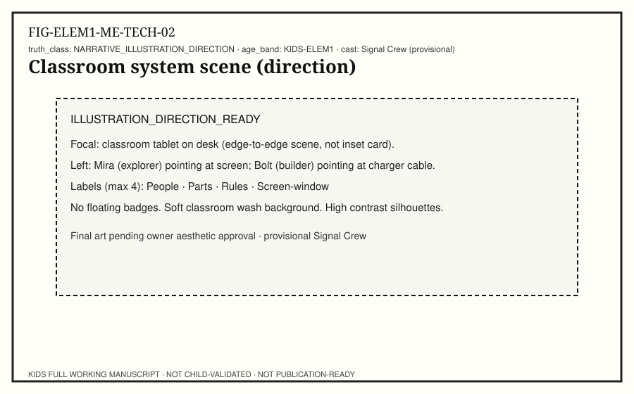

**Child-facing text:** Mira and Bolt sit with a classroom tablet. Look past the glass. Who is using it? What parts touch the world — screen, speakers, charger? What rules decide what is allowed? The bright screen is a window into a bigger system. Draw or write three labels: People · Parts · Rules.

**Try it:** Point to one person, one part, and one rule around a real device (with adult OK).

## PREDICT

**Child-facing text:** Mira taps a lamp icon that only changes this tablet’s brightness. Then she taps Refresh on a class page that sometimes waits. Predict: which tap finishes on this device alone? Which tap might need a message to leave the room? Mark each prediction with a star, not a grade.

**Try it:** Write two predictions before the next test.

## TEST

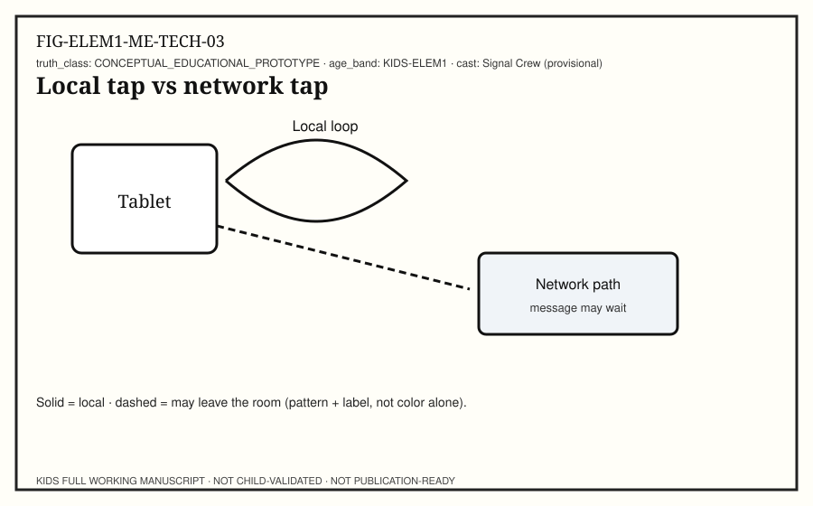

**Child-facing text:** Test time with Ping watching the paths. Watch the lamp tap: does the change arrive right away on this device? Watch Refresh: does anything wait? Classify each tap as local or network-ish. If you are unsure, draw a question mark — that is honest science.

**Try it:** Classify two taps; label guesses clearly.

## MEASURE

**Child-facing text:** Measure with simple marks, not fancy clocks. Clap once when the lamp looks brighter. Clap again when Refresh finishes showing new words (if it does). Count the claps between start and finish for each tap. Which job needed more waiting? Waiting is a clue that a message may be traveling.

**Try it:** Record clap-counts or tallies for both taps.

## EXPLAIN

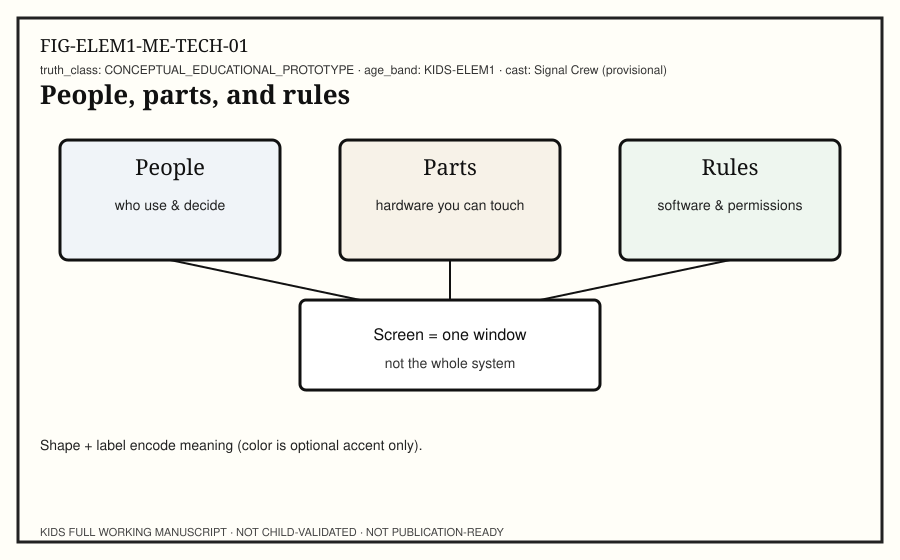

**Child-facing text:** Explain the system, not only the screen. Hardware parts sense the touch. Software rules decide what happens next. People choose when to tap and what is OK to share. A local tap can finish on this device. A network tap may send a message out and wait for an answer. Instant highlight does not always mean “finished everywhere.”

**Try it:** Tell the story of one tap using People · Parts · Rules.

## BUILD

**Child-facing text:** Build a paper system map. Draw the tablet as one box. Add arrows to people, parts, and rules. Add a short loop for a local tap and a longer path for a network tap. Keep this page for your Evidence Folder.

**Try it:** Finish a one-page system map.

## SECURE

**Child-facing text:** Shield’s checklist for this unit: use a school-safe or caregiver-approved device; do not install unknown apps; ask before sharing your name, photo, or school; stop if anyone feels rushed. Systems include safety rules on purpose.

**Try it:** Read the checklist aloud and check each line.

## REFLECT

**Child-facing text:** Misconception check: “The screen is the computer.” Evidence from your map shows people, parts, and rules around the window. Another slogan to rethink: “Every tap goes to the internet.” Your local lamp tap is evidence against that slogan. Kind discussion — no shame.

**Try it:** Rewrite one slogan with evidence from your test.

## TEACH

**Child-facing text:** Teach a partner or caregiver: technology is a system, and the screen is one part. Use Mira to notice, Bolt for parts, Step for rules, Ping for optional messages, Shield for pause-and-check. Stop anytime. Practice, not ranking.

**Try it:** Teach-back the system idea in your own words.

---

# Unit 2 — Inside the Box

**Focus idea:** Inside a device, different parts do different jobs: the CPU follows steps now, memory holds working notes, storage keeps things for later.

## OBSERVE

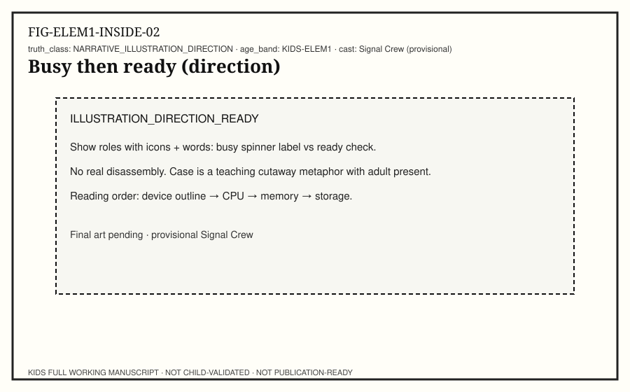

**Child-facing text:** Bolt shows a teaching cutaway — a picture of insides, not a real teardown. Watch a device go busy, then ready. What clues tell you work is happening? Lights, spinners, sounds, or heat a grown-up notices? Observe first. Do not open cases.

**Try it:** Watch one busy→ready moment and note two clues.

## PREDICT

**Child-facing text:** Predict which inside role handles each job: (1) following steps right now, (2) holding notes for this job, (3) keeping a drawing for tomorrow. Match to CPU, memory, or storage before you see the diagram answers.

**Try it:** Write three matches as predictions.

## TEST

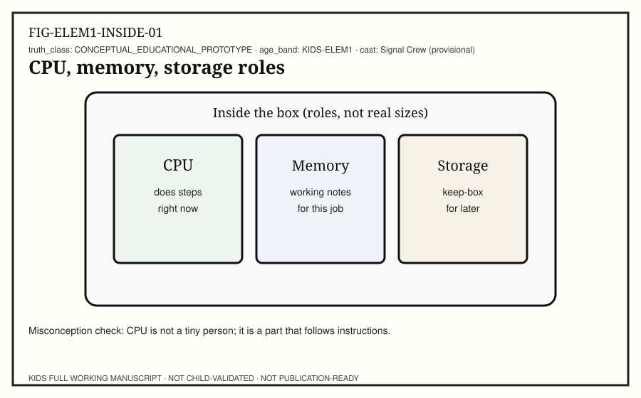

**Child-facing text:** Test your matches with the role diagram. CPU does steps now. Memory is working notes for the job in progress. Storage is the keep-box for later. Act out with cards: Mira hands Step a “do this next” card (CPU), Bolt holds sticky notes (memory), Ping files a paper in a folder (storage).

**Try it:** Sort three job cards into the three roles.

## MEASURE

**Child-facing text:** Measure a tiny difference: open a small drawing you already saved (storage→working), then make one new scribble (CPU + memory), then save again (back to storage). Tally how many adult-approved steps each path needed. Numbers here are counts of steps, not “better scores.”

**Try it:** Tally steps for open · edit · save.

## EXPLAIN

**Child-facing text:** Explain without magic. The CPU is not a tiny person. It is a part that follows instructions, one after another — and sometimes more than one job can be in progress on a bigger machine. Memory is for now. Storage is for later. If power stops, working notes can vanish while keep-box files may still be there — adults can help you check safely.

**Try it:** Explain CPU vs memory vs storage with one example each.

## BUILD

**Child-facing text:** Build a three-pocket paper sorter labeled CPU · Memory · Storage. Place job stickies into the right pocket. Photograph the paper only if a caregiver says yes — no child accounts.

**Try it:** Complete the sorter and keep it in the Evidence Folder.

## SECURE

**Child-facing text:** Shield reminder: insides are for pictures and models in this book. Real device opening can be unsafe. Ask an adult. Do not share device passcodes while you explore settings menus together.

**Try it:** Agree on a “look with a grown-up” rule.

## REFLECT

**Child-facing text:** Misconception check: “The CPU is a person inside.” Evidence: it follows instruction cards; it does not feel or know like a classmate. Another rethink: “More always means better.” More parts help some jobs and not others — your tallies show different jobs need different steps.

**Try it:** Fix one misconception sentence using your sorter.

## TEACH

**Child-facing text:** Teach someone the three roles with your pockets. Ask them to place one new job card. Celebrate clear thinking, not speed.

**Try it:** Partner teach-back with one new card.

---

# Unit 3 — Hardware and Software

**Focus idea:** Hardware senses; software instructs; an operating system helps apps take turns sharing the machine.

## OBSERVE

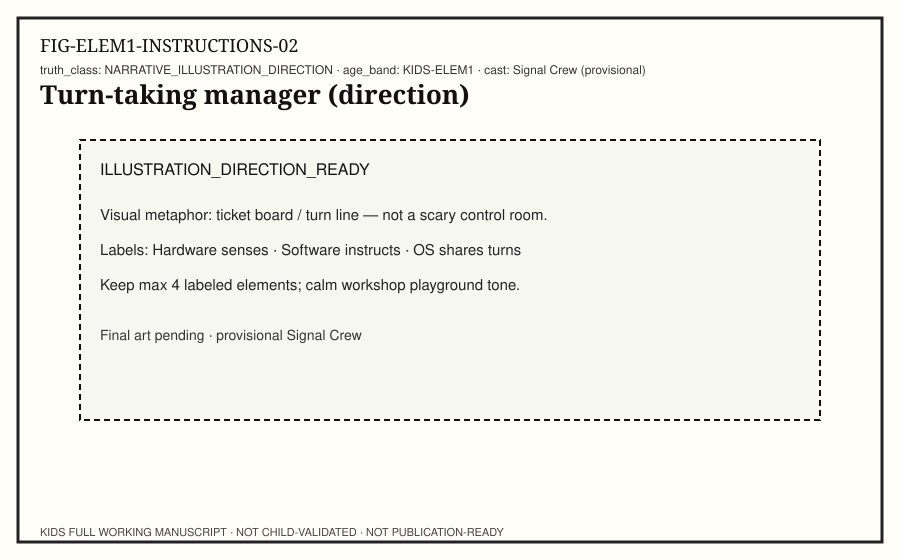

**Child-facing text:** Press a volume button if an adult says it is OK. What part did you touch? That sensing is hardware. What changed on screen or in sound? Instructions decided the change — that is software. Observe both sides of the same moment.

**Try it:** Name one hardware sense and one software change.

## PREDICT

**Child-facing text:** Two apps want attention. Predict what a fair manager program might do: run both at once somehow, or take turns? Step says order matters. Write your prediction before the diagram.

**Try it:** Predict turn-taking vs forever-one-app.

## TEST

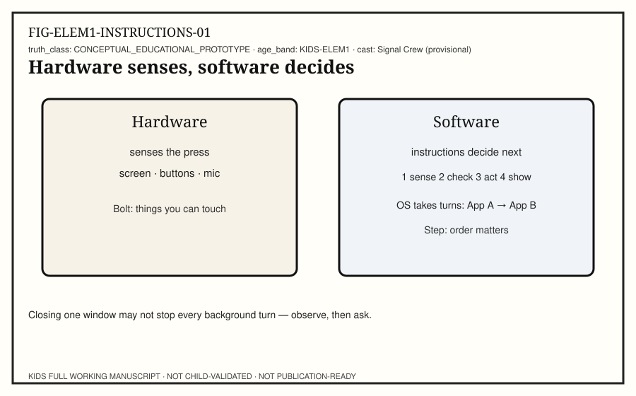

**Child-facing text:** Test with a human OS game. Two classmates are “apps.” One adult or child is the OS with a turn timer (clap rhythm). Each app gets a short turn to stack blocks. Hardware is the blocks and hands. Software is the rule card: “stack one, then stop.” Watch turn-taking work.

**Try it:** Play one round of the turn-taking OS game.

## MEASURE

**Child-facing text:** Measure fairness with counts: how many turns did App A get? App B? Did anyone wait with nothing to do? Waiting can be normal when a machine shares time. Record the counts on paper.

**Try it:** Make a two-column turn tally.

## EXPLAIN

**Child-facing text:** Hardware notices the world. Software is the recipe — an algorithm is a clear ordered plan. An operating system (OS) schedules which program gets the CPU’s attention next. Closing one window may not stop every background job. If something keeps working, ask a caregiver to help check — observe first, then ask.

**Try it:** Explain hardware vs software vs OS in one short paragraph or labeled drawing.

## BUILD

**Child-facing text:** Build a four-step algorithm card for a local lamp tap: 1) sense press 2) check which control 3) change brightness 4) show new light. Trade cards and see if a partner can follow your order without guessing. Input → process → output still sits underneath the steps.

**Try it:** Write and trade one algorithm card.

## SECURE

**Child-facing text:** Shield: do not install unknown software. Ask before changing permission switches. Fair access means classmates who need larger text, captions, or different input tools get those tools without being teased.

**Try it:** Name one fair-access tool you know.

## REFLECT

**Child-facing text:** Misconception check: “Closing an app always stops all background work.” Evidence from adult-guided observation may show otherwise — mark what you saw and what you only guessed. Recipes that skip steps cause mix-ups; that is humor, not failure.

**Try it:** Label one observation and one guess about background work.

## TEACH

**Child-facing text:** Teach the split: Bolt for hardware, Step for software and turn tickets. Have a partner follow your four-step algorithm exactly. If it breaks, fix the steps together.

**Try it:** Teach-back with a live algorithm run.

---

# Unit 4 — Networks Connect

**Focus idea:** Devices can connect in networks. Messages can split into packets that travel paths with addresses. Not every action needs the internet.

## OBSERVE

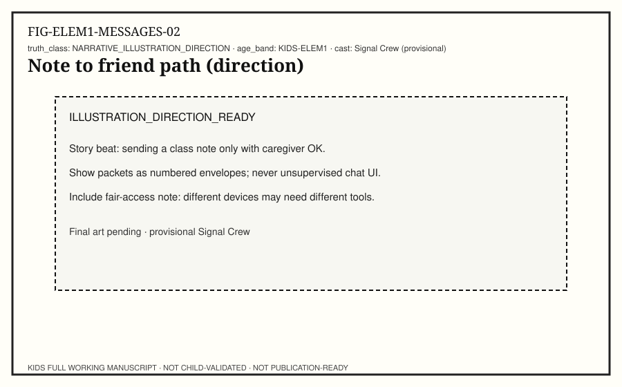

**Child-facing text:** Ping draws a path from here to there. Watch a caregiver-approved message or class page load. What stays on this device? What seems to travel? Observe delays without blaming anyone. Networks are shared roads.

**Try it:** Note one local action and one maybe-network action.

## PREDICT

**Child-facing text:** Predict what happens if a long note is torn into three labeled pieces before it travels. Will the pieces need addresses? Will they always arrive in order? Write yes/no/not sure for each question.

**Try it:** Answer the three prediction prompts.

## TEST

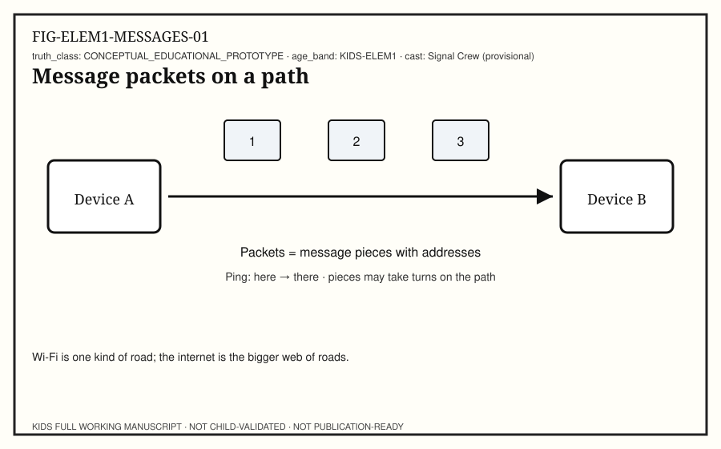

**Child-facing text:** Test with envelope packets. Write one sentence on a strip. Cut into three pieces. Number them 1–2–3 and add “to: Device B.” Hand them along a desk path with two “router” classmates who only forward. Reassemble at the end. Did every piece arrive? What if one waits?

**Try it:** Run the packet envelope relay once.

## MEASURE

**Child-facing text:** Measure reliability with tallies: pieces sent, pieces arrived, pieces late. Reliability is about what actually arrived — not who is “smart.” If a piece is missing, try again; that is normal network thinking.

**Try it:** Fill a sent / arrived / late table.

## EXPLAIN

**Child-facing text:** A network connects devices so messages can travel. Packets are pieces of a message with addressing information. Paths can use wires or wireless roads like Wi-Fi — Wi-Fi is one kind of road, not the whole internet. The internet is a huge web of networks. Messages do not always arrive; people design retries and checks.

**Try it:** Explain packet + path using your envelopes.

## BUILD

**Child-facing text:** Build a paper network: two device boxes, one router box, three packet tickets. Tape a path. Keep it for the Evidence Folder.

**Try it:** Finish the paper network model.

## SECURE

**Child-facing text:** Shield at the gate: no unsupervised messaging; ask a trusted adult before sending; never share home address, phone, or passwords; stop if a message feels wrong. Networks are powerful because they connect — and that is why consent matters.

**Try it:** Practice an ask-before-send sentence.

## REFLECT

**Child-facing text:** Misconception check: “The internet is one wire in the wall.” Evidence: your model needed devices, paths, and packets. Another rethink: “Wi-Fi is the internet.” Wi-Fi can be a road onto larger networks, but the words are not twins. “Messages always arrive” — your late/missing tallies say otherwise.

**Try it:** Correct one misconception with model evidence.

## TEACH

**Child-facing text:** Teach a caregiver the packet relay. Let them be a router once. Celebrate clear handoffs.

**Try it:** Teach-back the packet path.

---

# Unit 5 — Data Helps Predictions

**Focus idea:** Data is information we collect. Patterns in examples can help a prediction — and predictions can be wrong, so people must check.

## OBSERVE

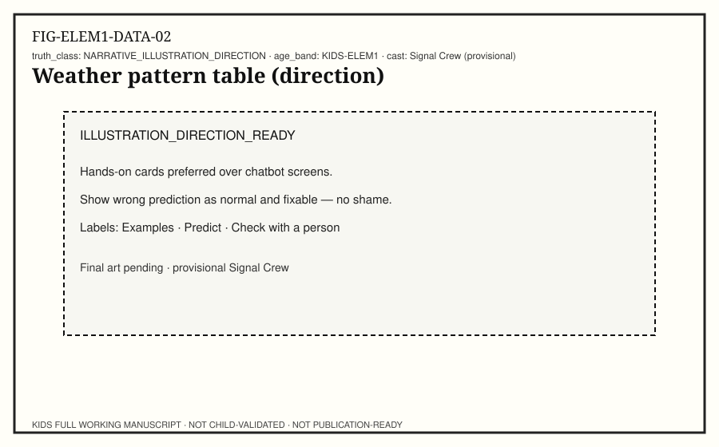

**Child-facing text:** Mira lays out example cards: three mornings that looked cloudy and felt cool. Observe the pattern without jumping to a big story. What repeats? What is different? Data starts as careful noticing.

**Try it:** Sort five picture cards into pattern groups.

## PREDICT

**Child-facing text:** Predict the next card in a simple pattern (for example: sun, cloud, sun, cloud, ?). Write the guess before flipping the answer card. A prediction is a guess guided by examples — not a proof.

**Try it:** Make one pattern prediction on paper.

## TEST

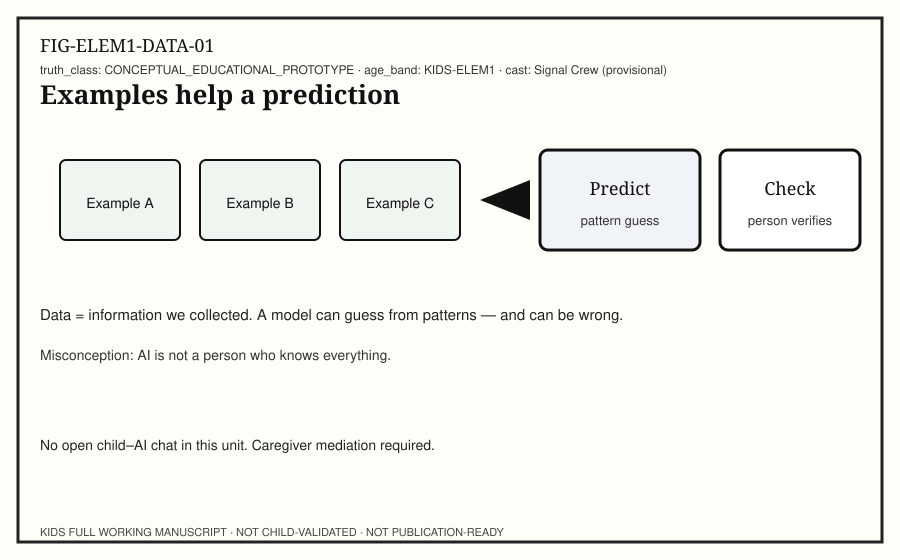

**Child-facing text:** Test the guess. Flip the next card. Were you right? If wrong, add the new example to your data and try again. Machines that “learn” from data also guess from patterns. They can invent wrong answers. People check.

**Try it:** Record right/wrong and update examples.

## MEASURE

**Child-facing text:** Measure with a fair scoreboard: predictions tried, correct, incorrect. No ranking of kids — only counting guesses. If you like, compare two pattern rules and see which fit the examples better.

**Try it:** Complete a tried / correct / incorrect tally.

## EXPLAIN

**Child-facing text:** Data is information we choose to collect and keep. Patterns help predictions. A model is a tool that uses examples to guess. Generative tools can invent text or pictures that look real but may be false. AI is not a person and does not “know everything.” Checking with a trusted person is part of the job.

**Try it:** Explain example → predict → check with your cards.

## BUILD

**Child-facing text:** Build a mini data poster: Examples · My prediction · What I checked · What changed. Keep it offline in the Evidence Folder. No child AI chat accounts for this unit.

**Try it:** Finish the data poster.

## SECURE

**Child-facing text:** Shield: collect only classroom-safe examples (weather icons, block colors) — not private photos of classmates without permission. Do not paste personal stories into public tools. Caregiver mediation required for any digital demo.

**Try it:** Choose a safe example set with an adult.

## REFLECT

**Child-facing text:** Misconception check: “AI knows everything” and “AI is a person.” Evidence: your wrong predictions still looked confident until you checked. Confidence is not the same as truth. Another rethink: “Bigger number always means better.” Your tallies measure guesses, not worth.

**Try it:** Rewrite an AI slogan using your check step.

## TEACH

**Child-facing text:** Teach a partner your poster. Ask them to make one new prediction and check it. Celebrate careful checking.

**Try it:** Teach-back example → predict → check.

---

# Unit 6 — Locks and Fair Access

**Focus idea:** Locks and permissions protect access. Privacy means choosing who can see. Fair access includes tools that help different learners.

## OBSERVE

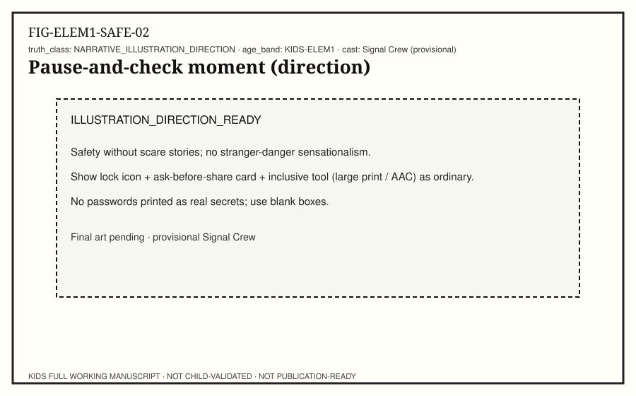

**Child-facing text:** Shield holds a pause hand. Observe a lock screen (do not share real passwords). What is the lock for? Who should be able to open it? Notice fair tools in your room: larger print, captions, quiet corner, different keyboards. Belonging is ordinary.

**Try it:** Point to one lock and one fair-access tool.

## PREDICT

**Child-facing text:** Predict which shares need a yes from a trusted adult: a drawing of a robot; your full name on a public wall; a photo of your face; your school name in a game chat. Mark ask / OK with adult / do not share.

**Try it:** Complete the share-choice predictions.

## TEST

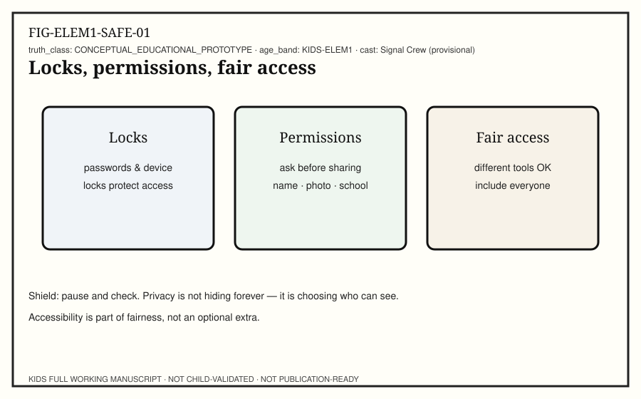

**Child-facing text:** Test with role-play cards: Locks · Permissions · Fair access. Mira wants to post a class photo. Shield asks who can see it. Step writes a permission checklist. Bolt adds a large-print copy so more friends can read the rule. Practice calm choices — no scare stories.

**Try it:** Act one permission scene and freeze at the ask.

## MEASURE

**Child-facing text:** Measure your habit with a weekly checklist count: times you asked before sharing; times you used a lock with help; times you helped a classmate get a tool they needed. Counts are practice mirrors, not grades.

**Try it:** Start a three-line habit tally.

## EXPLAIN

**Child-facing text:** Locks and passwords control who may use a device or account. Permissions are rules about what an app or person may see or do. Privacy is choosing who can see information — not hiding forever from everyone who cares for you. Fair access means designing so more people can join. Accessibility is part of fairness, not an optional sticker.

**Try it:** Explain lock vs permission vs fair access.

## BUILD

**Child-facing text:** Build a pocket “Ask first” card with three questions: Who will see this? Do I need an adult yes? Is there a fair way for everyone to join? Decorate without writing real secrets.

**Try it:** Make the Ask-first card for the Evidence Folder.

## SECURE

**Child-facing text:** Shield’s secure practice: protect passwords; do not trade them; refuse unknown installs; no chatting with strangers; stop and tell a trusted adult if something feels wrong. Safety without fear — we practice.

**Try it:** Rehearse a stop-and-tell sentence.

## REFLECT

**Child-facing text:** Misconception check: “Privacy means hiding forever.” Evidence: you still share with caregivers and teachers when it is safe and needed. “Accessibility is optional extras.” Evidence: fair tools helped someone join your scene. Security is not “hacking practice” — it is protection and consent.

**Try it:** Fix two misconception sentences kindly.

## TEACH

**Child-facing text:** Teach a caregiver your Ask-first card. Invite them to add one family rule. Easy stop if the talk feels heavy.

**Try it:** Teach-back locks + permissions + fairness.

---

# Unit 7 — Evidence Folder

**Focus idea:** An evidence folder shows process proof — what you saw, what you infer, and what you still do not know — not a contest.

## OBSERVE

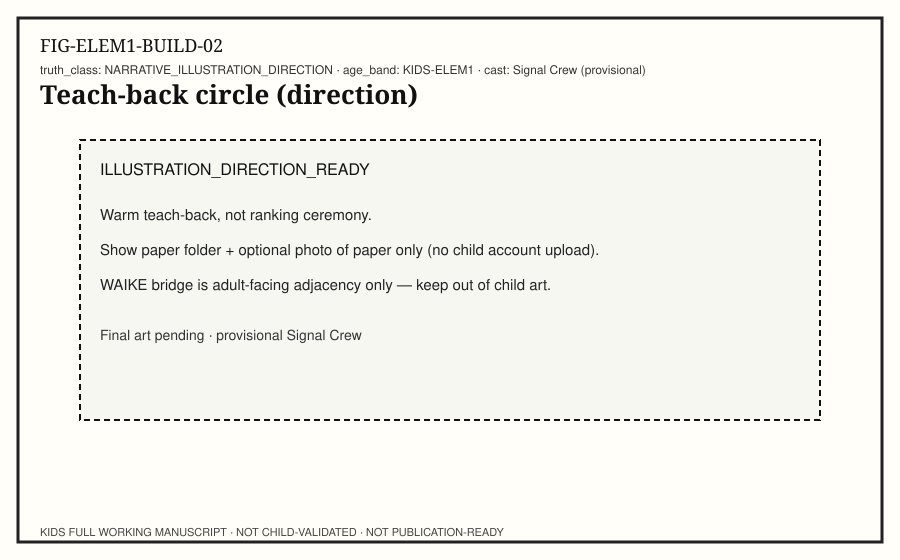

**Child-facing text:** Gather your pages from earlier units: system map, role sorter, algorithm card, packet path, data poster, Ask-first card. Observe what proof you already have. Mira is proud of process, not of beating anyone.

**Try it:** Lay out your artifacts and name each one.

## PREDICT

**Child-facing text:** Predict which page best shows observation vs guess. Which page best shows a test? Which page shows a safety choice? Write three predictions before sorting.

**Try it:** Predict a home for each artifact type.

## TEST

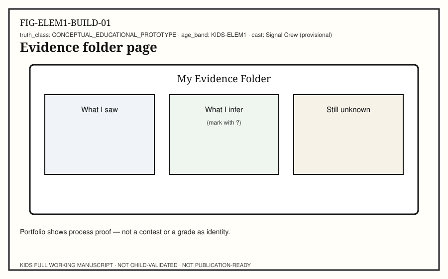

**Child-facing text:** Test your folder layout. Use three columns on a cover sheet: What I saw · What I infer (?) · What I still don’t know. Place sticky notes from one favorite investigation into the columns. Inferences keep question marks until tested.

**Try it:** Complete one cover sheet with sticky notes.

## MEASURE

**Child-facing text:** Measure folder health with counts: number of artifacts; number of question marks still open; number of teach-backs done. Growth means clearer evidence, not higher rank. Unknowns count as honest science.

**Try it:** Write the three folder counts.

## EXPLAIN

**Child-facing text:** Portfolios show how you learned: observing, predicting, testing, measuring, explaining, building, securing, reflecting, and teaching. They are not contests. They are not grades as identity. Careers later use portfolios to show proof — today we practice the habit with kid-safe evidence.

**Try it:** Explain “process proof” to a partner.

## BUILD

**Child-facing text:** Build or rebuild your Evidence Folder: cover sheet, six unit pages, one teach-back slip. Optional: caregiver photos of paper only. No child cloud account required.

**Try it:** Assemble the folder physically.

## SECURE

**Child-facing text:** Shield: keep private family details out of public displays; ask before photographing faces; store folders in a classroom-safe place. Sharing learning is good when consent is clear.

**Try it:** Check the folder for anything that should stay private.

## REFLECT

**Child-facing text:** Misconception check: “Portfolio is a contest.” Evidence: your unknowns and question marks are welcome. Compare early guesses to later explanations — improvement is normal. Celebrate repair.

**Try it:** Write one “I used to think… now I can show…” sentence.

## TEACH

**Child-facing text:** Teach a short gallery walk: each learner teaches one page. Listeners ask one curious question. Stop anytime. This is practice for explaining systems — the heart of the whole book.

**Try it:** Teach-back one Evidence Folder page.

---

# Back matter (child-facing)

## Tiny glossary

- **Hardware** — parts you can touch.
- **Software** — instructions that decide what happens.
- **Input → Process → Output** — what goes in, what happens inside, what you notice.
- **Algorithm** — a clear ordered plan.
- **Local** — finished on this device.
- **Network** — devices connected so messages can travel.
- **Packet** — a piece of a message with addressing.
- **Data** — information we collect.
- **Prediction** — a guess from patterns.
- **Privacy** — choosing who can see.
- **Permission** — a rule about what may be shared or used.
- **Evidence folder** — process proof of learning.

## Closing

You learned to observe systems, test ideas, and teach what you found. Keep asking kind questions. Keep your Evidence Folder. Stop anytime — learning likes rest too.
