# Technology Landscape Kids — KIDS-ELEM2 (Grades 3–5/6)

```
KIDS DEVELOPMENTAL / WORKING MANUSCRIPT DRAFT
NOT CHILD-VALIDATED
NOT PUBLICATION-READY
KIDS_CHILD_VALIDATION_PENDING
```

**Edition:** Junior technology / young-engineer reference (working draft)
**Age band:** `KIDS-ELEM2` · Grades 3–5/6 (guide, not a deadline)
**Cadence spine:** OBSERVE → PREDICT → TEST → MEASURE → EXPLAIN → BUILD → SECURE → REFLECT → TEACH
**Claim ceiling:** working manuscript draft only — not certification, not child-validated, not publication-ready

---

## How to use this book

This is a junior reference and lab notebook, not a densified vocabulary list. Read a short section, try something small and stoppable, write what you saw, then decide what you still do not know.

Separate **observation** (what you saw, heard, timed, or counted) from **inference** (the story you tell about why). Keep a `Still don't know` margin on every lab page.

Adults: stop anytime. No ranking. Portfolio evidence shows process, not a fake certificate. Standards IDs and provenance live in adult appendices — not in child-facing spreads.

---

## Caregiver / educator orientation

Coach the elementary cadence. Prefer rough classroom timers over confident myths. Mediate device use; no child accounts or data collection for these labs. Celebrate repair notes. Misconception callouts appear in labeled **Teach-back (adult)** boxes so child prose stays clear.

---

## Cast (provisional — Character Bible Option A)

- Explorer: **Mira** · Builder: **Bolt** · Instructions: **Step** · Signals: **Ping** · Safety: **Shield**
- _Provisional Character Bible Option A — not owner-locked IP._ Characters support learning; they do not replace explanation.

---

## Safety and accessibility note

- Easy stop; adult mediation for chargers, accounts, messaging, and any online path.
- No offensive security practice; no credential-sharing games; no open-ended child–AI chat required.
- Color is never the only encoding in figures — labels and patterns travel with shapes.
- Alternate routes: verbal teach-back, large-print printouts, partner scribe, AAC-friendly short scripts.

---

# Unit 1 — Experience Maps Systems

**Unit ID:** `UNIT-ELEM2-ME-TECH-01`  
**Strand:** Me & Technology  
**Concept:** `KCON-CH01-SYSTEM-NOT-SCREEN`  
**Learning goal:** Map visible experience to hidden components, software, and optional remote services.

### U01 · OBSERVE — The screen is not the whole system


**Child-facing text:** Mira opens a familiar app and asks the crew to name what is *visible*: icons, text, sound, vibration. Bolt points past the glass: the screen is one surface of a larger system. On a shared map, label layers you can honestly name — people and intent, input hardware, operating system, application, optional network path, output, your perception. Circle what you truly observed. Put a question mark on what you only infer. A map is a model: useful, incomplete, and revisable. If two classmates mark different question marks, that is good science, not a fight.

**Try it:** Annotate a visible→hidden systems map; mark observe vs infer.

**Talk together:** Shared figure is a tool, not a quiz key.

### U01 · PREDICT — Local or farther away?

**Child-facing text:** Ping asks: for *this* action, does anything need to leave the device? Predict in writing before you touch anything. Local-only actions can finish with power, CPU work, memory, and storage on the device. Networked actions may need packets on a path. Write three boxes: prediction → planned observation → what would count as evidence. Do not treat “it felt instant” as proof that no network was involved.

**Try it:** Write a local-vs-remote prediction for one familiar action.

**Talk together:** Prediction before trial.

### U01 · TEST — Airplane mode as an honest tool

**Child-facing text:** With an adult, test one safe action with radio off (airplane mode) if the device allows it. What still works? What fails, hangs, or stays blank? Record the result next to your prediction. If you cannot test safely today, keep the prediction and write why the test waited. Evidence beats slogans.

**Try it:** One supervised radio-off observation, or a written “test waited” note.

**Talk together:** Failed predictions are useful.

### U01 · MEASURE — Felt delay vs measured wait


**Child-facing text:** Latency means waiting time somewhere on a path. Felt delay is what your body notices; measured delay is what a classroom timer roughly shows. On a remote refresh (adult-approved), mark start, first visible change, and “done enough.” Write units (seconds). Separate felt delay from guessed cause — busy CPU, full memory, slow storage, weak Wi‑Fi, or a far server can feel similar until you gather evidence. Rough numbers beat confident myths.

**Try it:** Three rough stopwatch marks on one approved action.

**Talk together:** Classroom timer OK; rough is honest.

### U01 · EXPLAIN — CPU, memory, storage are jobs


**Child-facing text:** Bolt deals three role cards. **CPU:** runs instructions right now. **Memory (working space):** holds state the program is using this moment. **Storage (keep-box):** keeps durable data for later. Sort classroom examples: instructions being followed, today’s draft still open, yesterday’s saved file. Say the roles aloud. A bigger advertisement number does not tell the whole story — ask what was actually measured. If a label sounds like an ad for “brain speed,” rewrite it as a job the machine can do.

**Try it:** Sort role cards for CPU / memory / storage with real examples.

**Talk together:** Roles, not marketing numbers.

> **Teach-back (adult) — misconception:** CPU ≠ memory ≠ storage. The screen ≠ the whole computer. “Cloud” is remote computers and services — not weather in the sky.

### U01 · BUILD — Paper systems protocol

**Child-facing text:** Build a one-page protocol for tracing one experience across layers: numbered steps, a failure branch (“if no change, check power / ask a trusted adult”), and a short teach script for someone younger. Include one blank for a repair you will make after testing.

**Try it:** Protocol draft + younger teach script stub.

**Talk together:** Repair space is part of the design.

### U01 · SECURE — Who can see this path?

**Child-facing text:** Shield asks two calm questions about your mapped action: What security control protects the device or account (lock screen, update, permission prompt)? What privacy choice changes who can see information? List one of each. We learn protection tools — we do not practice breaking into systems.

**Try it:** One security control + one privacy choice tied to your map.

**Talk together:** Protection tools, not scare stories.

### U01 · REFLECT — Spiral: same idea, more tools

**Child-facing text:** What stays the same from earlier “touch → change” learning to this systems map? Contingent action and response. What vocabulary was earned later: input, output, event, packet, latency, privacy, security? Write one sentence you would teach a younger learner and one sentence only this class needs.

**Try it:** Spiral reflection note (younger / this class).

**Talk together:** Same idea, fewer new words for younger listeners.

### U01 · TEACH — Map teach-back

**Child-facing text:** Teach a partner your systems map. Name what you observed, what you inferred, and what you still do not know. Invite one question you cannot answer yet and write it down for next time. Do not invent evidence to sound finished.

**Try it:** Partner teach-back with observed / inferred / unknown.

**Talk together:** Uncertainty spoken calmly is skill.

---

# Unit 2 — Hardware Constraints

**Unit ID:** `UNIT-ELEM2-INSIDE-01`  
**Strand:** Inside the Machine  
**Concept:** `KCON-CH09-POWER-HEAT`  
**Learning goal:** Treat power budgets and thermal limits as real system constraints.

### U02 · OBSERVE — Energy makes work possible


**Child-facing text:** Bolt shows a battery icon and a warm laptop edge (look, don’t press hard). Devices need energy to run instructions, light a display, talk on radio, and keep storage alive. Warmth can be a clue that work is happening — not a magic mood. Observe: charge level (if shown), fans or silence, and whether an adult says the device feels only warm or too hot.

**Try it:** Observation sheet: energy clue + warmth clue + adult note.

**Talk together:** Clues are not diagnoses.

### U02 · PREDICT — What costs energy?

**Child-facing text:** Predict which classroom actions spend more energy: bright screen vs dim; local note app vs long video stream; radio off vs radio on. Rank three actions from “probably less” to “probably more.” Write why in one sentence each — still a prediction, not a proof.

**Try it:** Rank three actions by predicted energy cost.

**Talk together:** Ranking is a hypothesis tool.

### U02 · TEST — Dim vs bright, short trial

**Child-facing text:** With adult permission, run two short, stoppable trials on the same device: dim display for one minute of a local task, then bright for one minute of the same local task. Note battery percentage only if the OS shows it honestly — do not force settings you don’t understand. Record what changed and what stayed the same.

**Try it:** Two one-minute supervised trials; note battery if visible.

**Talk together:** Short trials; stop if anything feels wrong.

### U02 · MEASURE — Heat as a stop rule


**Child-facing text:** Measure with senses and adult judgment, not with homemade “temperature experiments” on gadgets. If a device is uncomfortably hot, stop using it and tell an adult. Write a classroom stop rule in your own words: warm may mean work; hot means pause. Adults handle chargers and damaged cables.

**Try it:** Write a thermal stop rule; role-play asking an adult.

**Talk together:** Safety first; no device surgery.

### U02 · EXPLAIN — Constraints shape design

**Child-facing text:** Power budgets and heat limits shape what engineers can build: how bright, how fast, how long a battery lasts, how thick a case can be. Interconnects (paths that carry signals and power between parts) also constrain design — parts must connect safely. We describe constraints, not brand winners.

**Try it:** List two constraints (power/heat/interconnect) that could change a design.

**Talk together:** Constraints ≠ “broken.”

> **Teach-back (adult) — misconception:** Warm ≠ always dangerous fire. Charging ≠ magic. A fan spinning is a cooling strategy, not proof of failure by itself.

### U02 · BUILD — Constraint cards

**Child-facing text:** Build three paper cards: Power, Heat, Interconnect. On each card, write one observation from this unit and one design question (“What would we change if…?”). Keep questions open — engineers revise.

**Try it:** Three constraint cards with observation + question.

**Talk together:** Questions are part of engineering.

### U02 · SECURE — Safe handling habits

**Child-facing text:** Shield’s checklist: adult handles chargers; don’t use damaged cables; don’t block vents on purpose; stop if hot; no opening devices. Security of the machine starts with not creating hazards while you learn.

**Try it:** Copy the safe-handling checklist into your notebook.

**Talk together:** Habits protect people and gear.

### U02 · REFLECT — Limits are information

**Child-facing text:** How does knowing about power and heat change how you explain a “slow” device? Maybe it is throttling work to stay cool — an inference you should mark with a ?. Write one revised explanation that includes a constraint.

**Try it:** Rewrite one “slow” story with a possible constraint + ?.

**Talk together:** Limits teach systems thinking.

### U02 · TEACH — Constraint teach-back

**Child-facing text:** Teach a younger learner: devices need energy; warmth can mean work; hot means ask an adult. Use fewer new words. Then teach a peer one interconnect idea: parts need paths for power and signals.

**Try it:** Two teach scripts (younger / peer).

**Talk together:** Audience changes the words, not the honesty.

---

# Unit 3 — Events and Handlers

**Unit ID:** `UNIT-ELEM2-INSTRUCTIONS-01`  
**Strand:** Instructions & Code  
**Concept:** `KCON-CH14-APPS-UI`  
**Learning goal:** Model event-driven apps: event → handler → state → output.

### U03 · OBSERVE — A tap becomes an event


**Child-facing text:** Step narrates: when you tap, input hardware reports activity. The operating system notices and delivers an **event** toward the app that should respond. Inside the app, a handler can run — instructions that update **state** (the program’s current facts) and ask for new output. Draw one chain on a single page: tap → OS event → app handler → updated state → screen or sound. This is a classroom model — useful, incomplete, revisable.

**Try it:** Draw the event-handling sequence on one page.

**Talk together:** Define new words once with pointing.

### U03 · PREDICT — Which handler fires?

**Child-facing text:** Predict: if you tap Save versus Undo in a writing app, which state changes? Predict outputs you expect to see. Write “if this event, then this handler idea” in plain words — you are designing a tiny mental program, not claiming you know the vendor’s code.

**Try it:** Two if-event → then-handler predictions.

**Talk together:** Plain words beat fake code theater.

### U03 · TEST — UI as conversation with a program


**Child-facing text:** A user interface (UI) is how people send events and read outputs. Test one supervised app: trigger two different events and record state changes you can see (text appeared, button grayed out, file name changed). If nothing visible changes, write that honestly — invisible work may still be happening, but you must not invent it.

**Try it:** Two events → visible state notes.

**Talk together:** Invisible ≠ nonexistent, but needs evidence.

### U03 · MEASURE — Order and timing of steps

**Child-facing text:** Instructions have order. Measure roughly: how many distinct visible steps between your event and a finished-looking result? Count frames of change if you can (1…2…3). Programming is giving ordered instructions a machine can follow; bugs often mean the order or the conditions are wrong.

**Try it:** Count visible steps from event to “done enough.”

**Talk together:** Order is part of the explanation.

### U03 · EXPLAIN — Files, data, and durable state

**Child-facing text:** Some state lives only in memory while the app is open. **Files** and durable storage keep data for later. When you save, you ask the system to write lasting data. When you open, you read it back. Trace: event Save → handler → storage write → later event Open → handler → memory holds the data again for editing.

**Try it:** Trace save/open as events that touch storage.

**Talk together:** Working state vs keep-box state.

> **Teach-back (adult) — misconception:** The icon is not the whole program. Closing a window is not always the same as deleting a file. “The computer remembered” usually means storage or an account — ask which.

### U03 · BUILD — Paper event app

**Child-facing text:** Build a paper mini-app: three events (Tap A / Tap B / Reset), a state box (score or mode), and handlers written as short sentences. Act it out with a partner as the “runtime.” Repair one unclear handler after the first run.

**Try it:** Paper app + one repair after rehearsal.

**Talk together:** Runtime is “who follows the instructions now.”

### U03 · SECURE — Permissions are events too

**Child-facing text:** Shield points at permission prompts: an app may request camera, mic, or location. That prompt is a security and privacy event — your choice (with an adult) can allow, deny, or ask later. List one permission you would want an adult to decide.

**Try it:** Name one permission decision for an adult.

**Talk together:** Consent is part of the event story.

### U03 · REFLECT — Programming as revise-able plans

**Child-facing text:** How is fixing a paper handler like debugging? You change instructions, retest, and keep evidence of the repair. Write one sentence: “My first handler failed because…; I improved it by…”

**Try it:** Failure → repair sentence.

**Talk together:** Repair is success.

### U03 · TEACH — Event chain teach-back

**Child-facing text:** Teach someone the chain without stack jargon overload: something happens → the system notices → instructions run → something updates → you see or hear a result. Add one honest limit: we do not see every step inside.

**Try it:** Teach-back with one named limit.

**Talk together:** Limits keep trust.

---

# Unit 4 — Packets and Routes

**Unit ID:** `UNIT-ELEM2-MESSAGES-01`  
**Strand:** Messages & Connections  
**Concept:** `KCON-CH16-PACKETS-INTERNET`  
**Learning goal:** Represent, transmit, route/forward, receive, and interpret messages; distinguish Wi‑Fi hops from the Internet.

### U04 · OBSERVE — Messages can be split


**Child-facing text:** Ping cuts a paper letter into addressed pieces called **packets** in our classroom model: little message pieces with enough addressing to travel and reassemble. Observe a relay game: sender → hop → hop → receiver. Some pieces may arrive out of order; some may wait. Reliability is not guaranteed just because sending felt easy.

**Try it:** Packet relay with addressed paper pieces.

**Talk together:** Arrival is an observation, not a wish.

### U04 · PREDICT — Path and failure

**Child-facing text:** Predict two failure modes: a piece goes missing; a hop is slow. What would the receiver notice? What could the sender try next (resend, wait, ask an adult)? Write predictions before the relay.

**Try it:** Missing-piece and slow-hop predictions.

**Talk together:** Plans for failure are engineering.

### U04 · TEST — Wi‑Fi is not the whole Internet


**Child-facing text:** Wi‑Fi is often a local radio hop between your device and a nearby access point. The **Internet** is a huge collection of networks that can carry packets farther. Cellular is another kind of radio access road. Test ideas with labels, not myths: “Connected to Wi‑Fi” does not mean “I am the Internet.” With an adult, name which hop you can actually identify today.

**Try it:** Label Wi‑Fi hop vs farther Internet path on a diagram.

**Talk together:** Names for hops beat vague “online.”

> **Teach-back (adult) — misconception:** Wi‑Fi ≠ Internet. One bar icon ≠ the whole truth about radio conditions. Messages do not always arrive.

### U04 · MEASURE — Latency and reliability notes

**Child-facing text:** Time a classroom packet relay: start when first piece leaves; end when the message is interpretable. Count pieces lost. Record latency (wait) and reliability (how complete). Felt lag on a real device may mix radio conditions, routing distance, and busy servers — mark causes with ? until tested.

**Try it:** Relay timer + lost-piece count.

**Talk together:** Two metrics: wait and completeness.

### U04 · EXPLAIN — Represent → transmit → interpret

**Child-facing text:** Data is represented (symbols/bits in our story), transmitted (moved), routed/forwarded (handed along paths), received, and interpreted (turned back into meaning for a person or program). If interpretation fails, you may see nonsense or an error — that is information too.

**Try it:** Five-box flow: represent / transmit / route / receive / interpret.

**Talk together:** Interpretation is a step, not automatic magic.

### U04 · BUILD — Classroom routing map

**Child-facing text:** Build a floor map with three hops and two possible routes. Send one packet each way. Note which route felt longer. Optional: mark a “congested” hop that must wait.

**Try it:** Two-route map with timing notes.

**Talk together:** Routes are choices under constraints.

### U04 · SECURE — Messages and strangers

**Child-facing text:** Shield: do not send personal information in classroom message games. Real networks can expose messages to more places than you see. We may say encrypted paths try to make messages harder for strangers to read in transit — without practicing attacks. Adult mediation for any real messaging.

**Try it:** List two things that should not ride on a practice packet.

**Talk together:** Privacy travels with messages.

### U04 · REFLECT — Sensors and far paths

**Child-facing text:** Some devices use **sensors** (light, motion, touch) to create local events; some sensor readings may later be sent as packets. Reflect: which of today’s examples stayed local, and which needed a route? Mark unknowns.

**Try it:** Local vs routed sensor/message table.

**Talk together:** Sensors start local; paths are optional.

### U04 · TEACH — Packet story for a peer

**Child-facing text:** Teach a peer using the letter metaphor, then retire the metaphor: real packets are not paper, but addressing, hops, delay, and loss still matter. End with Wi‑Fi ≠ Internet.

**Try it:** Teach-back ending in the Wi‑Fi misconception fix.

**Talk together:** Metaphor then precision.

---

# Unit 5 — Models Need Checks

**Unit ID:** `UNIT-ELEM2-DATA-01`  
**Strand:** Data & Intelligence  
**Concept:** `KCON-CH21-DATA-AI`  
**Learning goal:** Trace data → model → prediction; require human checks; reject “AI knows like a person.”

### U05 · OBSERVE — Patterns from examples


**Child-facing text:** Mira sorts example cards (shapes, words, or animal pictures). A **model** in this unit means a tool that found patterns in data and can output a **prediction** or generated suggestion. Observe carefully: which features did your sorting rule use (color, size, first letter)? Write the rule in one sentence. With few examples, guesses are shaky; with biased examples, guesses can be unfair. People choose data and checks. Sensors can create data too — a light sensor reading is still just a measurement until someone interprets it.

**Try it:** Sort examples; write the sorting rule; note what a classmate might “learn.”

**Talk together:** Data choices shape outcomes.


### U05 · PREDICT — When will it fail?

**Child-facing text:** Predict a failure: show the “model” (a classmate’s sorting rule) a case outside the training examples. What wrong label might appear? Write the prediction before the test.

**Try it:** Out-of-example failure prediction.

**Talk together:** Failure prediction is literacy.

### U05 · TEST — Inference is not understanding


**Child-facing text:** **Inference** here means running a model to get an output now. Test your classmate-rule model on five new cards. Score hits and misses. Important honesty: models do not “understand” like people — they match patterns from data. Fluent text from a generative tool can still be wrong. No open-ended child–AI chat is required for this lab; paper models are enough.

**Try it:** Five-card test with hit/miss tally.

**Talk together:** Fluent ≠ true.

> **Teach-back (adult) — misconception:** AI is not a person and does not know everything. A confident answer can still be a hallucination/error. Humans remain responsible for checks.

### U05 · MEASURE — Error rate, rough and honest

**Child-facing text:** Measure: misses ÷ total trials. Write the fraction and a plain sentence (“About 2 of 5 wrong on this tiny set”). Tiny sets do not prove a product is good or bad worldwide — they teach the habit of measuring.

**Try it:** Compute a tiny-set error rate with units.

**Talk together:** Small evidence, honest scope.

### U05 · EXPLAIN — Pipeline and responsibility

**Child-facing text:** Explain the pipeline: data → model → prediction/generation → human check → decision. Sensors may feed data; storage may keep datasets; networks may move them. At each arrow, ask who is accountable. Shield adds: if an output affects a person, a person must be able to question it.

**Try it:** Draw the pipeline; star the human-check step.

**Talk together:** Responsibility is part of the diagram.

### U05 · BUILD — Check protocol

**Child-facing text:** Build a three-question check protocol for any model output: (1) What evidence supports this? (2) What could be missing from the data? (3) Who should confirm before we trust it? Keep it on a card for Unit 7’s portfolio.

**Try it:** Three-question check card.

**Talk together:** Checks are design, not distrust theater.

### U05 · SECURE — Data about people

**Child-facing text:** If data is about people, privacy and fairness rules tighten. Do not collect classmate personal data for a “fun dataset.” Use public classroom-safe examples only. Equity means noticing who is left out of the examples.

**Try it:** Rewrite a bad data idea into a privacy-safe version.

**Talk together:** No child data collection in these labs.

### U05 · REFLECT — Careers precursor

**Child-facing text:** People who work with data and models test, measure, document limits, and teach others what can go wrong. That is a career precursor — curiosity plus honesty — not a job title quiz. Write one skill you practiced today that belongs in a young-engineer portfolio.

**Try it:** One portfolio skill sentence.

**Talk together:** Habits before job titles.

### U05 · TEACH — Limits teach-back

**Child-facing text:** Teach: models predict from patterns; people check; models don’t know like persons. Offer one example of a wrong but fluent answer you invented on paper to practice catching it.

**Try it:** Teach-back + one deliberate wrong fluent example to catch.

**Talk together:** Practice catching errors kindly.

---

# Unit 6 — Privacy Security Equity

**Unit ID:** `UNIT-ELEM2-SAFE-01`  
**Strand:** Safe, Private & Fair  
**Concept:** `KCON-CH25-DIGITAL-EQUITY`  
**Learning goal:** Separate privacy, security, and equity; measure access gaps carefully without ranking families.

### U06 · OBSERVE — Three related ideas


**Child-facing text:** Shield separates ideas that often get mashed together. **Security:** controls that protect systems and accounts — lock screens, updates, permission prompts. **Privacy:** choices about who can see or keep information — share settings, what you post, what an app stores. **Equity:** who can access, learn, and benefit — and who is excluded by missing devices, offline time, or inaccessible design. Observe classroom examples of each without ranking anyone’s home devices. Write one concrete example per column from school life only.

**Try it:** Three-column notes: security / privacy / equity examples (school-safe).

**Talk together:** No device-wealth ranking of families.


### U06 · PREDICT — Control vs choice vs access

**Child-facing text:** Predict how a lock screen (security), a share setting (privacy), and a missing school laptop cart (equity) change what a student can do tomorrow. Write one sentence each.

**Try it:** Three predictions tied to the triad.

**Talk together:** Different problems need different tools.

### U06 · TEST — Permission and pause

**Child-facing text:** Test a pause habit: before installing or signing into anything, stop and ask an adult. Role-play two prompts: “Allow tracking?” and “Share location?” Practice saying “Ask a trusted adult.” This is a behavioral test of the pause — not a real account creation.

**Try it:** Two pause role-plays.

**Talk together:** Pause is a control you own.

### U06 · MEASURE — Access gaps without blame

**Child-facing text:** Measure carefully: count classroom resources that are shared (loaner devices, library hours, offline packets). Equity work asks what people need to join — not who “failed” to buy gear. Write one measurable access support (hours, seats, offline option) without naming families.

**Try it:** One access-support measure, anonymized.

**Talk together:** Measure supports, not deficits of children.

> **Teach-back (adult) — misconception:** Having a phone ≠ equity solved. Deletion on one device ≠ deleted everywhere. Security ≠ only antivirus. Kids should not learn hacking tricks here.

### U06 · EXPLAIN — Chip-to-cloud duties (conceptually)

**Child-facing text:** Duties stack: device locks, app permissions, account rules, network protections, and organizational policies. You do not need every layer’s jargon — you need the idea that protection is layered, and privacy choices appear at multiple layers. Defense-in-depth is a calm concept: more than one control.

**Try it:** List three layers where a privacy or security choice can appear.

**Talk together:** Layers, not fear.

### U06 · BUILD — Fair classroom tech charter

**Child-facing text:** Build a short charter: stop anytime; ask adult for accounts; no sharing passwords; include offline ways to join; no ranking home devices; repair mistakes without humiliation. Sign with initials if you want — optional.

**Try it:** Classroom fair-tech charter draft.

**Talk together:** Belonging is a design goal.

### U06 · SECURE — Deletion and copies


**Child-facing text:** Deleting a file on one device may not remove every copy on backups, shared drives, or someone else’s download. Say what you can verify (“I deleted the classroom copy I control”) and what you only infer. Ask an adult about real deletion needs.

**Try it:** Write verify vs infer for a deletion story.

**Talk together:** Honesty about copies.

### U06 · REFLECT — Who benefits?

**Child-facing text:** Reflect on a tool you use: who benefits most, who might be left out, and what would make joining fairer? Keep tone respectful — systems can improve.

**Try it:** Benefits / left out / fairer idea.

**Talk together:** Critique without cruelty.

### U06 · TEACH — Triad teach-back

**Child-facing text:** Teach a peer the triad with one example each. End with: we protect people; we do not practice harm.

**Try it:** Triad teach-back + non-harm closer.

**Talk together:** Protection culture.

---

# Unit 7 — Explain Measure Improve Teach

**Unit ID:** `UNIT-ELEM2-BUILD-01`  
**Strand:** Build, Test & Share  
**Concept:** `KCON-CH31-CAPSTONE-TEACH`  
**Learning goal:** Complete an EMIT mini-capstone with portfolio evidence and epistemic humility.

### U07 · OBSERVE — What evidence do you already have?


**Child-facing text:** Gather artifacts from Units 1–6: systems maps, timers, constraint cards, paper apps, packet notes, model checks, fair-tech charter. Observe what is complete vs missing. A young-engineer **portfolio precursor** shows process — protocols, measures, repairs, teach scripts — not a fake certificate and not a ranked scoreboard. Put each artifact in an EMIT pile: useful for Explain, Measure, Improve, or Teach. If a pile is empty, that is your next build target.

**Try it:** Inventory checklist + EMIT pile sort of prior artifacts.

**Talk together:** Missing pieces are next work, not shame.


### U07 · PREDICT — Where will the teach-back fail?

**Child-facing text:** Predict one step a younger learner will find unclear in your best protocol. Plan a clarification before you teach.

**Try it:** Predicted confusion + planned fix.

**Talk together:** Audience testing starts as prediction.

### U07 · TEST — Rehearse once

**Child-facing text:** Test your teach script once with a partner. Mark where they stumble. Do not blame them — repair the script.

**Try it:** One rehearsal + stumble marks.

**Talk together:** Stumbles locate design debt.

### U07 · MEASURE — One wait, one error, one repair

**Child-facing text:** Measure three portfolio numbers if you can: one latency (seconds), one error rate from the model lab (fraction), one repair count (how many script fixes). Label units. If a measure is missing, write why.

**Try it:** Three labeled measures or explicit gaps.

**Talk together:** Gaps are honest data.

### U07 · EXPLAIN — EMIT loop

**Child-facing text:** **EMIT:** Explain one path or system · Measure one quantity · Improve one step · Teach someone else. Explain your chosen path with observed vs inferred columns. Admit unknowns.

**Try it:** EMIT explanation page with ? marks.

**Talk together:** Evidence and uncertainty together.

> **Teach-back (adult) — misconception:** One success does not prove “always works.” A polished poster is not the same as measured evidence.

### U07 · BUILD — Work packet


**Child-facing text:** Assemble a work packet: (1) systems or event protocol, (2) one measurement sheet with units, (3) model check card, (4) fair-tech charter snippet, (5) teach script for a chosen audience, (6) dated repair note describing what changed after rehearsal. Optional cover: your name or initials, date, and one sentence on what you still do not know. This packet is your young-engineer portfolio precursor — evidence of practice across systems, hardware limits, instructions, messages, data checks, and safety/equity.

**Try it:** Six-part work packet assembly (+ optional cover unknowns sentence).

**Talk together:** Packet shows process.


### U07 · SECURE — Share safely

**Child-facing text:** Before sharing a packet photo or digital copy, Shield checks: no passwords, no personal addresses, no classmates’ private data, adult OK for any upload. Prefer paper gallery walks.

**Try it:** Pre-share safety checklist initialed by adult if sharing beyond class.

**Talk together:** Sharing is optional and mediated.

### U07 · REFLECT — Careers and next questions

**Child-facing text:** Reflect: which role felt closest today — mapping systems, hardware constraints, instructions, networks, data checks, safety/equity, or teaching? Write two next questions for a future lab. Careers grow from repeated honest practice.

**Try it:** Role reflection + two next questions.

**Talk together:** Curiosity is portable.

### U07 · TEACH — Capstone teach-back

**Child-facing text:** Teach your EMIT story to someone else. Use the systems map or event chain as a shared figure. Name what you observed, what you inferred, and what you still do not know. Invite questions you cannot answer yet; write them down for a future lab. Do not invent evidence to sound finished. If energy drops, stop — an easy stop is part of good teaching. Careers in technology grow from repeated honest practice: explain, measure, improve, teach.

**Try it:** Final teach-back with unknown list and optional stop.

**Talk together:** Finished enough ≠ fake certainty.


# Back matter

## Age-appropriate glossary (child-facing)

- **CPU** — part that runs instructions right now.
- **Memory (working space)** — holds what a program is using this moment.
- **Storage (keep-box)** — keeps files/data for later.
- **Event** — a noticed happening (like a tap) the system can respond to.
- **Handler** — instructions that run when an event arrives.
- **State** — the program’s current facts.
- **Packet** — a small addressed piece of a message on a network path.
- **Latency** — waiting time on a path.
- **Wi‑Fi** — a common local radio hop; not the whole Internet.
- **Internet** — many networks connected so packets can travel farther.
- **Model** — a tool that finds patterns in data to predict or generate outputs.
- **Inference (model)** — running a model to get an output now.
- **Privacy** — choices about who can see or keep information.
- **Security** — controls that protect systems and accounts.
- **Equity** — fair chance to access, learn, and benefit.
- **EMIT** — Explain, Measure, Improve, Teach.

## Caregiver / educator extensions

See `CAREGIVER_EDUCATOR_NOTES.md` for mediation patterns, misconception coaching, and stop rules. Portfolio scoring: process evidence only; no ranking.

## Adult appendices (not child-facing)

- Standards crosswalk: `STANDARDS_TRACEABILITY.yaml` (ADJACENT / NOT_YET_MAPPED only; no certification).
- Media evidence: `MEDIA_EVIDENCE_TRACEABILITY.yaml`.
- Accessibility alternatives: `ACCESSIBILITY_NOTES.md`.
- Optional WAIKE bridge: only IDs present in `kids/waike/KIDS_WAIKE_CROSSWALK.yaml` at SHA `e97e74fc9bfb44b1cdc26b272dc4848264f15fe0` — adjacent precursor notes, no invented modules.
- Provenance: `BOOK_METADATA.yaml`, `ARTIFACT_MANIFEST.yaml`.

## Honesty banner (repeat)

```
NOT CHILD-VALIDATED
NOT PUBLICATION-READY
NO_CHILD_VALIDATION_EVIDENCE
NO_STANDARDS_CERTIFICATION_EVIDENCE
KIDS_CHILD_VALIDATION_PENDING
```
