# Systems, Paths, and Kind Choices — KIDS-PREK

```
KIDS FULL WORKING MANUSCRIPT
NOT CHILD-VALIDATED
NOT PUBLICATION-READY
KIDS_CHILD_VALIDATION_PENDING
```

**Age band:** KIDS-PREK (guide ages 4–6)
**Cadence:** STORY → NOTICE → NAME → CONNECT → PREDICT → TRY → EXPLAIN → MAKE → SAFE + FAIR → TEACH
**Claim ceiling:** WORKING_DRAFT_COMPLETE units only — not publication-ready

> Adult-facing status banners and provenance live in companion YAML/MD files. Child-facing spread text below must stay free of project-state meta, standards IDs, and source SHAs.

## How to use

Read aloud together. Pause for pointing, predicting, and short tries. Stop anytime. One idea per spread is enough. Optional educator co-use is welcome; no performance pressure.

## Caregiver / educator orientation

Prediction before certainty. Introduce precise words once with pointing. Celebrate repair. Privacy talk stays calm. Observation notes only — no diagnostic claims.

## Cast (provisional — Character Bible Option A)

- Explorer: **Mira** · Builder: **Bolt** · Instructions: **Step** · Signals: **Ping** · Safety: **Shield**
- _Provisional Character Bible Option A — Signal Crew — not owner-locked IP._

## Safety / accessibility note

Caregiver mediation for devices and messages. No child accounts, no collecting personal information in this prototype, no dark patterns, no fearmongering. Offer pointing, cards, drawing, and teach-back routes. Color is never the only meaning.

---

## Unit 1. Systems Have Parts

**Unit ID:** `UNIT-PREK-ME-TECH-01`  
**Strand:** Me & Technology (`STRAND-ME-TECH`)  
**Concept:** `KCON-CH01-SYSTEM-NOT-SCREEN`  
**Learning goal:** Parts work together  
**Status:** `WORKING_DRAFT_COMPLETE`

### Spread S01 — The lamp that needs help (STORY)

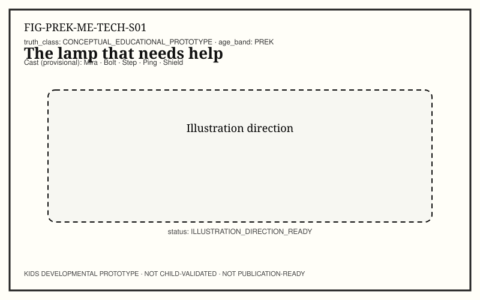

**Child-facing text:** Mira looks at a lamp. Bolt points to the switch, the cord, and the bulb. The screen of a phone nearby is only one part of another system.

**Try it:** Story hook: find three parts of one familiar device.

**Talk together:** Name parts without rushing.

### Spread S02 — What changes? (NOTICE)

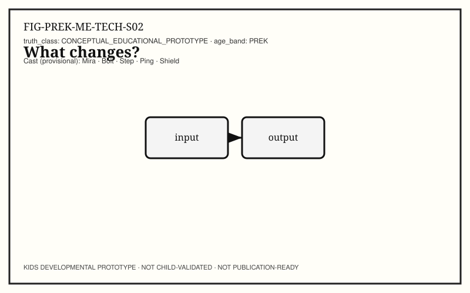

**Child-facing text:** When Mira presses the switch, light comes on. That press is an input. The light is an output.

**Try it:** Notice input then output once.

**Talk together:** Point to before and after.

### Spread S03 — System and part (NAME)

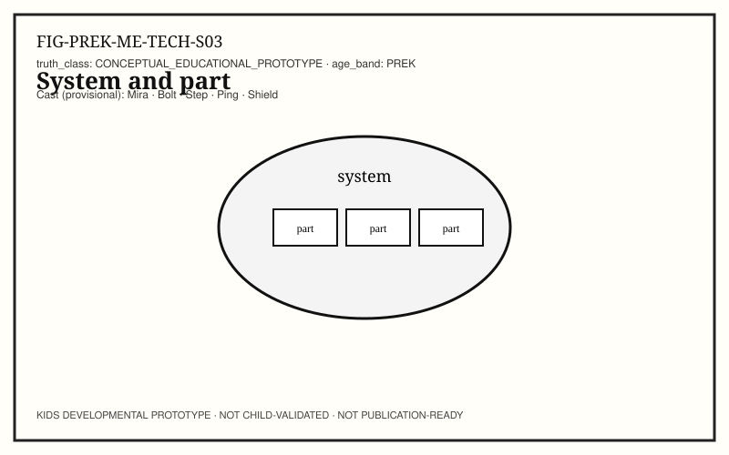

**Child-facing text:** Bolt says the lamp is a system. A part is one piece that helps. Switch, cord, bulb — parts of one system.

**Try it:** Say system and part while pointing.

**Talk together:** Use both words once.

### Spread S04 — Parts work together (CONNECT)

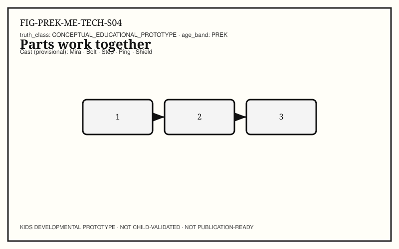

**Child-facing text:** If one part is missing, the system may not work. Step lines up: power → switch → light.

**Try it:** Connect three part cards in order.

**Talk together:** Order can matter.

### Spread S05 — What if the bulb is out? (PREDICT)

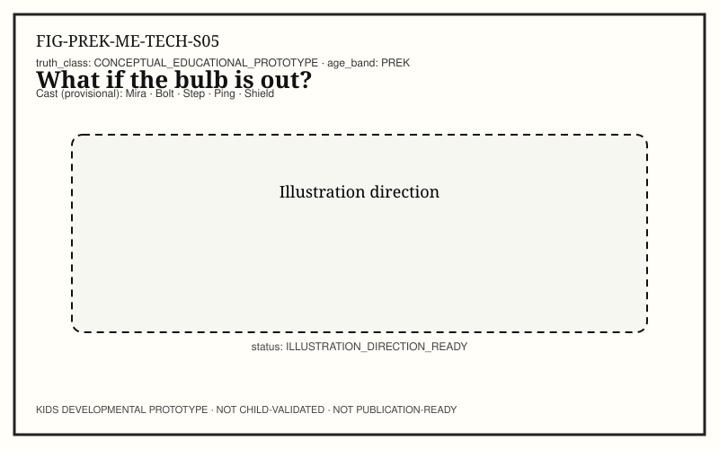

**Child-facing text:** Mira predicts: if the bulb is out, the switch still clicks, but maybe no bright output. What do you predict?

**Try it:** Predict before checking a safe toy lamp.

**Talk together:** Guesses are ok.

### Spread S06 — Find the parts (TRY)


**Child-facing text:** Try it with a caregiver: point to input, then point to output. Name one part of the system.

**Try it:** Hands-on part hunt on a safe device.

**Talk together:** Caregiver keeps it short.

### Spread S07 — Tell the story of parts (EXPLAIN)


**Child-facing text:** Explain which parts work together. Mira listens. Mistakes are ok.

**Try it:** Explain without perfection pressure.

**Talk together:** Listen more than correct.

### Spread S08 — Build a tiny system (MAKE)


**Child-facing text:** Make a cardboard system: input card, part card, output card. Bolt helps tape the path.

**Try it:** Build a three-card system.

**Talk together:** Celebrate the build.

### Spread S09 — Ask before opening (SAFE + FAIR)

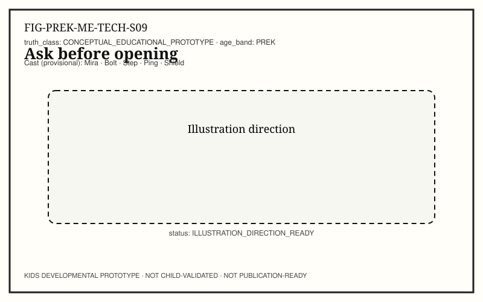

**Child-facing text:** Shield says: do not open real machines alone. Ask a trusted adult. Safe choices keep people and parts okay.

**Try it:** Choose the safer option: ask first.

**Talk together:** Calm, not scary.

### Spread S10 — Teach the words (TEACH)


**Child-facing text:** Teach your caregiver: system, part, input, output. You are the teacher now.

**Try it:** Teach-back four words with pointing.

**Talk together:** Adult becomes the learner.

### Unit facilitator pointer

Standards, media evidence, and provenance for this unit live in `STANDARDS_TRACEABILITY.yaml`, `MEDIA_EVIDENCE_TRACEABILITY.yaml`, and `UNIT_REGISTRY.yaml` — not in child-facing spreads.

---

## Unit 2. Working Space vs Keep-Box

**Unit ID:** `UNIT-PREK-INSIDE-01`  
**Strand:** Inside the Machine (`STRAND-INSIDE`)  
**Concept:** `KCON-CH07-MEMORY-STORAGE`  
**Learning goal:** Now vs later memory  
**Status:** `WORKING_DRAFT_COMPLETE`

### Spread S01 — Two boxes on the table (STORY)

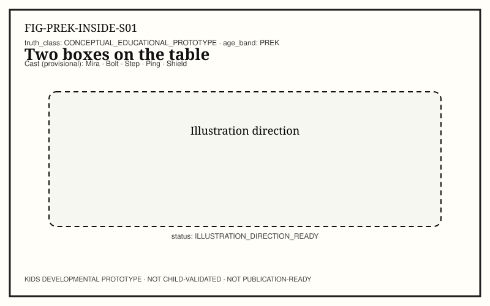

**Child-facing text:** Bolt shows Mira two boxes. One is Working Space — things we use right now. One is Keep-Box — things we save for later.

**Try it:** Story hook: now vs later.

**Talk together:** Two places, one idea.

### Spread S02 — What stays? (NOTICE)

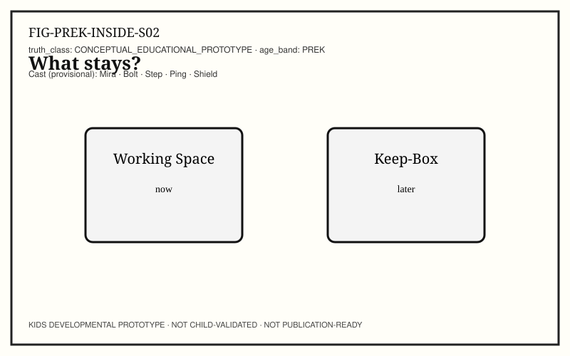

**Child-facing text:** Notice: a song playing now can stop. A picture saved in Keep-Box can still be there later.

**Try it:** Notice now versus later with a photo or drawing.

**Talk together:** Point to each box.

### Spread S03 — Name the places (NAME)

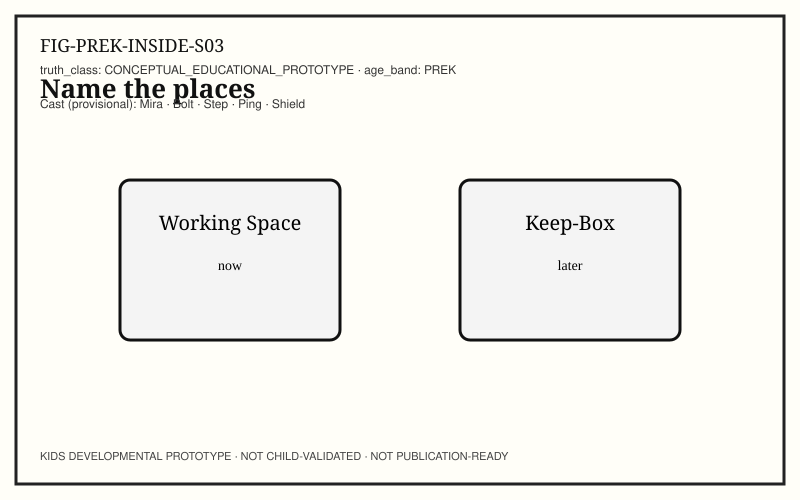

**Child-facing text:** Working Space is for now. Keep-Box holds data for later. Data means information we keep.

**Try it:** Name Working Space and Keep-Box once.

**Talk together:** Gloss data gently.

### Spread S04 — Same pattern (CONNECT)


**Child-facing text:** Step connects a pattern: make → use now → save to Keep-Box → find later.

**Try it:** Line up four step cards.

**Talk together:** Pattern means repeating order.

### Spread S05 — If we do not save? (PREDICT)

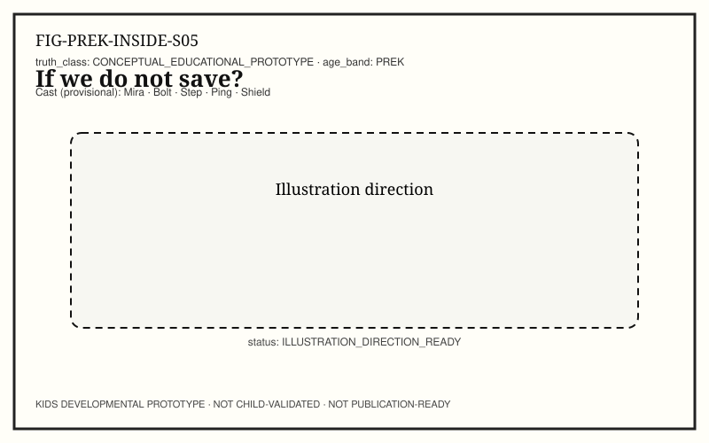

**Child-facing text:** If we only use Working Space and never save, what do you predict happens later?

**Try it:** Predict before trying a drawing save.

**Talk together:** Prediction, not certainty.

### Spread S06 — Save and find (TRY)

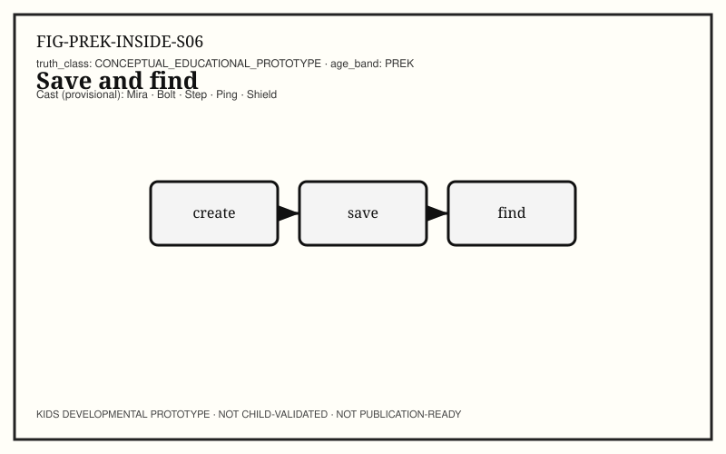

**Child-facing text:** Try it: draw a mark, put a copy in Keep-Box, then find it again with a caregiver.

**Try it:** Save-and-find paper activity.

**Talk together:** Short try; stop anytime.

### Spread S07 — Explain the two places (EXPLAIN)

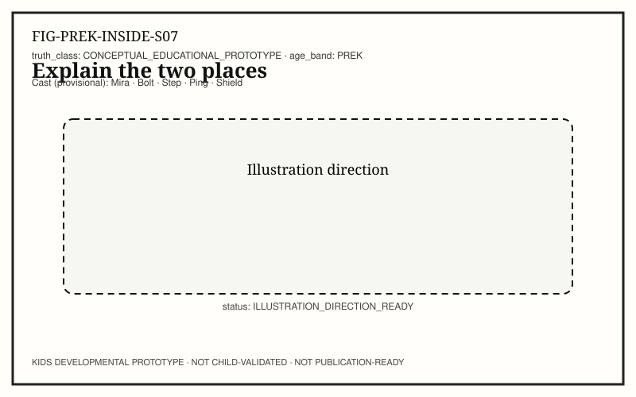

**Child-facing text:** Explain Working Space vs Keep-Box in your own words. Ping listens for the pattern.

**Try it:** Explain now vs later.

**Talk together:** Accept approximate words.

### Spread S08 — Make sorting mats (MAKE)

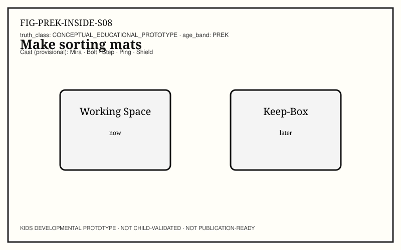

**Child-facing text:** Make two mats: Working Space and Keep-Box. Sort picture cards into each mat.

**Try it:** Hands-on sort.

**Talk together:** Talk while sorting.

### Spread S09 — Who may see saved things? (SAFE + FAIR)

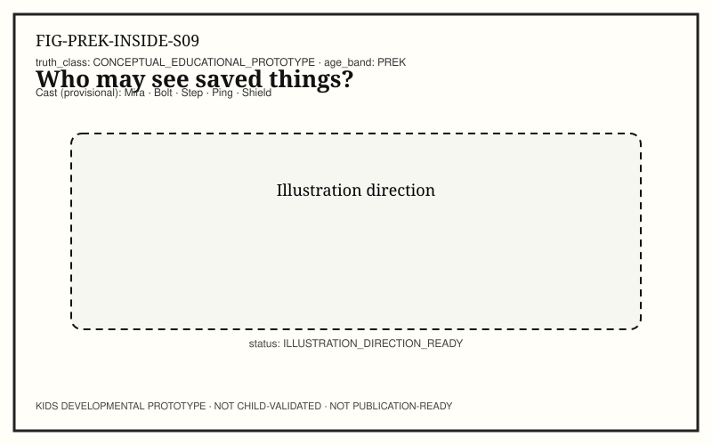

**Child-facing text:** Shield asks: some saved data is private. Ask a trusted adult before sharing Keep-Box photos.

**Try it:** Choose private vs share-with-adult.

**Talk together:** Calm privacy talk.

### Spread S10 — Teach now vs later (TEACH)


**Child-facing text:** Teach your caregiver the difference between Working Space and Keep-Box.

**Try it:** Teach-back with the two mats.

**Talk together:** Celebrate the teach.

### Unit facilitator pointer

Standards, media evidence, and provenance for this unit live in `STANDARDS_TRACEABILITY.yaml`, `MEDIA_EVIDENCE_TRACEABILITY.yaml`, and `UNIT_REGISTRY.yaml` — not in child-facing spreads.

---

## Unit 3. Simple Algorithm

**Unit ID:** `UNIT-PREK-INSTRUCTIONS-01`  
**Strand:** Instructions & Code (`STRAND-INSTRUCTIONS`)  
**Concept:** `KCON-CH14-APPS-UI`  
**Learning goal:** Ordered instructions  
**Status:** `WORKING_DRAFT_COMPLETE`

### Spread S01 — Step brings cards (STORY)

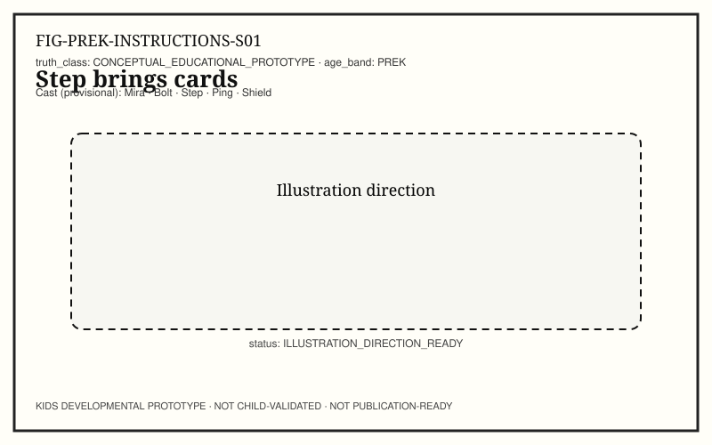

**Child-facing text:** Step brings three cards. An instruction tells what to do. A sequence is instructions in order.

**Try it:** Story hook: ordered cards.

**Talk together:** Order matters more than fancy words.

### Spread S02 — First, next, last (NOTICE)


**Child-facing text:** Notice first, next, last on a snack helper: 1 wash hands  2 get cup  3 pour water.

**Try it:** Notice three ordered steps.

**Talk together:** Point first/next/last.

### Spread S03 — Instruction and sequence (NAME)

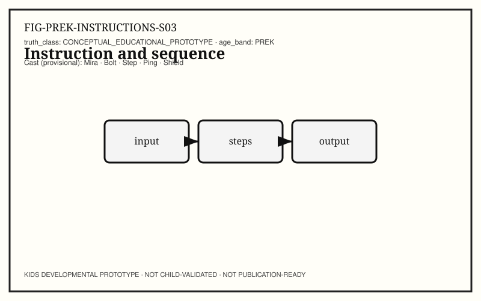

**Child-facing text:** Name it: each card is an instruction. Together in order they make a sequence — a simple algorithm.

**Try it:** Say instruction and sequence once.

**Talk together:** Algorithm means ordered steps.

### Spread S04 — Input to output (CONNECT)

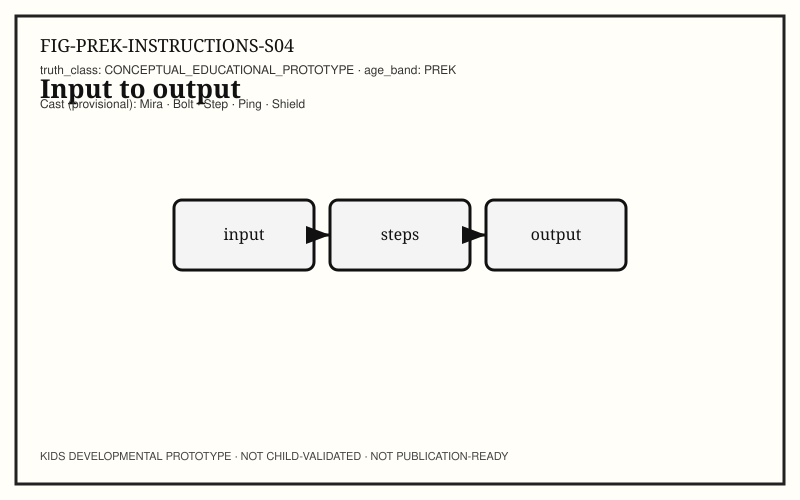

**Child-facing text:** Connect: input (press) → instructions (steps) → output (what you see). Apps follow rules like this.

**Try it:** Connect IPO cards.

**Talk together:** Link to everyday helper apps gently.

### Spread S05 — Wrong order? (PREDICT)

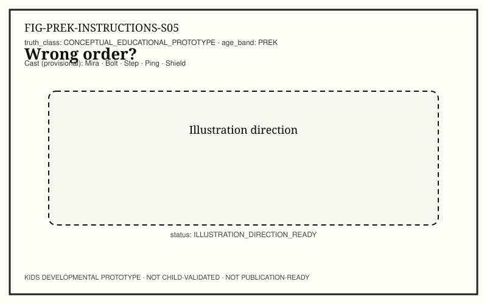

**Child-facing text:** If we pour water before getting the cup, what do you predict? Step smiles — sequences can be fixed.

**Try it:** Predict a mixed-up sequence.

**Talk together:** Wrong order is a fixable clue.

### Spread S06 — Run the steps (TRY)

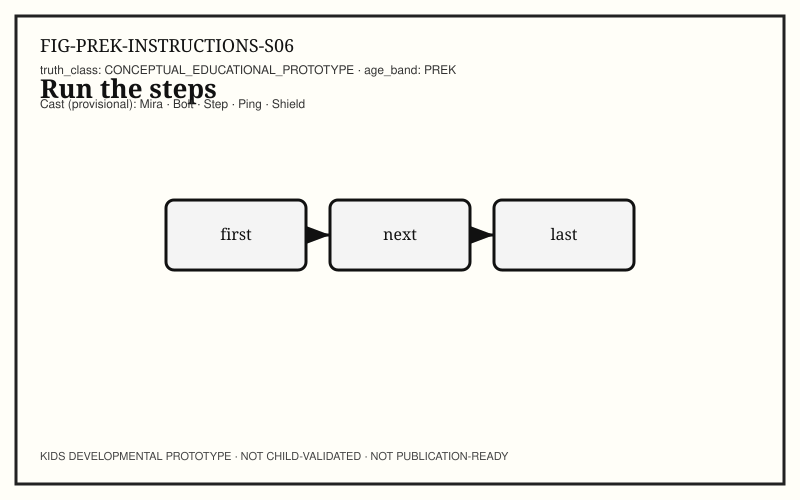

**Child-facing text:** Try a three-step sequence with paper cards. Follow first, next, last. Stop anytime.

**Try it:** Run a caregiver-safe sequence.

**Talk together:** Process over polish.

### Spread S07 — Explain your sequence (EXPLAIN)

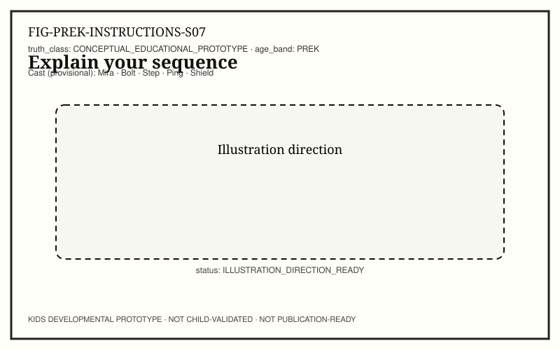

**Child-facing text:** Explain your sequence. Why does order matter? Mira listens.

**Try it:** Explain without perfection pressure.

**Talk together:** Listen without correcting every word.

### Spread S08 — Build-a-sequence (MAKE)

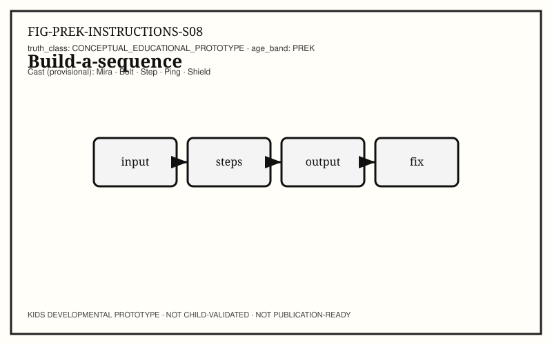

**Child-facing text:** Build cards: Input → Steps → Output. Add a Fix card if something goes wrong.

**Try it:** Hands-on sequence build.

**Talk together:** Optional Fix card.

### Spread S09 — Fair turns with steps (SAFE + FAIR)

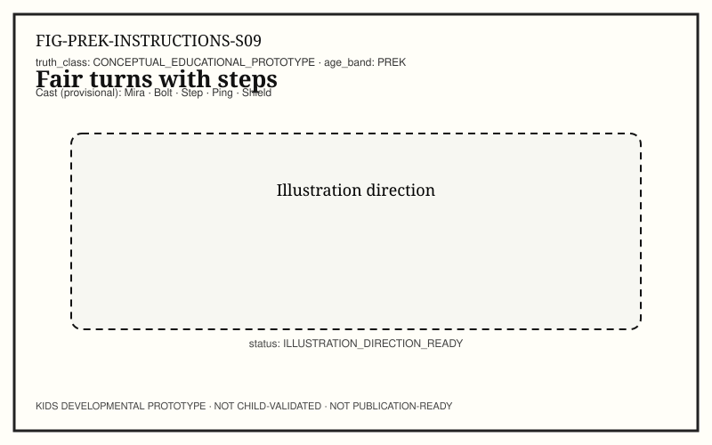

**Child-facing text:** Shield says take turns giving instructions. Fair means everyone can try the sequence.

**Try it:** Choose fair turn-taking.

**Talk together:** Include different ways to show steps.

### Spread S10 — Teach three steps (TEACH)

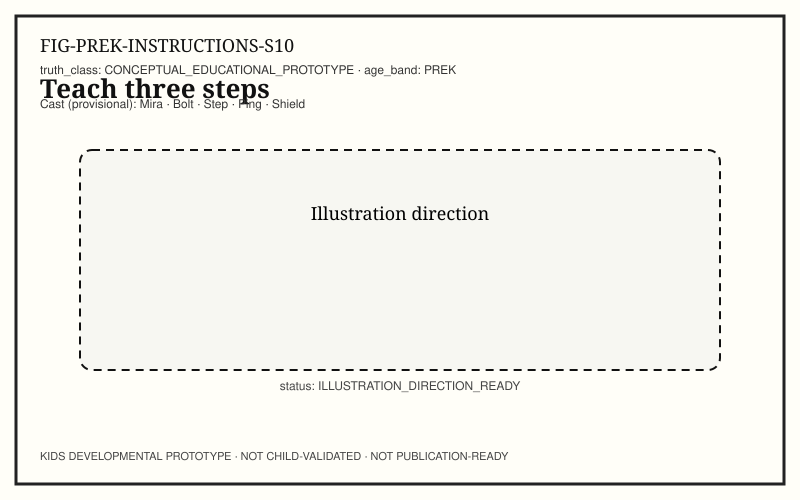

**Child-facing text:** Teach your caregiver a three-step sequence. You are the teacher now.

**Try it:** Teach-back three steps.

**Talk together:** Adult becomes the learner.

### Unit facilitator pointer

Standards, media evidence, and provenance for this unit live in `STANDARDS_TRACEABILITY.yaml`, `MEDIA_EVIDENCE_TRACEABILITY.yaml`, and `UNIT_REGISTRY.yaml` — not in child-facing spreads.

---

## Unit 4. Paths and Rules

**Unit ID:** `UNIT-PREK-MESSAGES-01`  
**Strand:** Messages & Connections (`STRAND-MESSAGES`)  
**Concept:** `KCON-CH16-PACKETS-INTERNET`  
**Learning goal:** Message follows a path  
**Status:** `WORKING_DRAFT_COMPLETE`

### Spread S01 — Ping draws a path (STORY)

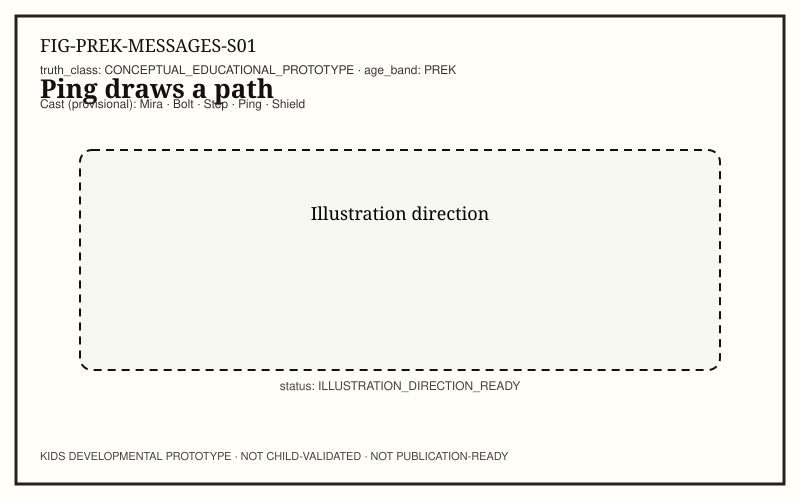

**Child-facing text:** Ping draws a dotted path from Mira to a helper across the room. A message can travel here to there.

**Try it:** Story hook: here to there.

**Talk together:** Plant network idea gently.

### Spread S02 — Local or far? (NOTICE)

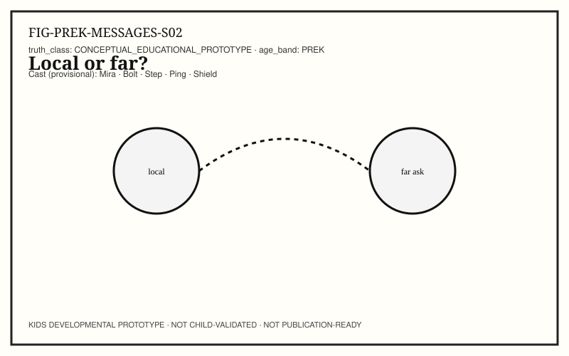

**Child-facing text:** Notice: sometimes the answer is already here. Sometimes a message must ask far away.

**Try it:** Notice local vs far ask.

**Talk together:** Two possibilities.

### Spread S03 — Message and path (NAME)


**Child-facing text:** Name it: a message is information that travels. A path is the way it goes. Rules tell how to send it.

**Try it:** Say message and path once.

**Talk together:** Concrete pointing.

### Spread S04 — Rules for the path (CONNECT)

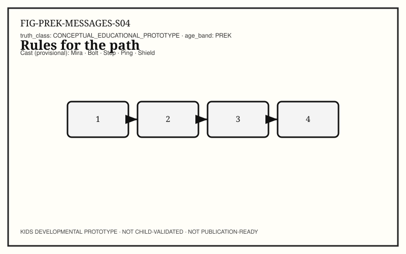

**Child-facing text:** Connect the pattern: start → follow path → arrive → reply. Rules keep the path fair and clear.

**Try it:** Connect four path cards.

**Talk together:** Rules are helpers, not scares.

### Spread S05 — If the path is blocked? (PREDICT)


**Child-facing text:** If a door is closed on the path, what do you predict? Maybe wait, or try another path later.

**Try it:** Predict a blocked path.

**Talk together:** Messages do not always arrive.

### Spread S06 — Draw Ping's path (TRY)

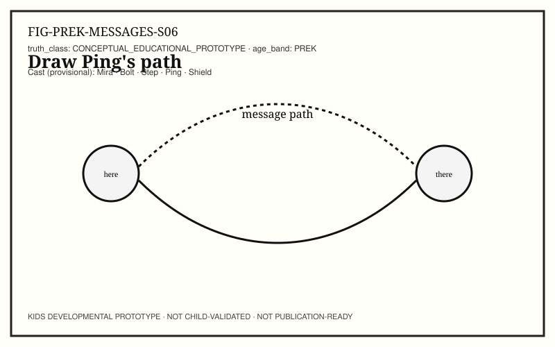

**Child-facing text:** Try it: draw a simple out-and-back message path on paper. Ping rides the dots.

**Try it:** Draw out-and-back path.

**Talk together:** Paper path is enough.

### Spread S07 — Explain the path (EXPLAIN)

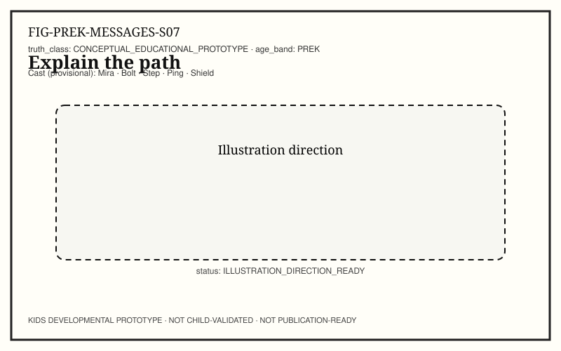

**Child-facing text:** Explain which path you drew and why. Mistakes are ok.

**Try it:** Explain the path.

**Talk together:** Listen without correcting every word.

### Spread S08 — Message relay (MAKE)

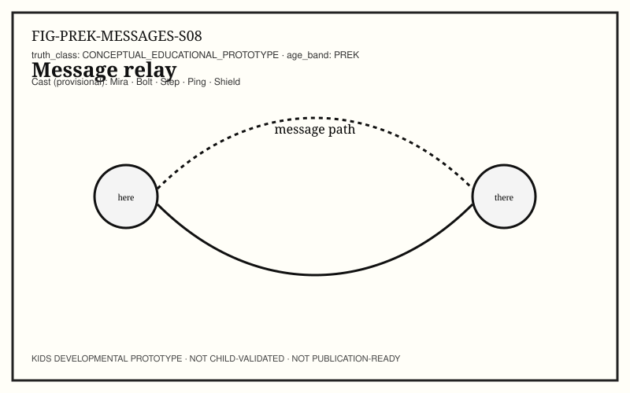

**Child-facing text:** Make a paper-note relay: write a kind mark, follow the path, deliver. Add a Rule card: ask first.

**Try it:** Hands-on relay with rule.

**Talk together:** Keep messages kind.

### Spread S09 — Who may get the message? (SAFE + FAIR)

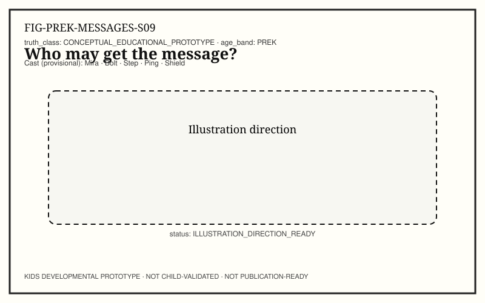

**Child-facing text:** Shield says: do we send to a stranger? No — ask a trusted adult. Safe and private choices matter.

**Try it:** Choose safer recipient.

**Talk together:** Calm, not scary.

### Spread S10 — Teach the path (TEACH)

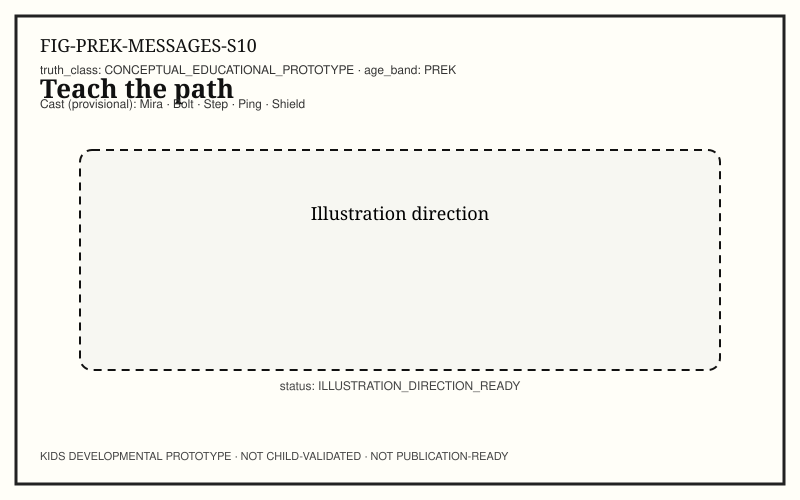

**Child-facing text:** Teach your caregiver the out-and-back path and one rule.

**Try it:** Teach-back path + rule.

**Talk together:** Adult becomes the learner.

### Unit facilitator pointer

Standards, media evidence, and provenance for this unit live in `STANDARDS_TRACEABILITY.yaml`, `MEDIA_EVIDENCE_TRACEABILITY.yaml`, and `UNIT_REGISTRY.yaml` — not in child-facing spreads.

---

## Unit 5. Saved for Later

**Unit ID:** `UNIT-PREK-DATA-01`  
**Strand:** Data & Intelligence (`STRAND-DATA`)  
**Concept:** `KCON-CH13-FILES-DATA-LIFE`  
**Learning goal:** Create/save/find  
**Status:** `WORKING_DRAFT_COMPLETE`

### Spread S01 — A drawing to keep (STORY)

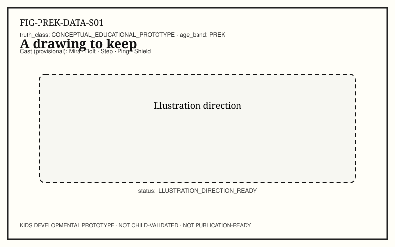

**Child-facing text:** Mira makes a drawing. Bolt says we can save it — keep the data for later — then find it again.

**Try it:** Story hook: create, save, find.

**Talk together:** Data means kept information.

### Spread S02 — Create, save, find (NOTICE)


**Child-facing text:** Notice the pattern: create → save → find. Missing a step changes what happens later.

**Try it:** Notice the three-step pattern.

**Talk together:** Point to each step.

### Spread S03 — Name the data (NAME)

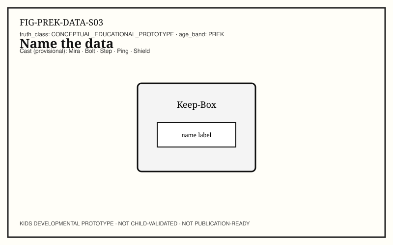

**Child-facing text:** Name it: the drawing is data. A name or picture label helps us find it in the Keep-Box.

**Try it:** Give a drawing a simple name label.

**Talk together:** Names help finding.

### Spread S04 — Same idea in devices (CONNECT)

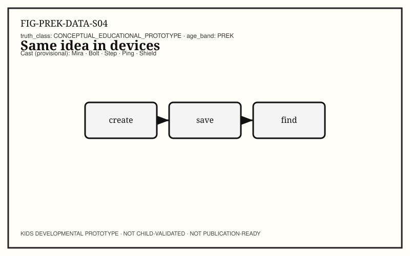

**Child-facing text:** Connect: phones and computers also create, save, and find. The pattern is the same, even if insides differ.

**Try it:** Connect paper pattern to a caregiver-shown save.

**Talk together:** No need for deep file jargon.

### Spread S05 — If we skip save? (PREDICT)


**Child-facing text:** If we create but do not save, what do you predict when we look later?

**Try it:** Predict missing save.

**Talk together:** Prediction, not certainty.

### Spread S06 — Save and find again (TRY)

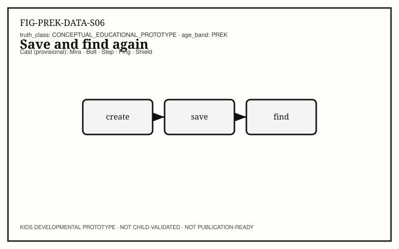

**Child-facing text:** Try it: create a mark, save it in an envelope, then find it. Caregiver helps.

**Try it:** Create-save-find try.

**Talk together:** Short, stoppable.

### Spread S07 — Explain the pattern (EXPLAIN)

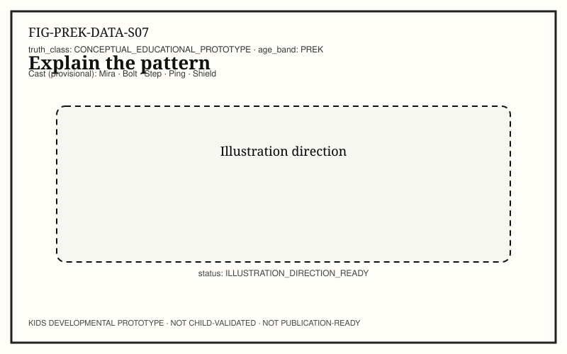

**Child-facing text:** Explain create, save, find. Step listens for the pattern.

**Try it:** Explain the three words.

**Talk together:** Accept approximate language.

### Spread S08 — Make a find box (MAKE)

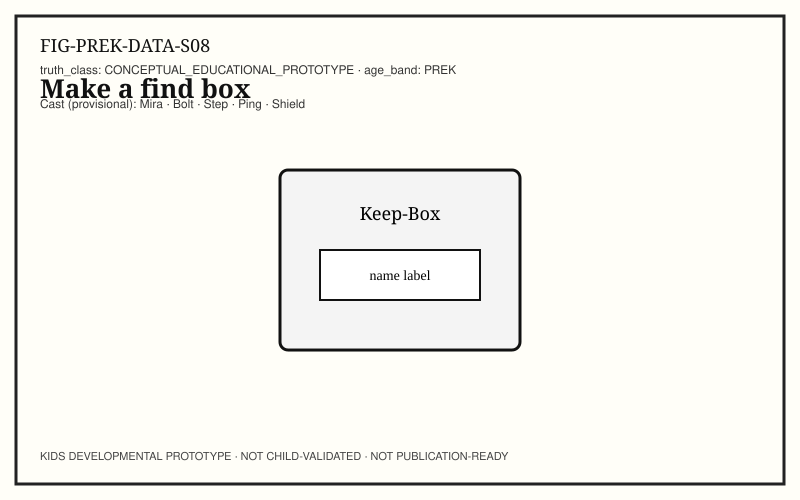

**Child-facing text:** Make a Find Box with labeled envelopes. Put drawings in. Practice finding by label.

**Try it:** Build labeled find box.

**Talk together:** Celebrate locating.

### Spread S09 — Private data (SAFE + FAIR)


**Child-facing text:** Shield says some data is private — not for every screen or stranger. Ask before sharing.

**Try it:** Choose private vs share-with-adult.

**Talk together:** Privacy without fear.

### Spread S10 — Teach create-save-find (TEACH)

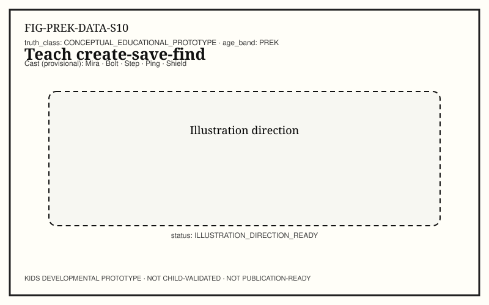

**Child-facing text:** Teach your caregiver the create → save → find pattern.

**Try it:** Teach-back the pattern.

**Talk together:** Adult becomes the learner.

### Unit facilitator pointer

Standards, media evidence, and provenance for this unit live in `STANDARDS_TRACEABILITY.yaml`, `MEDIA_EVIDENCE_TRACEABILITY.yaml`, and `UNIT_REGISTRY.yaml` — not in child-facing spreads.

---

## Unit 6. Safe or Private Choice

**Unit ID:** `UNIT-PREK-SAFE-01`  
**Strand:** Safe, Private & Fair (`STRAND-SAFE`)  
**Concept:** `KCON-CH24-PRIVACY-ETHICS`  
**Learning goal:** Choose the safer path  
**Status:** `WORKING_DRAFT_COMPLETE`

### Spread S01 — Shield's two doors (STORY)

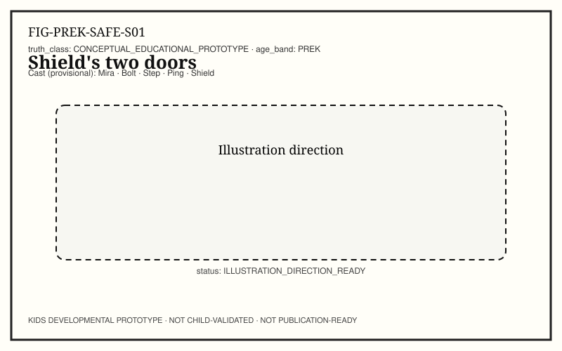

**Child-facing text:** Shield shows two doors: Safe Choice and Pause-to-Ask. Mira practices choosing before sharing a screen.

**Try it:** Story hook: choose before share.

**Talk together:** Calm tone.

### Spread S02 — Who can see? (NOTICE)

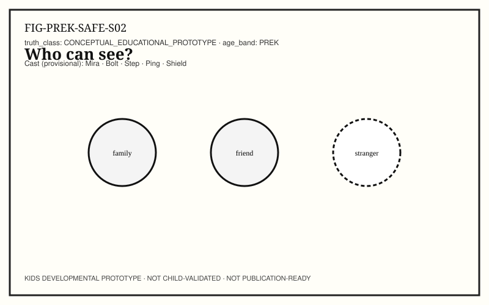

**Child-facing text:** Notice who can see: family, friend, or stranger? Private means not for everyone.

**Try it:** Notice audience options.

**Talk together:** Point to who can see.

### Spread S03 — Safe and private (NAME)


**Child-facing text:** Name it: safe means people stay okay. Private means some information stays with trusted people.

**Try it:** Say safe and private once.

**Talk together:** Gloss gently.

### Spread S04 — Fair includes helpers (CONNECT)

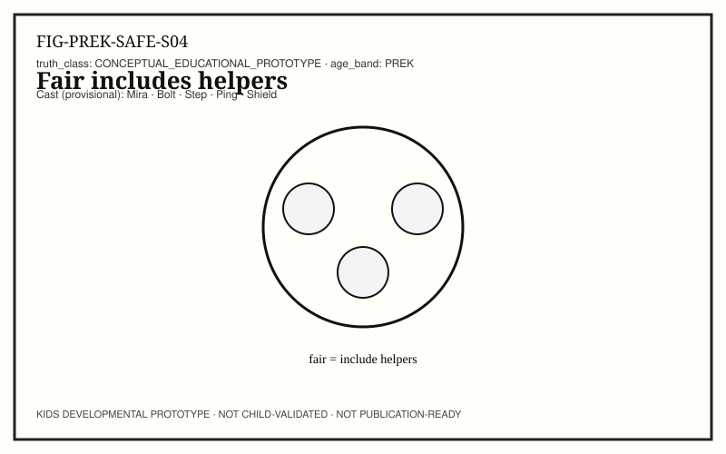

**Child-facing text:** Connect: fair means friends who need different tools can still join. Accessibility is part of fairness.

**Try it:** Connect fair with including helpers.

**Talk together:** Belonging, not pity.

### Spread S05 — Share with a stranger? (PREDICT)

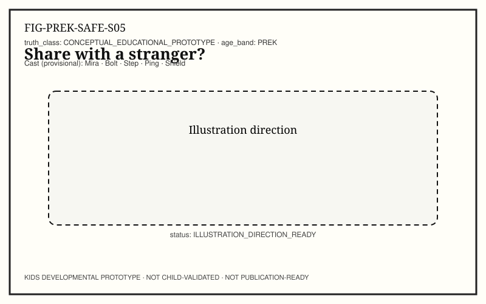

**Child-facing text:** If someone unknown asks to see the screen, what do you predict is safer?

**Try it:** Predict safer choice.

**Talk together:** No scare stories.

### Spread S06 — Practice the choice (TRY)


**Child-facing text:** Try choice cards: Share with caregiver / Ask first / Not with a stranger. Pick the safer path.

**Try it:** Choice-card practice.

**Talk together:** Celebrate the pause.

### Spread S07 — Explain your choice (EXPLAIN)


**Child-facing text:** Explain why you chose safe or private. Shield listens. Mistakes are ok.

**Try it:** Explain the choice.

**Talk together:** Listen without shaming.

### Spread S08 — Make a pause sign (MAKE)

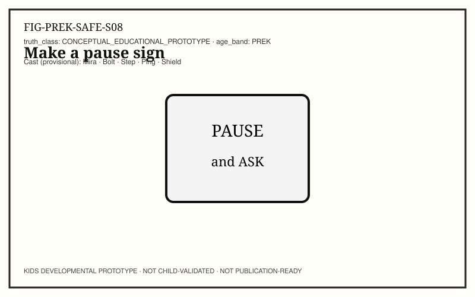

**Child-facing text:** Make a Pause-and-Ask sign for the family device corner. Practice holding it up.

**Try it:** Craft pause sign.

**Talk together:** Family agreement.

### Spread S09 — Stop is always ok (SAFE + FAIR)


**Child-facing text:** Shield says stop is always ok. Safe, private, and fair choices can be made slowly.

**Try it:** Practice an easy stop.

**Talk together:** Agency without pressure.

### Spread S10 — Teach safe or private (TEACH)


**Child-facing text:** Teach your caregiver one safe choice and one private choice.

**Try it:** Teach-back two choices.

**Talk together:** Adult becomes the learner.

### Unit facilitator pointer

Standards, media evidence, and provenance for this unit live in `STANDARDS_TRACEABILITY.yaml`, `MEDIA_EVIDENCE_TRACEABILITY.yaml`, and `UNIT_REGISTRY.yaml` — not in child-facing spreads.

---

## Unit 7. Build a Sequence

**Unit ID:** `UNIT-PREK-BUILD-01`  
**Strand:** Build, Test & Share (`STRAND-BUILD`)  
**Concept:** `KCON-CH26-SOFTWARE-VCS`  
**Learning goal:** Plan → try → fix  
**Status:** `WORKING_DRAFT_COMPLETE`

### Spread S01 — Plan on the table (STORY)

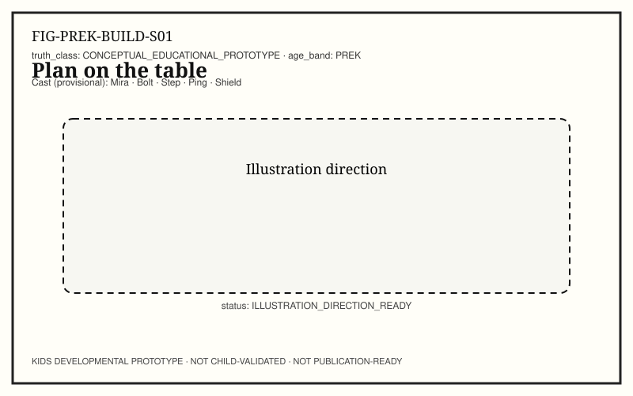

**Child-facing text:** Step and Bolt help Mira plan a sequence, try it, then fix it. First tries do not need to be perfect.

**Try it:** Story hook: plan → try → fix.

**Talk together:** Repair is celebrated.

### Spread S02 — Two versions (NOTICE)

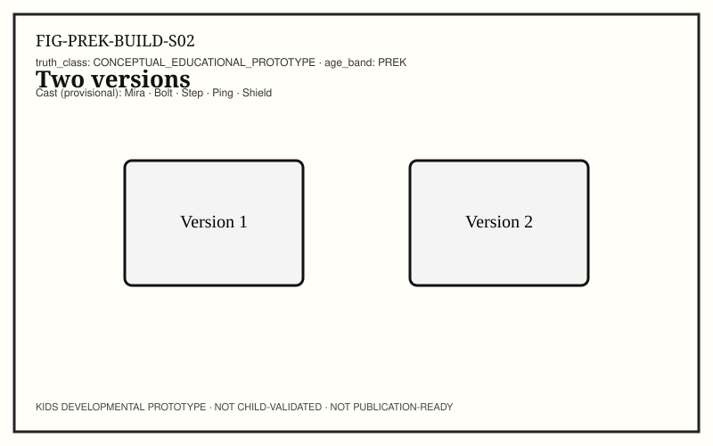

**Child-facing text:** Notice Version 1 and Version 2 of the same plan. Saving versions helps us go back.

**Try it:** Notice two versions side by side.

**Talk together:** History without jargon pressure.

### Spread S03 — Test means check (NAME)

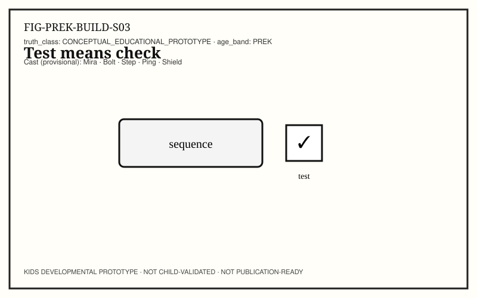

**Child-facing text:** Name it: a test means we check if the sequence works. If not, we fix and try again.

**Try it:** Say test once with a check gesture.

**Talk together:** Test is checking, not a grade.

### Spread S04 — Plan, try, fix (CONNECT)

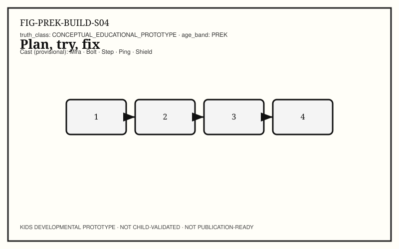

**Child-facing text:** Connect the pattern: plan → try → test → fix. That is how builders improve a sequence.

**Try it:** Connect four builder cards.

**Talk together:** Pattern language.

### Spread S05 — What will Version 2 fix? (PREDICT)


**Child-facing text:** Look at a wobbly Version 1. What do you predict Version 2 should change?

**Try it:** Predict a fix.

**Talk together:** Prediction before rebuild.

### Spread S06 — Try and test (TRY)

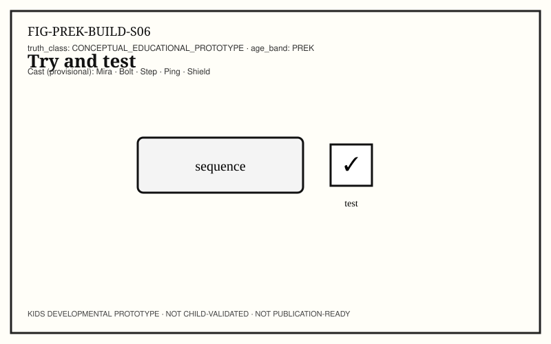

**Child-facing text:** Try your sequence. Test it once. If it wobbles, fix one thing. Stop anytime.

**Try it:** Try-test-fix loop once.

**Talk together:** One change at a time.

### Spread S07 — Explain what changed (EXPLAIN)

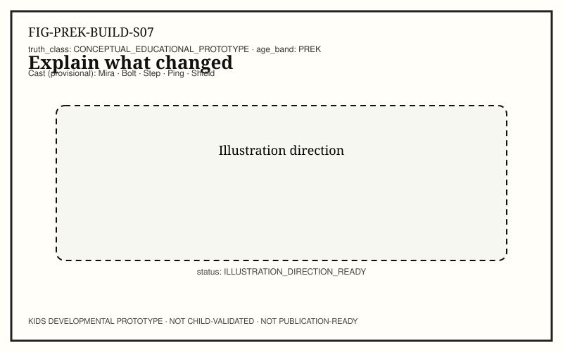

**Child-facing text:** Explain what changed from Version 1 to Version 2. Ping listens.

**Try it:** Explain the fix.

**Talk together:** Process over polish.

### Spread S08 — Keep both versions (MAKE)

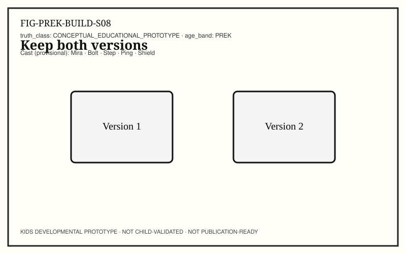

**Child-facing text:** Make Version 1 and Version 2 cards. Keep both. Builders save versions so they can go back.

**Try it:** Keep two version artifacts.

**Talk together:** History is helpful.

### Spread S09 — Share kindly (SAFE + FAIR)

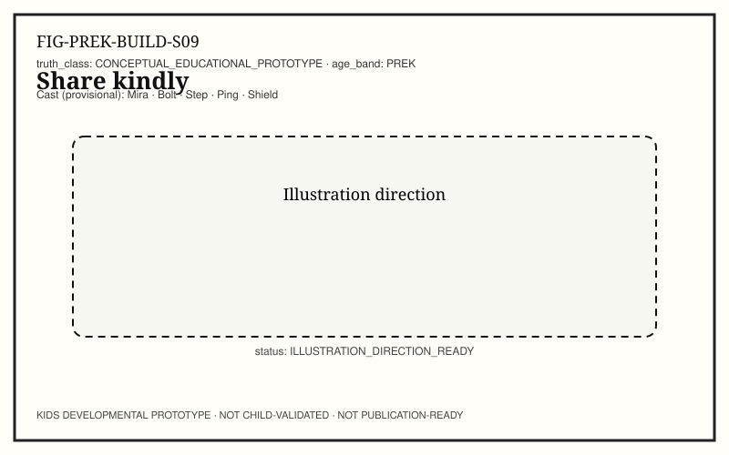

**Child-facing text:** Shield says share your build only with trusted people. Fair feedback is kind and specific.

**Try it:** Practice kind share words.

**Talk together:** No humiliation humor.

### Spread S10 — Teach plan-try-fix (TEACH)


**Child-facing text:** Teach your caregiver plan → try → test → fix. You are the teacher now.

**Try it:** Teach-back the builder pattern.

**Talk together:** Adult becomes the learner.

### Unit facilitator pointer

Standards, media evidence, and provenance for this unit live in `STANDARDS_TRACEABILITY.yaml`, `MEDIA_EVIDENCE_TRACEABILITY.yaml`, and `UNIT_REGISTRY.yaml` — not in child-facing spreads.

---

## Back matter

### Glossary (caregiver-facing terms used with children)

See `GLOSSARY.yaml` for child-safe glosses of input, output, part, system, instruction, sequence, message, pattern, data, safe, private, and test.

### Caregiver / educator extensions

See `CAREGIVER_EDUCATOR_NOTES.md` for pause prompts, household extensions, and an optional light WAIKE bridge (caregiver/educator facing only).

### Standards / evidence appendix

Adult-facing only: `STANDARDS_TRACEABILITY.yaml` and `MEDIA_EVIDENCE_TRACEABILITY.yaml`. Relationship: CROSSWALKED_AGAINST / editorial ADJACENT or NOT_YET_MAPPED. No certification claims.

### Accessibility alternatives

See `ACCESSIBILITY_NOTES.md`.

### Provenance

Source metadata: `BOOK_METADATA.yaml`, `ARTIFACT_MANIFEST.yaml`. WAIKE SHA reconfirmed in kids crosswalk: `e97e74fc9bfb44b1cdc26b272dc4848264f15fe0` (caregiver/educator facing; no invented modules).
