# KIDS-PRESCHOOL — Full Working Manuscript (7 Strands)

```
KIDS DEVELOPMENTAL PROTOTYPE
NOT CHILD-VALIDATED
NOT PUBLICATION-READY
KIDS_CHILD_VALIDATION_PENDING
NO_CHILD_VALIDATION_EVIDENCE
NO_STANDARDS_CERTIFICATION_EVIDENCE
```

**Age guide:** 3–4 years (guide, not deadline)  
**Status ceiling:** `WORKING_DRAFT_COMPLETE`  
**Cast (provisional — Character Bible Option A):** Mira · Bolt · Step · Ping · Shield  
_Provisional Character Bible Option A — not owner-locked IP._

## Caregiver / educator note

Story first. Notice before naming. Prediction before correction. Stop anytime.  
Truth banners, standards IDs, SHA provenance, and WAIKE notes live in adult-facing companions — **not** in child-facing text blocks.

## How to use

1. Read one unit in a short sitting (or split across days).  
2. Follow the cadence: STORY → NOTICE → NAME → CONNECT → PREDICT → TRY → EXPLAIN → MAKE → SAFE+FAIR → TEACH.  
3. Prefer pointing, gestures, and play over verbal performance.  
4. Keep offline play after device tries.

## Safety & accessibility (adult)

- Adult mediation for any device try.  
- No child accounts, no child data collection, no dark patterns.  
- Easy stop is success.  
- Offer pointing, AAC, or drawing routes for teach-back.

---

## UNIT-PRESCHOOL-ME-TECH-01 — Screen Is One Part

**Strand:** Me & Technology (`STRAND-ME-TECH`)  
**Adult concept (facilitator):** `KCON-CH01-SYSTEM-NOT-SCREEN` · status `WORKING_DRAFT_COMPLETE`

**Learning goal:** Outside vs inside — screen is one part of a device.

### Spread S01 — The music box (STORY)

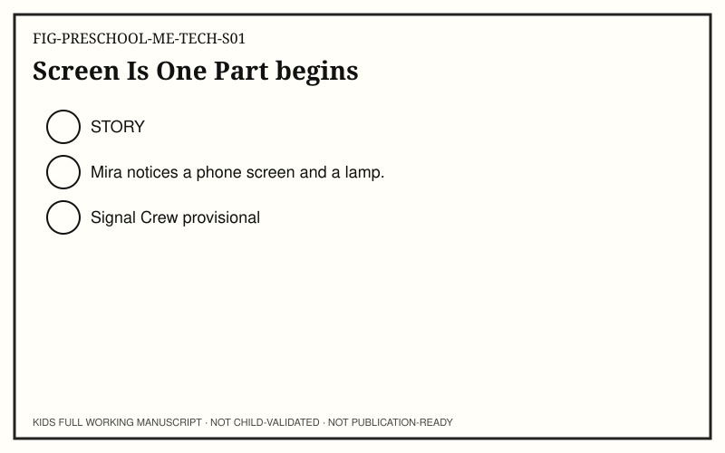

**Child-facing text:** Mira wants a song. Bolt taps the shiny screen. Is the screen the whole box?

**Try it:** Meet Mira and Bolt; set the tiny problem.

**Talk together:** Tell the tiny story once. Pause for looking.

### Spread S02 — What we notice (NOTICE)


**Child-facing text:** The screen lights up. A button waits. A speaker sits nearby. What did you see first?

**Try it:** List noticed parts with pointing.

**Talk together:** Notice before naming tech words.

### Spread S03 — Name the outsides (NAME)

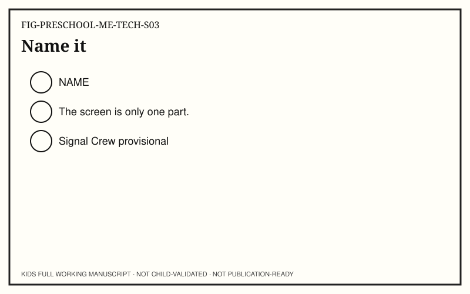

**Child-facing text:** Screen. Button. Speaker. Those are outside parts we can name.

**Try it:** Count three outside parts on fingers.

**Talk together:** Concrete nouns only.

### Spread S04 — Something inside helps (CONNECT)



**Child-facing text:** Something inside the box helps the parts work. The screen is not the whole story.

**Try it:** Gesture from outside to inside helpers.

**Talk together:** Keep mystery honest: we do not open sealed devices.

### Spread S05 — Predict the parts (PREDICT)

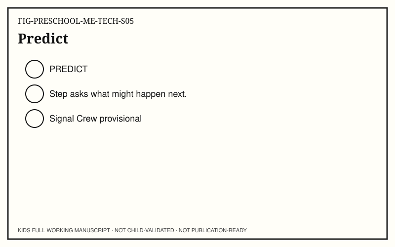

**Child-facing text:** If we press the button, which part helps next — screen, light, or speaker?

**Try it:** Predict which part acts next.

**Talk together:** Accept any sincere guess.

### Spread S06 — Try the song path (TRY)



**Child-facing text:** First press. Next the screen changes. Last the speaker sings. Act it with Mira.

**Try it:** Act outside to inside to sound with gestures.

**Talk together:** Movement helps memory.

### Spread S07 — One part of many (EXPLAIN)


**Child-facing text:** Bolt says the screen is one part. Inside helpers and outside parts work together.

**Try it:** Explain screen-as-one-part in plain words.

**Talk together:** Keep language concrete.

### Spread S08 — Sort outside and inside (MAKE)

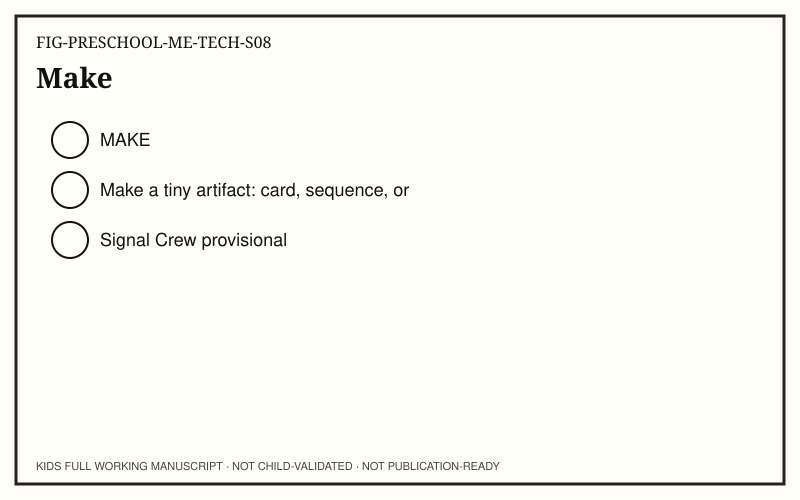

**Child-facing text:** Sort cards: outside parts / inside helpers. Can you put them in two piles?

**Try it:** Sorting outside vs inside with cards.

**Talk together:** Use drawings or cards.

### Spread S09 — Stop anytime (SAFE + FAIR)



**Child-facing text:** If the song is too loud, Shield says we stop. Stopping is fair.

**Try it:** Model agency to stop.

**Talk together:** Model stop without shame.

### Spread S10 — Teach a friend (TEACH)

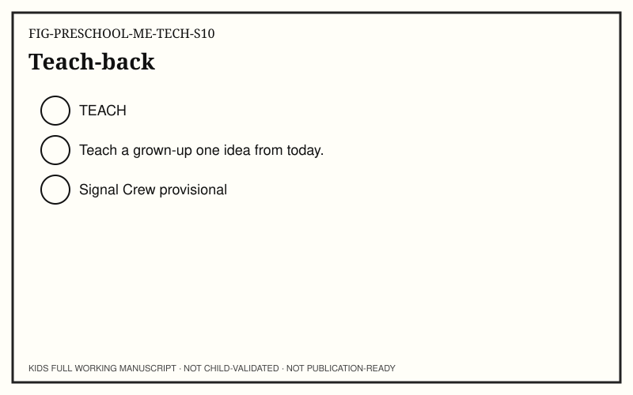

**Child-facing text:** Tell the story: screen is one part. Teach someone you trust.

**Try it:** Optional teach-back.

**Talk together:** Optional peer or caregiver share.

**Facilitator pointer:** Editor, standards, media, and provenance notes live in companion YAML/MD files — not in child-facing spreads.

---

## UNIT-PRESCHOOL-INSIDE-01 — Parts We Can Name

**Strand:** Inside the Machine (`STRAND-INSIDE`)  
**Adult concept (facilitator):** `KCON-CH04-DEVICE-FORMS` · status `WORKING_DRAFT_COMPLETE`

**Learning goal:** Name button, light, and speaker on different device shapes.

### Spread S01 — Three friend devices (STORY)

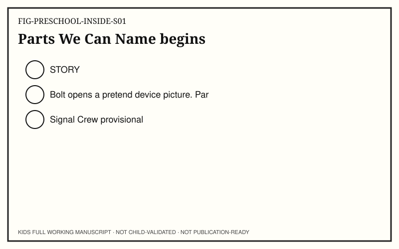

**Child-facing text:** Mira finds a phone, a speaker, and a lamp. Bolt wonders: what parts do they share?

**Try it:** Meet three device shapes.

**Talk together:** Pause to look at each shape.

### Spread S02 — Notice the parts (NOTICE)


**Child-facing text:** A button to press. A light that blinks. A speaker that sings. What do you notice?

**Try it:** Point to button, light, speaker.

**Talk together:** Accept pointing as answers.

### Spread S03 — Name three parts (NAME)



**Child-facing text:** Button. Light. Speaker. We can name the same parts on different devices.

**Try it:** Say or gesture each part name.

**Talk together:** Concrete nouns only.

### Spread S04 — Same parts, different shapes (CONNECT)


**Child-facing text:** Big speaker, small phone — both can have a button and a light. Shapes change; parts stay nameable.

**Try it:** Connect same part across two shapes.

**Talk together:** Gesture matching parts.

### Spread S05 — Predict the job (PREDICT)


**Child-facing text:** If Bolt presses the button on the lamp, what happens first?

**Try it:** Predict before trying.

**Talk together:** Accept sincere guesses.

### Spread S06 — Try naming on each (TRY)


**Child-facing text:** Find button, light, speaker on each friend device. Act a press, blink, then sound.

**Try it:** Name parts on each device in turn.

**Talk together:** Keep tries short and stoppable.

### Spread S07 — Parts help jobs (EXPLAIN)

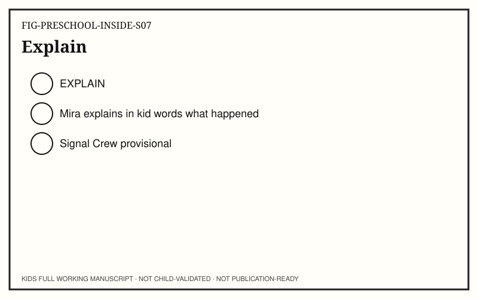

**Child-facing text:** Step says parts help the device do its job. Naming parts helps us look carefully.

**Try it:** Explain why naming parts helps.

**Talk together:** Keep language concrete.

### Spread S08 — Make a parts collage (MAKE)



**Child-facing text:** Draw or cut three cards: button, light, speaker. Stick them on your favorite device shape.

**Try it:** Hands-on parts collage.

**Talk together:** Local art only; no photos required.

### Spread S09 — Gentle hands (SAFE + FAIR)

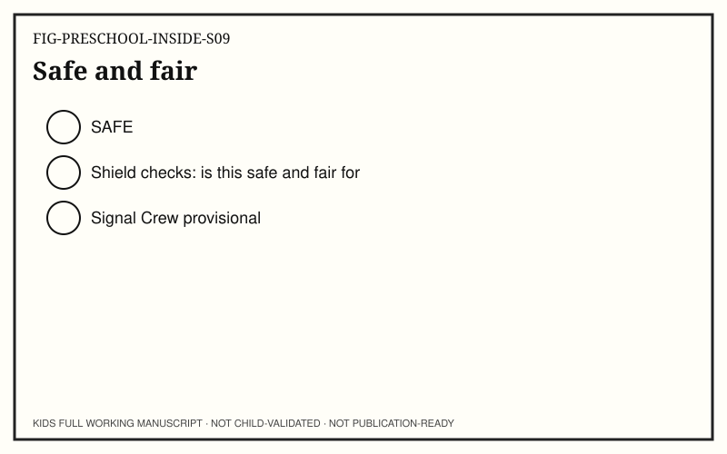

**Child-facing text:** Shield says we look and name with gentle hands. We do not open sealed devices.

**Try it:** Model gentle, mediated looking.

**Talk together:** Adult mediation always.

### Spread S10 — Teach the three names (TEACH)



**Child-facing text:** Teach a friend: button, light, speaker. Three parts we can name.

**Try it:** Optional teach-back of three names.

**Talk together:** No forced performance.

**Facilitator pointer:** Editor, standards, media, and provenance notes live in companion YAML/MD files — not in child-facing spreads.

---

## UNIT-PRESCHOOL-INSTRUCTIONS-01 — Steps for a Helper

**Strand:** Instructions & Code (`STRAND-INSTRUCTIONS`)  
**Adult concept (facilitator):** `KCON-CH14-APPS-UI` · status `WORKING_DRAFT_COMPLETE`

**Learning goal:** First / next / last steps for a helper.

### Spread S01 — Helper needs steps (STORY)

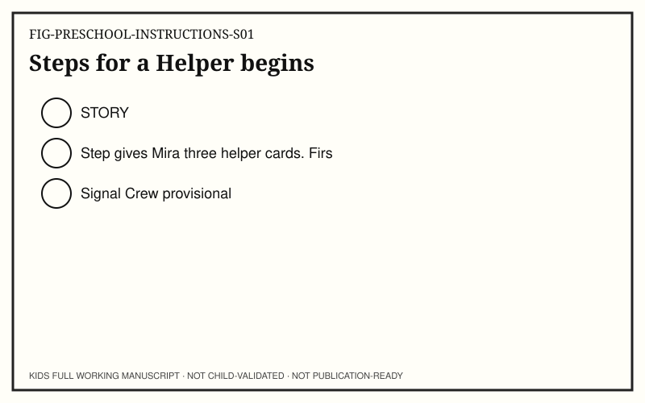

**Child-facing text:** Mira wants a helper to bring a cup. Step says helpers need clear steps.

**Try it:** Set the helper problem.

**Talk together:** Story first; no lecture.

### Spread S02 — Notice the order (NOTICE)



**Child-facing text:** First find the cup. Next carry it. Last give it to Mira. What order did you hear?

**Try it:** Notice first/next/last with gestures.

**Talk together:** Order before fancy words.

### Spread S03 — Name the steps (NAME)


**Child-facing text:** First. Next. Last. Those are step words we can name.

**Try it:** Count three step words on fingers.

**Talk together:** Concrete sequencing words.

### Spread S04 — Icons are not the whole helper (CONNECT)

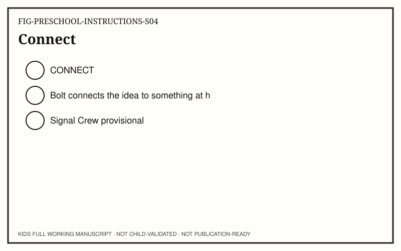

**Child-facing text:** A picture button starts the helper. The picture is not the whole plan. Steps still matter.

**Try it:** Connect icon to steps behind it.

**Talk together:** Icon is not the whole program (plain words).

### Spread S05 — Predict a mix-up (PREDICT)



**Child-facing text:** What if last comes first? What might go wrong?

**Try it:** Predict a scrambled-order outcome.

**Talk together:** Playful, not scary.

### Spread S06 — Try the helper steps (TRY)



**Child-facing text:** Act first, next, last with Mira and Step. Bring the cup in order.

**Try it:** Body sequence of three steps.

**Talk together:** Movement helps memory.

### Spread S07 — Instructions are steps (EXPLAIN)



**Child-facing text:** Step says instructions are steps a helper can follow. Order matters.

**Try it:** Explain instructions-as-steps.

**Talk together:** Keep language concrete.

### Spread S08 — Make step cards (MAKE)

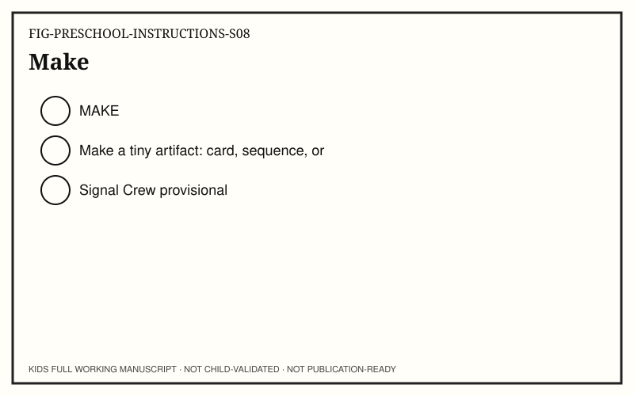

**Child-facing text:** Make three cards: first / next / last. Line them up for your helper story.

**Try it:** Sequence cards for the helper.

**Talk together:** Hands-on evidence of order.

### Spread S09 — Fair turns for helpers (SAFE + FAIR)

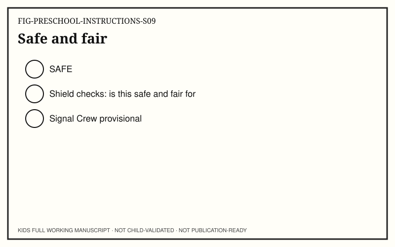

**Child-facing text:** Shield says everyone gets a fair turn giving steps. We can stop if it feels too hard.

**Try it:** Model fair turns and easy stop.

**Talk together:** Stopping is success.

### Spread S10 — Teach the steps (TEACH)

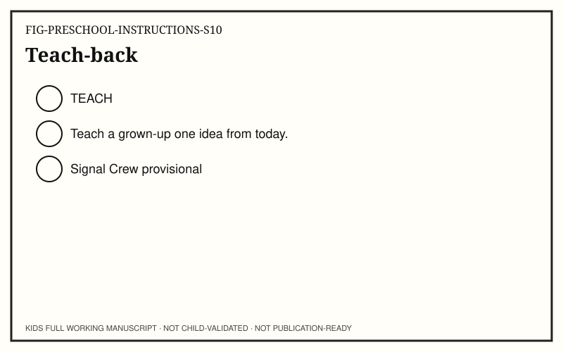

**Child-facing text:** Teach someone: first, next, last for the helper. Share your cards.

**Try it:** Optional teach-back of sequence.

**Talk together:** Optional peer share.

**Facilitator pointer:** Editor, standards, media, and provenance notes live in companion YAML/MD files — not in child-facing spreads.

---

## UNIT-PRESCHOOL-MESSAGES-01 — Devices Send Messages

**Strand:** Messages & Connections (`STRAND-MESSAGES`)  
**Adult concept (facilitator):** `KCON-CH16-PACKETS-INTERNET` · status `WORKING_DRAFT_COMPLETE`

**Learning goal:** Local story of sending a message from here to there.

### Spread S01 — A picture for Bolt (STORY)



**Child-facing text:** Mira draws a star. She wants Bolt to see it over there. Can a device send a message?

**Try it:** Set the send-message problem.

**Talk together:** Keep the story local and concrete.

### Spread S02 — Notice here and there (NOTICE)



**Child-facing text:** Mira’s device is here. Bolt’s device is there. What do you notice about the two places?

**Try it:** Point here and there.

**Talk together:** Space before network words.

### Spread S03 — Name a message (NAME)



**Child-facing text:** A message is something we send. Mira’s star picture can be a message.

**Try it:** Name message in plain words.

**Talk together:** Concrete noun.

### Spread S04 — Ping carries it (CONNECT)



**Child-facing text:** Ping hops the message from here to there. Sometimes it waits. Sometimes it arrives.

**Try it:** Connect send to travel to arrive.

**Talk together:** No magic wire claims.

### Spread S05 — Predict arrival (PREDICT)



**Child-facing text:** If Mira sends the star, what happens first? Next? Last?

**Try it:** Predict send order.

**Talk together:** Accept sincere guesses.

### Spread S06 — Try a room send (TRY)



**Child-facing text:** Caregiver helps: send a picture or tap-message across the room. Watch for arrive.

**Try it:** Supervised local send try.

**Talk together:** Adult mediates; stop anytime.

### Spread S07 — Sending is a path (EXPLAIN)


**Child-facing text:** Ping says sending follows a path. Messages do not always arrive right away.

**Try it:** Explain path and waiting.

**Talk together:** Honest: messages can wait or miss.

### Spread S08 — Make a message path (MAKE)



**Child-facing text:** Draw here, then a path, then there. Put your star message on the path.

**Try it:** Draw a simple message path.

**Talk together:** Local art artifact.

### Spread S09 — Ask before sending (SAFE + FAIR)

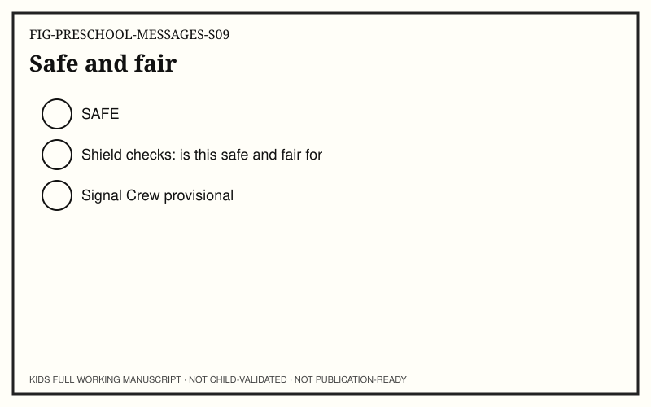

**Child-facing text:** Shield asks: who should see this message? We ask a grown-up before sending.

**Try it:** Model consent before send.

**Talk together:** Caregiver gate for sharing.

### Spread S10 — Teach the send story (TEACH)

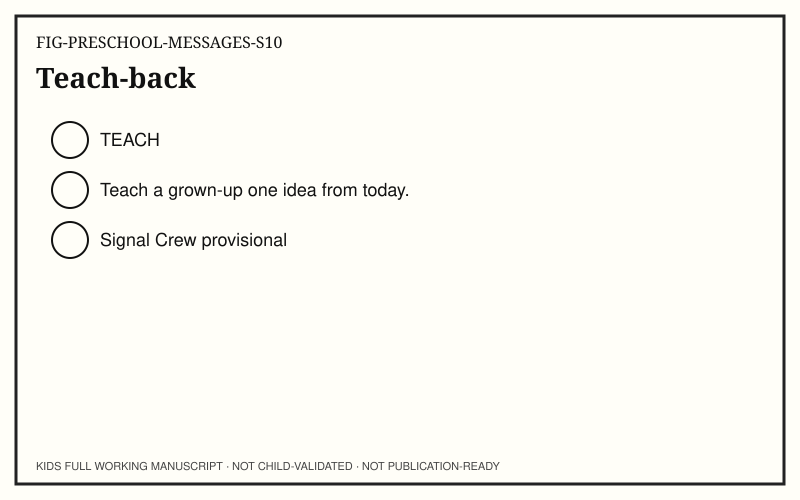

**Child-facing text:** Teach a friend: here, send, there. Devices can send messages.

**Try it:** Optional teach-back.

**Talk together:** Optional share.

**Facilitator pointer:** Editor, standards, media, and provenance notes live in companion YAML/MD files — not in child-facing spreads.

---

## UNIT-PRESCHOOL-DATA-01 — Keep-Boxes Have Names

**Strand:** Data & Intelligence (`STRAND-DATA`)  
**Adult concept (facilitator):** `KCON-CH13-FILES-DATA-LIFE` · status `WORKING_DRAFT_COMPLETE`

**Learning goal:** Named keepsakes/files help us find things later.

### Spread S01 — Where did the drawing go? (STORY)

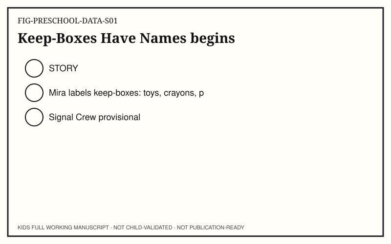

**Child-facing text:** Mira made a rainbow drawing. Later she cannot find it. Bolt looks for a keep-box.

**Try it:** Set the lost-drawing problem.

**Talk together:** Familiar household moment.

### Spread S02 — Notice keep-boxes (NOTICE)


**Child-facing text:** Envelopes, folders, and device folders can be keep-boxes. What keep-boxes do you see?

**Try it:** Notice named containers.

**Talk together:** Point and name.

### Spread S03 — Names on boxes (NAME)


**Child-facing text:** Keep-boxes have names. Mira’s box says Rainbow. Names help us find things.

**Try it:** Name a keep-box aloud.

**Talk together:** Concrete naming.

### Spread S04 — Save means keep (CONNECT)


**Child-facing text:** Saving puts the drawing in a keep-box. It can wait for later.

**Try it:** Connect save to keep-box to later.

**Talk together:** Gesture the keep action.

### Spread S05 — Predict the find (PREDICT)



**Child-facing text:** If the name says Rainbow, which box holds Mira’s drawing?

**Try it:** Predict by name.

**Talk together:** Accept sincere guesses.

### Spread S06 — Try naming a keep-box (TRY)

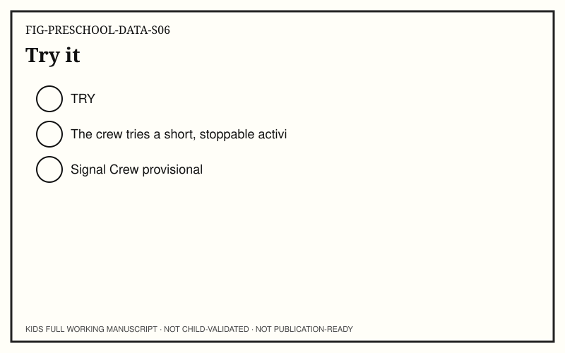

**Child-facing text:** Put a drawing in a paper keep-box. Write or sticker a name with a grown-up.

**Try it:** Hands-on named keep-box.

**Talk together:** Adult helps with writing.

### Spread S07 — Names help find (EXPLAIN)



**Child-facing text:** Bolt says names are labels for keep-boxes. Good names make finding easier.

**Try it:** Explain why names help.

**Talk together:** Plain words only.

### Spread S08 — Make two named boxes (MAKE)



**Child-facing text:** Make two keep-boxes with different names. Sort two drawings into them.

**Try it:** Sort into named boxes.

**Talk together:** Sorting as evidence.

### Spread S09 — Private keep-boxes (SAFE + FAIR)



**Child-facing text:** Shield says some keep-boxes are private. Ask a grown-up before opening someone else’s.

**Try it:** Model private vs shared boxes.

**Talk together:** Consent and fairness.

### Spread S10 — Teach keep-box names (TEACH)


**Child-facing text:** Teach a friend: keep-boxes have names so we can find things later.

**Try it:** Optional teach-back.

**Talk together:** Optional share.

**Facilitator pointer:** Editor, standards, media, and provenance notes live in companion YAML/MD files — not in child-facing spreads.

---

## UNIT-PRESCHOOL-SAFE-01 — Private Means Not Everyone

**Strand:** Safe, Private & Fair (`STRAND-SAFE`)  
**Adult concept (facilitator):** `KCON-CH24-PRIVACY-ETHICS` · status `WORKING_DRAFT_COMPLETE`

**Learning goal:** Private means not for everyone; share with a trusted caregiver.

### Spread S01 — A family photo (STORY)

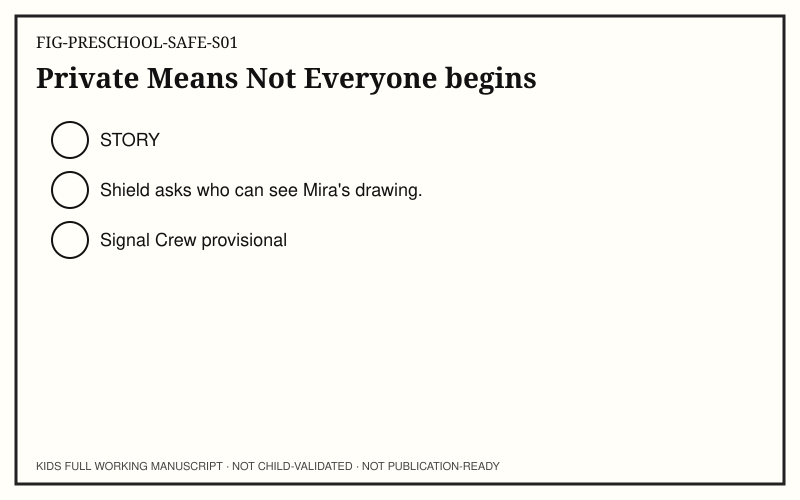

**Child-facing text:** Mira has a family photo. Ping wants to show everyone. Shield pauses.

**Try it:** Set the share-or-not problem.

**Talk together:** Gentle pause, not fear.

### Spread S02 — Notice who can see (NOTICE)



**Child-facing text:** Who is here now? Who is not here? What do you notice about who can see?

**Try it:** Notice audience with pointing.

**Talk together:** People before jargon.

### Spread S03 — Name private (NAME)


**Child-facing text:** Private means not for everyone. Some things stay with people we trust.

**Try it:** Name private in plain words.

**Talk together:** Concrete meaning.

### Spread S04 — Ask a grown-up (CONNECT)



**Child-facing text:** Shield connects private things to asking a grown-up before sharing.

**Try it:** Connect private to ask to share.

**Talk together:** Caregiver as trusted gate.

### Spread S05 — Predict the choice (PREDICT)

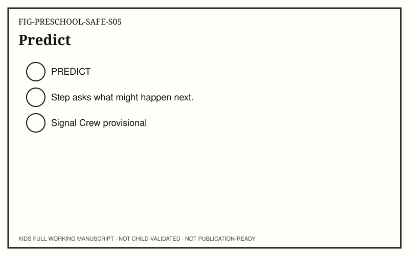

**Child-facing text:** If Mira shares with everyone, who might see the photo?

**Try it:** Predict share outcomes.

**Talk together:** No scare tactics.

### Spread S06 — Try a private choice (TRY)



**Child-facing text:** Practice: photo card goes to Trusted pile or Everyone pile. Choose with Shield.

**Try it:** Sort trusted vs everyone.

**Talk together:** Playful choice practice.

### Spread S07 — Private is a kind choice (EXPLAIN)



**Child-facing text:** Shield says private is not hiding forever. It is choosing carefully who can see.

**Try it:** Explain private as careful choice.

**Talk together:** Warm, concrete language.

### Spread S08 — Make a trust sign (MAKE)


**Child-facing text:** Make a simple sign: Ask first. Put it near shared devices.

**Try it:** Make an Ask-first reminder.

**Talk together:** Local artifact.

### Spread S09 — Fair for everyone (SAFE + FAIR)

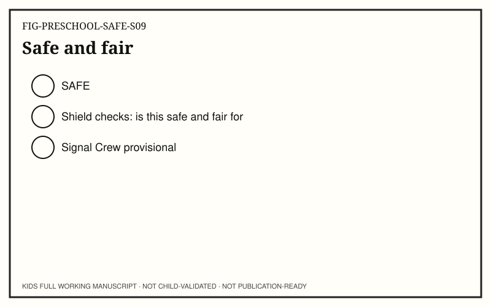

**Child-facing text:** Fair means we do not share someone’s private thing without asking. Stopping is fair.

**Try it:** Model fair share rules.

**Talk together:** Inclusive, no shame.

### Spread S10 — Teach private (TEACH)

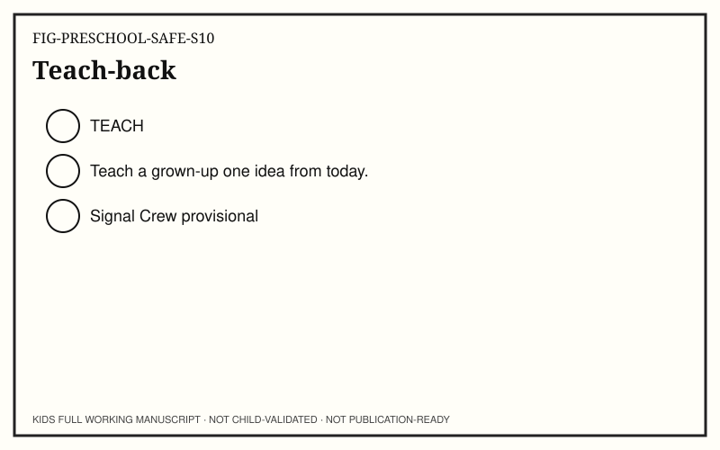

**Child-facing text:** Teach a friend: private means not everyone. Ask a grown-up you trust.

**Try it:** Optional teach-back.

**Talk together:** Optional share.

**Facilitator pointer:** Editor, standards, media, and provenance notes live in companion YAML/MD files — not in child-facing spreads.

---

## UNIT-PRESCHOOL-BUILD-01 — Test Means Try and See

**Strand:** Build, Test & Share (`STRAND-BUILD`)  
**Adult concept (facilitator):** `KCON-CH27-TEST-EVIDENCE` · status `WORKING_DRAFT_COMPLETE`

**Learning goal:** Test means try and see; check the change.

### Spread S01 — Will the paper button work? (STORY)



**Child-facing text:** Bolt builds a paper button for Mira’s song game. Will it work? They need to test.

**Try it:** Set the build-and-test problem.

**Talk together:** Curiosity over perfection.

### Spread S02 — Notice before and after (NOTICE)

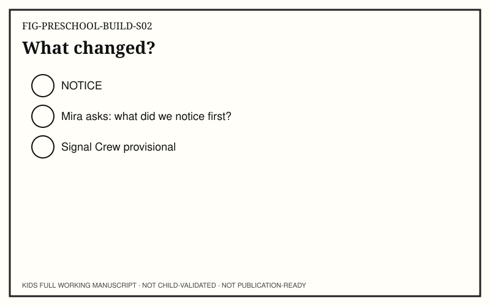

**Child-facing text:** Before the press, quiet. After the press — what changes? What do you notice?

**Try it:** Notice before/after.

**Talk together:** Observation first.

### Spread S03 — Name test (NAME)


**Child-facing text:** Test means try and see. We check if the change we want happened.

**Try it:** Name test in plain words.

**Talk together:** Concrete definition.

### Spread S04 — Plan connects to check (CONNECT)

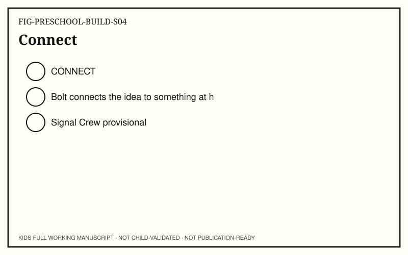

**Child-facing text:** Step connects the plan to a check: try, see, then maybe try again.

**Try it:** Connect plan to check.

**Talk together:** Gesture the loop.

### Spread S05 — Predict the change (PREDICT)


**Child-facing text:** If we press the paper button, what change do you predict?

**Try it:** Predict before trying.

**Talk together:** Accept sincere guesses.

### Spread S06 — Try and see (TRY)



**Child-facing text:** Press. Look. Listen. Did the change happen? Act it with Bolt.

**Try it:** Try and observe together.

**Talk together:** Short, stoppable try.

### Spread S07 — Evidence is what we saw (EXPLAIN)


**Child-facing text:** Bolt says the test evidence is what we saw or heard — not only what we hoped.

**Try it:** Explain evidence as what we noticed.

**Talk together:** Honest observation.

### Spread S08 — Make a try-again card (MAKE)


**Child-facing text:** Make cards: Try / See / Again. Line them up after your test.

**Try it:** Sequence try-see-again cards.

**Talk together:** Hands-on loop.

### Spread S09 — Fair tests (SAFE + FAIR)


**Child-facing text:** Shield says fair tests give everyone a turn. One try does not prove always. We can stop.

**Try it:** Model fair turns and limits.

**Talk together:** No shame if it fails.

### Spread S10 — Teach try and see (TEACH)


**Child-facing text:** Teach a friend: test means try and see. Share your cards.

**Try it:** Optional teach-back.

**Talk together:** Optional share.

**Facilitator pointer:** Editor, standards, media, and provenance notes live in companion YAML/MD files — not in child-facing spreads.

---

## Back matter (adult-facing)

- Glossary: `GLOSSARY.yaml`  
- Caregiver / educator notes: `CAREGIVER_EDUCATOR_NOTES.md`  
- Accessibility: `ACCESSIBILITY_NOTES.md`  
- Standards traceability: `STANDARDS_TRACEABILITY.yaml`  
- Media evidence: `MEDIA_EVIDENCE_TRACEABILITY.yaml`  
- WAIKE: caregiver/educator facing only; audited SHA `e97e74fc9bfb44b1cdc26b272dc4848264f15fe0` — see `BOOK_METADATA.yaml` / `STANDARDS_TRACEABILITY.yaml`. Do not invent Kids Edition WAIKE course IDs.
