# Look Touch Wait — KIDS-TODDLER Working Manuscript

```
KIDS DEVELOPMENTAL PROTOTYPE
NOT CHILD-VALIDATED
NOT PUBLICATION-READY
KIDS_CHILD_VALIDATION_PENDING
NO_CHILD_VALIDATION_EVIDENCE
NO_STANDARDS_CERTIFICATION_EVIDENCE
```

**Age band:** `KIDS-TODDLER` (guide 18–36 months)  
**Unit status ceiling:** `WORKING_DRAFT_COMPLETE`  
**Cast:** Signal Crew Option A (provisional) — Mira, Bolt, Step, Ping, Shield  
**Cadence:** LOOK → POINT → NAME → WAIT → RESPOND → REPEAT  
**Format:** print-first board/picture co-read; optional digital only with caregiver  

> Adult/integrator banners and appendices are outside child-facing prose. Child-facing lines never include project-state meta.

---

## How to use

1. Sit together. Follow the child's eyes.
2. One short phrase. Then wait.
3. Point, match, or try once — stop anytime.
4. Repeat with joy; never force a performance.

## Caregiver orientation

You are the co-reader and play partner. Name what you see. Connect book objects to safe home switches and buttons. Home language welcome. Observation only — no quizzes, no scores.

## Provisional cast (Option A — Signal Crew)

| Role | Name | Toddler presence |
| --- | --- | --- |
| Explorer | Mira | Points and wonders |
| Builder | Bolt | Things you can touch |
| Instructions | Step | First, then next |
| Signals | Ping | Here → there |
| Safety | Shield | Pause and ask |

Characters are gentle presence motifs, not required on every spread. Silhouettes stay provisional until owner IP lock.

## Safety & accessibility (session)

- Supervise all device touch.
- No stranger chat. No child accounts. No data collection.
- Easy stop. Autoplay off.
- Accept point, gesture, AAC, or vocalize.
- Color is never the only cue.

---

# Unit: Touch Then Change

**Unit ID:** `UNIT-TODDLER-ME-TECH-01`  
**Strand:** `STRAND-ME-TECH` — Me & Technology  
**Concept:** `KCON-CH02-ONE-TAP`  
**Learning goal:** Input then response  
**Cast focus:** Mira, Bolt  
**Status:** `WORKING_DRAFT_COMPLETE`  

*Story hook (caregiver):* Open from a familiar household cause→effect moment.

## Spread S01 — LOOK

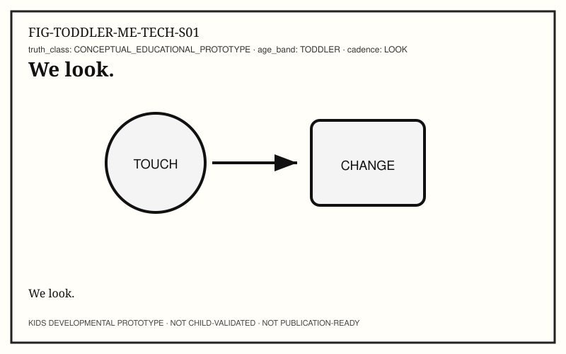

**Child-facing text:** We look.

**Try it:** Find the button together.

**Talk together:** One focal object.

## Spread S02 — POINT

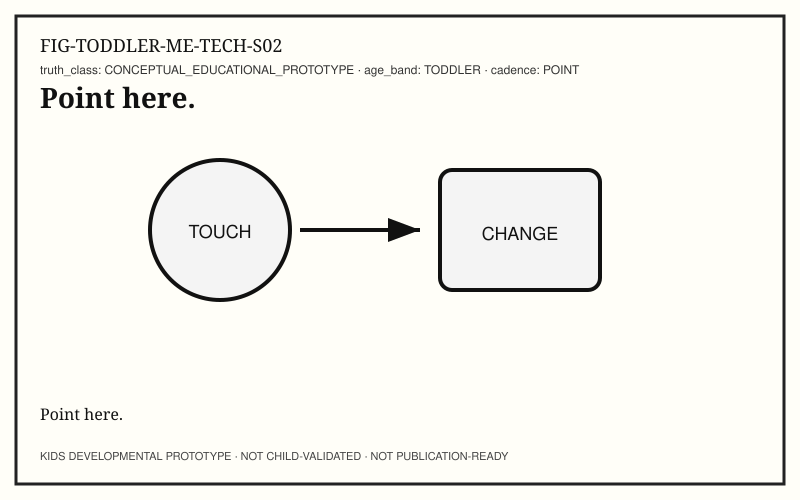

**Child-facing text:** Point here.

**Try it:** Child points to the button.

**Talk together:** Child leads the point.

## Spread S03 — NAME

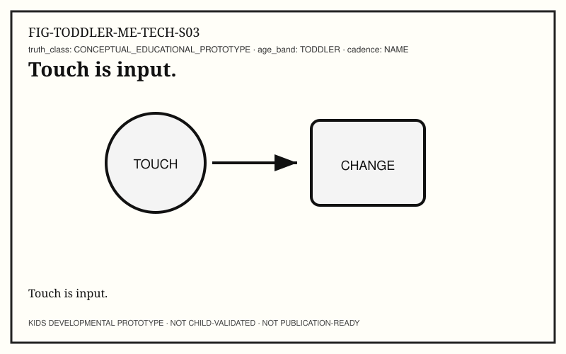

**Child-facing text:** Touch is input.

**Try it:** Name input with a gesture.

**Talk together:** Short phrase; gesture touch.

## Spread S04 — NAME


**Child-facing text:** Change is output.

**Try it:** Point to the change.

**Talk together:** Point to the change.

## Spread S05 — WAIT

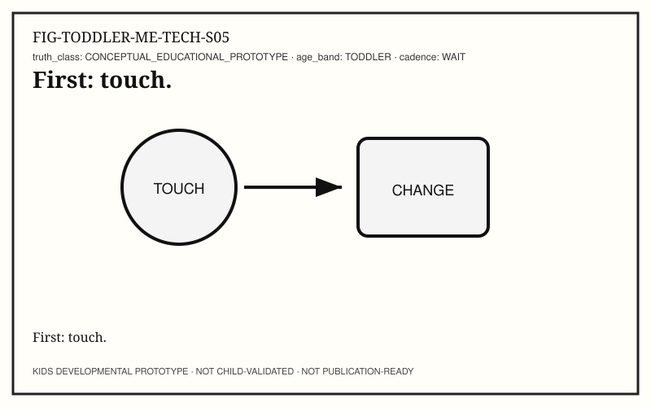

**Child-facing text:** First: touch.

**Try it:** Hold one finger for first.

**Talk together:** Hold up one finger.

## Spread S06 — RESPOND

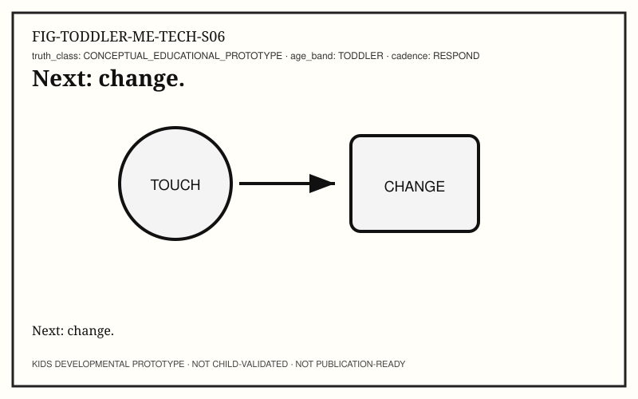

**Child-facing text:** Next: change.

**Try it:** Hold two fingers for next.

**Talk together:** Hold up two fingers.

## Spread S07 — TRY

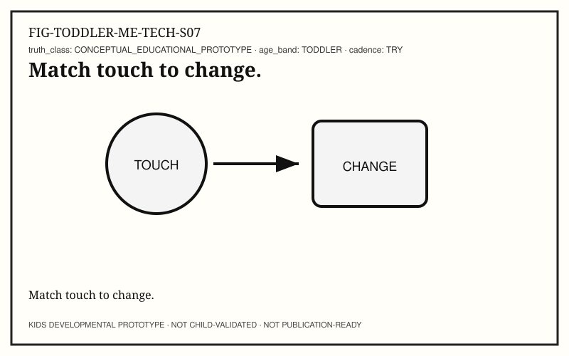

**Child-facing text:** Match touch to change.

**Try it:** One supervised tap.

**Talk together:** One physical try.

## Spread S08 — REPEAT

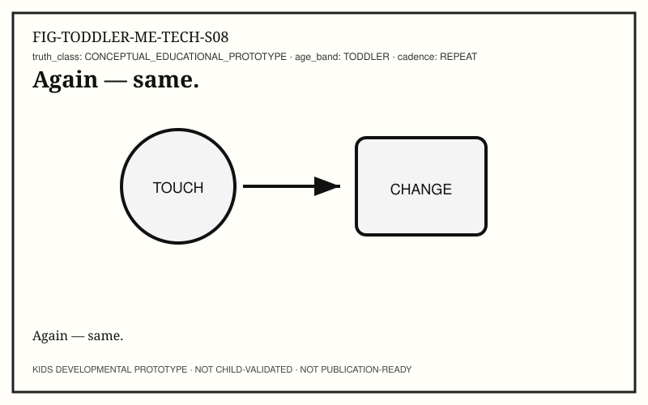

**Child-facing text:** Again — same.

**Try it:** Repeat once with joy.

**Talk together:** Repetition with joy.

## Spread S09 — SAFE

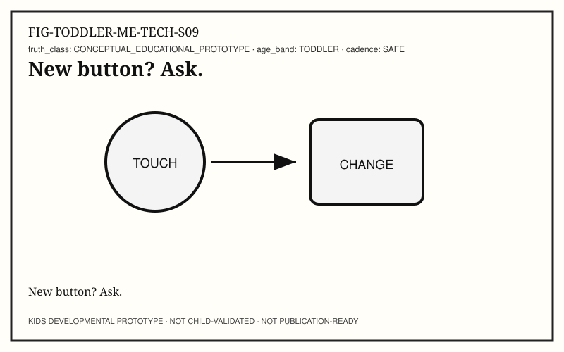

**Child-facing text:** New button? Ask.

**Try it:** Practice ask-before-new.

**Talk together:** Calm safety rule.

## Spread S10 — TEACH

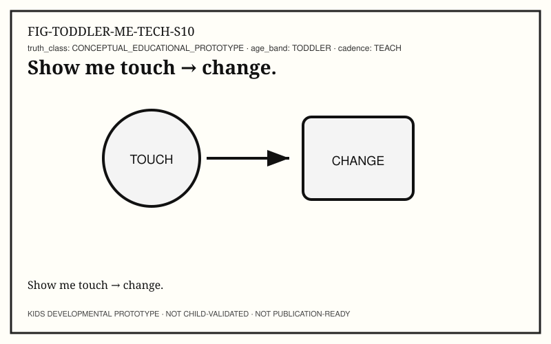

**Child-facing text:** Show me touch → change.

**Try it:** Child shows caregiver.

**Talk together:** Invite teach-back gesture.

### Caregiver extension (UNIT-TODDLER-ME-TECH-01)

- Follow attention; name; wait; never force performance.
- Short, safe, stoppable try matched to toddler band.
- Observation/play notes only — no scoring.
- Adult mediation; no child data collection; inclusive routes.


# Unit: Busy Then Ready

**Unit ID:** `UNIT-TODDLER-INSIDE-01`  
**Strand:** `STRAND-INSIDE` — Inside the Machine  
**Concept:** `KCON-CH06-CPU-WORK`  
**Learning goal:** Machine doing a job  
**Cast focus:** Bolt, Step  
**Status:** `WORKING_DRAFT_COMPLETE`  

*Story hook (caregiver):* Open from a familiar household cause→effect moment.

## Spread S01 — LOOK

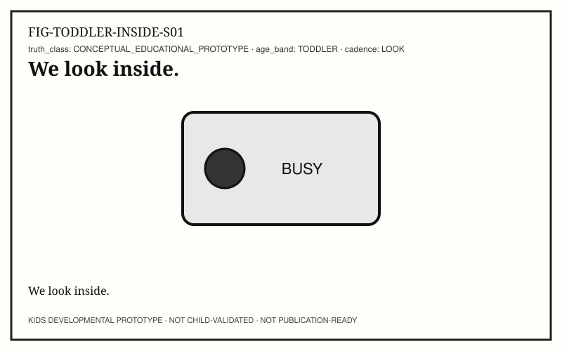

**Child-facing text:** We look inside.

**Try it:** Look at a quiet lamp or toy.

**Talk together:** One familiar device.

## Spread S02 — POINT

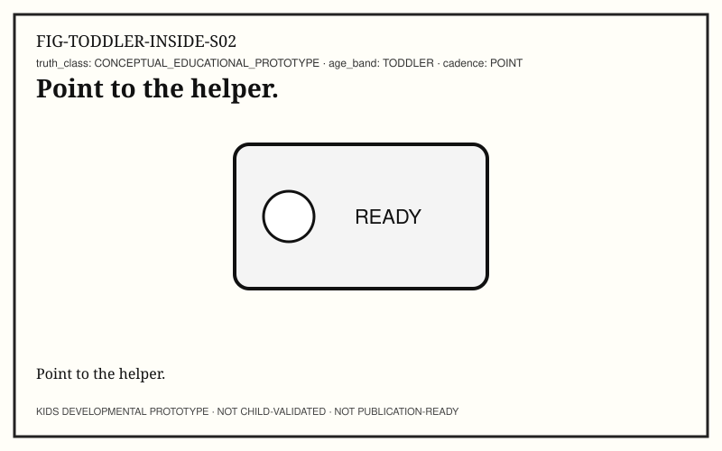

**Child-facing text:** Point to the helper.

**Try it:** Point to the busy light or spinner.

**Talk together:** Child points.

## Spread S03 — NAME

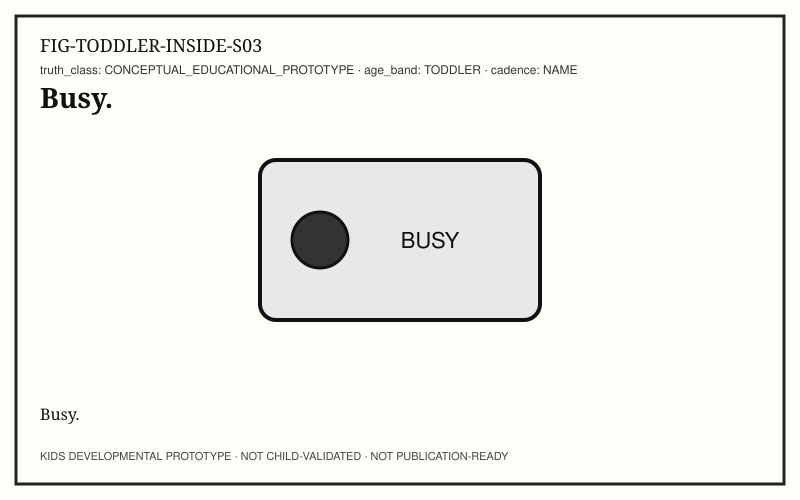

**Child-facing text:** Busy.

**Try it:** Name busy when it works.

**Talk together:** Say busy; wait.

## Spread S04 — WAIT

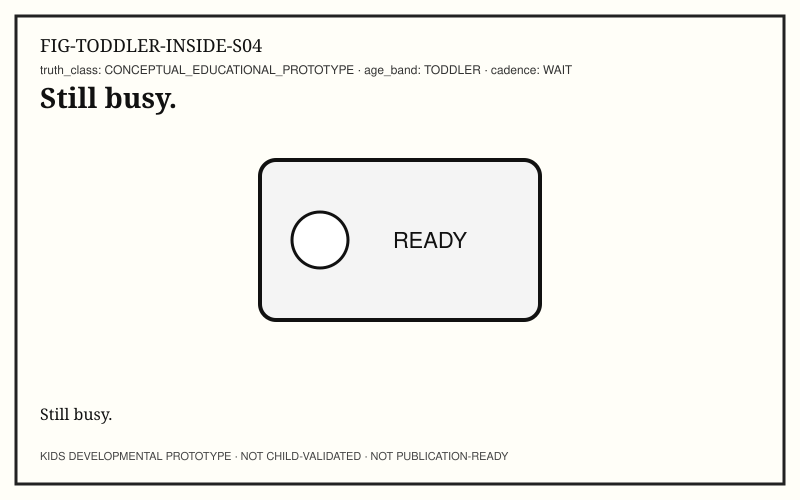

**Child-facing text:** Still busy.

**Try it:** Wait together.

**Talk together:** No rush.

## Spread S05 — RESPOND

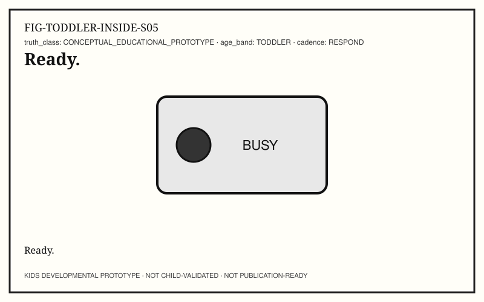

**Child-facing text:** Ready.

**Try it:** Name ready when it stops.

**Talk together:** Say ready.

## Spread S06 — NAME


**Child-facing text:** One job. Then next.

**Try it:** Show first job, then next.

**Talk together:** Order with fingers.

## Spread S07 — REPEAT

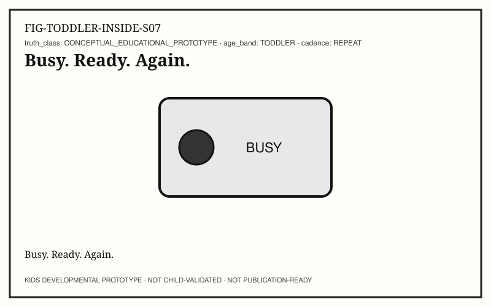

**Child-facing text:** Busy. Ready. Again.

**Try it:** Repeat the cycle once.

**Talk together:** Joyful repeat.

## Spread S08 — TEACH

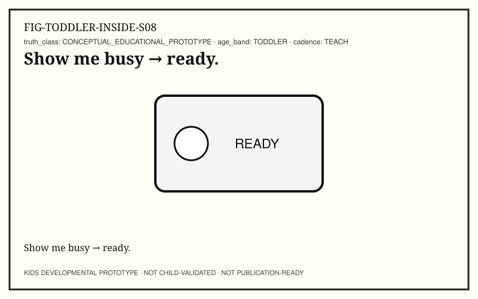

**Child-facing text:** Show me busy → ready.

**Try it:** Child shows the change.

**Talk together:** Teach-back gesture.

### Caregiver extension (UNIT-TODDLER-INSIDE-01)

- Follow attention; name; wait; never force performance.
- Short, safe, stoppable try matched to toddler band.
- Observation/play notes only — no scoring.
- Adult mediation; no child data collection; inclusive routes.


# Unit: First Next

**Unit ID:** `UNIT-TODDLER-INSTRUCTIONS-01`  
**Strand:** `STRAND-INSTRUCTIONS` — Instructions & Code  
**Concept:** `KCON-CH02-ONE-TAP`  
**Learning goal:** Order of two steps  
**Cast focus:** Step, Mira  
**Status:** `WORKING_DRAFT_COMPLETE`  

*Story hook (caregiver):* Open from a familiar household cause→effect moment.

## Spread S01 — LOOK

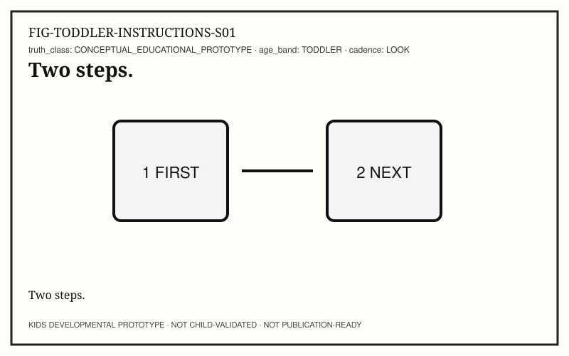

**Child-facing text:** Two steps.

**Try it:** Look at two picture cards.

**Talk together:** Two focals only.

## Spread S02 — POINT


**Child-facing text:** Point to first.

**Try it:** Child points to card one.

**Talk together:** First.

## Spread S03 — NAME

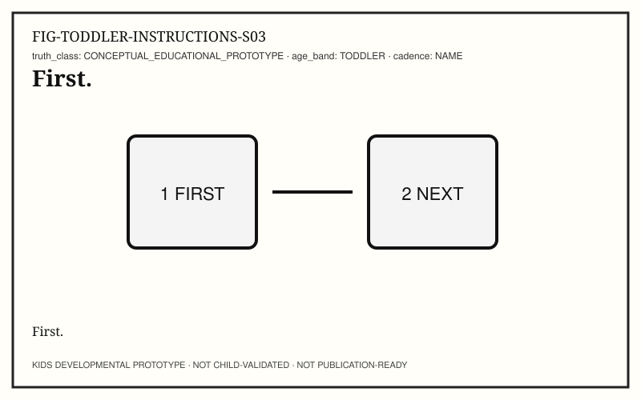

**Child-facing text:** First.

**Try it:** Say first with one finger.

**Talk together:** One finger.

## Spread S04 — POINT

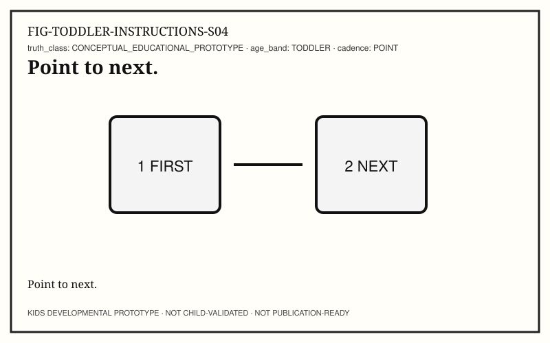

**Child-facing text:** Point to next.

**Try it:** Child points to card two.

**Talk together:** Next.

## Spread S05 — NAME


**Child-facing text:** Next.

**Try it:** Say next with two fingers.

**Talk together:** Two fingers.

## Spread S06 — WAIT

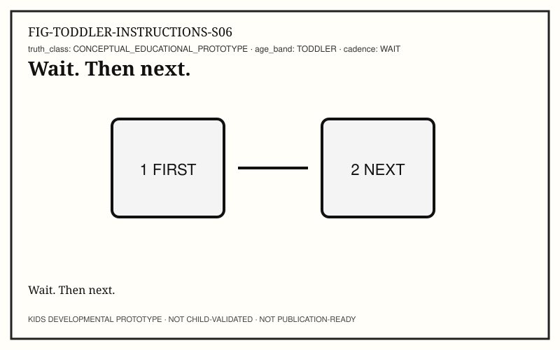

**Child-facing text:** Wait. Then next.

**Try it:** Pause between steps.

**Talk together:** Hold the wait.

## Spread S07 — TRY

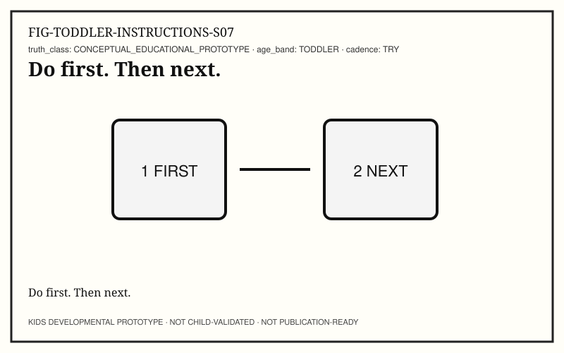

**Child-facing text:** Do first. Then next.

**Try it:** Try the two-step play.

**Talk together:** Supervised try.

## Spread S08 — REPEAT

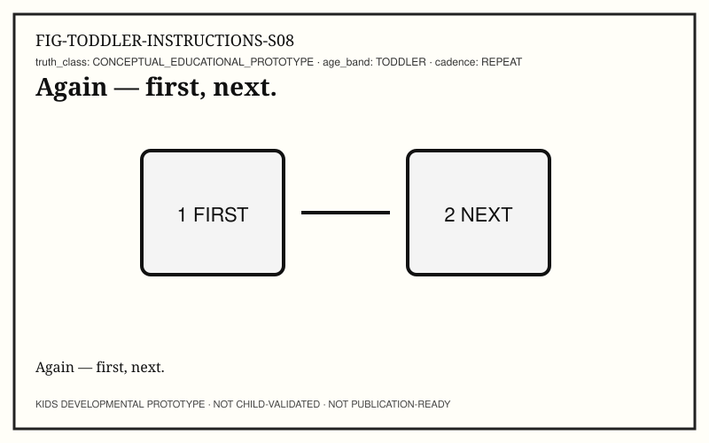

**Child-facing text:** Again — first, next.

**Try it:** Repeat once.

**Talk together:** Same order.

## Spread S09 — TEACH

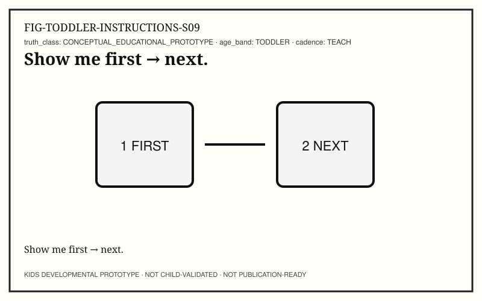

**Child-facing text:** Show me first → next.

**Try it:** Child leads the order.

**Talk together:** Teach-back.

### Caregiver extension (UNIT-TODDLER-INSTRUCTIONS-01)

- Follow attention; name; wait; never force performance.
- Short, safe, stoppable try matched to toddler band.
- Observation/play notes only — no scoring.
- Adult mediation; no child data collection; inclusive routes.


# Unit: Messages Move

**Unit ID:** `UNIT-TODDLER-MESSAGES-01`  
**Strand:** `STRAND-MESSAGES` — Messages & Connections  
**Concept:** `KCON-CH16-PACKETS-INTERNET`  
**Learning goal:** Send a sound/look afar  
**Cast focus:** Ping, Mira  
**Status:** `WORKING_DRAFT_COMPLETE`  

*Story hook (caregiver):* Open from a familiar household cause→effect moment.

## Spread S01 — LOOK

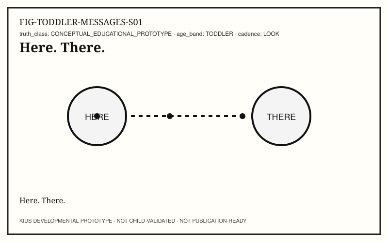

**Child-facing text:** Here. There.

**Try it:** Look at two places in the room.

**Talk together:** Two spots.

## Spread S02 — POINT


**Child-facing text:** Point here.

**Try it:** Point to here.

**Talk together:** Here.

## Spread S03 — POINT

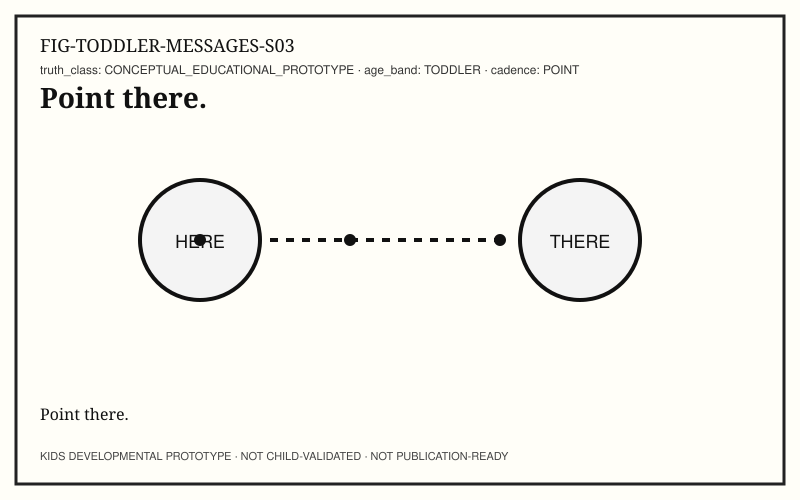

**Child-facing text:** Point there.

**Try it:** Point to there.

**Talk together:** There.

## Spread S04 — NAME

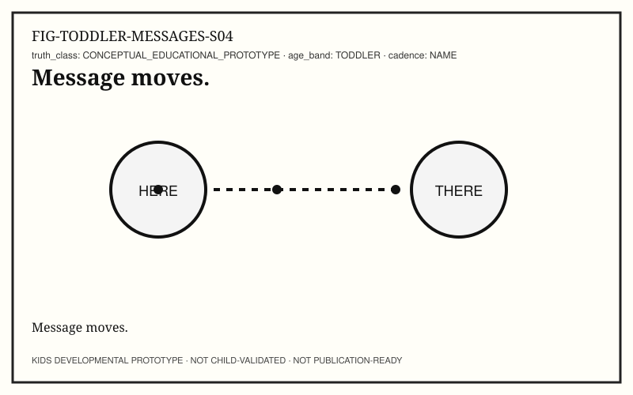

**Child-facing text:** Message moves.

**Try it:** Hand a soft toy from here to there.

**Talk together:** Here → there.

## Spread S05 — WAIT

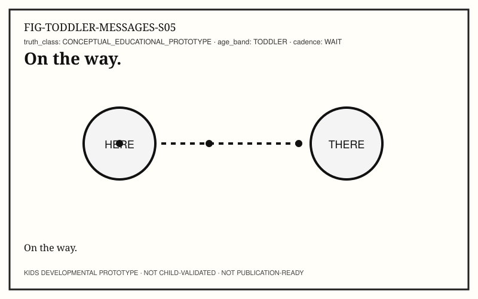

**Child-facing text:** On the way.

**Try it:** Watch it move.

**Talk together:** Wait while it travels.

## Spread S06 — RESPOND


**Child-facing text:** It arrived.

**Try it:** Name arrived.

**Talk together:** Arrived.

## Spread S07 — REPEAT

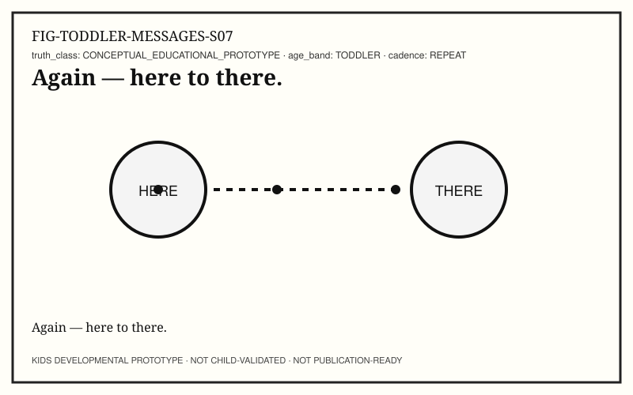

**Child-facing text:** Again — here to there.

**Try it:** Send again once.

**Talk together:** Repeat path.

## Spread S08 — SAFE

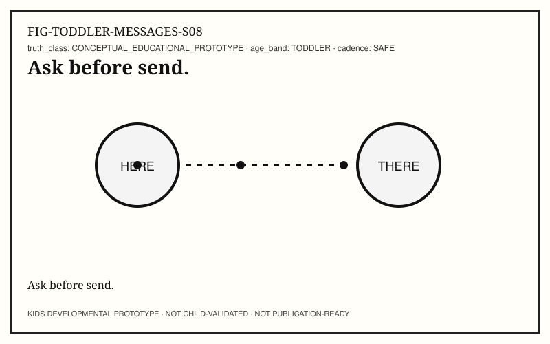

**Child-facing text:** Ask before send.

**Try it:** Ask adult before a device send.

**Talk together:** Adult mediation.

## Spread S09 — TEACH

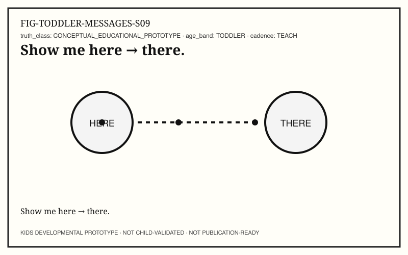

**Child-facing text:** Show me here → there.

**Try it:** Child shows the path.

**Talk together:** Teach-back.

### Caregiver extension (UNIT-TODDLER-MESSAGES-01)

- Follow attention; name; wait; never force performance.
- Short, safe, stoppable try matched to toddler band.
- Observation/play notes only — no scoring.
- Adult mediation; no child data collection; inclusive routes.


# Unit: Guess Can Be Wrong

**Unit ID:** `UNIT-TODDLER-DATA-01`  
**Strand:** `STRAND-DATA` — Data & Intelligence  
**Concept:** `KCON-CH21-DATA-AI`  
**Learning goal:** Pattern guess play  
**Cast focus:** Mira, Shield  
**Status:** `WORKING_DRAFT_COMPLETE`  

*Story hook (caregiver):* Open from a familiar household cause→effect moment.

## Spread S01 — LOOK

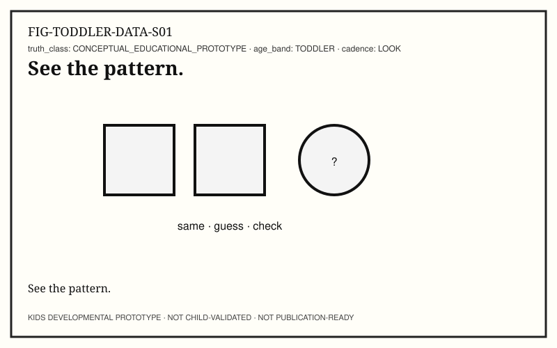

**Child-facing text:** See the pattern.

**Try it:** Look at two same shapes.

**Talk together:** Two same.

## Spread S02 — POINT

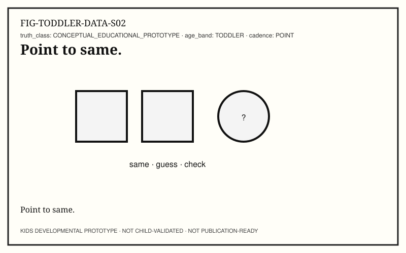

**Child-facing text:** Point to same.

**Try it:** Child matches same.

**Talk together:** Match.

## Spread S03 — NAME

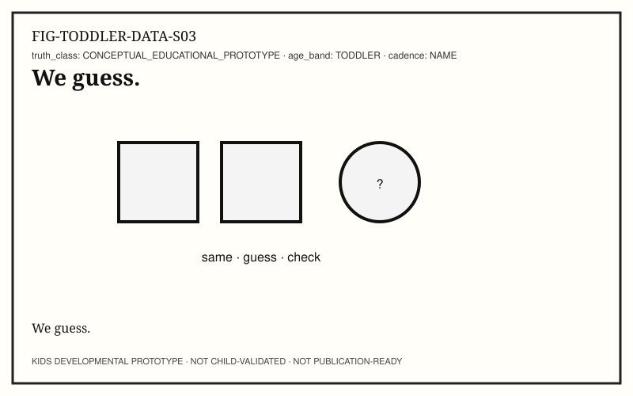

**Child-facing text:** We guess.

**Try it:** Caregiver guesses next.

**Talk together:** Guess aloud.

## Spread S04 — WAIT

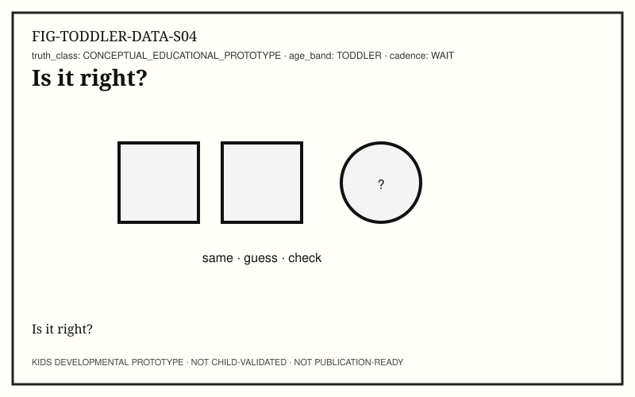

**Child-facing text:** Is it right?

**Try it:** Pause before reveal.

**Talk together:** Wait.

## Spread S05 — RESPOND

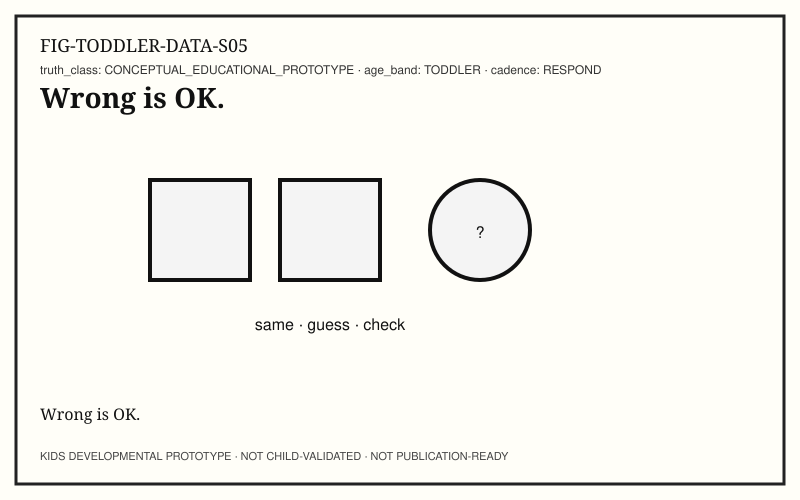

**Child-facing text:** Wrong is OK.

**Try it:** Show a wrong guess calmly.

**Talk together:** Wrong can happen.

## Spread S06 — NAME

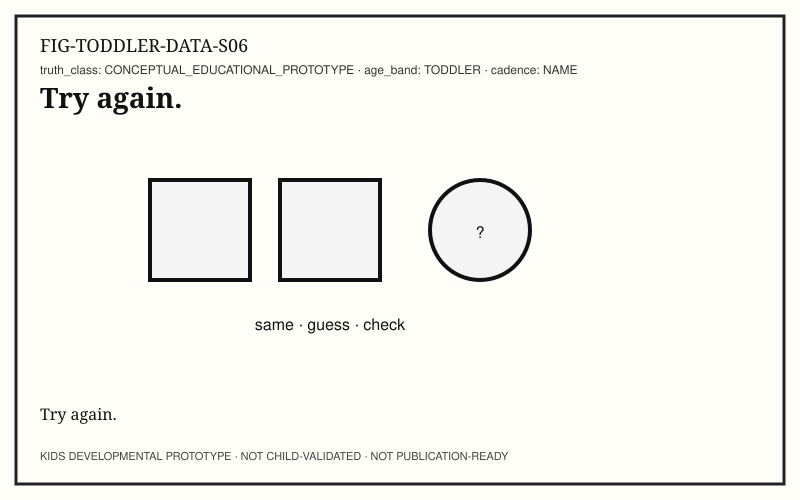

**Child-facing text:** Try again.

**Try it:** Guess again with help.

**Talk together:** Another try.

## Spread S07 — REPEAT

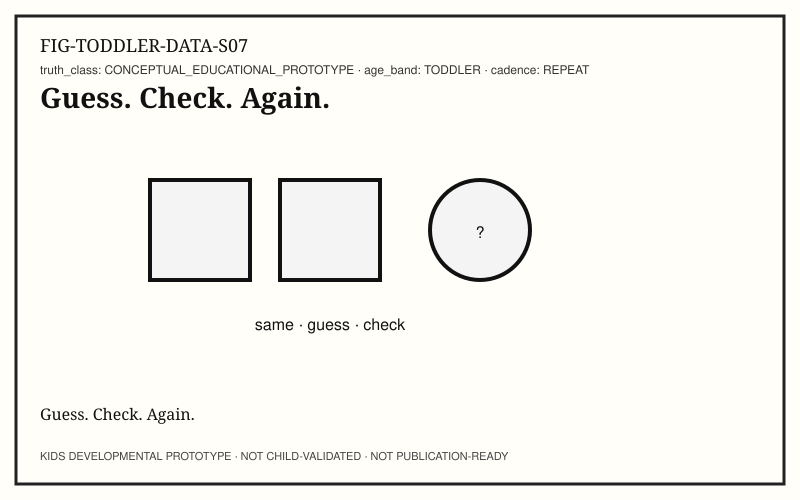

**Child-facing text:** Guess. Check. Again.

**Try it:** Repeat once.

**Talk together:** Check together.

## Spread S08 — SAFE

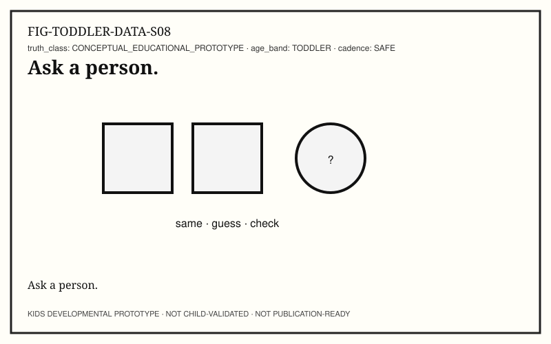

**Child-facing text:** Ask a person.

**Try it:** Ask caregiver when unsure.

**Talk together:** People check.

## Spread S09 — TEACH

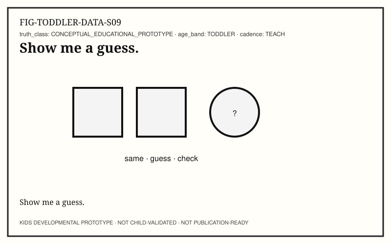

**Child-facing text:** Show me a guess.

**Try it:** Child makes a match guess.

**Talk together:** Teach-back.

### Caregiver extension (UNIT-TODDLER-DATA-01)

- Follow attention; name; wait; never force performance.
- Short, safe, stoppable try matched to toddler band.
- Observation/play notes only — no scoring.
- Adult mediation; no child data collection; inclusive routes.


# Unit: Ask Before New

**Unit ID:** `UNIT-TODDLER-SAFE-01`  
**Strand:** `STRAND-SAFE` — Safe, Private & Fair  
**Concept:** `KCON-CH23-CYBERSECURITY`  
**Learning goal:** Stop and ask  
**Cast focus:** Shield, Mira  
**Status:** `WORKING_DRAFT_COMPLETE`  

*Story hook (caregiver):* Open from a familiar household cause→effect moment.

## Spread S01 — LOOK

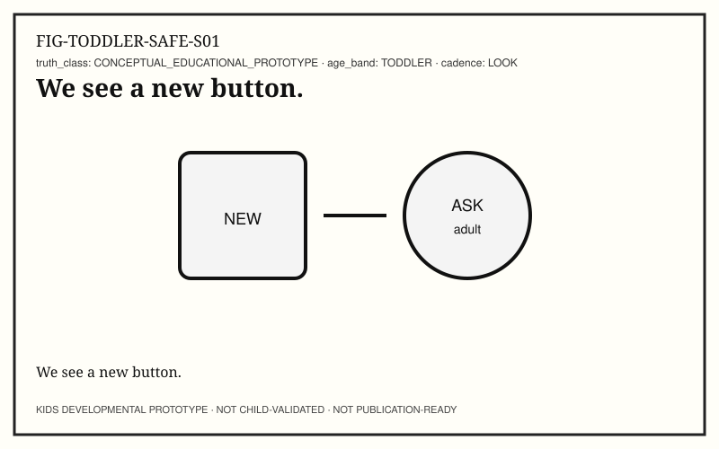

**Child-facing text:** We see a new button.

**Try it:** Look at a covered new control.

**Talk together:** New thing.

## Spread S02 — POINT

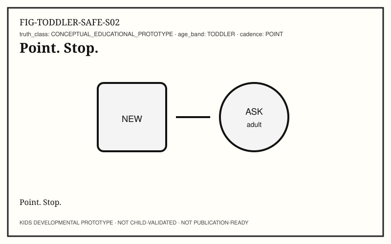

**Child-facing text:** Point. Stop.

**Try it:** Point, then stop hands.

**Talk together:** Stop gesture.

## Spread S03 — NAME

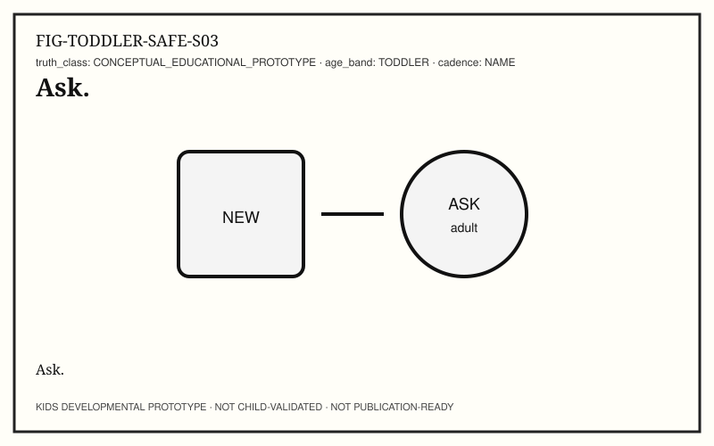

**Child-facing text:** Ask.

**Try it:** Say ask with open hand.

**Talk together:** Ask.

## Spread S04 — WAIT

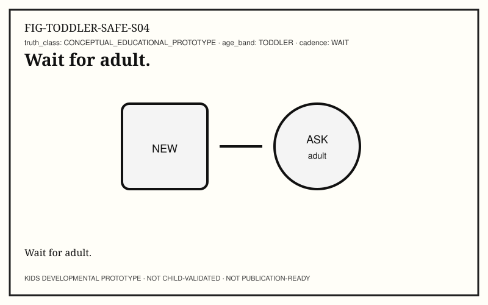

**Child-facing text:** Wait for adult.

**Try it:** Pause for yes/no.

**Talk together:** Wait.

## Spread S05 — RESPOND

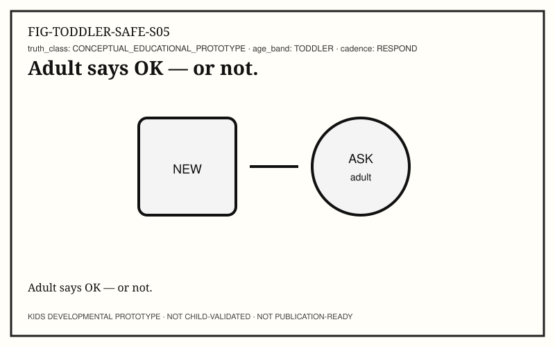

**Child-facing text:** Adult says OK — or not.

**Try it:** Practice both answers.

**Talk together:** Both OK.

## Spread S06 — NAME

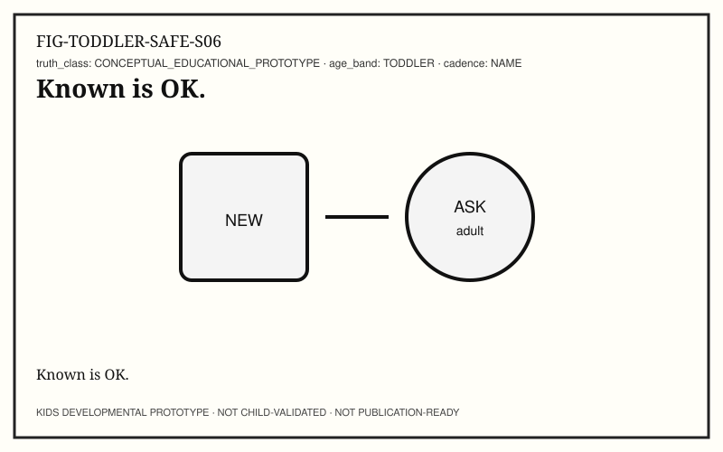

**Child-facing text:** Known is OK.

**Try it:** Touch a known safe control.

**Talk together:** Familiar only.

## Spread S07 — REPEAT

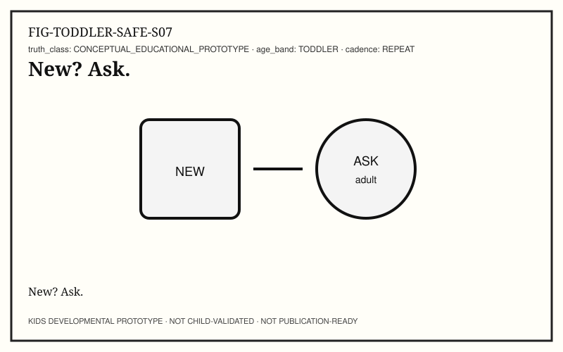

**Child-facing text:** New? Ask.

**Try it:** Repeat the rule once.

**Talk together:** Calm rule.

## Spread S08 — TEACH


**Child-facing text:** Show me ask.

**Try it:** Child practices ask gesture.

**Talk together:** Teach-back.

### Caregiver extension (UNIT-TODDLER-SAFE-01)

- Follow attention; name; wait; never force performance.
- Short, safe, stoppable try matched to toddler band.
- Observation/play notes only — no scoring.
- Adult mediation; no child data collection; inclusive routes.


# Unit: Make and Try Again

**Unit ID:** `UNIT-TODDLER-BUILD-01`  
**Strand:** `STRAND-BUILD` — Build, Test & Share  
**Concept:** `KCON-CH26-SOFTWARE-VCS`  
**Learning goal:** Build a tiny try  
**Cast focus:** Bolt, Step  
**Status:** `WORKING_DRAFT_COMPLETE`  

*Story hook (caregiver):* Open from a familiar household cause→effect moment.

## Spread S01 — LOOK

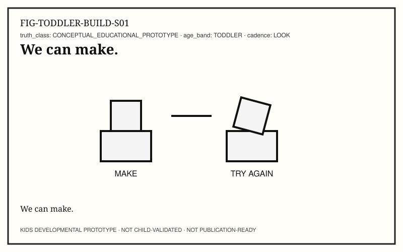

**Child-facing text:** We can make.

**Try it:** Look at two blocks.

**Talk together:** Simple materials.

## Spread S02 — POINT

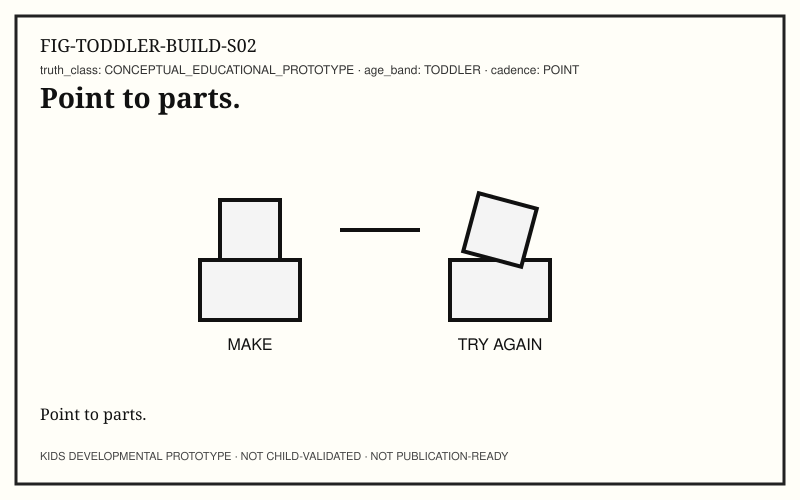

**Child-facing text:** Point to parts.

**Try it:** Point to each block.

**Talk together:** Parts.

## Spread S03 — NAME

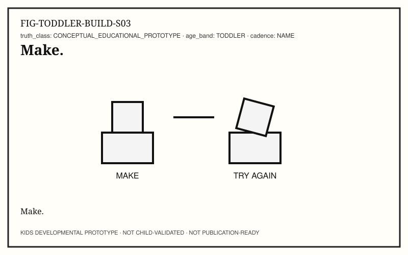

**Child-facing text:** Make.

**Try it:** Stack one on one.

**Talk together:** Make.

## Spread S04 — TRY

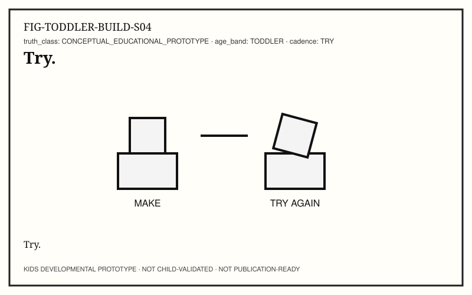

**Child-facing text:** Try.

**Try it:** See if it stands.

**Talk together:** Try.

## Spread S05 — RESPOND

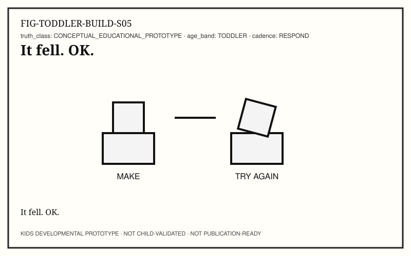

**Child-facing text:** It fell. OK.

**Try it:** Name the fall calmly.

**Talk together:** Fall is OK.

## Spread S06 — NAME

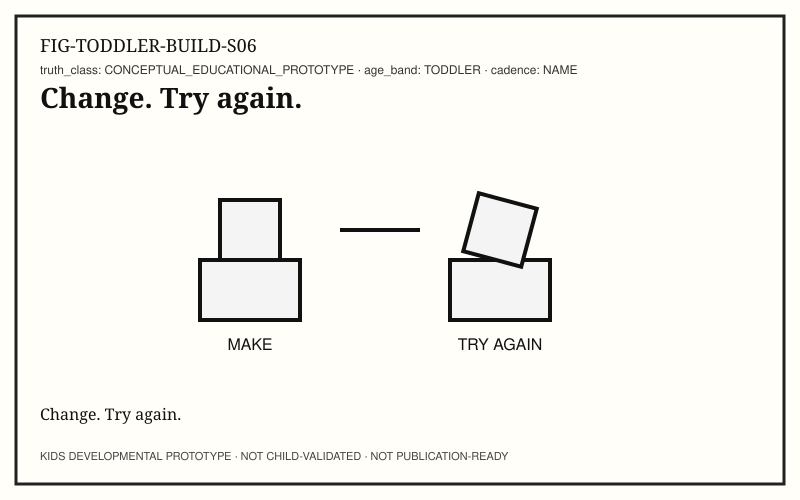

**Child-facing text:** Change. Try again.

**Try it:** Change one part; try again.

**Talk together:** Try again.

## Spread S07 — REPEAT

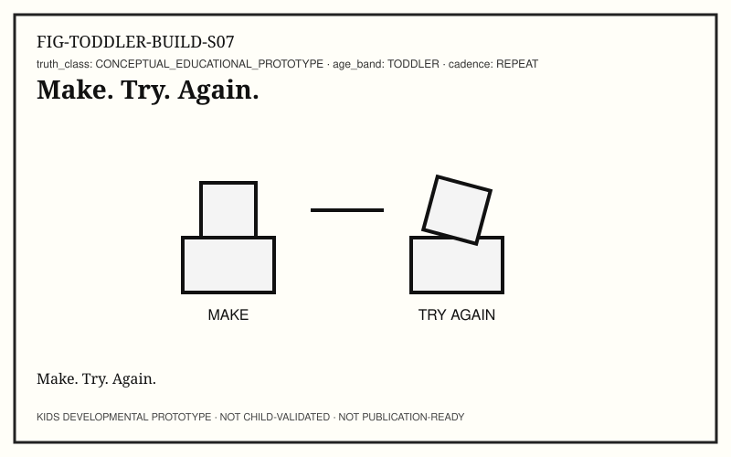

**Child-facing text:** Make. Try. Again.

**Try it:** Repeat once.

**Talk together:** Joy in retry.

## Spread S08 — TEACH


**Child-facing text:** Show me make → try.

**Try it:** Child shows the try.

**Talk together:** Teach-back.

### Caregiver extension (UNIT-TODDLER-BUILD-01)

- Follow attention; name; wait; never force performance.
- Short, safe, stoppable try matched to toddler band.
- Observation/play notes only — no scoring.
- Adult mediation; no child data collection; inclusive routes.


---

# Back matter (adult / caregiver facing)

## Age-appropriate glossary (caregiver terms)

See `GLOSSARY.yaml` for short caregiver definitions used while co-reading. Not a child quiz list.

## Adult standards & evidence appendix

- Unit standards: `STANDARDS_TRACEABILITY.yaml` (MAP-UNIT-* from scope sequence; ADJACENT / NOT_YET_MAPPED only).
- Media evidence: `MEDIA_EVIDENCE_TRACEABILITY.yaml` (real CME-* IDs).
- No certification claims. `NO_STANDARDS_CERTIFICATION_EVIDENCE`.

## WAIKE note (caregiver / integrator only)

WAIKE main SHA reconfirmed: `e97e74fc9bfb44b1cdc26b272dc4848264f15fe0` (`kids/waike/KIDS_WAIKE_CROSSWALK.yaml`).  
Kids Edition is a precursor layer — **adjacent** package names only where listed. **No invented WAIKE modules.** Not a certified WAIKE track.

## Provenance

- Curriculum: `kids/curriculum/KIDS_SCOPE_AND_SEQUENCE.yaml`
- Pilot expansion (ME-TECH): `kids/pilots/ONE_TAP/KIDS-TODDLER/`
- Spiral: `kids/concepts/ADULT31_TO_KIDS_SPIRAL.yaml`
- Cadence: `kids/cadence/STORY_LEARNING_CADENCE.md`
- Character bible Option A: `kids/characters/CHARACTER_BIBLE.md`
- Adult main SHA (reference): `82284cd8f41d750ff508cd6ea5bad0a9534d8162`

## Facilitator pointer

Editor, standards, and evidence live in companion YAML/MD files — not in child-facing spreads.
