# ONE TAP — KIDS-BABY (0–18 months)

```
KIDS DEVELOPMENTAL PROTOTYPE
NOT CHILD-VALIDATED
NOT PUBLICATION-READY
```

**Pilot concept:** Input → Response across devices and (sometimes) networks.
**Concept ID:** `KCON-CH02-ONE-TAP`
**Child validation:** none

## Caregiver / educator note

Follow gaze. Soft voice. Print-first. Stop anytime.

## Spread S01 — Look (LOOK)



**Child-facing text:** Look.

**Try it:** Look together at one lit control.

**Talk together:** Follow gaze. Soft voice.

## Spread S02 — Hand (POINT)



**Child-facing text:** Hand.

**Try it:** Notice hand near the surface.

**Talk together:** Point to hand, then control.

## Spread S03 — Touch (NAME)



**Child-facing text:** Touch.

**Try it:** Finger meets surface.

**Talk together:** Name the touch when contact happens.

## Spread S04 — Wait (WAIT)



**Child-facing text:** Wait…

**Try it:** A short wait before change.

**Talk together:** Pause. Do not rush.

## Spread S05 — Change (RESPOND)



**Child-facing text:** Change!

**Try it:** Light or sound changes.

**Talk together:** Celebrate the change calmly.

## Spread S06 — Again (REPEAT)



**Child-facing text:** Again?

**Try it:** Optional second touch.

**Talk together:** Offer repeat; accept no.

## Spread S07 — Same place (NAME)



**Child-facing text:** Same.

**Try it:** Repeat at same control.

**Talk together:** Same spot → same kind of change.

## Spread S08 — New place (LOOK)



**Child-facing text:** New.

**Try it:** Move attention to another control.

**Talk together:** Different control, different change.

## Spread S09 — Point with me (POINT)



**Child-facing text:** Point.

**Try it:** Point to what changed.

**Talk together:** Invite pointing; no demand for speech.

## Spread S10 — All done (RESPOND)



**Child-facing text:** All done.

**Try it:** Session ends positively.

**Talk together:** Easy stop. Close the book.

## Facilitator pointer

Editor, standards, and provenance notes live in `AUTHOR_NOTES.yaml` and `TRACEABILITY.yaml` — not in child-facing spreads.
