# ONE TAP — KIDS-ELEM1 (Kindergarten–Grade 2)

```
KIDS DEVELOPMENTAL PROTOTYPE
NOT CHILD-VALIDATED
NOT PUBLICATION-READY
```

**Pilot concept:** Input → Response (adult CH02 developmental rewrite, not sentence simplification).
**Concept ID:** `KCON-CH02-ONE-TAP`
**Child validation:** none

## Caregiver / educator note

Use observation, not ranking. Stop anytime.

## Spread S01 — Observe a tap (OBSERVE)



**Child-facing text:** Tap a control that only changes this device. Then tap one that needs the network. Write what you saw.

**Action:** Two observations.

**Caregiver prompt:** Supervise; no accounts.

## Spread S02 — Hardware / software (NAME)



**Child-facing text:** Hardware senses the touch. Software follows instructions about what to do next.

**Action:** Name HW/SW.

**Caregiver prompt:** Keep definitions short.

## Spread S03 — Input → process → output (NAME)



**Child-facing text:** Input: touch report. Process: app decides. Output: pixels, sound, or motion.

**Action:** Fill IPO.

**Caregiver prompt:** IPO diagram.

## Spread S04 — Algorithm steps (PREDICT)



**Child-facing text:** Write a 4-step algorithm for your local tap.

**Action:** Write algorithm.

**Caregiver prompt:** Any clear order OK.

## Spread S05 — Local vs network (TEST)



**Child-facing text:** Test: which tap stayed local? Which waited on a network?

**Action:** Classify taps.

**Caregiver prompt:** Observation vs guess.

## Spread S06 — Why feedback felt instant (EXPLAIN)



**Child-facing text:** Instant highlight can finish before remote content arrives.

**Action:** Explain timelines.

**Caregiver prompt:** Two timelines.

## Spread S07 — Safe practice (SECURE)



**Child-facing text:** Do not install unknown apps. Ask before sharing personal info.

**Action:** Safety checklist.

**Caregiver prompt:** Safety without fear.

## Spread S08 — Worksheet (BUILD)



**Child-facing text:** Complete the observation worksheet: what I saw / what I infer / what I still don't know.

**Action:** Worksheet.

**Caregiver prompt:** Portfolio piece.

## Spread S09 — Misconception check (REFLECT)



**Child-facing text:** True or rethink: “Every tap goes to the internet.”

**Action:** Misconception.

**Caregiver prompt:** Discuss kindly.

## Spread S10 — Teach-back (TEACH)



**Child-facing text:** Teach a partner the IPO path for one tap.

**Action:** Teach-back.

**Caregiver prompt:** Optional peer.

## Standards appendix (adult-facing)

All mappings `NOT_YET_MAPPED` pending sister standards atlas land. Wire IDs in `TRACEABILITY.yaml`.

## Source / evidence appendix (adult-facing)

- Adult CH02 on main `82284cd8f41d750ff508cd6ea5bad0a9534d8162`
- Spiral: `kids/concepts/ADULT31_TO_KIDS_SPIRAL.yaml`
- No child testing was conducted for this prototype.
