# ONE TAP — KIDS-ELEM2 (Grades 3–5/6)

```
KIDS DEVELOPMENTAL PROTOTYPE
NOT CHILD-VALIDATED
NOT PUBLICATION-READY
```

**Pilot concept:** Input → Response across devices and (sometimes) networks.
**Concept ID:** `KCON-CH02-ONE-TAP`
**Child validation:** none

## Caregiver / educator note

Separate observation from inference. Measure roughly. Stop anytime.

## Cast (provisional — Character Bible Option A)

- Explorer: **Mira** · Builder: **Bolt** · Instructions: **Step** · Signals: **Ping** · Safety: **Shield**
- _Provisional Character Bible Option A — not owner-locked IP._

## Spread S01 — Cross-layer path (OBSERVE)



**Child-facing text:** Follow one tap with Mira across layers you can name on paper: human intent → input hardware → operating-system event → application handler → optional network → output (pixels or sound) → your perception. Annotate the shared map. Circle steps you truly observed. Put a question mark on steps you only infer. A map is a model — useful, incomplete, and revisable. If two classmates mark different question marks, that is good science, not a fight. Compare notes before you “fix” anything. Leave one blank margin note titled Still invisible to us.

**Try it:** Annotate cross-layer map; mark observe vs infer.

**Talk together:** Keep discussion concrete; shared figure is a tool, not a quiz key.

## Spread S02 — CPU, memory, storage (NAME)



**Child-facing text:** Bolt deals three role cards. CPU: runs instructions right now. Memory (working space): holds state the program is using this moment. Storage (keep-box): keeps durable data for later. Sort classroom examples: the instructions being followed, today’s draft text still open, yesterday’s saved file. Say the roles aloud. We describe jobs machines do — we do not invent magic megahertz, “brain speed,” or frequency-to-intelligence product claims. If a label sounds like an ad, rewrite it.

**Try it:** Sort role cards for CPU / memory / storage.

**Talk together:** Roles, not marketing numbers.

## Spread S03 — OS and app events (NAME)



**Child-facing text:** A tap becomes an event. The operating system notices input-hardware activity and delivers an event toward the app that should respond. Inside the app, an event loop can dispatch a handler that updates state and asks for a new frame of output. Draw one chain on a single page: tap → OS event → app handler → updated state → screen or sound. This is a junior model of stack ideas — earned with classroom words. Do not copy adult chapter prose; if a word is new, define it once with a pointing example.

**Try it:** Draw event-handling sequence.

**Talk together:** Keep the chain on one page; avoid jargon dumps.

## Spread S04 — Packets or not? (PREDICT)



**Child-facing text:** Ping asks: does your action need packets — little addressed message pieces that can travel on a network? Predict first, in writing. Then imagine airplane mode or radio off: what would you observe if the action were local only? What would fail, hang, or stay blank if it needed the network? Fill three boxes: prediction → planned observation → result. Local vs network is a question for evidence, not a slogan you memorize. If you cannot test safely today, keep the prediction and write why the test waited.

**Try it:** Predict packet need; plan an observation if radio is off.

**Talk together:** Prediction before trial.

## Spread S05 — Latency: feel vs measure (MEASURE)



**Child-facing text:** Latency means waiting time somewhere on a path. Felt delay is what your body notices; measured delay is what a timer roughly shows. Use a classroom stopwatch on a remote refresh. Record three marks if you can: start, first visible change, and content “done enough.” Separate felt delay from guessed cause — slow Wi‑Fi, a busy CPU, and a far server can feel similar until you gather evidence. Rough numbers beat confident myths. Write units (seconds) beside every mark.

**Try it:** Rough stopwatch measure of a remote refresh.

**Talk together:** Classroom timer OK; rough is honest.

## Spread S06 — Observation vs inference (EXPLAIN)



**Child-facing text:** Two columns only: Observation | Inference. Example observation: “Highlight appeared in under a second.” Example inference: “Therefore no packets were sent.” Mark every inference with a ? until tested. Systems literacy starts when we stop pretending every story we tell ourselves is a measurement. Trade papers with a partner and circle any inference dressed up as a fact. Add a third tiny box if needed: Still don’t know — and keep it empty of fake certainty.

**Try it:** Two-column notes with uncertainty marks.

**Talk together:** Core systems skill — model it first.

## Spread S07 — Security vs privacy (SECURE)


**Child-facing text:** Shield separates two ideas that often get mashed together. Security: controls that protect systems and accounts — lock screen, updates, permission prompts. Privacy: choices about who can see or keep your information. List one security control and one privacy choice that change a tap path. We may talk about HTTPS as “the path tries to keep the message harder for strangers to read on the way.” No exploit steps. No hacking practice. Calm tools beat scary stories.

**Try it:** List one security control + one privacy choice.

**Talk together:** No exploit content.

## Spread S08 — Build, test, teach (BUILD)



**Child-facing text:** Build a paper protocol for tracing one tap: numbered steps, a failure branch (“if no change, check power / ask a trusted adult”), and a teach-back script written for a younger band (Pre‑K or K–2 language — short sentences, no stack jargon). Test the protocol once with a partner. Repair one unclear step and date the repair. Portfolio artifact = protocol + teach script + one repair note. Repair is success.

**Try it:** Paper protocol + younger-band teach script + one repair.

**Talk together:** Portfolio artifact; process evidence.

## Spread S09 — Spiral: baby to map (REFLECT)



**Child-facing text:** What stays the same from baby LOOK → CHANGE to this cross-layer map? Contingent action and response — something happens, then something answers. What vocabulary was earned later: input, output, event, packet, latency, privacy, security? Spiral learning means the same idea grows tools as learners grow. It does not mean babies should hear junior-reference prose. Honor the sparse earlier bands. Write one sentence you would teach a toddler and one you would only teach this band.

**Try it:** Spiral reflection note.

**Talk together:** Honor earlier bands’ restraint.

## Spread S10 — EMIT mini-capstone (TEACH)



**Child-facing text:** EMIT loop: Explain one tap path · Measure one wait · Improve one step of your protocol · Teach someone else. Say the honesty lines with Shield, calmly: this is a kids developmental prototype; it is not child-validated; it is not publication-ready. Learning bravely includes labeling what we have not tested with children. Your portfolio shows process evidence — not a fake certificate. When you teach, invite questions you cannot answer yet, and write them down for next time.

**Try it:** Complete EMIT loop with honesty labels spoken.

**Talk together:** Honesty labels are part of the learning, spoken calmly.

## Facilitator pointer

Editor, standards, and provenance notes live in `AUTHOR_NOTES.yaml` and `TRACEABILITY.yaml` — not in child-facing spreads.
