# ONE TAP — KIDS-PREK (4–6 years)

```
KIDS DEVELOPMENTAL PROTOTYPE
NOT CHILD-VALIDATED
NOT PUBLICATION-READY
```

**Pilot concept:** Input → Response (adult CH02 developmental rewrite, not sentence simplification).
**Concept ID:** `KCON-CH02-ONE-TAP`
**Child validation:** none

## Caregiver / educator note

Use observation, not ranking. Stop anytime.

## Spread S01 — Message or local? (STORY)



**Child-facing text:** Jordan taps Refresh. Sometimes the phone already has the page. Sometimes it asks far away.

**Action:** Story hook.

**Caregiver prompt:** Plant optional network idea.

## Spread S02 — Two timelines (NOTICE)



**Child-facing text:** A quick highlight can happen before new words arrive.

**Action:** Notice two timings.

**Caregiver prompt:** Immediate vs later.

## Spread S03 — System and component (NAME)



**Child-facing text:** The phone is a system. The button is a component.

**Action:** Name system/component.

**Caregiver prompt:** Use both words once, concretely.

## Spread S04 — Simple algorithm (CONNECT)



**Child-facing text:** 1 sense press 2 choose action 3 show result.

**Action:** Write/draw 3 steps.

**Caregiver prompt:** Algorithm = ordered steps.

## Spread S05 — Local prediction (PREDICT)



**Child-facing text:** If the page is already here, maybe no far message.

**Action:** Predict local path.

**Caregiver prompt:** Prediction, not certainty.

## Spread S06 — Message path (TRY)



**Child-facing text:** If it needs new info, a message can travel out and back.

**Action:** Draw message path.

**Caregiver prompt:** Path drawing.

## Spread S07 — Private choice (SAFE + FAIR)



**Child-facing text:** Do we share the screen with a stranger? No — ask a trusted adult.

**Action:** Choose safe option.

**Caregiver prompt:** Safe/private choice.

## Spread S08 — Build-a-sequence (MAKE)



**Child-facing text:** Build cards: Input → Steps → Output (optional Message).

**Action:** Build sequence.

**Caregiver prompt:** Hands-on sequence.

## Spread S09 — Explain the path (EXPLAIN)



**Child-facing text:** Explain which path you built and why.

**Action:** Explain.

**Caregiver prompt:** Listen without correcting every word.

## Spread S10 — Teach caregiver (TEACH)



**Child-facing text:** Teach your caregiver the three steps.

**Action:** Teach-back.

**Caregiver prompt:** Be the learner.

## Standards appendix (adult-facing)

All mappings `NOT_YET_MAPPED` pending sister standards atlas land. Wire IDs in `TRACEABILITY.yaml`.

## Source / evidence appendix (adult-facing)

- Adult CH02 on main `82284cd8f41d750ff508cd6ea5bad0a9534d8162`
- Spiral: `kids/concepts/ADULT31_TO_KIDS_SPIRAL.yaml`
- No child testing was conducted for this prototype.
