# ONE TAP — KIDS-PRESCHOOL (3–4 years)

```
KIDS DEVELOPMENTAL PROTOTYPE
NOT CHILD-VALIDATED
NOT PUBLICATION-READY
```

**Pilot concept:** Input → Response across devices and (sometimes) networks.
**Concept ID:** `KCON-CH02-ONE-TAP`
**Child validation:** none

## Caregiver / educator note

Story first. Notice before naming. Stop anytime.

## Cast (provisional — Character Bible Option A)

- Explorer: **Mira** · Builder: **Bolt** · Instructions: **Step** · Signals: **Ping** · Safety: **Shield**
- _Provisional Character Bible Option A — not owner-locked IP._

## Spread S01 — The sticky song (STORY)



**Child-facing text:** Mira wants the song button to work. Bolt taps the box. Can they make music?

**Try it:** Meet Mira and Bolt; set the tiny problem.

**Talk together:** Tell the tiny story once. Pause for looking.

## Spread S02 — What we notice (NOTICE)



**Child-facing text:** Mira presses. A light blinks. Music starts. What did you see first?

**Try it:** List noticed events in order with gestures.

**Talk together:** Notice before naming tech words.

## Spread S03 — Parts (NAME)



**Child-facing text:** Button. Light. Speaker. Those are parts we can name.

**Try it:** Count three parts on fingers.

**Talk together:** Count parts on fingers.

## Spread S04 — Inside helps (CONNECT)



**Child-facing text:** Something inside the box helps the parts talk. The screen is not the whole story.

**Try it:** Connect outside parts to an “inside helpers” idea.

**Talk together:** Gesture from outside to inside.

## Spread S05 — Predict (PREDICT)



**Child-facing text:** If we press, what happens first? Next? Last?

**Try it:** Predict order before trying.

**Talk together:** Accept any sincere guess.

## Spread S06 — Try the order (TRY)



**Child-facing text:** First press. Next blink. Last sound. Act it with Mira.

**Try it:** Act the sequence with body gestures.

**Talk together:** Act the sequence together.

## Spread S07 — Sensor idea (EXPLAIN)



**Child-facing text:** The button notices a press. Bolt says it is like a tiny sensor.

**Try it:** Explain sensing in plain words.

**Talk together:** Keep language concrete.

## Spread S08 — Sort the cards (MAKE)



**Child-facing text:** Sort three cards: press / blink / sound. Can you put them in order?

**Try it:** Sorting and sequencing with cards or drawings.

**Talk together:** Use three cards or drawings.

## Spread S09 — Stop anytime (SAFE + FAIR)



**Child-facing text:** If it is too loud, Shield says we stop. Stopping is fair.

**Try it:** Model agency to stop.

**Talk together:** Model stop without shame.

## Spread S10 — Teach a friend (TEACH)



**Child-facing text:** Tell the story: press → blink → sound. Teach someone you trust.

**Try it:** Optional teach-back.

**Talk together:** Optional peer or caregiver share.

## Facilitator pointer

Editor, standards, and provenance notes live in `AUTHOR_NOTES.yaml` and `TRACEABILITY.yaml` — not in child-facing spreads.
