# ONE TAP — KIDS-TODDLER (18–36 months)

```
KIDS DEVELOPMENTAL PROTOTYPE
NOT CHILD-VALIDATED
NOT PUBLICATION-READY
```

**Pilot concept:** Input → Response across devices and (sometimes) networks.
**Concept ID:** `KCON-CH02-ONE-TAP`
**Child validation:** none

## Caregiver / educator note

One focal object. Short phrases. Stop anytime.

## Spread S01 — We look (LOOK)



**Child-facing text:** We look.

**Try it:** Find the button together.

**Talk together:** One focal object.

## Spread S02 — Input (NAME)



**Child-facing text:** Touch is input.

**Try it:** Name input with a gesture.

**Talk together:** Short phrase; gesture touch.

## Spread S03 — Output (NAME)



**Child-facing text:** Change is output.

**Try it:** Point to the change.

**Talk together:** Point to the change.

## Spread S04 — First (WAIT)



**Child-facing text:** First: touch.

**Try it:** Sequence start.

**Talk together:** Hold up one finger.

## Spread S05 — Next (RESPOND)



**Child-facing text:** Next: change.

**Try it:** Sequence continue.

**Talk together:** Hold up two fingers.

## Spread S06 — Find (POINT)



**Child-facing text:** Find the button.

**Try it:** Child points or finds.

**Talk together:** Child leads the find.

## Spread S07 — Match (TRY)



**Child-facing text:** Match touch to change.

**Try it:** One supervised tap.

**Talk together:** One physical try.

## Spread S08 — Again same (REPEAT)



**Child-facing text:** Again — same.

**Try it:** Repeat once.

**Talk together:** Repetition with joy.

## Spread S09 — Ask adult (SAFE + FAIR)



**Child-facing text:** New button? Ask.

**Try it:** Practice ask-before-new.

**Talk together:** Calm safety rule.

## Spread S10 — Show me (TEACH)



**Child-facing text:** Show me touch → change.

**Try it:** Child shows caregiver.

**Talk together:** Invite teach-back gesture.

## Facilitator pointer

Editor, standards, and provenance notes live in `AUTHOR_NOTES.yaml` and `TRACEABILITY.yaml` — not in child-facing spreads.
